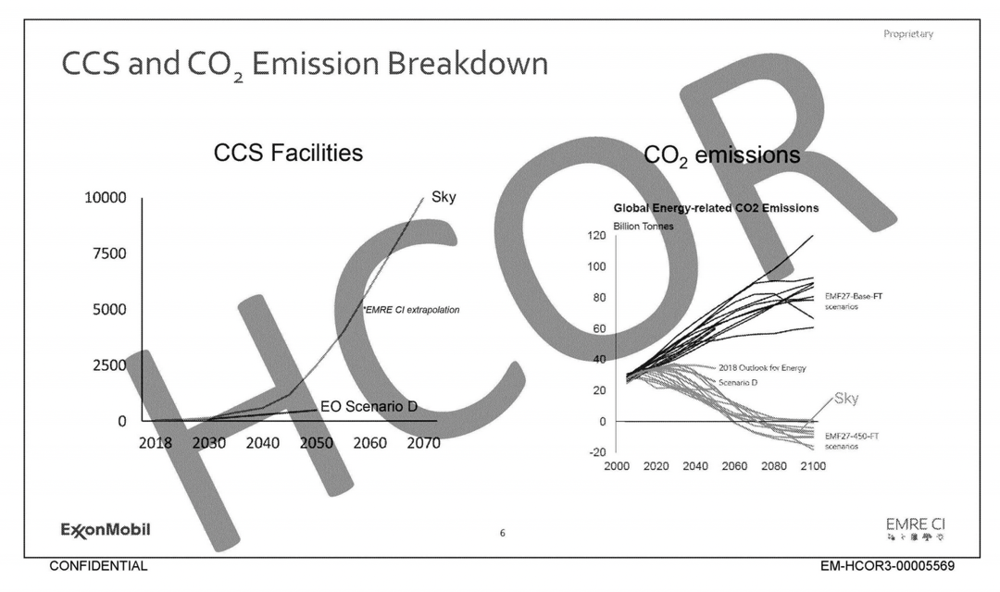

https://drilled.media/news/ccs

During the United States Congress' 2022 investigation into the fossil fuel industry's role in climate disinformation, investigators concluded that major oil companies had not only misled the public on climate change for decades, but also were continuing to misinform them about the industry’s preferred climate “solutions”— particularly biofuels and carbon capture.

The industry pushes relentlessly positive marketing of carbon capture, which aims to collect and store CO2 emissions from power plants and industrial and fossil fuel extraction facilities, so they don’t add to global warming. The Intergovernmental Panel on Climate Change (IPCC) has said carbon capture might be necessary to reduce the emissions of certain “hard to abate” sectors like steel, concrete, and some chemical manufacturing, but noted that in the best-case scenario, with carbon capture technology working flawlessly and deployed at large scale, it could only account for a little over 2 percent of global carbon emissions reductions by 2030.

That hasn't stopped major oil companies from claiming that carbon capture and storage will be essential for helping society achieve net-zero emissions, that they are delivering carbon capture for American industry, working on reducing carbon intensity in their own businesses, and delivering heavy industry with low emissions.

However, companies have downplayed CCS internally even as they touted its potential publicly. While Shell optimistically projects 10000 large-scale CCS facilities operational by 2070, with more than 2500 facilities by 2050, Exxon predicts somewhere between 250 and 500 facilities by 2050.

 Projected number of CCS units in Shell Sky scenario vs ExxonMobil Scenario D.

The Institute for Energy Economics and Financial Analysis (IEEFA), a nonprofit, non-partisan think tank that produces market-based research on the energy transition, states: “It’s worth noting that not one single CCS project has ever reached its target CO2 capture rate.” Stanford University researcher Mark Jacobson said that because it also requires energy and materials to function, CCS attached to a fossil-fueled power plant is worse for the climate than replacing fossil energy with renewables. “They actually increase carbon dioxide emissions by doing this, in addition to increasing air pollution,” he said, referencing a study he conducted in 2019 that does the math on the lifecycle CO2 emissions of various carbon capture scenarios. Even when CCS is powered by wind, Jacobson said it’s not worth doing, from a climate perspective. “If you just used wind to replace coal in the first place, you’d get a higher reduction in CO2 emissions,” he said.

When the Environmental Protection Agency proposed requiring that power plants install CCS in its rules for power plants, Exxon encouraged the agency to reduce its requirements around capture efficiency from 95 percent to 75 percent, which is more in line with the actual performance of existing CCS projects. Even though the agency weakened its requirements around CCS, the industry has now asked the Supreme Court to issue an emergency stay on the power plant rules, again arguing that the technology isn’t ready for prime time.

To date, the only 'successful' carbon capture Exxon claims is its LaBarge Shute Creek gas facility in Wyoming, which is often referenced by the industry in general as a large and long-standing CCS project. On paper, it’s responsible for around 40 percent of the total carbon emissions ever captured in the world. But the details tell a more complicated story. Only around 3 percent of the carbon captured in LaBarge has been permanently sequestered underground. Of the rest, half has been sold for enhanced oil recovery, and half has been vented into the atmosphere. While EOR does sequester carbon — some of it stays underground after it's been injected — experts say the process could release 40 percent of the CO2 back into the air, and the oil it helps to get out of the ground also generates CO2 emissions when it’s burned.

In the United States, more than 70 percent of the CO2 injected underground as part of the EOR process is from natural sources. That’s true of the Exxon’s showcase facility—the Shute Creek facility in LaBarge, Wyoming—as well.The CO2 source there is the gas that’s being drilled. ExxonMobil calls this “anthropogenic CO2,” but when pressed, a spokesperson told Drilled it’s generated by the separation process. In other words, absent the gas drilling, there would be no CO2 to capture at the site in the first place.

“It doesn’t  make sense to use CCS to prolong our use of fossil fuels, especially to produce electricity,” David Ho, professor at University of Hawaii and senior researcher at Columbia University, said. “The argument in favor of enhanced oil recovery is often that if they weren’t using this captured CO2 they’d be using some other CO2. But I don’t think you can call anything where you’re getting more oil out of the ground to burn a climate solution.”

“What the IPCC actually said in its mitigation report was that carbon capture might be necessary for hard-to-abate industries, but that it’s one of the most expensive options and it only equates to small emissions reductions,” said Paul Blackburn, an environmental lawyer and advisor to the Bold Alliance, a nonprofit network of frontline communities focused on protecting land and water. “So we’re doing the most expensive, least applicable thing first rather than cheapest easiest things first at great expense to taxpayers and with no analysis of net climate benefit.”

