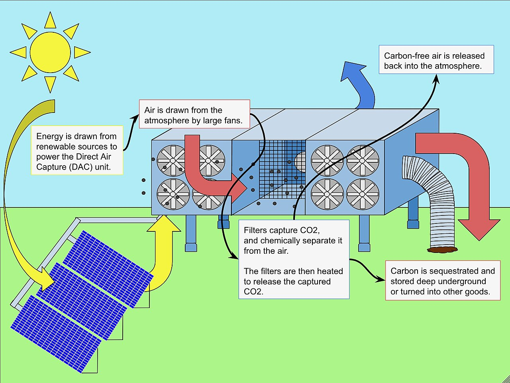

### Contributors: Alex Nedelcu
### Date: 21/06/2025

There are two high-level categories of carbon capture:
1. Industrial carbon capture and storage (referred to as CCS) or utilization (CCU), which involves process or flue gas from industrial processes being chemically treated to isolate the carbon dioxide (which is a greenhouse gas) and deliver it either to be stored or used in some way.

[Flue gas carbon capture requires significant equipment stacks.](https://climate.mit.edu/explainers/carbon-capture)

2. Direct air capture (DAC), which involves the use of fans to push air through a series of filters, chemically separate carbon dioxide, and then release the air back to the atmosphere, with the carbon dioxide being once again delivered to storage or usage.

 [Direct air capture.](https://en.wikipedia.org/wiki/Direct_air_capture)

Many are touting these technologies as necessary to achieve long-term decarbonization. Even prestigious organizations such as the[ International Energy Agency](https://www.iea.org/energy-system/carbon-capture-utilisation-and-storage) or the [Intergovernmental Panel on Climate Change](https://www.catf.us/2022/04/what-does-latest-ipcc-report-say-about-carbon-capture/) have stated that a principal pathway to rapidly reducing anthropogenic (human-caused) emissions to net zero and meeting climate goals is the implementation of these technologies. And indeed, they may be required for certain industries or processes where there is no alternative to carbon emissions (called hard to abate), such as [cement production](https://www.mckinsey.com/industries/chemicals/our-insights/laying-the-foundation-for-zero-carbon-cement).

However, it is not a good idea to put all our eggs in one basket and hope for a technological panacea to our environmental problems. We need to critically evaluate these technologies and see whether they indeed perform as well as their supporters assume. We discuss the two technologies separately below. 

#### Carbon capture and storage/utilization
The years have not been kind to industrial carbon capture. According to a searing [analysis](https://ieefa.org/ccs) from the Institute for Energy Economics and Financial Analysis, an Australian think-tank, the technology is expensive, unproven, and ineffective. The IEEFA studied 16 real-world projects and found that, in spite of the industry claim that carbon capture systems can reduce carbon dioxide emissions by up to 95%, no existing project has consistently captured more than 80% of its emissions, with most barely hitting 50%. 

[Carbon capture rates in real-world projects.](https://ieefa.org/ccs)

This raises significant questions about whether the technology we are being sold on actually works. In the United States, when the Environmental Protection Agency was considering instating a new rule for power plants that would require the implementation of CCS with capture efficiencies of 95 percent, companies like Exxon-Mobil (who publicly tout carbon capture as a climate solution)[ asked it to reduce its requirements](https://drilled.media/news/ccs) to 75 percent. It seems that, internally, even the companies that promote CCS aren't so confident about its performance.

But this isn't the only criticism of carbon capture. Another controversy is related to the ultimate fate of the carbon dioxide after it's been treated - whether it be storage or utilization. If the CO2 is permanently sequestered underground, for example in a salt cavern, and no leaks occur, than few further emissions are expected. However, a worrying precedent has been set by Exxon-Mobil's Shute Creek facility in Wyoming. There, [only 3 percent of the captured emissions have been sequestered](https://ieefa.org/articles/shute-creek-worlds-largest-carbon-capture-facility-sells-co2-oil-production-vents-unsold), with half of the rest being vented into the atmosphere, and the other half being sold to be used in a process called enhanced oil recovery (EOR). As insidious as it sounds, this involves the pumping of CO2 into depleted oil fields to extract what little remains are left. Evidently, this cannot be called a climate solution.

Indeed, CCS may actually harm rather than support the fight against pollution and climate change. Stanford researcher Mark Jacobson [found that](https://sci-hub.st/https://doi.org/10.1039/C9EE02709B), over twenty years, applying a carbon capture system to a coal plant and powering it with wind energy reduces emissions by 37.4%, while using the wind electricity instead to replace that same coal electricity being produced reduces emissions by 49.7%. This also means that the carbon avoidance cost for carbon capture is up to 39 times higher compared to wind energy generation due to the prohibitive cost of carbon capture equipment. Finally, Jacobson notes that CCS does not also capture air pollutants such as particulate matter, which means that they continue to affect the people living near these fossil fuel energy plants.

Overall, the outcome is bleak for industrial CCS. When it comes to energy generation, it cannot be seen other than as opportunity costs. Of course, if there is no alternative, it may be necessary, but as long as the alternative exists, such as renewable energy sources or green hydrogen, it does not make sense to continue investing in carbon capture.

#### Direct air capture
But what about DAC? Surely, nobody could be against a technology that aims to practically remove carbon from the atmosphere.

Unfortunately, here too there are significant issues. Carbon dioxide removal researcher David Ho [writes](https://www.nature.com/articles/d41586-023-00953-x) that the scale of emissions reductions is monumental - around 40 gigatons of carbon dioxide would have to be captured each year, in contrast to proposed DAC hubs being able to capture around one megaton per year. All the concerns about CCS presented above, from cost to the proven effectiveness of the technology, apply to DAC as well. It makes more sense to reduce emissions by switching to green energy and industry first, then use carbon dioxide removal as required to cover the 'emissions gap' to net zero. 

Other researchers have also raised the alarm about direct air capture. An [estimate](https://doi.org/10.1038/s41467-020-17203-7) from 2020 found that, for a capacity of 30 gigatons of CO2/year, the production of chemical solvents required in the capture process would account for up to 20% of the global primary energy supply, as well as more than our global electricity generation capacity. Producing these solvents can also result in the production of incredibly high quantities of chlorine gas (up to 60 times our global demand), ammonia, or ethylene oxide. Additionally, this analysis does not take into account the energy and materials needed for storage or utilization, which impose further needs for pipelines, prospection equipment, and pumps, to name a few. Of course, this is just one estimate, but it raises important questions moving forward.

[Energy and materials requirements for material production and sorbent regeneration.](https://doi.org/10.1038/s41467-020-17203-7)

#### Conclusion
It is clear that carbon dioxide removal technologies such as CCS and DAC will be necessary to decarbonize and compensate for hard to abate sectors. Researching these technologies is definitely a worthwhile pursuit. However, as society moves towards sustainability, we have to decide whether we allocate our limited resources to unproven solutions, or go for the most effective pathway we know, which is the replacement of our energy supply with low-carbon sources such as solar, wind, hydro, and nuclear. 

#### Quiz!
1. Which component in a CCS stack takes the carbon dioxide from the flue gas?
	- The stripper
	- The compressor
	- _The absorber_
	- The cooling tower
2. What is the industry estimate for carbon dioxide capture efficiency?
	- 100%
	- _95%_
	- 80%
	- 50%
3. What percentage of the Shute Creek emissions were sequestered underground?
	- 100%
	- 50%
	- 47%
	- _3%_
4. Which is the most effective option for decarbonization of the energy supply?
	- Coal plant with gas-powered CCS
	- Coal plant with wind-powered CCS
	- Coal plant with wind-powered CCU
	- _Replacing the coal plant with wind turbines_
5. How many 1MT DAC hubs would be required to capture yearly global CO2 emissions?
	- 40
	- 400
	- 4000
	- _40000_
6. Which of the below is not a prospective problem for DAC development?
	- _There's not enough underground storage capacity_
	- It's expensive
	- It requires unrealistic amounts of materials
	- It would take up clean energy we could use to decarbonize

