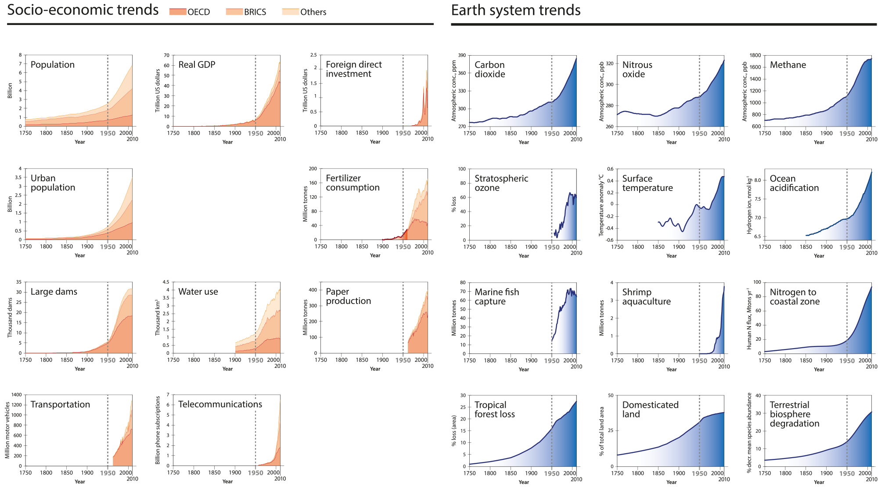
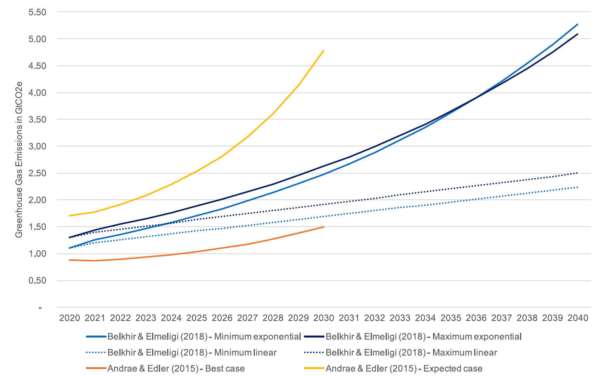
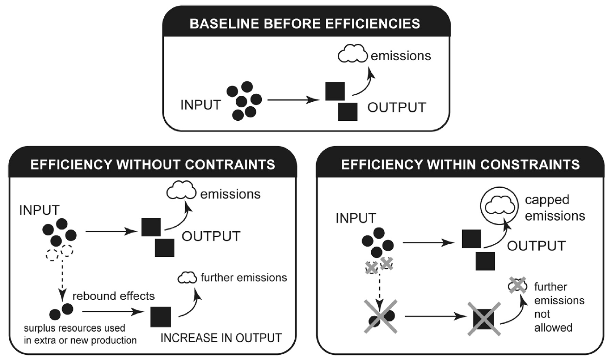
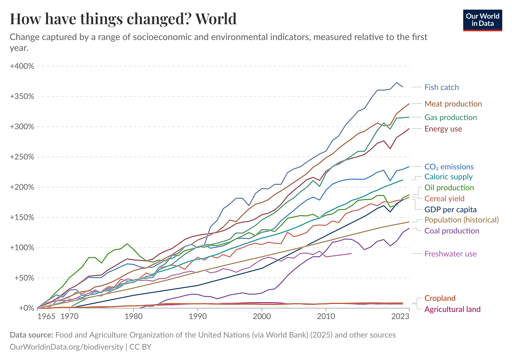

`Version: 1.0`
`Contributors: Alex Nedelcu`
`Publication date: 01.09.2025`

## Introduction: the Great Acceleration
Since the Industrial Revolution in the 1800's, human society has been expanding continuously and exponentially. This is what we call the [Great Acceleration](https://futureearth.org/2015/01/16/the-great-acceleration/), which has resulted in economic growth to the order of trillions, growth in population, transportation and fertilizer use, but also in increasing impacts upon the environment: carbon dioxide and methane emissions, ocean acidification, and deforestation among others.

[Line go up.](https://futureearth.org/2015/01/16/the-great-acceleration/)

## A primer on climate change
The most important and far-reaching impact of humanity on the planet is climate change. This is not a course about climate change, but we should get a baseline understanding of how it works. In short, our planet is in [energy equilibrium](https://climate.mit.edu/explainers/radiative-forcing) with the surrounding cosmos: the incoming energy from the Sun is balanced out by the energy emitted by the planet as infrared radiation. This emitted energy is [correlated](https://en.wikipedia.org/wiki/Black-body_radiation#Equations) with the temperature of the planet.

Our world economy currently relies on fossil fuels. When these fuels are combusted, they emit gases such as carbon dioxide into the atmosphere. These gases absorb some of the energy emitted by the planet as infrared radiation. This means that, to maintain the energy balance, the planet gets hotter: the greenhouse effect, hence why these gases are called [greenhouse gases](https://climate.mit.edu/explainers/greenhouse-gases). If the planet is hotter, then the atmosphere is also warmer, and can store more water, making weather patterns more unpredictable and extreme - this is what we commonly call climate change.

[The energy balance within Earth's atmosphere.](https://climate.mit.edu/explainers/radiative-forcing)

## ICT's impacts
Now, you may think that this has nothing to do with us as software engineers. Software does not exist in the real world; it is ones and zeroes. But every line of code needs a physical processor to run it. That processor needs power electronics and cooling. And you, as a programmer, need a screen, a mouse, a keyboard, and probably a connection to the internet to run the latest version of Copilot. These are all physical objects in the real world, which have an impact on the real world.

Historically speaking, our ICT emissions have grown faster than our total emissions, with global emissions [growing about 20%](https://doi.org/10.1016/j.patter.2021.100340) between 2002 and 2012 and ICT emissions growing about twice as fast. If we look at some estimates from a few years ago, we notice that ICT's greenhouse gas emissions in 2020 [were](https://doi.org/10.1016/j.patter.2021.100340) between 2.1% and 3.9% of total emissions, with a marked acceleration in recent times due to several significant trends. The Internet of Things, the blockchain, the pivot to big data and most recently AI have only accelerated the rate of emissions growth. Not to mention all associated impacts on the water system and consumption of raw materials, which we will discuss in depth in later lectures. 

 
[ICT emissions are projected to grow exponentially.](https://doi.org/10.1016/j.patter.2021.100340)

## Solutions and false solutions
ICT's increasing emissions are undeniably a problem. If they weren't, we wouldn't be doing this course! Let's take a look at the potential solutions proposed by people and companies until now.

### 1. Increasing energy efficiency
The classic talking point is that we just need to make all ICT systems more energy efficient. If they consume less energy, then we need less energy to be generated, so we need to burn less oil and gas. It's an intuitive solution, especially as efficiency gains have somewhat restrained the emissions growth of ICT systems until now. For example, data center compute efficiency has[ increased by 550%](https://doi.org/10.1016/j.patter.2021.100340) even while emissions have remained more or less stable.

But there are some important problems with this kind of thinking. Firstly, even though there is still room for further efficiency improvements in data centers and user devices, these efficiency improvements might be coming to an end. Transistors have shrunk in size and increased in speed following Moore's law, but they have also [started to heat up and get affected by complex phenomena like quantum entanglement](https://doi.org/10.1016/j.patter.2021.100340), which might slow further efficiency gains.

What's more, despite the enormous efficiency gains that we have seen, demand for both computation and ICT devices has outpaced these energy efficiency improvements - resulting in higher overall energy consumption. This pattern fits with the [rebound effect](https://doi.org/10.1016/j.patter.2023.100679): as a process becomes less energy intensive, it also becomes cheaper, which means that it happens more. We'll talk about it more in Lecture 2. So, even though energy efficiency is important, if it doesn't go directly towards reducing the total consumption, it is not sufficient. We need something else!

 [We need to constrain further consumption gains from energy efficiency policies to cap emissions.](https://doi.org/10.1016/j.patter.2023.100679)
### 2. Saturation
Others say that there is an [absolute cap](https://doi.org/10.1016/j.patter.2021.100340) for the total emissions - that is, everyone on Earth might have a smartphone and have their demand for ICT services satisfied. Furthermore, there is a limited amount of time in the day to use your phone, so there exists a theoretical absolute limit to how much energy you can expend. 

However, this pattern is not compatible with how our economy works. Companies continuously release new products and devices, from cloud computing to AI to wearables and new phones, and data traffic over the internet is only growing, leading to infrastructure growth and further emissions. Not to mention that we really don't want to reach the ceiling of emissions, we want to reach the floor!

### 3. ICT enabling effects and digital sharing
Some, like the Global eSustainability Initiative, [argue](https://www.gesi.org/public-resources/digital-with-purpose-report-delivering-a-smarter-2030/) that ICT could save several gigatons of greenhouse gas emissions in other industries, such as health, education, buildings, agriculture, transport, and manufacturing, due to improvements in efficiency. They claim that ICT has already saved more than 1.5 times its own emissions, and will help accelerate the use of renewable energy for electricity generation. However, [recent data](https://doi.org/10.1016/j.patter.2021.100340) shows that these so-called enabling effects have not yet materialized, and could themselves fall prey to the same rebound effect we discussed above. These efficiency improvements enabled by ICT could lead to further growth in polluting industries, which would go against what we are aiming for!

One interesting view that has emerged in the past ten years is that that the [digital sharing economy](https://doi.org/10.3390/su10124453), enabled by ICT systems and aiming to provide temporary access to products as a service, could reduce our environmental impact. For example, rather than buy a car, you could download an app and only drive when you really need it, saving the emissions from all the additional vehicles that don't need to be built. However, even this is unfortunately not enough. We will still depend on physical products that need to be produced, and, even though ICT's role is critical, it is not sufficient.

### 4. Carbon capture and removal
We could go another route, and say that, if emissions are the problem, then we just capture those emissions before they reach the atmosphere or remove them from the atmosphere later on. This sounds nice in theory, but, as Einstein said, in theory, theory and practice are the same. In practice, they are not.

Several technological solutions have been proposed recently, from the traditional tree-planting to the esoteric enhanced rock weathering. All these solutions are probably required in concert to support decarbonization. But all of them are also [wildly insufficient](https://www.nature.com/articles/d41586-023-00953-x) to reach the kind of decarbonization we need to avoid the worst climate scenarios.

First of all, even though tree-planting sounds heartwarming - think of the squirrels! - we would need to plant an incredible number to cover our global yearly emissions, [somewhere around 1.6 trillion trees](https://www.nature.com/articles/d41586-023-00953-x), or two hundred per person. Even so, forests are not permanent carbon sinks, due to the risk of natural events such as wildfires releasing the carbon into the atmosphere again. 

Secondly, you may have heard claims from companies pushing technologies such as carbon capture, which would theoretically allow us to emit all we want now, and draw down those emissions from the atmosphere later on and store them underground or utilize them.

The problems with such thinking are manifold. The technology for carbon capture is as of yet unproven, and [does not work as well as we are told in real world use-cases](https://ieefa.org/ccs). It also consumes energy and costs money, which [could be put to better use](https://sci-hub.st/https://doi.org/10.1039/C9EE02709B) either reducing energy consumption or replacing polluting generation like coal or gas with renewables. Then, if we were to use carbon capture to take in all the emissions from our modern economy - only capture, not all the transport or storage we would also need to do - we would need to expend [an unbelievable amount of energy and materials](https://doi.org/10.1038/s41467-020-17203-7) for the carbon capture machines. Not to mention that, historically, oil companies have been using carbon capture to pump carbon dioxide into expended oil wells and extract more oil, something called [enhanced oil recovery](https://drilled.media/news/ccs). Is this really the future of sustainability?

[Carbon capture doesn't work.](https://ieefa.org/ccs)

There are other solutions being proposed, such as biochar carbon removal, bioenergy with carbon capture and storage, direct air capture, and enhanced rock weathering. But these [all face the same problems as carbon capture](https://www.nature.com/articles/d41586-023-00953-x): insufficient technology readiness level and cost and material requirements that are utterly prohibitive. These are not real, solid solutions for decarbonization. 

Unfortunately, solving sustainability is not as simple as plugging a carbon capture machine on top of the economy. This is also because, as we will see in the following lecture, sustainability is not just about emissions, but about all the impacts that human society has on the environment. We need to make explicit decisions about how we, as engineers, engage with the planet. 

## Economics and sustainability
Currently, the planet is seen as natural capital: physical resources that can be exploited for economic activity. This economic activity is measured through the [Gross Domestic Product](https://en.wikipedia.org/wiki/Gross_domestic_product) indicator; GDP growth therefore measures how much a certain country's production increased or decreased compared to the previous year. For example, the contribution of computer software to GDP can be calculated according to the [System of National Accounts](https://unstats.un.org/unsd/nationalaccount/docs/sna2008.pdf), and includes 'both the initial development and subsequent extensions of software as well as acquisition of copies that are classified as assets'. However, because GDP measures economic activity, activities with negative impacts on the environment such as resource extraction have a positive economic connotation.

Up until recently, modern economics tended to look at GDP growth as the ultimate tool to fix any complex socio-economic problem. The [mantra is that when GDP grows, the rest grows along too](https://www.thelancet.com/journals/lanplh/article/PIIS2542-5196(24)00310-3/fulltext). But here we have a problem. All economic activity requires energy, you can't produce something from nothing. This is true for ICT systems, too. For the past two hundred or so years, this energy has come from fossil fuels such as coal, oil, and gas; therefore, it has also resulted in carbon dioxide emissions. This means that, for a long while, [there has been correlation](https://doi.org/10.1080/08911916.2020.1778866) - or coupling - between economic growth, energy use, and emissions. Otherwise said, if we want to reduce emissions, economic growth will decrease unless we reach some state of decoupling of the three.

Now, how are we doing at the moment? There are three types of decoupling: relative, where GDP grows while energy use and emissions grow at a slower rate, absolute, where GDP grows while they decline, and sufficient absolute decoupling, where GDP grows while they decline enough to avoid the worst impacts on the environment. The scientific consensus over the past few years has been that, while there is some relative decoupling in some e.g. European countries, [there is no evidence of sustained absolute decoupling anywhere](https://www.thelancet.com/journals/lanplh/article/PIIS2542-5196(24)00310-3/fulltext). This means that, the more the economy grows, the more we impact the environment. 

[Relative change of GDP per capita and many other indicators over the past 50 years.](https://ourworldindata.org/grapher/global-change-over-the-last-50-years)

For [some](https://www.thelancet.com/journals/lanplh/article/PIIS2542-5196(24)00310-3/fulltext), this has led to questions about whether our current economic system, which is reliant on growth to support itself, is fit for purpose. In this course, we will not worry ourselves with such philosophical questions, but we will note the need to decouple economic processes - like ICT systems! - from energy use and emissions. We will be discussing more about how we can measure this coupling and how we can actually work towards stopping it in the following lectures.

# Feedback
We are happy to receive any feedback you may have on this lecture. Is there too much information in the slides/notes, or would you like to know more about a certain topic? Please let us know by **[filling in this form](https://forms.cloud.microsoft/e/LpKCQqQtud)**.

# Further reading
Want to know more about the topics in this lecture? Here are some sources that didn't quite make the cut.

## Climate science
- [IPCC Sixth Assessment Report](https://www.ipcc.ch/assessment-report/ar6/): the IPCC's most recent report on the causes and effects of climate change.
- [Global Carbon Project](https://www.globalcarbonproject.org/): a knowledge base on our greenhouse gas 'budget' until climate breakdown.
- [Global Warming Has Accelerated](https://doi.org/10.1080/00139157.2025.2434494): a worrying recent paper from 'godfather of climate science' James Hansen that explains recent changes in the rate of global warming.
- [Climate Tipping Points](https://climatetippingpoints.info/what-are-climate-tipping-points/): an explanation of the concept of climate tipping points, which have the potential to destabilize the Earth system.

## Energy efficiency
- [Energy Efficiency and Climate Policy](https://www.ourenergypolicy.org/resources/energy-efficiency-and-climate-policy-the-rebound-dilemma/): a comprehensive explanation of rebound effects in the context of energy efficiency policy.
- [Integrative Design for Radical Energy Efficiency](https://integrative-design-for-radical-energy-efficiency.stanford.edu/): a design paradigm that aims to reduce the general impact of systems rather than individual components through energy efficiency.

## Carbon capture
- [Extra - Carbon Capture and Storage](Extra/Extra%20-%20Carbon%20Capture%20and%20Storage.md): a short, optional reading from your dependable course TA's, synthesizing how carbon capture works, the difference between industrial carbon capture and direct air capture, and various criticisms of the technology.
- [Carbon Dioxide Capture Handbook](https://www.netl.doe.gov/sites/default/files/netl-file/Carbon-Dioxide-Capture-Handbook-2015.pdf ): an in-depth review of the technologies being applied in carbon capture systems from the US National Energy Technology Laboratory. Could be quite dated as it is from 2015.
- [The Role of CO2 Storage](https://www.iea.org/reports/the-role-of-co2-storage): a report from the International Energy Agency that discusses scenarios for CCS implementation, as well as its limitations.
- [Confronting the Myth of Carbon-free Fossil Fuels](https://ciel.org/wp-content/uploads/2021/07/Confronting-the-Myth-of-Carbon-Free-Fossil-Fuels.pdf): a brief from the Center for International Environmental Law that lays out the case against carbon capture for climate change mitigation in great detail.
- [Carbon Capture and Storage: Predatory Delay Laid Bare](https://jonathonporritt.com/carbon-capture-and-storage-predatory-delay-laid-bare/): a more non-academic source from a commenter linking delays in climate action to carbon capture.

## Growth and degrowth
- [Energy and Human Ambitions on a Finite Planet](https://escholarship.org/uc/item/9js5291m): a very readable textbook about the physical limits to human society imposed by our planet.
- [The Limits to Growth](https://www.clubofrome.org/publication/the-limits-to-growth/): the seminal work from the Club of Rome that started the debate about the prospect of infinite economic growth through the use of system dynamics modeling.
- [Ecological Economics](https://archive.org/details/ecologicaleconom0000daly_l4v5): a framework developed by Herman Daly to include the interactions between the economic and natural systems in economic modeling.
- [Resources of the Seven Billion](https://youtu.be/Y9oDn1_zt6A): a lecture from population ecology researcher William Rees on the ecological footprint and overshoot of humanity.