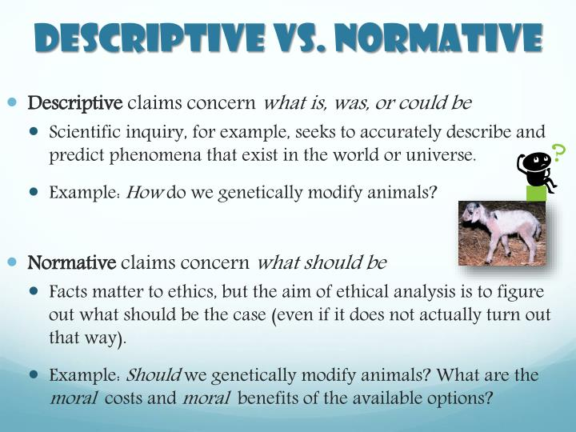

`Version: 1.0`
`Contributors: Alex Nedelcu`
`Publication date: 11.09.2025`

# Conceptualizing sustainability
Before we start discussing anything related to ICT systems, we need to all be on the same page with respect to what sustainability means.

## History and context
First of all, [sustainability](https://en.wikipedia.org/wiki/Sustainability#Historical_usage) is a historical concept. Coming from the Latin _sustinēo_ - to uphold, support, maintain, or preserve, sustainability has been historically applied to forestry by Hans Carl von Carlowitz in his 1713 _Silvicultura oeconomica_, in which sustainability meant the long-term responsible use of forest resources. Of course, many cultures and communities around the world have restricted the use of natural resources.

As a concept, sustainability is [**normative**](https://thisvsthat.io/descriptive-vs-normative). This means that it describes how the world should be, rather than what it is at the moment. Normative concepts are subjective and involve people's values and beliefs, and their objective is to evaluate and recommend actions in the real world. This is the context in which the term is used: in comparison with our current way of doing things, sustainability is different. But how exactly is it different?

[Descriptive vs normative claims.](https://www.slideserve.com/yaron/introduction-to-bioethics)

## Definitions
Let's look at an example definition: the Brundtland Commission's [definition](https://www.britannica.com/topic/Brundtland-Report) of **sustainable development**. This is development that "meets the needs of the present without compromising the ability of future generations to meet their own needs". We can put this definition in perspective by comparing this normative concept with our current world, which is clearly in some ways unsustainable. But how exactly? 

Karl-Hendrik Robert was a Swedish oncologist who worked on defining the system conditions of sustainability. In his "[Natural Step](https://en.wikipedia.org/wiki/Sustainability_metrics_and_indices#Natural_Step_approach)" framework, a sustainable society is that which does not systematically increase concentrations of "substances extracted from the Earth's crust", or "substances produced by society"; that "does not degrade the environment" and in which people have the "capacity to meet their needs worldwide".

For our use of a resource, whether it be natural or social, to compromise the ability of future generations to meet their own needs, that resource would have to be finite. It's difficult to compromise their ability to receive sunlight! So what are some resources that we are consuming?

1) Atmosphere: by [emitting greenhouse gases into the atmosphere](https://climate.mit.edu/explainers/greenhouse-gases), we are changing the Earth's climate from the cozy warmth of the Holocene to a hot, wet, unstable system that threatens to wreak havoc on society.
2) Hydrosphere: by over-extracting from aquifers and diverting rivers for irrigation, we permanently damage sweet water resources (e.g. through seawater intrusion) and make populations across the globe [vulnerable to drought](https://doi.org/10.1126/sciadv.1500323). An unstable climate system can also lead to more powerful floods and droughts. Mining for rare earth metals and [nitrogenation from overuse of fertilizers](https://doi.org/10.1007/978-3-319-58841-4_19) can also poison the water supply. 
3) Pedosphere: by committing to industrial agriculture, we mine the soil for carbon and extract its nutrients until it can no longer be used for farming and is [left barren](https://doi.org/10.1073/pnas.0611508104).
4) Lithosphere: by mining metals and [phosphorus fertilizers](https://sci-hub.st/https://www.sciencedirect.com/science/article/abs/pii/B9780080959757008135) and careless use in society, we [reduce reservoirs and deposits](https://www.unep.org/resources/Global-Resource-Outlook-2024).
5) Biosphere: by deforesting, mining, agricultural expansion, and sprawl, [we damage the biological carbon sinks](https://en.wikipedia.org/wiki/Carbon_cycle#Human_influence_on_fast_carbon_cycle) that regulate greenhouse gas concentration, as well as support hydrological systems. Habitat loss leads to [species loss and extinction](https://www.iucnredlist.org/resources/summary-statistics).
6) Anthroposphere: by relying on debt to fuel our current consumption, we [burden](https://en.wikipedia.org/wiki/Generational_accounting) future generations to work to support us.

[The four planetary spheres.](https://old-ib.bioninja.com.au/options/option-c-ecology-and-conser/c3-impacts-of-humans-on/earth-spheres.html)

This non-exhaustive list should make it quite clear that there are many aspects in which our current society is not sustainable according to the Brundtland Commission's definition. But there's another interesting aspect: sustainability can be more than environmental.

Another way that researchers usually look at sustainability is through the use of the [three pillars approach](https://en.wikipedia.org/wiki/Sustainability#Dimensions): environmental, social, and economic. This is also the framework adopted by the [Rio Declaration of 1992](https://en.wikipedia.org/wiki/Rio_Declaration_on_Environment_and_Development): "Countries could develop systems for monitoring and evaluation of progress towards achieving sustainable development by adopting indicators that measure changes across economic, social and environmental dimensions." 

Up until now, we have been discussing environmental sustainability, which aims to ensure that the natural resources that humanity has access to are managed in a way that does not infringe upon future generations' access to these same resources. Let's also take a look at what the other pillars of sustainability entail.

[Three pillars of sustainability.](https://en.wikipedia.org/wiki/Sustainability#/media/File:Diagramme_de_Venn_du_d%C3%A9veloppement_durable.svg)

Economic sustainability refers to economic policies that support long-term job creation, profitability, and viability without present-day damage. [Some sources](https://www.re-thinkingthefuture.com/sustainable-architecture/a13634-the-three-pillars-of-sustainability-environmental-economic-and-social-sustainability/) state that economic sustainability is about sustainable long-term growth, but that is [increasingly debated](https://theconversation.com/idea-of-green-growth-losing-traction-among-climate-policy-researchers-survey-of-nearly-800-academics-reveals-213434) as structural limits to growth have started to emerge. Another interesting aspect of economic sustainability is fighting against the over-burdening of future generations, for example through [debt crises](https://en.wikipedia.org/wiki/Debt_crisis), [generational accounting](https://en.wikipedia.org/wiki/Generational_accounting#), or increasing [dependency ratios](https://en.wikipedia.org/wiki/Dependency_ratio).

Social sustainability [refers to](https://en.wikipedia.org/wiki/Sustainability#Social_sustainability) the ability of society to continue existing without structural obstacles in key areas. These key areas important for the continuation of human society are its well-being, security and system of rights, access to healthcare, social justice and equality. For a large, complex, integrated human society like the one we live in to continue, all these aspects need to be taken into account.

All definitions of sustainability have these three dimensions interconnected. Some, in addition, have the environmental dimension as [principal and overarching](https://en.wikipedia.org/wiki/Sustainability#Hierarchy) (because the natural system contains the human system), with economic sustainability being nested within social sustainability. Otherwise said, the economic system is part of the social system, and the social system is part of the environmental system. If this is the case, then the environmental dimension sets limits to economic and social development.

[Hierarchy of the dimensions of sustainability.](https://en.wikipedia.org/wiki/Sustainability#/media/File:Nested_sustainability-v2.svg)

In this course, we are generally going to focus on environmental sustainability. This is, on one hand, because one could dedicate one's life to how ICT systems affect each dimension of sustainability, but also because, as written above, environmental sustainability is of principal concern when discussing the impact of human systems. 

## Applications to ICT systems
We've taken a look at a few general definitions for sustainability. These definitions all share a few aspects:

1) Sustainability is an objective to be reached.
2) Sustainability involves the protection of the planetary system.
3) Sustainability involves judicious use of resources.

These three aspects can be combined and applied to ICT systems to develop a definition for sustainable ICT systems, which we will rely on in this course: **Sustainable ICT systems are those which minimize impact on natural resources while meeting societal needs.**

Now that we've defined sustainable ICT systems, we will discuss how we can measure this impact on natural resources, as well as how researchers think about the connection between them and meeting societal needs.

# Operationalizing sustainability
Let's take a look at what frameworks researchers use to think about sustainability. For each framework, we will also discuss what tools are commonly used to measure the actual data that we gather about the world.

## Planetary boundaries
We just recognized that sustainability does not only mean carbon dioxide emissions. In 2009, a group of researchers at the Stockholm Resilience Centre led by Johan Rockström developed the **[planetary boundaries](https://www.stockholmresilience.org/research/planetary-boundaries.html) framework**, which contains the safe limits for human pressure on the nine critical processes which together maintain a stable and resilient Earth. Let's discuss these boundaries and how researchers study them.

[Planetary boundaries.](https://stockholmuniversity.app.box.com/s/sr0nfknm95oydnnsm1zj0c526qzjn1vs)

1) Climate change: deeply connected to global warming, caused by anthropogenic greenhouse gases that make the atmosphere absorb more energy than it emits, leading to a greenhouse effect that warms the planet. Researchers measure climate change by evaluating the carbon dioxide-equivalent concentration in atmosphere, or the atomic carbon concentration in PPM. In April 2025, this [value](https://gml.noaa.gov/ccgg/trends/) was 429.64 ppm, 3 ppm above the previous year.
2) Biosphere integrity: ecosystem biodiversity is threatened by human actions. Researchers measure biosphere integrity by evaluating genetic integrity (e.g. species extinctions) and functional integrity (e.g. the ecosystem services that the biosphere provides).
3) Ocean acidification: the absorption of atmospheric carbon increases the acidity of ocean water, impacting marine ecosystems. It is measured through aragonite saturation state (as aragonite is a substance necessary for organisms to form calcium shells).
4) Modification of biogeochemical flows: represented by nitrogen and phosphorus, two nutrients required for life. The natural cycles for nitrogen and phosphorus have been strongly affected by the enormous production of industrial fertilizers, and this impact is measured by evaluating the oceanic phosphorus concentration (where the nutrient in fertilizers ends up eventually) and industrial nitrogen fixation (which is done to produce nitrogen-rich fertilizers).
5) Freshwater change: human-induced disturbances of blue water (whether it be surface water like rivers and lakes or underground water like aquifers) and green water (precipitation that is stored in the soil) can lead to shifts in precipitation.
6) Land system change: natural landscapes are damaged by deforestation and urbanization. Researchers measure human impact in this field by evaluating forest cover in each biome: tropical, boreal, and temperate.
7) Stratospheric ozone depletion: as exemplified by the Antarctic ozone hole, certain chemicals used within human society can damage the ozone layer that protects life from harmful UV radiation. This impact is measured through stratospheric ozone concentrations.
8) Atmospheric aerosol loading: concentrations of airborne particles from human activities or natural sources.
9) Novel entities: synthetic substances released into the environment without adequate testing, such as chemicals (microplastics, endocrine disruptors), radioactive material, and GMO's.

It should be noted that studying the planetary system is a very complex and difficult endeavor. It is [not always easy](https://doi.org/10.1126/sciadv.adh2458) to figure out where exactly the limits for a stable and resilient Earth are, and there are great uncertainties due to the sheer size of the project. However, in this kind of situation, it is best that we take a precautionary approach, as [stated](https://www.gdrc.org/u-gov/precaution-7.html) in the 1992 Rio Declaration: "Where there are threats of serious or irreversible damage, lack of full scientific certainty shall not be used as a reason for postponing cost-effective measures to prevent environmental degradation."

[Burden of proof vs precautionary principle.](https://old-ib.bioninja.com.au/standard-level/topic-4-ecology/44-climate-change/precautionary-principle.html)

In order to actually measure the physical impacts of human society on the natural systems, several tools have been developed. Substance flow analysis (SFA) and [**material flow analysis](https://link-springer-com.tudelft.idm.oclc.org/chapter/10.1007/978-1-4020-9158-2_12) (MFA)** calculate how individual substances, such as carbon, nitrogen, or phosphorus, as well as materials, such as steel, chlorine, or plastics, travel through the world. Otherwise said, they are systematic assessments of the flows and stocks of materials within a system defined in space and time. 

[An example of material flow analysis: global cadmium flows in the 1980's.](https://thecitywasteproject.files.wordpress.com/2013/03/practical_handbook-of-material-flow-analysis.pdf)

## Environmental footprints and lifecycle analysis
Central to the planetary boundaries framework is the idea of environmental footprint. The **[environmental footprint](https://sci-hub.st/https://www.science.org/doi/10.1126/science.1248365)** quantifies the total human pressure on the natural environment. It is the sum of the total footprints (carbon footprint, land footprint, energy footprint, water footprint, material footprint etc.) of each individual product or activity in human society. The total environmental footprint measures how much of the [available capacity within the planetary boundaries](https://sci-hub.st/https://doi.org/10.1038/s41893-018-0021-4) is already consumed.

Each type of footprint is usually calculated through the use of a [**lifecycle analysis](https://link-springer-com.tudelft.idm.oclc.org/chapter/10.1007/978-1-4020-9158-2_12) (LCA)**. This is a quantitative tool for environmental assessment of products over their lifetime. In a lifecycle analysis, every single activity involved in the manufacturing of an item, or provision of a service, is evaluated, and the environmental impact for each tiny little step is measured through a number of indicators, such as global warming potential, human toxicity, and so on. We'll get back to these indicators later. For now, to give you an example of how a lifecycle assessment works in practice, we can take a look at an ICT product that you have probably heard about: the Fairphone. 

[Flow chart presenting the lifecycle of an incandescent lightbulb.](https://link.springer.com/content/pdf/10.1007/978-1-4020-9158-2_18)

Fairphone organized a [lifecycle analysis](https://www.fairphone.com/wp-content/uploads/2020/07/Fairphone_3_LCA.pdf) for their Fairphone 3 product. This LCA assessed the phone's environmental impact and studied several impact categories: climate change, fossil fuel use, material use, and human and ecological toxicity. The assessment split the lifecycle into several phases: production (which includes material sourcing), transport, use, and end of life. 

As the bar chart below shows, the highest impact is of course coming from the production phase, which involves obtaining raw materials, processing them, assembly, and everything else that is required to get the phone out of the factory door. Some impacts are also attributed to the use phase: for example, when you charge the phone, you are relying on electricity generated by, for example, a natural gas plant, which emits carbon into the atmosphere. The lifecycle analysis also divided these impacts per component of the phone, and also attributed some impacts to all components that help the Fairphone be modular, which is its main selling point.

[Relative impact for each lifecycle phase for the Fairphone 3.](https://www.fairphone.com/wp-content/uploads/2020/07/Fairphone_3_LCA.pdf)

## Sustainability indicators
Up until now we have seen both the planetary boundaries framework and the environmental footprint framework. These are both very useful in helping us conceptualize sustainability, but, as you might have noticed, they also feature so many sustainability indicators! There is no universal standard on how to measure sustainability, so every discipline has developed several competing indicators. For now, we'll take a look at the ones that are used the most, and then leave you with some resources for more in-depth perspectives. But first, to clarify, an indicator represents a quantitative or qualitative measure of how close we are to a target measure (for example, achieving a set objective).

[What-are-the-most-used-economic-indicators-by-investors](Figures/What-are-the-most-used-economic-indicators-by-investors.avif)
[Economic indicators.](https://www.strike.money/fundamental-analysis/economic-indicators)

We use sustainability indicators to measure the impact of human activities on the planet. To make a clear distinction, we'll divide them by field of interest: emissions, materials, energy, and water.

### 1. Global warming potential
The principal indicator that we will constantly return to is the [global warming potential](https://en.wikipedia.org/wiki/Global_warming_potential#) (GWP). By now, there exists a scientific consensus that climate change is predominantly caused by the anthropogenic emissions of greenhouse gases. These gases block the thermal energy emitted by the planet in the atmosphere, creating a [greenhouse effect](https://climate.mit.edu/explainers/radiative-forcing) that warms up the atmosphere.

The global warming potential is a multiple of the warming caused by the same mass of carbon dioxide (which has a GWP of 1). The GWP can be used to [calculate](https://en.wikipedia.org/wiki/Global_warming_potential#) the carbon dioxide equivalent (CO2-eq), or the mass of CO2 that would warm the Earth as much as the mass of that gas. When we want to calculate the impact of an activity on climate change, whether it be a product like a phone, or a system like a data center, we rely on this simple indicator of CO2-equivalent emissions to calculate a carbon intensity.

[Lifecycle emissions of electronic devices in kgCO2-eq](https://unctad.org/publication/digital-economy-report-2024)

Before we continue to some other environmental indicators, we need to go on a little tangent about [carbon accounting](https://en.wikipedia.org/wiki/Carbon_accounting), which is used to track the emissions of a certain organization. There are many frameworks and standards for emissions reporting, allocation, and data collection and use. For example, the [GHG Protocol](https://ghgprotocol.org/) was developed by the World Resources Institute, while [ISO 14064](https://en.wikipedia.org/wiki/ISO_14064) was published by the International Organization of Standardization based on it. The United States' Environmental Protection Agency (supposing it still exists at time of presentation) has its own [GHG Reporting Program](https://www.epa.gov/ghgreporting/what-ghgrp), while European industries covered by the Emissions Trading Scheme [follow its Monitoring and Reporting Regulation](https://climate.ec.europa.eu/eu-action/eu-emissions-trading-system-eu-ets/monitoring-reporting-and-verification_en), and the Netherlands also has an [Emissions Authority](https://www.emissionsauthority.nl/topics/reporting) monitoring emissions within its borders.

[Scope 1, 2, and 3 for emissions reporting.](https://en.wikipedia.org/wiki/Carbon_footprint#/media/File:Scope3_Calculation_Guidance_-updated.png)

Let's take a [practical look at how companies go about emissions reporting](https://kpmg.com/xx/en/our-insights/ifrg/2024/handbook-ghg-protocol.html) when they follow the Greenhouse Gas Protocol. First, they define an organizational boundary that covers all the activities owned or controlled by the company. Then, they classify sources of emissions according to three scopes:

- Scope 1: direct emissions that occur within the organizational boundary: these come from sources that are owned or controlled by the company, such as its facilities or vehicles: generation of electricity, physical or chemical processing, transportation of materials and product waste. These are most relevant for industry sectors like oil and gas, aluminum, cement, manufacturing etc.
- Scope 2: indirect emissions representing energy that is generated outside the organizational boundary, such as electricity, heat, steam, or cooling, but are purchased and consumed by the company.
- Scope 3: indirect emissions that occur outside the organizational boundary, but are part of the company's upstream or downstream value chain. The upstream emissions are related to the purchase of goods and services for use by the company, while the downstream emissions are related to the use of goods and services by the company. Some examples of upstream emissions are employee commuting, waste generated in operations, and capital goods, while some downstream emissions are processing, use, and end-of-life treatment of sold products.

[Practical distinction between Scope 1, 2, and 3 emissions.](https://kpmg.com/xx/en/our-insights/ifrg/2024/handbook-ghg-protocol.html)

The company then calculates its total emissions for each scope by multiplying its activities by the carbon intensity (emission factor) of each activity, and tracks them in relation to emissions targets, for example on a yearly basis. 
$$
\mathrm{tCO_2eq} \; = \mathrm{Activity} \; \mathrm{data} \cdot \mathrm{Emission} \;\mathrm{factor} \cdot \mathrm{GWP}
$$
The emissions data is placed inside a GHG inventory, which is reported to the responsible authorities. These calculations are never 100% precise, due of the possibility of real uncertainties in activity data and emission factors (which are taken from standard databases) on one hand and sometimes malicious misreporting on the other. Unless specific standards are imposed by the regulating authority, companies can sometimes play with the numbers (for example, by using different accounting methods) to [underreport their emissions](https://www.ucl.ac.uk/news/2025/feb/inconsistent-reporting-leads-underestimation-climate-impact-methane) and seem more sustainable. This is why frameworks like the EU Emissions Trading Scheme focus on compliance and emissions audits.

### 2. Material intensity
One large impact of society on the planet is the continuous extraction of materials for human use. The European Union's [3rd Raw Materials Scoreboard](https://op.europa.eu/en/publication-detail/-/publication/eb052a18-c1f3-11eb-a925-01aa75ed71a1) shows that global material use, including biomass, fossil fuels, metal ores, and non-metallic minerals, has probably exceeded 90 billion tons. The EU also [recognizes](https://eur-lex.europa.eu/legal-content/EN/TXT/?uri=CELEX:52020DC0474) several [critical raw materials](https://sci-hub.st/https://www.sciencedirect.com/science/article/pii/S0301420717300223?via%3Dihub#bib18) which are characterized by their supply risk and economic importance. These critical raw materials are [important](https://ec.europa.eu/docsroom/documents/42881/attachments/1/translations/en/renditions/native) for renewable energy, electric vehicles, but also batteries and digital technologies, which are of particular importance for ICT systems. 

Beyond the metals required for e.g. lithium-ion batteries, data storage technologies such as HDD's RAM, flash memory and phase-change memory are [projected](https://www.sciencedirect.com/science/article/pii/S2214993717301252) to heavily increase in use, leading to more consumption of platinum, neodymium, cobalt, rubidium, chromium, selenium and many many other critical raw materials. To measure the consumption of materials, we use an indicator of material intensity, which shows the quantity of material per unit of capacity or per technology.

[Material intensity for different memory technologies in tons per zettabyte.](https://ec.europa.eu/docsroom/documents/42881/attachments/1/translations/en/renditions/native)

### 3. Energy intensity
But to make a hard drive disk we don't only need the materials inside, we also need the energy to put them together. And if we are to live in a world that is no longer powered by abundant (and polluting) fossil fuels, we will need to make use of the energy we do obtain from renewable and nuclear sources more judiciously. 

There [are several ways to measure this energy](https://ourworldindata.org/energy-definitions). First, we can take a look at the primary energy: the energy found in nature, inside inputs that have not been processed by humans, with examples being the chemical energy inside wood, coal, or oil. But we can also look at the useful energy, which is put to the desired output of the application, such as the electricity that powers a lightbulb or the heat from wood burnt in a fireplace. Both of these can be used to calculate the (primary) energy intensity of a product of service: how many units of energy are required to power it per unit of output? 

[w=1350 4](Figures/w%3D1350%204.avif)
[Primary, secondary, final, and useful energy.](https://ourworldindata.org/energy-definitions)

### 4. Water intensity
Then, there is water. Human life cannot continue without water. Therefore, hydrologists are [constantly developing indicators](https://www.researchgate.net/publication/315527957_Water_scarcity_assessments_in_the_past_present_and_future), such as the Falkenmark indicator, the water use to availability ratio, the IWMI indicator, the water poverty index, the environmental flow requirement and so on and so on. Each of these indicators calculates some impact of human activity on the hydrological system and vice-versa. 

For our more modest purposes, we will focus on a more instrumental indicator that can be applied to ICT systems: the humble water intensity. Otherwise said, we measure how much water is consumed for a certain product or process, while noting that: a) not all water used is consumed, and some is returned to the hydrological cycle, and b) not all water is created equal, with pure water being polluted to become grey water.

[Water footprint of various products and services.](http://sncyear7geography.weebly.com/water-footprint.html)

### 5. Others
Finally, there is everything else. Researchers have developed indicators for [biodiversity](https://www.sciencedirect.com/science/article/abs/pii/S0169534716300222#bib0090), for [ocean acidification](https://www.ncei.noaa.gov/access/ocean-carbon-acidification-data-system/synthesis/surface-oa-indicators.html), and for every other aspect of human intervention in the natural system that we are aware of. You are free to take a look, but we will not be using other indicators than the four discussed in detail above in this course.

## Circular economy and rebound effects
Another important framework for sustainability that we will take a look at in this lecture is that of the circular economy. There is no universally-accepted definition (in fact, a [paper](https://doi.org/10.1016/j.resconrec.2017.09.005) from 2017 gives no fewer than 114 definitions). Let's take a look at a few of the definitions that literature gives:

- The strongest public supporters of the circular economy are the [Ellen MacArthur Foundation](https://www.sciencedirect.com/science/article/pii/S0959652615012287), they say that "a circular economy is an economic system where products and services are traded in closed loops or ‘cycles’. A circular economy is characterized as an economy which is regenerative by design, with the aim to retain as much value as possible of products, parts and materials. This means that the aim should be to create a system that allows for the long life, optimal reuse, refurbishment, remanufacturing and recycling of products and materials."
- In contrast, [Chinese circular economy promotion laws](https://www.sciencedirect.com/science/article/pii/S0959652615012287) see it as "a generic term for the reducing, reusing and recycling activities conducted in the process of production, circulation and consumption". 
- Another way to define the circular economy is by contrasting it against our current, [linear economy](https://en.wikipedia.org/wiki/Circular_economy#Definition). In the linear economy, natural resources are processed into products that are ultimately destined to become waste because of the way they have been designed and manufactured: "take, make, waste". In contrast, the circular economy represents a restorative and regenerative system that closes the loop. 

Now, what are some common principles that we can see in these perspectives on the circular economy?

[Circular vs linear economy.](https://blog.sendle.com/guide-to-circular-economy)

The [butterfly diagram](https://www.ellenmacarthurfoundation.org/circular-economy-diagram) developed by the Ellen MacArthur Foundation shows that the circular economy aims to design systems for reuse, sharing, repair, refurbishment and recycling that ultimately reduce human impacts on the environment. You are definitely used to the three R's ("reduce, reuse, recycle"), so you'll be happy to know that there are now nine (or sometimes ten) R's: refuse, rethink, reduce, reuse, repair, refurbish, remanufacture, repurpose, recycle, and recover. Deliberate, reflective design is applied for both products and activities to make them circular at every stage of the lifecycle.

[The butterfly diagram of circular economy.](https://www.ellenmacarthurfoundation.org/circular-economy-diagram)

Now, the idea of a circular economy sounds great in theory, but we need to remain critical and realistic. The circular economy aims to maintain our mode of economic organization, and still aims to support economic growth. Even though it recognizes the need for an energy transition, maintaining economic growth in itself will require [enormous increases in energy supplies](https://www.carbone4.com/en/publication-decoupling) due to [GDP-energy coupling](https://www.tandfonline.com/doi/full/10.1080/08911916.2020.1778866). 7% growth per year would mean economic growth of a factor of 1000 in a hundred years, and will need the energy from all incoming solar radiation hitting the Earth in 105 years.

Another criticism is that circularity can only be obtained by prolonging the lifetime of products. Is this really a problem? Well, fewer of them need to be produced, which means that fewer manufacturing jobs are required! This could be a problem, unless we realize that we are obtaining the same welfare with less work. But where are these welfare gains going? These are complex problems to sort out.

[Relative decoupling between GDP growth, energy consumption, and emissions.](https://www.carbone4.com/en/publication-decoupling)

One important point to keep in mind is that the circular economy focuses a lot on physical materials rather than energy. Of course, researchers involved in studying the circular economy recognize that we need to switch from carbon emitting fossil fuels to renewables, and reduce their energy intensity. But there is a great practical problem that appears when you reduce the material or energy intensity of a product: its cost goes down. Sounds great, until you realize that, if cost goes down, more people purchase the product. As such, it may be that, even though the per-product material or energy intensity goes down, the industry-wide footprint increases! This is the foundation of the [rebound effect](https://en.wikipedia.org/wiki/Rebound_effect_(conservation)#).

[Rebound effect.](https://sociallifeofenergy.substack.com/p/why-efficiency-wont-save-us)

In any case, we will be keeping in mind the principles of the circular economy as we continue to discuss sustainable ICT systems in the following lectures of this course.

## Digital sufficiency
The final framework we will go through today is that of digital sufficiency. Unlike the others presented above, [digital sufficiency](http://dx.doi.org/10.1007/s12243-022-00914-x) was specifically developed by a multinational, multidisciplinary team from several European universities to think about sustainability in ICT systems. 

But first, what exactly does sufficiency mean? We define it in contrast to other strategies to achieve sustainability:

1. Consistency: doing things better, for example by reusing a waste stream and closing nutrient cycles in a circular economy.
2. Efficiency: doing more with less, for example by reducing the carbon or material intensity of a product or service.
3. Sufficiency: reducing total demand for resources and energy while still keeping well-being constant.

As you may have noted, the concept of sufficiency is very similar to our own definition of sustainable ICT systems. Digital sufficiency is itself [defined](http://dx.doi.org/10.1007/s12243-022-00914-x) as 'directly or indirectly decreasing the absolute level of resource and energy demand from the production or application of ICT'. 

The environmental impacts from ICT use in human society can be positive or negative, and they are classified as direct, relating to device manufacturing and electricity demand, or indirect, resulting from the various social changes that happen due to the introduction of ICT systems. For example, making processes in other industries more efficient through digitalization is a positive indirect effect, while creating the possibility for people to store data on the cloud and increase the volume of data they use is a negative indirect effect.

Digital sufficiency aims to address both direct and indirect effects, and it has four interconnected dimensions.

### 1. Hardware sufficiency
We would expect hardware efficiency to mean reducing the amount of materials and energy we need to produce a certain device, or to mean increasing its energy efficiency. In contrast, [hardware sufficiency](http://dx.doi.org/10.1007/s12243-022-00914-x) means being able to produce fewer devices, designing them to last longer, ensuring that they are the right tool for the job and no more, and therefore keeping their energy demand at the absolute minimum required to perform the tasks they need to do.

If we extend their useful life, for example by designing repairable and upgradable devices (for example, through modular design), fewer new devices will need to be produced. If we design devices for recycling at the end-of-life, for example by using mechanical connectors like screws instead of glue, we can improve the recovery of resources and need fewer virgin extraction. Smaller devices may also be sufficient - why buy a desktop when a laptop can do the job?

We can talk about nice design practices all we want, but unless they are applied in real life, it's all bunk. At a societal level, we should have standards for long-lasting hardware, low-energy consumption, avoiding critical and hazardous materials, and encouraging recycling. Manufacturers should eliminate early obsolescence and offer repair and upgrade services and provide software updates until the end of a device's physical lifetime. These strategies are not only technical - they are also economic and political, same as everything else related to sustainability.

### 2. Software sufficiency
As you will see in the lecture on designing sustainable software, efficient software reduces both electricity consumption and hardware utilization for each unit of compute. In contrast, [sufficient software](http://dx.doi.org/10.1007/s12243-022-00914-x) aims to minimize these in absolute terms, for example by reducing total data volume and traffic. 

Software can and should be programmed so as to minimize absolute energy demand: default settings for minimum energy consumption, limiting the extent of forced connectivity, applying open standards, and mitigating hardware obsolescence by ensuring backward compatibility. A sufficiency stand on software would lean towards maintenance of existing software rather than on constant novelty.

### 3. User sufficiency
[User sufficiency](http://dx.doi.org/10.1007/s12243-022-00914-x) is a bit more nebulous than the former two concepts, but it is necessary if we want to achieve social sustainability. When investigating user impacts, we need to think both about how ICT itself is used (for example, the number of devices, the intensity, and the duration) and about what it's used for. Applying user sufficiency means, on one hand, applying digital devices frugally (do we need an account for the washing machine?) and, on the other hand, using them to promote sustainable lifestyles and help users reduce their consumption needs while maintaining a good quality of life.

### 4. Economic sufficiency
Improving the economic efficiency of ICT systems means maximizing economic outputs with scarce resource and energy inputs. In contrast, [economic sufficiency](http://dx.doi.org/10.1007/s12243-022-00914-x) would use digitalization to support the transition to an economy characterized not by economic growth as primary imperative but by sufficient production and consumption to serve societal and individual needs. This is more on the social side, and involves using ICT improvements in productivity to reduce our need to work, as well as using ICT systems for cooperation and services rather than monopolist platforms.

[The four dimensions of digital sufficiency acting in concert.](http://dx.doi.org/10.1007/s12243-022-00914-x)

## Applications to ICT systems
In this lecture, we've gone through a whirlwind of information about sustainability and how we can think about it both as a concept and as something to be measured. We won't be having you perform lifecycle analysis for your phones in this course. That's the job of very smart people in [Industrial Ecology](https://studiegids.universiteitleiden.nl/en/courses/123916/lca-practice-reporting). But we will be applying the perspectives in this lecture to the more 'rich' ICT topics in the following lectures. 

1) We will be thinking about how we can design software to run more efficiently so that we can consume less energy doing so.
2) We will be evaluating data centers and how they are driving an unprecedented increase in energy and water resource consumption while supercharging carbon emissions.
3) We will be thinking about AI and whether it will help or harm our efforts towards sustainability.
4) We will be studying the material intensity of electronics and how we can deliberately design electronics to reduce their reliance on critical raw materials.

For all these topics, it will be important to keep in mind the frameworks we discussed today. The planetary boundaries should act as constraints for everything we set out to do as we aim for a circular economy, with our environmental footprint being measured with the many indicators that we saw in the lecture. The final objective, of course, is digital sufficiency: reducing the absolute impact of ICT systems on the environment.

# Feedback
We are happy to receive any feedback you may have on this lecture. Is there too much information in the slides/notes, or would you like to know more about a certain topic? Please let us know by [**filling in this form**](https://forms.cloud.microsoft/e/28PK4pSGgW).

# Further reading
Want to know more about the topics in this lecture? Here are some sources that didn't quite make the cut.

## Planetary boundaries
- [A good life for all within planetary boundaries](https://sci-hub.st/https://doi.org/10.1038/s41893-018-0021-4): a study estimating the standard of living for humanity to exist safely within the planetary boundaries.
- [Doughnut economics](https://doughnuteconomics.org/about-doughnut-economics): one of the most famous and intuitive ways of thinking about supporting human society within the planetary boundaries.
- [Earth Overshoot Day](https://www.footprintnetwork.org/our-work/earth-overshoot-day/): a more poetic description of the overshoot of planetary boundaries, the date when humanity has exhausted nature's budget for the year.
- [Planetary Limits Academic Network](https://planetarylimits.net/): an interdisciplinary project to bring together various field and design responses to the breach of planetary limits.
## Tools for sustainability assessment
- [Principles of Environmental Sciences](https://tudelft.on.worldcat.org/oclc/314175026): an excellent introductory source for all sustainability assessment methods mentioned in the course, explaining principles and methodologies.
- [Practical Handbook of Material Flow Analysis](https://thecitywasteproject.files.wordpress.com/2013/03/practical_handbook-of-material-flow-analysis.pdf): an academic source explaining in great detail MFA principles and implementation in practical use-cases.
- [Indicators of sustainable production](https://doi.org/10.1016/S0959-6526(01)00010-5): a paper that develops a set of indicators for sustainable production, from materials sourcing to manufacturing and end-of-life procedures.

## Circular economy
- [DelftX Circular Economy MOOC](https://www.edx.org/learn/circular-economy/delft-university-of-technology-circular-economy-an-introduction): a free TU Delft online course on the principles, implementation, and critiques of circular economy.
- [National Circular Economy Programme 2023-2030](https://www.government.nl/documents/reports/2023/09/27/national-circular-economy-programme-2023-2030): the Netherlands' official agenda to reach a circular economy by 2030.
- [Netherlands Circularity Gap](https://www.circularity-gap.world/netherlands): a report on what measures need to be implemented to improve the circularity of the Dutch economy.

## Digital sufficiency
- [Digital Reset](https://digitalization-for-sustainability.com/digital-reset/): a comprehensive report on the need and methods for implementation of digital sufficiency in the world economy.
- [Digital Sobriety](https://theshiftproject.org/en/publications/lean-ict/): a similar concept to digital sufficiency developed by the Shift Project in France.
- [Towards a sufficiency-driven business model](https://doi.org/10.1016/j.eist.2015.07.010): a more generalist paper conceptualizing the business models that would be required for a transition towards sufficiency.