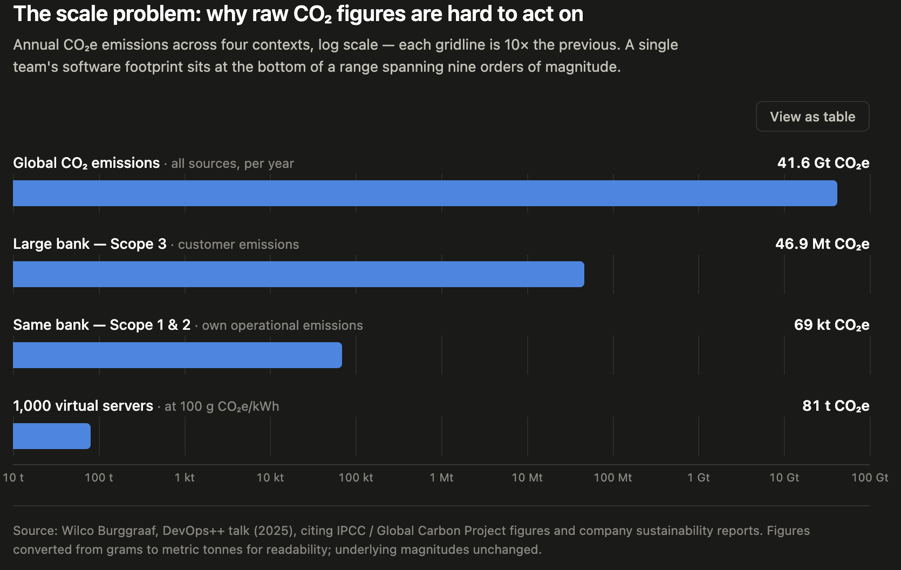
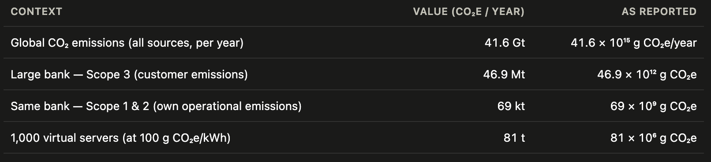

`Version: 2.0`
`Contributors: Liwia Padowska`
`Publication date: 17.09.2026`

# Sustainable Software: Green Programming, Profiling, and AI-Assisted Development

These notes synthesise the technical side of sustainable software: how to write low-waste code, how to measure energy and carbon of software, and how the rise of AI-assisted ("agentic") development changes the picture, both as a tool for sustainability and as a new source of waste. They draw on the work of Wilco Burggraaf (HighTech Innovators), the Green Software Foundation's Software Carbon Intensity standard, the CNCF energy-profiling ecosystem (Kepler, KEIT), and recent empirical research on the energy cost of LLM-generated code.

This lecture deliberately goes beyond what TU Delft's green software MSc course, Sustainable Software Engineering (CS4575), teaches: it adds the DevOps++ delivery-loop framing, the SCI/KEIT measurement pipeline, and the agentic-AI and vibe-coding material, none of which are covered there.

## Table of contents

1. Framing: from CO₂ to action
2. The four laws of green IT and sustainable software
3. Green programming: patterns of waste and how to remove them
4. DevOps++: embedding sustainability in the delivery loop
5. Measuring energy: two profilers, and whether they agree
6. Measuring carbon: the SCI standard and KEIT
7. Sustainable design: the parts people forget
8. Green software with AI: agentic development
9. Vibe coding: what is the energy cost?
10. Resources

---

## 1. **Why CO₂ is a poor *driver of engineering action* (even though it is the goal)**

A natural instinct in sustainable computing is to put a carbon number on everything and optimise it. But raw CO₂ figures are hard to act on. Consider the scale (figures are taken from Wilco Burggraaf's DevOps++ talk, sourced from IPCC / Global Carbon Project and company sustainability reports):





At the top, the world's total yearly emission of CO₂e sits at roughly 41.6 billion tonnes (Global Carbon Project, 2025). One row down, one large bank's full supply-chain yearly footprint, drawn from an anonymised sustainability report, comes to roughly 46.9 million tonnes, a thousand-fold smaller than the global figure but still far beyond anything one engineer can picture or influence directly. The software footprint a single team of developers actually controls corresponds to the smallest number in the list above, the 1,000-server IT company example, roughly 81 tonnes, or 81,000,000 grams of CO₂e a year. That small number is hard to feel anything about: nobody has an everyday sense of what a gram of CO₂e means, so `81,000,000 grams CO₂e` still reads as abstract, and it is easy to argue with or dismiss. People instead respond to things they can watch change in real time: an energy meter ticking up while their code runs, or the total on a cloud bill going down after a fix. Those give someone something concrete to act on right now.

The DevOps++ framing is therefore:

> **Actions first. CO₂ second.** Concrete engineering action, such as shutting down idle compute, right-sizing resources, or shrinking payloads, is tangible and directly under an engineer's control: waste goes down, and CO₂ goes down with it. CO₂ works best as *validation* that an action helped, not as the *driver* that motivates the action in the first place.
> 

This reframing matters: it shifts from paralysing global numbers toward concrete, local engineering decisions engineers can actually make.

### Hardware efficiency is not enough

A common misconception is that using more efficient computer hardware automatically solves the problem. Modern processors have become much better at reducing their power use when they are not busy. However, every unit of electricity they consume still contributes to carbon emissions, depending on how that electricity is generated. This means that inefficient software still wastes energy, even on highly efficient hardware. For example, software may perform unnecessary calculations, send excessive amounts of data between different parts of a system, run too many tasks at once, or spend time waiting inefficiently for information to arrive. All of these behaviours increase energy consumption without providing additional value. This connects directly to the AI hardware lecture: a chip can only power down the parts of itself that aren't doing anything, a technique called **power gating**, where the chip cuts off the electricity supply to a circuit block entirely once it has no work left to do, rather than leaving it switched on and idling. If wasteful software keeps asking that circuit to do unnecessary work, it never goes quiet long enough to be gated off, so the chip never gets the chance to save that power.

---

## 2. The four "laws" of green IT and sustainable software

Wilco Burggraaf formalises green and sustainable IT into four "laws" (Laws of Green IT and Sustainable Software, 2025). They map onto three of the ten circular-economy actions (Refuse, Rethink, Reduce, Reuse, Repair, Refurbish, Remanufacture, Repurpose, Recycle, Recover) defined by Potting, Hekkert, Worrell & Hanemaaijer (2017), *Circular Economy: Measuring Innovation in the Product Chain*, PBL Netherlands Environmental Assessment Agency. See the note at the end for the R's they don't cover.

### **Law 1: Minimal Negative Impact (Green Efficiency Law) — *maps to: Reduce***

**Law statement:** Reducing the energy and hardware a system consumes, and sourcing that energy more cleanly, reduces its environmental impact across its whole lifecycle.

The goal of Green IT is to use computing resources in a way that minimizes their environmental impact throughout their entire lifecycle. From the extraction of raw materials and manufacturing, through everyday use, to disposal or recycling at the end of their life. In practice, this means performing the same computing tasks while using less electricity (energy efficiency), running them on fewer or more efficient machines (hardware efficiency), and using electricity from cleaner energy sources whenever possible.

**Worked example: cut redundant network calls.** A common Law 1 fix is batching: instead of one network call per event (`for event in events: http.post("/log", event)`, which wakes the device's radio out of its low-power state to send one small event, then lets it go idle again, repeating for every event), buffer events and send them together (`buffer.append(event); if len(buffer) >= BATCH_SIZE or timer_elapsed(): http.post("/log/batch", buffer); buffer.clear()`), so the radio wakes once for the whole batch instead of once per event. In a controlled study on Android, batching HTTP calls this way cut energy use by about 40%: 393 J instead of 643 J for the same set of calls, over a mobile (4G) connection (Vergallo, Cagnazzo, Mele & Casciaro, 2024, *Measuring the Effectiveness of the "Batch Operations" Energy Design Pattern to Mitigate the Carbon Footprint of Communication Peripherals on Mobile Devices*, Sensors, 24(22), 7246). One caveat worth keeping in mind: the same study found batching did **not** help for GPS calls, so this is a real, measured pattern for network/radio use specifically, not a universal law that batching always helps regardless of what is being batched.

Batching is one instance of a broader family the Green Software Foundation's patterns catalog groups together under "reduce redundant work": don't repeat work that has already been done. Three named patterns from that family worth knowing individually: 

- **cache static data** (if a value has not changed, use the stored copy instead of recomputing or re-fetching it),
- **lazy loading** (only compute or fetch a value the moment it is actually needed, not before, instead of eagerly doing it up front on the chance it might be needed), and
- **batch requests** (group many small calls into one, as above). This is the same pattern in the Green Software Foundation's patterns catalog as "keep request counts low";

TU Delft's own Sustainable Software Engineering course (CS4575, taught by Luís Cruz) covers many more patterns like it.

### **Law 2: Sustained Process (Longevity Law) — *maps to: Repair***

**Law statement:** Keeping software clean, modular, and well-documented so it can be repaired and extended, rather than rewritten, avoids paying its development cost a second time.

Design systems to be maintained and supported over long periods. For software this means clean, modular, well-architected code that can be *extended* rather than rewritten. Durability equals sustainability: keeping a system in service avoids repaying its **development cost,** the effort already spent designing, building, testing and deploying it, a second time. A ground-up rewrite starts that cost again from zero; a repair does not, because it was already paid once. (A terminology note: it's tempting to call this the system's "embodied cost," borrowing the term the SCI standard uses for a *hardware's* manufacturing footprint. That borrowing overstates the analogy since a rewrite's cost is sunk engineering effort and time, not a physical manufacturing emission, so these notes keep "development cost" for software and reserve "embodied" strictly for hardware.)

### Law 3: Full Resource Utilisation (Circular Use Law) **— *maps to: Reuse***

**Law statement:** Reusing existing libraries, hardware, and devices before building or buying new ones avoids the environmental cost of producing something new.

Before creating or consuming anything new, fully use and repurpose what already exists, reducing and reusing before producing anew. The most sustainable product is the one you already have. In software: reuse existing libraries instead of reinventing them; optimise software to run on existing hardware instead of forcing upgrades. A lightweight app that runs on an old phone keeps that phone out of the e-waste stream. Increasing the useful lifespan of electronic devices by 50–100% could mitigate up to half of their total greenhouse-gas emissions (Singh & Ogunseitan, 2022). A concrete illustration worth keeping in mind: a university that keeps its lab laptops in service for six years instead of three avoids buying, and manufacturing, twice as many replacement devices over the same period.

### Law 4: Holistic Impact Awareness (Systemic Optimisation Law) - ***doesn't map to a single R (see note)***

**Law statement:** Accounting for impact across the whole system, rather than optimising one part in isolation, prevents an apparent local improvement from simply shifting the burden elsewhere.

Before acting on a design or optimisation decision, account for its full environmental impact, energy, carbon, and embodied cost, across every stage of the system it touches: the hardware it runs on, the services it depends on, and the system's full lifecycle from manufacturing to disposal. Avoid siloed optimisations that improve one part of that chain while quietly pushing the cost onto another part. Only proceed once the whole system, not just the piece directly in front of you, has been considered.

This is where it gets genuinely hard: unlike a physical product, software has no clear mass or single lifetime, so it is easy to lose track of where its impact actually is. Three examples of the trap this law warns against: 

- consolidating servers onto fewer, busier machines cuts the cloud bill while leaving total energy, and therefore CO₂, unchanged, because the same work still runs somewhere;
- judging an AI service only by its per-call inference energy while ignoring the enormous embodied cost of training the model in the first place (the "manufacturing" of the model), amortised across every call it will ever serve;
- switching a web application from server-side to client-side rendering, which lowers the load on the server but pushes the same rendering work onto every visitor's device instead. The server's energy bill looks better, but the total energy spent across all those devices doing the same work can end up higher even as the server's own cost falls.

In every case, the fix that looks like a win is only a real win once you have checked what it did to the rest of the chain, not just the part you were looking at.

### Law 4 in numbers: the greenest programming languages, and choosing one by task

Holistic impact awareness applies to a choice engineers make constantly and rarely measure: which language to write something in. Pereira, et. al (2017) ran the same 27 benchmark tasks across many languages with a chip-level power meter. Selected results (energy per benchmark run, C as the lowest-energy baseline): 

- C ≈57 J,
- Rust ≈59 J,
- C++ ≈77 J,
- Java ≈114 J,
- compiled languages averaged ≈120 J,
- virtual-machine languages averaged ≈576 J (≈5× the compiled average),
- Ruby ≈4,045 J,
- Python ≈4,390 J,
- interpreted languages averaged ≈2,365 J (≈20× the compiled average).

At the top of the list, energy and execution time track closely, the fastest languages are also the most efficient, though that relationship weakens further down. This is clock-cycle efficiency only; it says nothing about how long a language takes to write or maintain.

That second cost is real too. Prechelt (2000) had professional and student programmers solve the same small task (phone-number encoding) in C, C++ or Java versus a scripting language (Perl, Python, Rexx or Tcl). Scripters took a median of 3.1 hours against 10.0 hours for the non-scripting group, less than half the time, and the paper reports non-scripted solutions typically ran two to three times longer in lines of code than the scripted ones. Choosing a language purely by clock cycles ignores the engineer-hours (and the infrastructure behind them) spent writing and maintaining the code across its whole lifetime. Both costs are real; the right choice depends on how often the code runs versus how often a person has to change it. A practical way to apply this:

- **A large inner loop** — processing millions of rows, or a training loop that runs constantly. Compiled languages win here: C or Rust use roughly 20× less energy than the interpreted average, per Pereira et al. above.
- **A low-traffic internal tool** — an admin dashboard used by ten people a week. Engineering time to build, review and maintain it matters more than runtime energy, so a scripting language such as Python is often the better default, per Prechelt's findings above: scripters needed about half the development time and about half the code length of an equivalent C solution.
- **A data or ML pipeline** — training a model with NumPy in Python. The Python interpreter barely runs at all, since the heavy loop underneath executes as compiled C, C++, or CUDA code, so numeric libraries like NumPy can approach compiled-language performance for this kind of workload even though the surrounding code is "interpreted Python." A widely cited illustration of the size of this effect: one comparison found NumPy's matrix multiplication ran roughly 84 times faster and used roughly 44 times less energy than an equivalent hand-written C++ loop, because almost none of the actual arithmetic happens in the interpreter. Treat that specific ratio as an illustration of *how large* the gap can be for this kind of workload rather than a fixed constant, since the exact multiplier depends heavily on matrix size, hardware, and which BLAS library NumPy is linked against. A useful counterpoint to keep in mind alongside it: *It's Not Easy Being Green: On the Energy Efficiency of Programming Languages* (arXiv:2410.05460, 2024) argues that once execution time, core count and memory use are controlled for, the choice of *language* has little independent effect on energy beyond how long the code takes to run. The language-energy tables like Pereira et al.'s are a real, measured pattern, but the underlying driver may be execution time itself rather than some intrinsic property of "the language."

A companion study, Georgiou, Kechagia, Louridas & Spinellis (2018), *What are your programming language's energy-delay implications?*, MSR 2018 (ACM), mined real open-source commit histories rather than running fresh benchmarks, and found that a change's effect on energy tracks its effect on execution time closely enough that developers can often use delay as a practical proxy for energy when a direct energy measurement is not available, reinforcing the same "fast and green usually agree" pattern discussed further in §3.

We still cannot pick the "greenest library" with confidence the way we can read an appliance's energy label: software is intangible and runs across millions of machines at once, so measuring and assigning its impact is hard. You can use the following three proxy indicators: 

- code that does a job in fewer processor cycles usually also uses less energy;
- a region whose power comes mostly from wind, solar or water is cleaner to run in;
- a project many people maintain has likely already had most of its waste found and fixed.

The field's answer to the harder quantification problem is the emerging Software Carbon Intensity standard, covered in §6.

---

## 3. Green programming: patterns of waste and how to remove them

Green programming, based on Burggraaf's ten DevOps++ principles (Fixing Friction, 2025), is basically performance engineering, but with a different question in mind. Performance engineers already look for the same kinds of waste: CPU cycles spent on nothing useful, data moved around when it didn't need to be, time spent waiting instead of working. Normally, they judge whether a fix worked by checking if the system got faster or could handle more users. Green programming looks for that same waste, but judges success differently: did the code use fewer joules of electricity to do the same job? The patterns below show up again and again in real systems. The ten principles are grouped into four themes; each theme listing several numbered sub-points because the same underlying problem tends to show up in more than one place in a system. Each sub-point names a different place and the specific fix for that spot.

### Eliminating idle waste

1. **Eliminate idle compute.** "Idle compute" means computers or containers that are switched on and using electricity, but aren't actually doing any useful work. This happens in a few common ways. A **testing environment** (a copy of the system used to try things out before they go live) often gets left running all the time, even though people only actually use it for a few hours a day. A **development cluster** (a group of servers a team sets up to build and test their code) sometimes gets forgotten once a project ends, so it just keeps running, and using electricity, with nobody using it anymore. And sometimes a service is kept switched on and ready to respond instantly, even when nobody is using it, because turning it off means it takes a few extra seconds to start back up next time it's needed. If that "next time" doesn't come for weeks, all that waiting time is wasted electricity.
The fix is to stop deciding when to turn things off using a fixed clock (for example, "always turn it off at 8pm"), because a clock has no idea whether the system is actually being used at that moment. Instead, use a signal that comes from the application itself, something that tells you directly whether there is real work to do right now, like how many tasks are currently waiting, or how many people are actively using it. When that number drops to zero, the system can safely turn itself off; when it rises again, the system turns back on.
Here's a simplified example, using a tool called KEDA that can automatically turn a service on or off based on a number it reads from monitoring data:

```yaml
# Tells the system: "run zero copies of this service when there is
# no active work, and turn back on automatically when work appears"
   apiVersion: keda.sh/v1alpha1
   kind: ScaledObject
   metadata:
     name: worker-scaler
   spec:
     scaleTargetRef:
       name: worker-deployment
     minReplicaCount: 0        # it's allowed to switch off completely
     maxReplicaCount: 10
     triggers:
       - type: prometheus
         metadata:
           query: sum(app_active_jobs)   # a number the application reports itself
           threshold: "1"
```

In plain terms: `app_active_jobs` is a number the application keeps track of and reports, how many tasks it currently has to do. As soon as that number hits zero, the service switches off completely and stops using electricity. The moment real work shows up again, it switches back on automatically. That's the difference between reacting to what's actually happening (a signal) and just guessing based on the time of day (a timer).

1. **Challenge CPU load without business context.** High CPU load doesn't automatically mean you need more servers. First trace it back to what's actually causing it: real user activity, or the system uselessly talking to itself?
For example, an order-processing service might spike every night at 2am. That could be a legitimate nightly job matching orders to warehouse stock, real work that needs the CPU. Or it could be one service repeatedly asking another "are you done yet?" dozens of times a second while waiting for a task to finish (called **polling**), instead of just being notified once when it's actually done. The graph looks the same either way, but only one of these is worth paying for with more servers; the other is a bug to fix in code. A monitoring dashboard that averages usage into, say, five-minute buckets makes this worse: both a real spike and a polling spike collapse into the same-looking line on the graph, so the averaging itself hides the distinction you actually need to see.
In practice, engineers use monitoring tools (APM, short for Application Performance Monitoring) to see which specific part of the system is using the CPU, then check that against real business numbers from the same time, orders placed, active users, and so on. High CPU with no matching rise in business activity is a strong sign of waste, not a case for scaling up. This is standard site-reliability practice, not a green-specific invention: Beyer, Jones, Petoff & Murphy (2016), *Site Reliability Engineering*, O'Reilly, and the Kubernetes project's own documentation on resource management for pods and containers describe the same discipline of tying CPU limits and alerts to real, measured demand rather than assumption.
2. **Right-size memory with runtime feedback.** No one gets a service's memory allocation right on the first try. A memory **limit** is just the maximum amount of RAM a service is allowed to use. If the limit is too low, the service can get killed before it finishes its work. If the limit is too high, memory is reserved but never actually used, so it is wasted.
**Historical runtime traces** are simply records of how much memory a service has actually used while it was running in the past. This is real, measured data collected over time, not a guess made before the service ever ran. Feeding this real data back into **infrastructure-as-code (IaC)**, the config files (for example Terraform or Kubernetes YAML) that define how much memory each service gets, lets the memory limit be automatically corrected to match what the service really needs, instead of staying stuck at whatever number someone guessed at the start.
This also reduces "out of memory" crashes (OOM). An OOM crash happens when a service tries to use more memory than its limit allows, so the operating system forcibly shuts it down. A limit set too low causes frequent OOM crashes. A limit set too high just wastes memory. Using real usage data to set the limit helps avoid both problems.

### Seeing the real bottleneck

1. **Prioritise I/O visibility over compute assumptions.** Slow systems are often blamed on the CPU when the real cost is disk I/O, database locks, or blocked sockets. **Full-stack latency tracing** means adding small markers in the code that record exactly how long each individual step takes, the database call, an external API call, a file read, and so on, instead of only knowing that "the whole request took 2 seconds" without knowing why.
For example:

```python
   from opentelemetry import trace

   tracer = trace.get_tracer("order-service")

   def get_order_info(order_id):
       with tracer.start_as_current_span("db_query"):
           order = db.query("SELECT * FROM orders WHERE id = ?", order_id)

       with tracer.start_as_current_span("external_api_call"):
           shipping_status = shipping_api.get_status(order.tracking_id)

       return {"order": order, "shipping_status": shipping_status}
```

Each `with tracer.start_as_current_span(...)` block records how long the code inside it took to run. A tool like Jaeger or Grafana Tempo then shows this as a timeline: instead of just "2 seconds total," you might see `db_query` took 1.8 seconds and `external_api_call` took 0.15 seconds. Now the bottleneck is obvious: it's the database, not the CPU. Adding more CPU or more servers would do nothing here; the actual fix is a faster database query, a missing index, or a database lock somewhere else in the system. Embed full-stack latency tracing and fix the bottleneck where it actually is.

1. **Validate performance early, not post-deployment.** Run performance and efficiency checks as early as possible, ideally automatically, as part of the pull request, before the code is ever deployed. Do this using simulated infrastructure that behaves like the real system, instead of waiting until the code is already live and being used by real people.
The earlier a problem is caught, the cheaper it is to fix. A performance issue found during a pull request review costs a few minutes to fix, the code hasn't been deployed yet, so nothing has broken and no energy has actually been wasted running it. The same issue, if it's only discovered after the code is already live, means real users are already affected by the slowness, engineers scramble to patch it, and extra servers may get added just to cope, all while the inefficient code keeps running and burning energy in production. 

### Moving less data, in the right place

1. **Prune data at the source.** In a system built from many small services that call each other over the network (a "microservices" system), each response sent over the network is called a **payload**, the actual data content of the message, as opposed to things like headers. "Over-communicating" services send payloads containing far more data than the receiving service actually uses, wasting network bandwidth, and the energy that goes with moving that data, on information nobody reads.
    
    **Telemetry** here means adding simple tracking to a running system to see which fields inside a payload are actually read by whoever receives it. Any field that's never accessed anywhere is a strong candidate to remove. For example:
    
    ```python
    class TrackedResponse(dict):
        """Wraps an API response and records which fields actually get read."""
        def __getitem__(self, key):
            telemetry.increment(f"payload_field_used.{key}")
            return super().__getitem__(key)
    
    response = TrackedResponse(api_call().json())
    name = response["name"]     # records that "name" was used
    # if "middle_name" is never accessed anywhere in the codebase,
    # its usage counter stays at zero
    ```
    
    After running this in production for a while, the counters might show `payload_field_used.email` read 50,000 times, but `payload_field_used.middle_name` read zero times, meaning `middle_name` is being sent in every single response for nothing. Once a field's usage counter has stayed at zero for long enough to trust it, the field is a strong candidate to simply drop from the response entirely. (The `TrackedResponse` pattern above, wrapping a built-in `dict` to intercept every read transparently, is a standard idiom from Ramalho, L. (2015), *Fluent Python: Clear, Concise, and Effective Programming*, O'Reilly, applied here to telemetry instead of its usual uses.)
    
    **"Max payload size"** means setting a hard limit, enforced by the server, on how large a single request or response's data content is allowed to be, so no service can accidentally, or through bad design, send back an enormous block of data, for example an entire database table dumped into one response.
    
    **Contract-first development** means agreeing on the exact shape of a payload, which fields it contains and nothing more, in a shared specification (for example an OpenAPI or Protobuf schema) before any code is written, so sender and receiver both deliberately agree on what's actually needed. This is the opposite of a common bad habit: a developer just returning their entire internal database record because it's convenient, which is exactly how unused fields end up shipped in every request.
    
2. **Choose compute location intelligently.** Not all compute belongs in the cloud. Where response time, data location, or sustainability matter, running code close to the user, on the edge or on the user's own device, can be the better choice, for two distinct reasons worth keeping separate.
    
    The first is bypassing long-distance transmission over the wide-area network (WAN) entirely. Sending data over the internet is not free: transmitting it consumes roughly 0.015–0.06 kWh per gigabyte across core routers and radio access networks combined, and that cost is paid on every round trip. Running the computation locally or at the edge, instead of shipping the data to a distant cloud region and back, can cut network data transfer by roughly 70–90% for workloads where most of the traffic was the request/response payload itself rather than the computation's own output (Aslan et al., 2018; Jansen et al., 2025; Lee et al., 2025).
    
    The second is a knock-on effect on the device's own radio, and it is subtler: a phone or laptop's Wi-Fi or 5G chip stays fully awake at high power while it waits for a reply, so the round-trip latency itself, not just the data volume, has an energy cost. Cutting a response time from around 80 ms (typical of a round trip to a distant cloud region) down to under 10 ms (typical of an edge or local response) lets the wireless chip return to its low-power sleep state immediately, instead of sitting awake and draining the battery while it waits for an answer that is still travelling across the network. This is the same idle-versus-active distinction as the radio wake-up cost in the batching example in Law 1, just triggered by network distance rather than by call frequency.
    
    Simulate and validate workloads across regions and runtimes before committing to a location, since the right answer depends on the specific workload's data volume and latency sensitivity, not a blanket rule that edge is always greener.
    
3. **Embrace lightweight execution (WebAssembly).** **WebAssembly (Wasm)** is a small, portable format for compiled code that runs inside a lightweight, sandboxed (isolated and secure) environment. It was originally built to let languages like C++ or Rust run inside web browsers alongside JavaScript, but it's now also used to run code outside the browser, for example on a server, at the network edge, or on a cloud "serverless" platform, as a lighter alternative to a full container or virtual machine.
    
    For stateless, secure, fast functions (small, self-contained pieces of code that don't need to remember anything between calls), Wasm modules build faster, ship lighter, and scale with negligible overhead **when deployed to one of those server, edge, or serverless cloud environments**, compared to a traditional Docker container running a full Linux operating system and language runtime. A Wasm module is typically a few kilobytes to a few megabytes, versus hundreds of megabytes for a typical container image, so it builds and transfers over the network faster; and because there's no full operating system to boot, a new instance can start in milliseconds instead of the seconds a container or virtual machine needs. That matters most in cloud or edge environments that are constantly starting and stopping instances in response to traffic, exactly the "eliminate idle compute" situation from earlier: less to start up means less energy spent every time the system scales up or down.
    

### Measuring what matters

1. **Tie performance thresholds to perception, not tradition.** Humans experience time in thresholds: roughly 0.1 s feels instant, roughly 1 s stays comfortable, and beyond that attention drifts. Target the thresholds users actually feel, using **real-user monitoring (RUM)**, measuring the real load and response times experienced by real people on their own devices and networks, rather than a single number measured once in a lab. For example:
    
    ```jsx
    // Runs in a real visitor's browser and reports what they actually experienced
    window.addEventListener("load", () => {
      const [pageNav] = performance.getEntriesByType("navigation");
      const loadTime = pageNav.loadEventEnd - pageNav.startTime;
    
      fetch("/rum-collector", {
        method: "POST",
        body: JSON.stringify({ metric: "page_load_time", value: loadTime })
      });
    });
    ```
    
    Collected across thousands of real visits, on different phones, laptops, and network speeds, this builds a picture of what users genuinely experience. Compare that with **speculative micro-optimisations**, small code tweaks a developer makes because they guess it'll help (for example, swapping one loop style for another) without any real measurement showing users would even notice.
    
2. **Measure efficiency in user terms (OPUA).** **Operations-Per-User-Action (OPUA)** counts how many underlying operations, database queries, API calls, computations, happen behind a single thing a user does, like loading a page or clicking "add to cart." The best systems do less to achieve the same output: for example, if loading a user's dashboard originally triggers 42 separate database queries (one per widget on the page), and a team batches those into a single combined query so the dashboard still shows exactly the same information, OPUA has dropped from 42 to 1 for that same user action. This is measured directly, by instrumenting the code to count every database or API call made while handling one user request, and comparing the count before and after a change. Counting "user calls per transaction" this way is itself a standard database-monitoring concept, not something invented for this course (Oracle, 2024, *Database Instance: User Calls (per transaction)*, Oracle documentation) — the 42-queries-to-1 example just applies it at the level of one page instead of one transaction.

### Why "fast" and "green" point the same way

Many of these techniques reduce both latency and energy, because they reduce data movement and improve cache locality:

- **Async I/O (asynchronous input/output).** Normally, when code asks for something slow, reading a file, calling an external API, querying a database, it can "block": the program just sits there doing nothing until the answer comes back, wasting time that could be spent on other work. Async I/O lets the program start that slow operation and immediately move on to something else useful, coming back to handle the result once it's actually ready, instead of idling while it waits.
- **Batching.** Instead of sending many small, separate requests, for example, one database query per item in a list, batching combines them into a single larger request. This cuts down the repeated overhead, connection setup, headers, round trips, that comes with every individual request, so less data needs to move back and forth overall.
- **Local caching.** Storing a copy of something expensive to fetch or compute, close to where it's needed, for example, in memory rather than a database, so that if it's needed again soon, the program reuses the stored copy instead of fetching or recomputing it from scratch.
- **Pre-computation.** Calculating a result ahead of time, before anyone actually asks for it, for example overnight, or whenever the underlying data changes, so that when it is requested, it's already sitting ready instead of being computed fresh on the spot.

**Moving data dominates energy**. It takes roughly 1,000 to 10,000 times more dynamic energy to read an operand from off-chip main memory than to execute a 32-bit integer addition inside the processor core. Treat that as an illustration of scale rather than a single precise constant: independent estimates of the exact ratio vary a fair amount by source and by DRAM generation, since a modern chip's on-chip add has gotten cheaper (fractions of a picojoule to a few picojoules) while an off-chip DRAM access has stayed in the nanojoule range. Horowitz's widely-cited ISSCC 2014 keynote ("Computing's Energy Problem (and what we can do about it)"), for instance, put the gap closer to two orders of magnitude, roughly 100–200× an integer add, rather than the 1,000–10,000× figure above. Whichever specific multiplier you quote, the shape of the claim holds and is the one worth remembering: code that respects locality is simultaneously faster and greener. (One caveat, from Law 4: this holds for **operational** energy. A micro-optimisation that, say, demands newer hardware could still lose on embodied carbon.)

### A concrete example: API endpoint with hidden waste

This scenario is drawn from Wilco Burggraaf's DevOps++ workshop slides: an endpoint called `GET /api/GetInfo` that sorts, filters, groups, and computes over a dataset, shown taking 2 seconds before a fix and 1.5 seconds after it (Burggraaf, DevOps++ workshop slides, internal course material).

Both versions below use a helper called `group_by`, which sorts a list of items into buckets: it takes a list and a function that decides which "bucket" each item belongs to, and returns a dictionary mapping each bucket to the list of items in it.

```python
def group_by(items, key):
    """Sorts a list of items into buckets. `key` is a function that decides,
    for each item, which bucket it belongs to (here: which region an order
    is from). Returns a dictionary: {bucket_name: [items in that bucket]}."""
    groups = {}
    for item in items:
        groups.setdefault(key(item), []).append(item)
    return groups
```

Both versions also call `summarize_region`, a stand-in for whatever expensive calculation the business actually needs per region, for example totals, a forecast, or some aggregated statistic. The specific calculation doesn't matter here; what matters is that it's slow, and that it gives the same answer for the same region every time, so recomputing it for every request is pure waste.

A naive implementation might look as follows:

```python
# Wasteful: sorts the full dataset before filtering, recomputes per request
def get_info(orders):
    ordered = sorted(orders, key=lambda o: o.date)        # sort everything first
    active  = [o for o in ordered if o.active]              # then throw most away
    groups  = group_by(active, key=lambda o: o.region)
    return {region: summarize_region(orders_in_region)
            for region, orders_in_region in groups.items()}
```

Here, every order gets sorted, including the ones thrown away on the very next line, and `summarize_region` runs fresh for every single request, even if nothing has changed since the last time someone asked about that region.

Two cheap fixes, filtering before sorting (so there's less to sort) and caching the per-region result (so it's only computed once), cut this down substantially. The fix keeps the same `get_info` name and the same `summarize_region` calculation, just wrapped in a cache so it isn't repeated:

```python
class SimpleCache:
    """Remembers the result of an expensive computation so it isn't repeated.
    The first time a region is asked for, it runs the real calculation and
    stores the answer. Every time after that, it just hands back the stored
    answer instead of recomputing it."""
    def __init__(self):
        self._store = {}
    def get_or_compute(self, key, compute_fn, data):
        if key not in self._store:
            self._store[key] = compute_fn(data)
        return self._store[key]
# Leaner: filter first (less to sort), reuse cached results instead of recomputing
def get_info(orders, cache):
    active = [o for o in orders if o.active]                # filter first
    active.sort(key=lambda o: o.date)                        # sort only the survivors
    groups = group_by(active, key=lambda o: o.region)
    return {region: cache.get_or_compute(region, summarize_region, orders_in_region)
            for region, orders_in_region in groups.items()}
```

Each of the two fixes has its own, separate mechanism worth naming. Filtering before sorting shrinks the input to the sort itself, since only the K active items are left to compare and swap, and sorting complexity drops accordingly, cutting the comparison and memory-swap energy spent on that step by up to 70–85%. Bunse, Höpfner, Roychoudhury & Mansour, 2009, *Exploring the Energy Consumption of Data Sorting Algorithms in Embedded and Mobile Environments*, IEEE MDM, measured exactly this kind of input-size-dependent sorting energy directly on device. Memoisation (the `get_or_compute` cache) eliminates redundant CPU execution altogether on a repeat request: once a region's result has been computed and stored, resolving the same query again is an O(1) lookup instead of a full recomputation, cutting the computation energy for that call by more than 90% on cache hits. Besnard, Jamin & Charlet, 2019, *A Parameterizable Memoization Framework*, Science of Computer Programming, studies this general trade-off between recomputation cost and cache-storage cost for exactly this pattern. A smaller, easy-to-miss third saving comes from `active.sort()` itself: sorting the list in place, rather than building a brand-new sorted list with `sorted(...)`, avoids allocating a second buffer for the result, which keeps more of the working set inside the processor's L1/L2 cache and avoids triggering an extra garbage-collection sweep to clean up the buffer that would otherwise have been thrown away (Pinto et al., 2014, *Understanding Energy Behaviors of Java Collections*, ACM FSE, found allocation and garbage-collection pressure to be a measurable, recurring source of avoidable energy in exactly this kind of collection-processing code).

The point is not the specific trick; it is that **the inefficiency was invisible until measured**, and the fix improved latency **and** energy together. This motivates the rest of the lecture: you cannot manage what you cannot see.

---

## 4. DevOps++: embedding sustainability in the software delivery loop

### What DevOps++ is

**DevOps** is a name formed by combining "Development" (writing the software) and "Operations" (running it in production, keeping it available, monitoring it). It is meant to bring those two teams together. Classically, these were two separate teams working in a silo, a group that works in isolation, with little communication with other teams. In practice this meant developers wrote code and handed it off to a separate operations team, who then had to figure out how to actually run it, with little feedback flowing back in either direction. Developers rarely heard how their code behaved once it was live, and operations had little say in how it was built.

Classical **DevOps** breaks down that silo by treating development and operations as one continuous loop (plan, code, build, test, deploy, run, monitor, improve) instead of two disconnected halves. It automates that loop with **CI/CD** (Continuous Integration / Continuous Deployment): Continuous Integration means every developer's code change is automatically combined with everyone else's and tested right away, instead of many people's changes piling up for weeks and colliding all at once. Continuous Deployment means that once those automated tests pass, the change is automatically released, instead of being manually pushed out in a large, rare, risky batch.

**DevOps++** (Burggraaf, 2025) extends that loop with an explicit *sustainability lens*. It is deliberately **not** a product, certification, or proprietary framework; it is an open, shared vocabulary. It reframes performance as **value per watt** rather than raw throughput, treating every user action as a unit of value that should be served with as few operations and as little energy as possible.

### The DevOps++ playbook

This is a cycle applied to a software system again and again, run every sprint, every release, or continuously as part of CI, not a one-time clean-up exercise. Each pass works through the same four steps, then loops back to the first one to catch whatever waste has crept back in since the last pass:

1. **Detect.** Use observability (monitoring what's actually happening while the system runs) and analytics, and increasingly AI, to find underutilisation, bottlenecks, and waiting patterns from source code and runtime data combined. Find the "top 20" issues. One honest caveat worth flagging to students: if AI is doing this detection work, that AI usage has its own energy cost, so it needs to earn its own value-per-watt too, the tool used to find waste shouldn't quietly become a new source of it.
2. **Expose.** Run integration and scenario tests that make those inefficiencies visible in CI (the automated build-and-test pipeline from earlier), including from an energy perspective, using the best available profiling tools.
3. **Fix.** Automate **remediation**, meaning actually applying a fix for the problem that was found, not just reporting it. This can mean **IaC** (infrastructure-as-code: config files, for example Terraform or Kubernetes YAML, that define how servers and services are set up, instead of configuring them by hand) changes that right-size instances and scaling rules; code changes that **batch** work (combine many small operations into one, as in §3) or **debounce** it (wait briefly for a burst of repeated triggers to settle before acting once, instead of reacting to every single one, for example waiting until someone stops typing in a search box before firing a search request, rather than firing one on every keystroke); or **contract** changes that shrink payloads (changing the agreed-upon shape of the data two services exchange, as in the contract-first development from §3, to remove fields nobody actually uses).
4. **Validate.** Confirm with **Ops** (the operations team, who run the software in production and keep it available) and **FinOps** (a companion discipline to DevOps, combining "Finance" and "Operations," focused on tracking and managing cloud costs so engineering decisions are made with real cost visibility) data in acceptance and production that kWh and cloud bills actually went down, not just latency and error rates.

---

## 5. Measuring energy: two profilers, and whether they agree

You cannot reduce what you cannot measure. But a normal electricity meter only tells you how much power an entire machine is drawing, it has no idea which process, container, or line of code is responsible for how much of that. Turning a whole-machine power number into something attributable to specific software requires a **profiler**. There are two broad families of these tools, and a recurring research question is whether they give the **same** answer for the same workload:

- **Hardware-counter based** tools read real, physical energy counters that are built directly into the CPU chip. This is what RAPL and Scaphandre do, below.
- **Model and eBPF based** tools estimate energy from other signals (like how busy a CPU is) when there's no direct hardware counter to read, typically because the software is running inside a cloud VM with no access to the physical chip underneath it. This is what Kepler does, next.

### Two kinds of efficiency, and how to quantify them

Before the tools, there are two distinctions worth keeping straight:

- **Energy efficiency** is how much energy running the application itself uses; it is granular and can be measured down to one function, one request, or one line of code, which is what the profilers below measure.
- **Carbon efficiency** is the environmental cost across the system's whole lifecycle, including manufacturing the hardware it runs on; it is broader and much harder to change on any given day (this is the *M* term that reappears in the SCI formula in §6).

Energy itself is measured in joules or kilowatt-hours; power (energy per unit time) is measured in watts. Two formulas recur through this section and through SCI in §6:

- **Average power**, used because instantaneous power draw is rarely constant across a whole run — it spikes and dips as the code does different work:

$$
E = P_{\text{average}} \times \Delta t.
$$

- **Energy-delay product (EDP)**,
    
    $$
    EDP = E \times t, 
    $$
    
    which rewards code that is fast *and* energy-efficient at once. A faster program is not automatically a greener one. It can win on time while spending more energy overall and EDP only rewards a change when it improves both together. A stricter cousin of this metric weights the delay term quadratically instead of linearly ($ED^2P = E \times t^2$), which punishes slow code more heavily; the quadratic term exists specifically so that a change cannot look good by trading away a large amount of latency for a small energy saving, which plain EDP can still be tricked into rewarding.
    

Both formulas, along with the underlying idea that a processor's own power dissipation can be measured and attributed to specific work, trace back to classic work on microprocessor energy measurement (Gonzalez & Horowitz, 1996, *Energy dissipation in general purpose microprocessors*, IEEE Journal of Solid-State Circuits, 31(9), 1277–1284).

### Whole-system meters: the watt meter and the Monsoon HVPM

The simplest way to measure power is to plug the whole system into a meter and read the number: the device under test plugs into the meter, which plugs into the wall, and the meter averages voltage times current over time and shows the result live, in watts. This gives the most accurate reading of the system's *real* total draw, but zero granularity — it cannot say which process, or which line of code, is responsible. Devices like the Watts Up? Pro have been used this way in published software-energy research as a logging meter (it records a full time series automatically over USB/serial, not just one live number); a consumer Wi-Fi smart plug with a metering chip can be read the same way programmatically over its own API (e.g. via the open-source `python-kasa` library) for a cheap DIY setup, though it is not lab-grade accurate.

For lab-grade accuracy on a mobile device, a **Monsoon high-voltage power monitor (HVPM)** connects in place of the device's own battery. Because it replaces the battery connection directly, it measures the device's true total power draw with very high accuracy and sample rate (a current-sense resistor reveals the instantaneous current, and a fast analog-to-digital converter samples voltage and current thousands of times a second, streamed to a PC over USB for live viewing, logging and analysis), at the cost of needing physical access to open the device up, which is why it is a lab tool rather than something used on a live production server. 

On-device software profiling is available too: Android Studio's **Power Profiler** (Power Rails panel) gives a live view while debugging an app on a connected phone or emulator. Run the app under debug, open the Profiler tab's Power Rails panel, trigger the action of interest (opening a screen, a location fix, a network call), and read which rail spiked (CPU, GPU, display, or radio). It is available on supported Pixel devices and some others where the manufacturer exposes real per-rail power sensors; elsewhere it falls back to an estimate. This is much more granular than a watt meter or a Monsoon unit. It splits power by internal subsystem, live, with no extra hardware needed, though (like Kepler, below) an estimate is only as good as the model behind it when no real sensor exists.

#### Hardware-counter based: RAPL and Scaphandre

**RAPL** (Running Average Power Limit) is a feature built into Intel and AMD CPUs (since around 2012) that tracks the chip's own energy consumption in dedicated on-chip counters, hardware circuits inside the processor itself that continuously add up how much energy has been used, similar to how a car's odometer continuously adds up distance travelled.

These counters are exposed through **MSRs** (Model-Specific Registers): special-purpose registers built into the CPU for configuration and monitoring, distinct from the general-purpose registers a program's normal instructions use for computation. Reading an MSR requires elevated (root) privileges, because it exposes low-level hardware state. Two MSRs matter for RAPL, as documented in QEMU's RAPL/MSR specification:

- **`MSR_RAPL_POWER_UNIT`** (register address `0x606`) doesn't hold an energy value itself, it holds a *scaling factor*. A few of its bits (bits 12 down to 8) encode an exponent that tells you what one "tick" of the energy counter below is actually worth, in joules.
- **`MSR_PKG_ENERGY_STATUS`** (register address `0x611`) is the actual energy counter: a 32-bit number that keeps counting upward, representing the total energy consumed by the whole CPU package (the physical chip housing all its cores) since the counter was last reset, and wraps back around to zero roughly every 60 seconds under heavy load once it overflows.

To measure the energy used over some window of time, you read `MSR_PKG_ENERGY_STATUS` once at the start, do whatever work you want to measure, read it again at the end, subtract the two readings, and multiply that difference by the scaling factor from `MSR_RAPL_POWER_UNIT` to convert the raw count into joules. One thing worth being precise about, since it is an easy mistake to make: reading the counter only once, right when your code finishes running, does **not** tell you how many joules that run used, since the counter is cumulative and keeps counting everything the whole package does; only the *difference* between a reading taken before and a reading taken after isolates the energy spent on the thing you actually care about. In C, reading an MSR directly looks like this:

```c
#include <fcntl.h>
#include <unistd.h>
#include <stdint.h>
#include <stdio.h>

#define MSR_RAPL_POWER_UNIT   0x606
#define MSR_PKG_ENERGY_STATUS 0x611

// Reads one 64-bit Model-Specific Register from CPU core 0.
// Requires root, and the "msr" kernel module to be loaded.
uint64_t read_msr(int fd, uint32_t reg) {
    uint64_t data;
    pread(fd, &data, sizeof(data), reg);   // MSRs are read at a fixed file offset
    return data;
}

int main() {
    int fd = open("/dev/cpu/0/msr", O_RDONLY);   // one file per CPU core, exposed by Linux

    // Bits 12:8 of the power-unit register give an exponent: 1 tick = 1 / 2^exponent joules
    uint64_t unit_reg = read_msr(fd, MSR_RAPL_POWER_UNIT);
    double energy_unit = 1.0 / (1 << ((unit_reg >> 8) & 0x1F));

    uint64_t e1 = read_msr(fd, MSR_PKG_ENERGY_STATUS);
    sleep(1);                                     // the window we're measuring
    uint64_t e2 = read_msr(fd, MSR_PKG_ENERGY_STATUS);

    double joules = (e2 - e1) * energy_unit;      // ticks used, converted to joules
    printf("Package energy over 1s: %.3f J\n", joules);
    close(fd);
    return 0;
}
```

Reading raw MSRs like this is the low-level way in. Most tools, Scaphandre included, instead use a friendlier interface the Linux kernel provides on top of the same counters, called powercap: it exposes the same energy value already converted into microjoules, as a plain text file at `/sys/class/powercap/intel-rapl:0/energy_uj`, that any program can just read, no raw register math needed (Linux Kernel Documentation, n.d., *Power Capping Framework*).

**Scaphandre** is an open-source agent that reads this data and attributes power down to the process level. Its algorithm, at each measurement interval, is:

1. Read the total package energy from the powercap file (as above), both at the start and end of the interval.
2. Read `/proc/stat` (a file the Linux kernel maintains showing total CPU time used across the whole machine) at the start and end of the same interval, to get total CPU-time used by everyone.
3. Read `/proc/<pid>/stat` for each process of interest, to get how much of that CPU time was used by that specific process.
4. Compute that process's *share*: its CPU time divided by the total CPU time for the interval.
5. Multiply the total measured package energy from step 1 by that share, giving an estimated energy figure for that one process.

In other words, Scaphandre doesn't measure a single process's energy directly, no hardware counter can do that. It measures the *whole package's* real energy (from RAPL) and then splits that real number proportionally, based on how much CPU time each process actually used. Here is the actual idea expressed in Scaphandre's own source, simplified:

```rust
// scaphandre/src/sensors/mod.rs (simplified)
pub fn get_process_power_consumption_microwatts(&self, pid: Pid) -> Option<Record> {
    let cpu_pct = self.get_process_cpu_usage_percentage(pid)?;
    let machine_delta = self.get_records_diff_power_microwatts()?;  // from RAPL, above
    let share = machine_delta.value.parse::<f64>().unwrap()
              * cpu_pct.value.parse::<f64>().unwrap() / 100.0;
    Some(Record::new(machine_delta.timestamp, share.to_string(), Unit::MicroWatt))
}
```

`machine_delta` is the real, measured change in package energy read straight from RAPL; `cpu_pct` is this one process's share of total CPU time over the same interval; multiplying the two gives that process its proportional slice of a real, physically measured number, rather than an independent estimate of its own. Scaphandre also reads hypervisor data where available, to do the same kind of attribution for virtual machines running on a host.

**Strengths of RAPL** (and so, of Scaphandre, which is built on top of it): it reflects **actual measured energy** on bare metal (a machine you're running directly on, not inside someone else's virtual machine).

**Limits of RAPL**: it only covers the CPU package and DRAM (Dynamic Random-Access Memory, the computer's main memory) domains. The whole machine, fans, disks, and NICs (Network Interface Cards, the hardware that connects a machine to the network) are not included, and the GPU often isn't either. RAPL is also frequently unavailable, or deliberately hidden, on cloud instances: cloud providers often don't expose direct hardware counters to virtual machines, precisely because a VM doesn't have real access to the physical chip underneath it, only a virtualised slice of it.

### Model and system stats based: Kepler

Kepler (short for Kubernetes based Efficient Power Level Exporter, a CNCF Sandbox project) solves a different problem than RAPL and Scaphandre. Most containers today run inside Kubernetes, often on cloud machines where you never get to touch the physical hardware. Kepler's whole purpose is to turn energy numbers into something that talks directly to Kubernetes, reporting power per pod and per container instead of per raw process, and to keep working even on machines where you cannot read hardware counters at all.

*A quick history note, because it matters for accuracy.* Kepler originally used eBPF (a Linux feature that lets a small program attach itself deep inside the kernel and watch events like process switching, as they happen). This worked, but it caused real problems in practice: it needed special kernel level permissions that many companies refuse to grant to a monitoring tool, and it turned out to miss or mismeasure short lived containers. Because of this, the Kepler project rebuilt itself, announced in the CNCF blog post "Kepler, re-architected: Improved power accuracy and a community call to action!" on **30 June 2026**. The new version no longer uses eBPF at all. Instead, it reads the same kind of information every Linux process already exposes through the `/proc` and `/sys` filesystems, the same idea Scaphandre uses. This removes the need for special permissions and simplifies the code a lot. This is confirmed in the project's own announcement of the change (linked below), so if you read older articles or the official docs site about Kepler and eBPF, treat that as describing the previous version, not the one you would install today.

*How Kepler measures what each process is doing.* For every running process, Linux keeps a small file at `/proc/[pid]/stat` containing, among other things, how much CPU time that process has used. Kepler reads this file for every process on the machine. Here is the actual function from Kepler's source code that does this:

```go
// internal/resource/procfs_reader.go
const userHZ = 100 // how many clock ticks the kernel counts per second

func (p *procWrapper) CPUTime() (float64, error) {
    st, err := p.proc.Stat()
    if err != nil {
        return 0, err
    }
    // STime is time the process spent running kernel code on its behalf,
    // UTime is time it spent running its own code. Both are counted in
    // "clock ticks," so dividing by userHZ turns them into seconds.
    return float64(st.STime+st.UTime) / userHZ, nil
}
```

When Kepler runs on a physical machine (not inside a VM) with an Intel or AMD chip, it reads energy the same way described for Scaphandre above: through the `powercap` files under `/sys/class/powercap/intel-rapl*`. One improvement in the rebuilt version is that Kepler now checks at startup what energy zones the machine actually has, rather than assuming a fixed structure that might not match the real hardware.

*How Kepler splits that energy between containers?* This is the part usually called the "ratio model," and the real code for it looks like this:

```go
// internal/monitor/process.go
cpuTimeRatio := proc.CPUTimeDelta / nodeCPUTimeDelta
activeEnergy := Energy(cpuTimeRatio * float64(nodeZoneUsage.activeEnergy))
```

In plain terms: over a short time window, Kepler adds up how many seconds of CPU time one process used, and divides that by how many seconds of CPU time the whole machine used in the same window. That gives a fraction, for example a process might be responsible for 15% of all CPU activity on the node in that window. Kepler then gives that process 15% of the machine's real, measured active energy for that window. The same calculation is then rolled up to give each container and pod its share.

One thing worth being precise about, since the notes elsewhere talk about being careful with numbers: a machine's total power draw is made up of active power (caused by whatever is actually running) and idle power (what it draws just sitting there, doing nothing). In the current version of Kepler, only the active portion is divided up between containers using the ratio above. The idle portion is measured and reported as its own separate node level number, but it is not currently split up and added on top of each container's share. So if you read older papers about Kepler describing idle power being spread across containers by their size, that described an earlier version of the tool, not the one running today.

*What happens with no hardware access, for example a Kubernetes cluster running on AWS.* Here the honest answer is that Kepler currently cannot give you a real measurement, and it also does not yet have a finished replacement for the machine learning model it used to fall back on in its earlier version. There is an open proposal inside the project (called EP-003) to build a new machine learning model for this exact situation, but as of writing it is still marked "Draft" and is explicitly asking for community help to finish it. So if you see Kepler running on a cloud VM today, its power numbers should be treated with caution rather than trusted as accurate.

**Strengths of Kepler**

It reports energy directly against Kubernetes pods and containers, so it plugs straight into the monitoring tools a Kubernetes team already uses, without anyone having to manually map process IDs to containers. Since the 30 June 2026 rebuild, it also no longer needs special kernel permissions to run, which made it much easier for companies to actually deploy it.

**Limits of Kepler**

On a real, physical machine, it can only measure and attribute the active portion of energy use, not idle energy, and it only uses one signal (CPU time) to decide how to split that energy between containers, which is simpler and easier to trust than an eBPF based approach, but still an approximation, not a direct per container measurement. On any machine without hardware energy counters, for example most cloud VMs, it currently has no reliable way to estimate power at all, since the machine learning replacement for that case is still unfinished. An independent evaluation, Pijnacker, Setz & Andrikopoulos, *Container-level Energy Observability in Kubernetes Clusters* (arXiv:2504.10702, 2025), found Kepler does not yet produce a trustworthy measure of container energy. It can misattribute power to non-running containers and misallocate dynamic power when cluster composition changes, and proposes an alternative tool, KubeWatt, to address it. That study predates the 30 June 2026 rewrite, tested the older, eBPF-based version of Kepler, so its exact numbers may not carry over one to one to the rebuilt version, even though the general point (splitting energy between containers is genuinely hard to get right) still stands.

### Beyond RAPL and Kepler: meters at the socket and sensors on the board

Two more ways to get an energy reading, useful when neither a chip counter nor Kepler's estimate is available or trustworthy enough. **Socket meters** apply the watt-meter idea above with more automation: a logging watt meter such as the Watts Up? Pro connects over USB or serial and records a full time series automatically instead of needing someone to read a screen, and a consumer Wi-Fi smart plug with a metering chip can be read the same way over its own API or an open-source library (`python-kasa`), a cheap way to build a DIY logging setup for a home lab. Neither is finer-grained than the whole-system watt meter above, the difference is automation, not precision, and smart plugs are not lab-grade accurate.

**Onboard sensors**, by contrast, read power directly off a specific piece of hardware:

| Tool | Where it reads from | Example |
| --- | --- | --- |
| `nvidia-smi` | An NVIDIA GPU's own onboard power sensor | `nvidia-smi --query-gpu=power.draw --format=csv` |
| `ipmitool` | A server's baseboard management controller (a small independent chip that keeps working even if the main system is off) | `ipmitool dcmi power reading` |
| `powermetrics` | Apple Silicon's own on-die power sensors | `sudo powermetrics --samplers cpu_power,gpu_power` |
| INA219 / INA226 | A current-sense chip wired onto a board's own power rail, read over I2C — common in DIY/embedded research rigs | e.g. Stokke, Stensland, Griwodz & Halvorsen (2015) used an INA219 on an NVIDIA Jetson TK1 board to measure platform power while benchmarking video-encoding energy efficiency (ACM MMSys 2015 demo paper) |

All four give a plain-text table or numeric log, easy to pipe into a script or a dashboard. `nvidia-smi` and `powermetrics` come free with the hardware and its drivers; the INA219/INA226 chips are the ones engineers wire in by hand when no built-in sensor exists.

### Do the two profilers agree?

This is a genuine open question and a good lab exercise. The two approaches answer subtly different questions: Scaphandre and RAPL report **measured** package energy; Kepler may report **measured** energy where counters exist and **estimated** energy where they do not. Expect:

- **Good agreement** on bare-metal, CPU-bound workloads where RAPL is authoritative and Kepler can read the same counters.
- **Divergence** on cloud and virtualised hosts (Kepler estimates, RAPL may be hidden), on GPU-heavy work (often outside RAPL's CPU and DRAM domains), and on I/O-bound work (much of the energy is in devices neither tool fully captures).

The methodological lesson: an energy number is only meaningful with its **boundary** and **method** attached. "5 J" from RAPL (CPU package only, measured) and "7 J" from a Kepler model (whole-pod, estimated) are not contradictory; they measure different things. Reading the source of a profiler to see **exactly what it includes** is part of using it responsibly.

---

## 6. Measuring carbon: the SCI standard and KEIT

### Software Carbon Intensity (SCI)

The Green Software Foundation's **Software Carbon Intensity** specification is an ISO-accredited standard (**ISO/IEC 21031:2024**). Crucially, SCI is a **rate**, carbon per unit of useful work, not a total, and not an offset. Lower is better; teams aim for a **decreasing trend** across releases.

$$

\text{SCI} = \frac{(E \times I) + M}{R}
$$

where:

- **E** is the energy consumed by the software across its boundary (servers, storage, networking, end-user devices), in kWh.
- **I** is the carbon intensity of that energy: grams CO₂e per kWh, varying by **location and time** (this is what enables carbon-aware scheduling).
- **M** is the embodied emissions of the hardware, amortised over its lifespan (Law 4 made quantitative).
- **R** is the functional unit: per user, per transaction, per API call, per training job.

Often written compactly as `SCI = (O + M) per R`, where `O = E × I` is the operational emissions. Because SCI normalises by a functional unit, it lets teams track carbon efficiency independently of growth in workload volume: a service can serve more users while its SCI falls.

**Worked example.** A backend service in one release cycle: E = 1,200 kWh, I = 180 gCO₂e/kWh, M = 60,000 gCO₂e (amortised hardware share), R = 40,000 requests.

$$
\text{SCI} = \frac{(1{,}200 \times 180) + 60{,}000}{40{,}000} = \frac{216{,}000 + 60{,}000}{40{,}000} \approx 6.9\ \text{gCO}_2\text{e per request}
$$

The two GSF action categories that reduce SCI: **energy efficiency** (use less electricity for the same function) and **hardware efficiency** (use fewer physical resources), plus **carbon-aware** choices that lower I.

### KEIT: operationalising SCI on Kubernetes

**KEIT** (Kubernetes Emissions Insights Tool), built by Aknostic (Flavia Paganelli and team) and contributed within the CNCF TAG Environmental Sustainability, stitches the SCI components together from open-source parts (Aknostic):

- **Kepler** (or Scaphandre) supplies **E**, the energy consumed by running software.
- **Electricity Maps** (via `grid-intensity-go`'s Prometheus exporter) supplies **I**, real, location- and time-specific grid carbon intensity.
- **Boavizta API** supplies **M**, embodied emissions of the underlying hardware.
- **Metrics Server** supplies resource-utilisation data for attribution.
- **Prometheus** collects and stores the time series; **Grafana** visualises it.

The result is an end-to-end SCI score that puts **emissions** (not just energy) reporting in developers' hands, alongside performance metrics, so architectural choices can be made with more complete information. KEIT has been tested on bare-metal Kubernetes and AWS EKS, with Azure support in progress. It is open source.

The KEIT team's own practice reinforces Law 3: they run Kubernetes on **refurbished hardware**, extending device lifespans to cut both cost and embodied impact.

---

## 7. Sustainable design: the part people forget

Green programming is not only hot-loop optimisation. Two of the four laws (Longevity, Full Utilisation) are about **design over time**, and these are easy to neglect. The CHI 2026 taxonomy of agentic-AI behaviour (§8) independently arrived at the same expectations human teams hold, which is a useful cross-check that these "soft" practices are real engineering, not box-ticking.

### Maintainability is sustainability

Law 2 says durable software is greener software: extending a system avoids repaying its development cost a second time on a replacement (see the terminology note in §2 on why "development cost," not "embodied cost," is the right word for software here). Concretely, that means the unglamorous disciplines:

- **Clean, modular, SOLID code** that adapts to new requirements instead of being rewritten. A rewrite throws away the energy already invested in the original.
- **Proper documentation** so the system can be understood and safely changed years later, by people who did not write it. Undocumented systems get replaced not because they are worn out but because no one dares touch them.
- **Testing**, and not only for correctness. Tests are what let you *refactor for efficiency* without fear, and (in DevOps++) they are where energy regressions are caught. Integration and scenario tests can make underutilisation, bottlenecks, and waiting patterns visible from an energy perspective, in CI, before they reach production.

---

## 8. Green software with AI: agentic development

AI enters sustainable software in two opposite roles: as a **tool** that helps detect and fix waste, and as a **new source** of energy demand. This section covers the first; §9 covers the cost.

### AI as a detection tool in DevOps++

The DevOps++ "Detect" step explicitly allows **traditional AI / ML / GenAI** to scan source code plus runtime information and surface the top underutilisation, bottleneck, and waiting patterns. This is a sound use: AI is good at sifting large, noisy observability data for candidates, which humans then validate through tests (Expose) and remediate (Fix). The human stays in the loop precisely because correctness and judgement still need checking.

This detection role splits naturally into two complementary jobs. The first is **lowering the cost of upkeep**: tests, documentation, and small modular refactors are exactly the disciplines that keep code maintainable (§7), but they all cost engineering time, which is precisely why they are often the first thing skipped under deadline pressure. An AI assistant can draft a first version of each of these at low marginal cost: a test before a refactor, a docstring before review, a small, incremental change proposed instead of one large rewrite, echoing the CHI 2026 taxonomy's "solve problems incrementally" expectation in §8 below.

The second job is **scanning for the specific waste already described in §3**: an AI assistant can be pointed at code together with the output of a time or energy profiler, and asked to spot the same patterns this lecture covers by hand, the nested loops and repeated work that drive up both latency and energy. The human still has to check the result before it ships, though, and not as a formality: a slow disk or network call can fool a time profiler into pointing at the wrong hot spot (the "prioritise I/O visibility over compute assumptions" pattern in §3), so a person needs to confirm the AI's suggested fix with tests and real measurements before trusting it, exactly the same discipline as anywhere else in this lecture.

Two concrete examples of prompts an engineer might use for this, tied directly to patterns from §3 and framed as the DevOps++ Detect step in action, a person still directs the change and checks it either way: "Here's my slow endpoint. Which of these database calls could be batched into one?" (the N+1-query pattern from Law 1 and §3), and "Is there a more efficient way to do this than scanning the full list every time?" (spotting an unnecessary O(n) or O(n²) pass). A third, less obvious use closes the loop with §7's point that testing is what makes refactoring safe: "Before we refactor this for speed, write a test that pins down its current behaviour," so that an efficiency-motivated change can be verified rather than trusted on faith.

### When to use agentic AI, and for what

"Agentic" AI means models acting as increasingly autonomous partners, not just code completers. The CHI 2026 paper **From Correctness to Collaboration** (Dong, Sampath, Lee, Shi & Macvean, Google, 2026) analysed 91 sets of real developer-defined agent rules (the `AGENTS.md` / `GEMINI.md` files teams write to instruct their AI) and derived a taxonomy of what makes an agent a good **partner**, not just a producer of correct code. Four core expectations emerged:

1. **Adhere to standards and processes.** Follow established best practices and project workflows and conventions (for example, "after creating a new `_test.go` file, add a `go_test` target").
2. **Ensure code quality and reliability.** Maintain code style; write readable, maintainable code ("write for others, assuming someone else will read and maintain it"); build robust, performant software.
3. **Solve problems effectively.** Understand project context before acting; work incrementally and iteratively; validate proactively; learn by example ("make the smallest possible code change, then run tests; fix failures before continuing").
4. **Collaborate with the developer.** Communicate effectively; seek clarification; plan collaboratively and analyse trade-offs ("if a prompt is ambiguous, challenge it and propose a better alternative, explaining the trade-offs").

Three short quotes, pulled directly from the AGENTS.md-style rule files this taxonomy is built from, make the same four expectations concrete in the exact words engineering teams actually write for their AI: "Make the smallest possible change, then run the tests." "Write code for someone else to read and maintain later." "If a request is unclear, ask, do not guess." Each line maps straight onto one of the four expectations above (incremental problem-solving, code quality, and collaboration respectively), and together they are a template worth reusing verbatim in your own `AGENTS.md` (see Exercise 4).

The sustainability connection is direct: these expectations are **the same disciplines that make software durable and efficient** (§7). An agent told to "make the smallest change and run tests" produces more maintainable diffs (Law 2); one told to "analyse trade-offs" can be told those trade-offs include energy and carbon (Law 4). In other words, **the rules we write for agents are a lever for sustainability**: if we put efficiency and longevity into the agent's standing instructions, we get them by default.

So when should you use agentic AI? When the task is well-specified, verifiable by tests, and the human can review the trade-offs, and when the energy spent generating the code is justified by the value and lifetime of the result (Law 1 and Law 4). The decision is itself a value-per-watt judgement.

### Two lenses on agentic AI: it helps, and it costs

Hold two findings in tension, and present both honestly rather than picking a side.

**Lens A: it can make code more maintainable, but only when asked to.** A 2024/2025 EnviroInfo study, *Investigating the Use of GitHub Copilot for Green Software*, found no statistically significant difference in energy use between Copilot's default output and human code — but when Copilot was explicitly prompted for energy efficiency, its output used significantly less energy, with no drop in code quality or correctness. The gain was not automatic; it only showed up once a developer explicitly asked for it. Counterpoint: Vartziotis et al. (2024), *Learn to Code Sustainably: An Empirical Study on LLM-based Green Code Generation* (arXiv:2403.03344), compared human-written code against three AI tools (GitHub Copilot, ChatGPT-3, Amazon CodeWhisperer) on a "green capacity" metric and found human-optimised code still beat all three on efficiency in the majority of the coding problems tried.

**Lens B: running the model has a real cost of its own.** Luccioni, Jernite & Strubell (2024), *Power Hungry Processing*, ACM FAccT 2024 (arXiv:2311.16863), measured energy per 1,000 inferences across task types: generating text used about 15× more energy than a masked-language-modelling task like fill-mask (and roughly 23× more than plain text classification), and generating an image used over 60× more energy than generating text. Agentic coding multiplies this further: *How Do AI Agents Spend Your Money? Analyzing and Predicting Token Consumption in Agentic Coding Tasks*, a 2026 Microsoft Research study analysing token consumption in agentic coding tasks (arXiv:2604.22750), found an agentic coding run can spend up to roughly 1,000× more tokens than a single chat reply, and that token spend on the same task varied by up to 30× with no matching gain in accuracy — meaning a real share of that spend is measurable waste even by the system's own goal, not a cost that buys anything.

Neither lens is settled science. What matters pedagogically is that a full agentic run — many tool calls chained together — is a very different energy cost than one prompt and one reply, and that "AI made this more maintainable" and "running the AI had a real energy cost" are both true at once; §9 develops the cost side further.

---

## 9. Vibe coding: what is the energy cost?

"**Vibe coding**", describing intent in natural language and iterating with an LLM until the output is functionally satisfactory, often without reading the generated code, relies on LLMs far more heavily than traditional AI-assisted development, where a human reviews and debugs. If it becomes mainstream, reliance on LLMs for programming rises sharply — the clearest evidence for this is a direct AI-vs-human measurement, Nature Scientific Reports 15:39182, 2025, *A comparative study of AI and human programming on environmental sustainability* (note this is a single-author paper by a high-school researcher rather than a research-lab team, worth weighing accordingly, though its result is a genuine empirical one: across iterative correction rounds on the same problems, GPT-4o-mini emitted roughly 20–59% of human emissions, while GPT-4 emitted 5–19× more CO2e than humans, driven mainly by the number of correction iterations needed). There are two energy questions: the cost of **generating** the code, and the cost of **running** it.

### The generation cost

Each LLM interaction has a measurable inference footprint, and length and complexity drive the cost steeply: the lecture puts a short, simple exchange at roughly 0.4 Wh, rising to roughly 33 Wh for a long, complex prompt and reply, nearly two orders of magnitude apart for the same underlying activity. Jegham, Abdelatti, Koh, Elmoubarki & Hendawi (2025), *How Hungry is AI? Benchmarking Energy, Water, and Carbon Footprint of LLM Inference* (arXiv:2505.09598), is the source behind figures of this kind: they directly measured GPT-4o at around 0.4 Wh for a short, simple exchange, and their dataset separately shows reasoning models such as o3 or DeepSeek-R1 running far higher on long, complex prompts, up into the tens of watt-hours, which is the range the lecture's "~33 Wh" figure sits in. In other words, the gap between the two headline numbers is driven at least as much by *which kind of model* is doing the reasoning as by prompt length alone, so when comparing a "short" and a "long" exchange it matters whether the model itself was held fixed. Vibe coding's iterative loop ("not quite, try again") multiplies the generation cost regardless of which end of that range you start from: many round-trips per accepted result, and each retry regenerates a full answer from scratch. Model choice dominates: choosing the smallest model that can do the job matters more than any other single choice, and the same Jegham et al. data support the suggestion that requests should be routed to the most appropriate, smallest-sufficient model for a task.

### The execution cost: correctness is not efficiency

The subtler issue is that the ability of an LLM to generate *correct* code is not the same as its ability to generate *efficient* code. Solovyeva, Weidmann & Castor (2025), asked GitHub Copilot, GPT-4o, and OpenAI o1-mini to solve 53 hard LeetCode problems in Python, Java, and C++, then measured the energy their generated code used against canonical human solutions (477 solutions in total). Sorting, graph, and greedy algorithms showed the biggest gap: in C++, AI-generated solutions used 127% to 232% of the human baseline's energy, worst for GitHub Copilot, while Python code came close to the human baseline and sometimes beat it. Not always worse, either: one o1-mini solution used a technically-worse O(n²) approach but ran leaner than a human's O(n) solution, because it avoided expensive modulus operations inside the loop: complexity on paper is not the same as energy in practice. Human-written code remains more energy-efficient on average, but prompting for efficiency is not a reliable fix: Cappendijk, de Reus & Oprescu (2025), *Generating Energy-Efficient Code with LLMs*, ICSE GREENS 2025 (arXiv:2411.10599), found the exact same efficiency-focused prompt cut energy by about 60% on one problem (CodeLlama-70b) and *increased* it by about 465% on another (DeepSeek-Coder-33b), the authors' own "poignant counterexample." An earlier, related result points the same way: Oprescu et al. (2023) had already found that models do somewhat better at producing efficient code when explicitly asked to optimise for energy, which is consistent with Lens A in §8, but the 2025 Cappendijk et al. result shows that "asking for efficiency" is not a dependable lever on its own, since its effect swings wildly by model. (Both tested models were open-weight code models, not GPT-family models, so treat this as evidence about prompting reliability generically rather than about any one specific model family.) The danger of vibe coding specifically: if the human never reads the output, an inefficient-but-correct solution ships and then burns energy on every execution, for the lifetime of the system. The generation cost is one-off, but the execution cost recurs, and because prompting for efficiency is not reliable, the responsible move is to measure the actual result rather than trust the prompt, and only keep an AI-suggested change if it verifiably reduces energy on the real workload, running the same profiler discipline used everywhere else in this lecture. This keeps AI-assisted development inside the same Software Carbon Intensity boundary as the rest of the system: it is one more thing to measure, not an exception.

### The balanced view

This is a Law 4 (holistic) problem. Against the costs, AI can **reduce** footprint: it accelerates the DevOps++ detect step, can be prompted to produce efficient code, and can lower the human labour (and its overhead) for a task. Whether a given use of AI is net-positive depends on the model chosen, the number of iterations, whether the output is reviewed for efficiency, and how long and how often the resulting code will run. Matching effort to the task matters here too: a lightweight assistant is enough for a small edit, while a full, budgeted agentic run is worth its cost only when the value it delivers clearly justifies the tokens it will spend, per Lens B in §8. The responsible stance is not "AI good" or "AI bad" but **measure it**: treat AI-assisted development as another component inside the SCI boundary, and prompt explicitly for efficiency and maintainability so the generated code inherits the disciplines of §7.

---

## 10. Resources

**Guest lecturer: Wilco Burggraaf (HighTech Innovators).** Principal lead at HighTech Innovators, working on sustainable, efficient software.

- Company: https://www.hightechinnovators.nl
- LinkedIn: https://www.linkedin.com/in/wilco-burggraaf-a6b15517/
- Medium (all articles): https://medium.com/@wilco.burggraaf

**Core readings.**

- *DevOps++: The Discipline of Low-Waste Software*: https://medium.com/@wilco.burggraaf/devops-the-discipline-of-low-waste-software-7f30b44a5342
- *Laws of Green IT and Sustainable Software*: https://medium.com/@wilco.burggraaf/laws-of-green-it-and-sustainable-software-41b5eefbcd69
- *Fixing Friction: Ten Example Principles for DevOps++*: https://medium.com/@wilco.burggraaf/fixing-friction-ten-example-principles-for-devops-3d70e8899ee0
- GitHub Engineering, 2026, Improving token efficiency in GitHub Agentic Workflows: https://github.blog/ai-and-ml/github-copilot/improving-token-efficiency-in-github-agentic-workflows/
- Reuters, 2026, AI to double data centre power and water consumption by 2030, UN researchers say.
- Freitag et al., 2021, The climate impact of ICT: a review of estimates, trends and regulations.

**Tooling.**

- Kepler (CNCF): https://www.cncf.io/projects/kepler/ · project site https://sustainable-computing.io/
- Scaphandre (RAPL-based profiler): https://github.com/hubblo-org/scaphandre
- KEIT (Kubernetes Emissions Insights Tool, Aknostic): https://aknostic.com/articles/kubernetes-emissions-insights-tool/ · code https://github.com/aknostic/keit
- Electricity Maps: https://www.electricitymaps.com/ · Boavizta API https://boavizta.org/
- KEIT (Kubernetes Emissions Insights Tool, Aknostic): article https://aknostic.com/articles/kubernetes-emissions-insights-tool/ · code https://github.com/aknostic/keit · Green IO Amsterdam 2026 materials https://github.com/aknostic/green-io-amsterdam-2026
- GitHub Agentic Workflows: docs https://github.github.com/gh-aw/ · project page https://githubnext.com/projects/agentic-workflows/ · sample pack (including a Daily Efficiency Improver) https://github.com/githubnext/agentics
- Greenpixie GPX Data (ISO 14064-verified cloud and AI emissions): https://greenpixie.com/ · GreenOps overview https://greenpixie.com/greenops
- Electricity Maps (grid carbon intensity), EcoLogits (per-call AI footprint), and Cloud Carbon Footprint, as used in the ABN AMRO and KEIT pipelines.
- Kepler re-architecture announcement, "Kepler, re-architected: Improved power accuracy and a community call to action!" (CNCF blog, 30 June 2026); Kepler source code: `internal/resource/procfs_reader.go` and `internal/monitor/process.go`; EP-003 VM power-modelling proposal (`docs/developer/proposal/draft-20260417-VM-CPU-Power-Models-Training.md`, status Draft); Pijnacker, Setz & Andrikopoulos, "Container-level Energy Observability in Kubernetes Clusters" (arXiv:2504.10702, 2025)

**Measurement devices and language-choice research.**

- Pereira, Couto, Ribeiro, Rua, Cunha, Fernandes & Saraiva, *Energy efficiency across programming languages: how do energy, time, and memory relate?*, SLE 2017 (ACM).
- Prechelt, *An empirical comparison of seven programming languages*, IEEE Computer 33(10), 2000.
- Georgiou, Kechagia, Louridas & Spinellis, *What are your programming language's energy-delay implications?*, MSR 2018 (ACM) — a commit-history study corroborating Pereira et al.'s benchmark result that delay is a usable proxy for energy.
- *It's Not Easy Being Green: On the Energy Efficiency of Programming Languages* (arXiv:2410.05460, 2024) — a critical counterpoint to language-energy tables like Pereira et al.'s.
- Vergallo, Cagnazzo, Mele & Casciaro, *Measuring the Effectiveness of the "Batch Operations" Energy Design Pattern...*, Sensors 24(22):7246, 2024.
- Gonzalez & Horowitz, *Energy dissipation in general purpose microprocessors*, IEEE Journal of Solid-State Circuits, 31(9), 1277–1284, 1996 — the classic source behind the energy/EDP formulas in §5.
- Horowitz, M., *Computing's Energy Problem (and What We Can Do About It)*, ISSCC 2014 keynote — source of the ~100–200× on-chip-add-vs-DRAM-access figure discussed (and reconciled with the deck's own ~1,000–10,000× figure) in §3.
- Gupta, Kim, Lee, Tse, Lee, Wei, Brooks & Wu, *Chasing Carbon: The Elusive Quest for Green Cloud Computing*, IEEE HPCA 2021.
- Carroll & Heiser, *An Analysis of Power Consumption in a Smartphone*, USENIX ATC 2010.
- Rice & Hay, *Decomposing power measurements for mobile devices*, IEEE PerCom 2010.
- Stokke, Stensland, Griwodz & Halvorsen, *Energy Efficient Video Encoding Using the Tegra K1 Mobile Processor*, ACM MMSys 2015 (demo paper; source of the INA219/Jetson TK1 measurement example).
- Aslan, J., et al. (2018), *Electricity intensity of Internet data transmission*, Journal of Industrial Ecology — source of the WAN transmission energy figures in §3.
- Jansen, M., et al. (2025), *Memory-efficient WebAssembly containers*, @Large Research, TU Delft — source, alongside Aslan et al., of the edge/local-execution data-transfer figures in §3.
- Lee, K., et al. (2025), *HybridServe* — source, alongside Aslan et al. and Jansen et al., of the edge/local-execution latency figures in §3.
- Bunse, Höpfner, Roychoudhury & Mansour, *Exploring the Energy Consumption of Data Sorting Algorithms in Embedded and Mobile Environments*, IEEE MDM 2009 — source of the sorting-energy savings figure in §3's waste-removal example.
- Besnard, Jamin & Charlet, *A Parameterizable Memoization Framework*, Science of Computer Programming, 2019 — source of the memoisation savings figure in the same example.
- Pinto, Castor & Liu, *Understanding Energy Behaviors of Java Collections*, ACM FSE 2014 — source of the in-place-sort/garbage-collection point in the same example.
- Singh, N., & Ogunseitan, O. A. (2022), *Disentangling the worldwide web of e-waste and climate change co-benefits*, Circular Economy — source of the device-lifespan-extension figure in §2, Law 3.
- Ramalho, L. (2015), *Fluent Python: Clear, Concise, and Effective Programming*, O'Reilly — source of the `dict`subclassing idiom behind the `TrackedResponse` telemetry pattern in §3.
- Oracle (2024), *Database Instance: User Calls (per transaction)*, Oracle documentation — source of the "user calls per transaction" framing behind OPUA in §3.
- Beyer, Jones, Petoff & Murphy, *Site Reliability Engineering*, O'Reilly, 2016, and the Kubernetes project's documentation on Resource Management for Pods and Containers — source of the CPU-load-vs-business-context monitoring discipline in §3.
- Linux Kernel Documentation, *Power Capping Framework* — source of the `powercap`/`intel-rapl` interface described in §5.
- Green Software Foundation patterns catalog: https://patterns.greensoftware.foundation/
- python-kasa (Wi-Fi smart-plug metering library): https://github.com/python-kasa/python-kasa

**Standards.**

- Software Carbon Intensity (SCI), ISO/IEC 21031:2024: https://sci.greensoftware.foundation/ · Green Software Foundation https://greensoftware.foundation/
- W3C Web Sustainability Guidelines (WSG): https://www.w3.org/TR/web-sustainability-guidelines/ · quick reference https://w3c.github.io/sustainableweb-wsg/quickref.html
- ISO 14064 (greenhouse-gas accounting and verification), referenced by Greenpixie's verified methodology.

**Research (AI and energy).**

- Solovyeva, Weidmann & Castor, *AI-Powered, But Power-Hungry? Energy Efficiency of LLM-Generated Code*, IEEE/ACM FORGE 2025 (arXiv:2502.02412 — note: this replaces an earlier, incorrect arXiv:2505.20324 reference to the same claim).
- *A comparative study of AI and human programming on environmental sustainability*, Nolan H. Woo, Nature Scientific Reports 15:39182, 2025: https://www.nature.com/articles/s41598-025-24658-5 (single-author, high-school-affiliated — weigh accordingly against the lab-authored papers on this list).
- Cappendijk, de Reus & Oprescu, *Generating Energy-Efficient Code with LLMs*, ICSE GREENS 2025 (arXiv:2411.10599).
- Jegham, Abdelatti, Koh, Elmoubarki & Hendawi, *How Hungry is AI? Benchmarking Energy, Water, and Carbon Footprint of LLM Inference* (arXiv:2505.09598, 2025).
- Vartziotis et al., *Learn to Code Sustainably: An Empirical Study on LLM-based Green Code Generation* (arXiv:2403.03344, 2024).
- Luccioni, Jernite & Strubell, *Power Hungry Processing*, ACM FAccT 2024 (arXiv:2311.16863).
- *How Do AI Agents Spend Your Money? Analyzing and Predicting Token Consumption in Agentic Coding Tasks*, Microsoft Research (arXiv:2604.22750, 2026).
- Oprescu et al. (2023) — earlier work finding LLMs produce somewhat more efficient code when explicitly prompted for energy efficiency, a result Cappendijk et al. (2025, above) complicates by showing that effect is unreliable across models.
- Investigating the Use of GitHub Copilot for Green Software, EnviroInfo 2024/2025 — source of the Lens A default-vs-prompted Copilot energy comparison in §8.
- Paganelli, F., 2026, KEIT, One Year On: Measuring Kubernetes Carbon on a Sovereign Cloud, Green IO Amsterdam.
- Mizzi, M. and Burggraaf, W., 2026, Green Coding with GitHub Actions, Green IO Amsterdam.
- Tinney, W. and van der Zee, W., 2026, Customer Success with GreenOps for Cloud and AI, Green IO Amsterdam.
- Related earlier talks by Paganelli: FOSDEM 2025, Kubernetes Emissions Insights: Turning Cloud-Native Green; Green IO podcast episode 55, Decarbonizing Kubernetes (with Niki Manoledaki).

**CHI 2026 papers (course and department research).**

- Dong, Sampath, Lee, Shi & Macvean, *From Correctness to Collaboration: A Human-Centered Taxonomy of AI Agent Behavior in Software Engineering*, Google, ACM CHI 2026 (arXiv:2512.23844).
- Bondo Andersen, Herklotz, Liu, Goeke, Juelich & Kern, *From Awareness to Action? The Impact of CO₂ Emission Feedback on Student LLM Usage*, LMU Munich / MCML, ACM CHI 2026 Extended Abstracts.