`Version: 1.0`
`Contributors: Cristian Cutitei, Liwia Padowska, Alex Despan
`Publication date: 25.09.2025`

# Foundations of sustainable AI
When we talk about the sustainability of artificial intelligence, two competing philosophies often emerge: [Red AI and Green AI](https://doi.org/10.1145/3381831). These terms capture not just technical differences but also value systems that shape the direction of research.
- **Red AI** is the pursuit of ever-higher performance at nearly any cost. It thrives on scaling up: bigger datasets, larger models, longer training runs. This philosophy has brought impressive breakthroughs, but it often ignores the environmental and economic toll. Training a single large model can consume as much electricity as dozens of households use in a year, generating significant carbon emissions and raising barriers for institutions without access to vast computing resources.
- **Green AI**, in contrast, places efficiency at its core. It seeks competitive performance while minimizing energy consumption, redundant computation, and waste. Rather than chasing accuracy at any cost, Green AI asks: _How can we achieve progress responsibly?_

 

The distinction is not absolute. Both approaches have their place, but the values they embody lead to [very different outcomes](https://doi.org/10.1145/3381831). Red AI expands technical frontiers, often with diminishing returns: the last fraction of a percent in accuracy might require exponentially more compute. Green AI, however, reminds us that innovation should also consider accessibility, equity, and sustainability.

## Metrics and measurements
Traditionally, AI research has celebrated accuracy as the key metric of success. But accuracy alone hides the true price of progress. To properly evaluate sustainability, we must consider different aspects:

1. **Carbon emissions** during training, which vary by region and energy source. 
2. **Energy consumption**, logged by GPUs or power meters.
3. **Floating-point operations (FLOPs):** FLOPs measure the total number of arithmetic operations required to train or run a model. They provide a hardware-independent estimate of computational effort. A model that requires trillions of FLOPs is far more resource-intensive than one requiring billions. However, FLOPs do not account for memory transfers, data loading, or communication between devices, which can also be major bottlenecks.
4. **Model parameters:** The number of trainable parameters indicates the size and complexity of a model. Larger parameter counts usually mean greater memory requirements, higher storage costs, and longer training times. For example, a model with billions of parameters may need specialized hardware and parallelization strategies, while a smaller model can run on standard GPUs or even edge devices. That said, parameter count alone does not perfectly predict efficiency, since some architectures are designed to be lightweight despite high parameter counts.
5. **Runtime:** This refers to the wall-clock time needed to train or perform inference with a model. Runtime captures the interaction between model design, dataset size, hardware efficiency, and parallelism. Two models with identical FLOPs may have very different runtimes if one makes better use of GPU parallelization or optimized kernels. Runtime also includes practical overhead such as data preprocessing and checkpointing, which can significantly increase total costs in real-world workflows.

No single measure captures the full picture. But together, they allow researchers to compare not only **what** a model achieves, but **how** it achieves it. This all sounds well and good in theory, but, in practice, many machine learning papers still fail to report the energy and carbon costs of training. Several changes [have been proposed](https://www.jmlr.org/papers/v21/20-312.html) to close this gap: 

- Lightweight loggers that track real-time energy use.
- Publishing environmental metrics alongside accuracy in benchmarks.
- Experiment-level reporting to ensure reproducibility. When ethically appropriate, researchers should release code and models to reduce emissions from unnecessary replication (independently re-running experiments to verify reported results).  When code or models are not shared, researchers must recreate them from scratch, which often consumes substantial computing resources and energy. This is particularly important for large models, where limited access to resources makes replication energy-intensive. In production settings, sharing models and code internally within a company promotes reuse and prevents the extra energy costs of building similar systems from scratch.
- Training models (especially in reinforcement learning) in efficient environments. For example, you can improve the efficiency of Atari experiments by keeping resources on the GPU, and thus avoiding energy and time overheads from moving memory back and forth.

Researchers [argue](https://www.jmlr.org/papers/v21/20-312.html) for systemic changes in how research is evaluated. Imagine leaderboards where models are ranked not only by accuracy but also by efficiency and carbon footprint. Or badging systems that highlight environmentally responsible research. By shifting incentives, the community can reward practices that balance innovation with responsibility.

# AI accelerator hardware

The rapid progress of artificial intelligence has not been driven solely by better algorithms. A central enabler has been the development of [**specialized hardware accelerators**](https://ieeexplore.ieee.org/document/9988986) that make the training and deployment of large-scale models computationally feasible. While general-purpose CPUs remain indispensable for everyday computing, they lack the characteristics required to process the highly parallel workloads used in modern machine learning.

## Limitations of Central Processing Units (CPUs)

Central Processing Units (CPUs) are designed to handle a wide variety of tasks. This flexibility is an advantage for general computing, but it comes at a cost: inefficiency in highly parallel operations. Neural networks, in contrast, rely on repetitive matrix multiplications and vector operations, computations that are [trivially parallelizable](https://en.wikipedia.org/wiki/Parallel_computing).

Attempts to scale CPUs by increasing frequency eventually failed due to the physical limits of [**Dennard scaling**](https://doi.org/10.1109/JSSC.1974.1050511), leading to excessive heat dissipation and energy leakage. The transition to multicore designs provided some relief, but the phenomenon of [**Dark Silicon**](https://link.springer.com/book/10.1007/978-3-031-28924-8), which represents the inability to power all transistors simultaneously due to power density limits, imposed fundamental constraints on further CPU-based scaling.

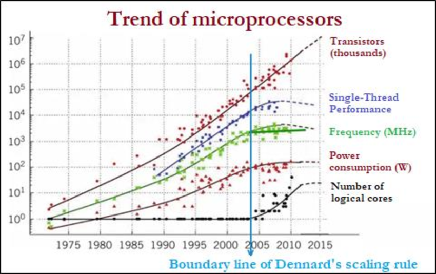
[CPU frequency and power trends show the end of Dennard scaling and rise of Dark Silicon.](https://doi.org/10.36427/CEJNTREP.5.1.5051)

## Classifying AI accelerators
AI-specific hardware can be classified according to two criteria: its fabrication and its architecture. Two widely used fabrication-based classifications are [**ASICs** and **FPGAs**](https://doi.org/10.1109/ACCESS.2022.3229767):

* **Application-Specific Integrated Circuits (ASICs):** chips whose logic is permanently fixed during fabrication. Every transistor and wire is laid out for a single purpose, yielding very high efficiency and performance-per-watt, but no post-fabrication flexibility. Google’s Tensor Processing Unit (TPU) is an example of an ASIC designed specifically for neural network workloads.
* **Field-Programmable Gate Arrays (FPGAs):** integrated circuits that can be reconfigured after manufacturing. They consist of a grid of programmable logic blocks and interconnects, which can be rewired to implement different datapaths. This makes them adaptable for research and prototyping, though they are typically less energy-efficient than ASICs due to configuration overhead.

These categories describe how a chip is manufactured or configured, but they do not capture how computation is organized internally. For this, we turn to the distinction between [**temporal** and **spatial** architectures](https://doi.org/10.1109/ACCESS.2022.3229767):

* **Temporal architectures (e.g., CPUs, GPUs):** Computation relies on a small number of [Arithmetic Logic Units (ALUs)](https://doi.org/10.1109/ACCESS.2022.3229767) that repeatedly fetch data from a central memory hierarchy. The same ALUs are reused across different operations over time.
* **Spatial architectures (e.g., TPUs, neuromorphic processors):** Computation is [distributed](https://doi.org/10.1109/ACCESS.2022.3229767) across many ALUs, each equipped with local memory and control logic. These units operate in parallel, and each region of silicon is dedicated to a specific part of the computation.

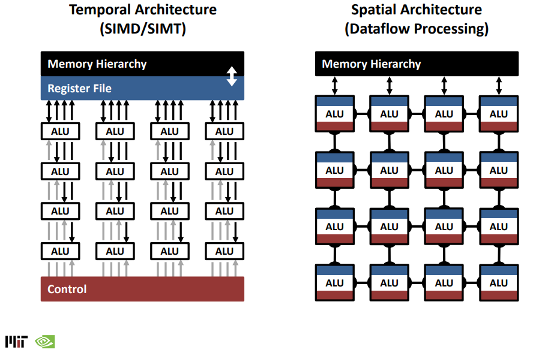 [Visualization of temporal and spatial architectures.](https://eyeriss.mit.edu/tutorial-previous.html)

## Accelerator families
With the properties used for categorization of AI hardware cleared up, it is best to clarify how these properties are applied in practice by studying the most important 'families' of AI accelerators.

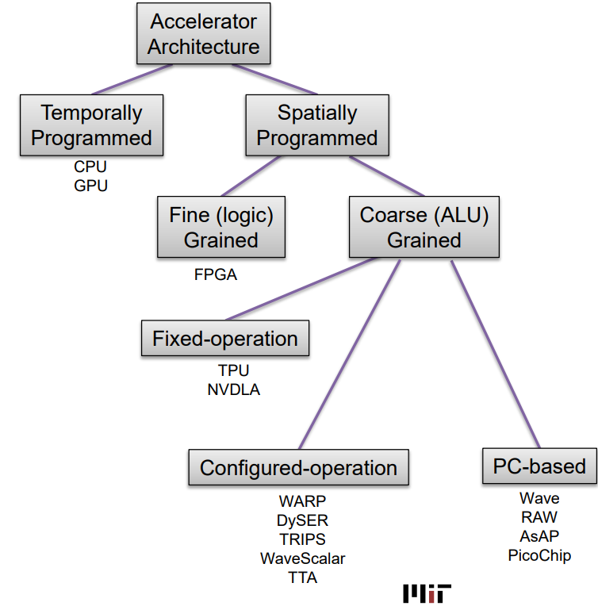
[AI hardware has been produced with both temporal and spatial designs.](https://eyeriss.mit.edu/tutorial-previous.html)

### 1. Graphics Processing Units (GPUs)
Originally designed for rendering graphics, GPUs consist of thousands of relatively simple cores optimized for floating-point throughput. Their architecture is well-suited to data-parallel operations, making them the [workhorses](https://dl.acm.org/doi/abs/10.5555/319030) of deep learning.
- Advantages: mature software ecosystem (CUDA, PyTorch, TensorFlow), versatility across workloads, high throughput
- Limitations: high power consumption, [less efficient](https://doi.org/10.1109/ACCESS.2022.3229767) than purpose-built hardware

### 2. Application-Specific Integrated Circuits (ASICs)
ASICs are fixed-function chips in which every transistor and wire is laid out for a specific purpose. Google’s [**Tensor Processing Unit (TPU)**](https://doi.org/10.48550/arXiv.1704.04760) exemplifies this category: it employs **systolic arrays** that rhythmically pass data across processing elements to maximize locality and reuse.
- Advantages: maximum efficiency and performance-per-watt, minimal wasted computation
- Limitations: extremely costly and time-consuming to design, and inflexible once fabricated

### 3. Field-Programmable Gate Arrays (FPGAs)
FPGAs occupy an intermediate space between flexibility and efficiency. They consist of [reconfigurable logic blocks](https://doi.org/10.1109/ACCESS.2022.3229767) that can be “rewired” post-manufacturing. This allows them to prototype new accelerator designs or adapt to evolving workloads.
- Advantages: reconfigurable, lower power consumption than GPUs, suitable for edge or low-to-medium production volumes
- Limitations: limited peak performance compared to ASICs, steeper programming complexity, smaller ecosystem

### 4. Neuromorphic chips
Neuromorphic processors take inspiration from biology, specifically the brain’s event-driven communication. Instead of continuous matrix multiplications, they employ [**spiking neural networks (SNNs)**](https://doi.org/10.1109/JPROC.2021.3067593). This architecture yields **ultra-low power consumption** (energy per spike as low as 50 femtojoules) and **massive parallelism**, since neurons operate independently. However, neuromorphic hardware remains [experimental](https://dx.doi.org/10.1088/1741-2560/13/5/051001), with limited software support and incompatibility with mainstream deep learning models.
- Advantages: exceptional energy efficiency, real-time operation, suitability for edge devices
- Limitations: immature ecosystem, difficulty benchmarking, limited applicability to conventional deep learning

## TinyML: Ultra-Low-Power AI at the Edge
[**TinyML (Tiny Machine Learning)**](https://tinymlbook.com/) is the field of deploying machine learning models on very low-power devices such as **microcontrollers, edge sensors, and embedded systems**. It fills the gap between state-of-the-art AI and **real-world applications in constrained environments**. It enables intelligent, responsive systems to function in remote locations without requiring constant internet access or a cloud connection. This makes it ideal for **real-time inference in IoT, wearables, and edge computing**.

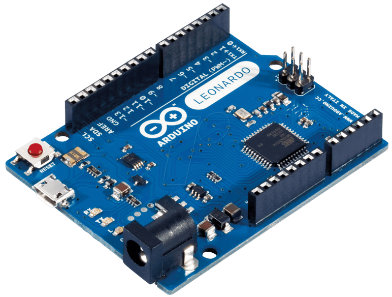
[TinyML deployment on a microcontroller.](https://tinymlbook.com/)

## Scalable Transformer Accelerator Unit (STAU)
Many new architectures are being designed to support modern computational efforts. One such design is the [**Scalable Transformer Accelerator Unit (STAU)**](https://doi.org/10.3390/electronics13234683), developed for efficient execution of Transformer models on small devices. Unlike GPUs or TPUs that target large-scale training, STAU is optimized for **real-time, on-device AI** such as voice assistants and mobile applications.

Key architectural innovations [include](https://doi.org/10.3390/electronics13234683):
* **Variable Systolic Array (VSA):** dynamically adapts to varying sequence lengths, avoiding idle computation and improving efficiency for natural language processing tasks.
* **Row-wise data input:** reduces memory stalls and improves bandwidth utilization.
* **Quantization without layer normalization:** employs a custom 16-bit floating-point format, eliminating expensive normalization operations.
* **Radix-2 softmax engine:** reduces hardware complexity while preserving accuracy in attention mechanisms.
* **Embedded processor integration:** allows the same hardware to support multiple Transformer architectures through software configuration.

STAU [has been claimed to](https://doi.org/10.3390/electronics13234683) achieve up to a 5.18× speedup compared to CPUs, while maintaining accuracy above 97% and reducing computation time for longer inputs by more than 68%. This case illustrates a broader trend: accelerators are moving not only into data centers but also into edge devices, where efficiency, privacy, and low power consumption are essential.

Overall, AI hardware accelerators have become [indispensable](https://doi.org/10.1109/ACCESS.2022.3229767) in enabling modern machine learning. GPUs provided the first scalable platform, ASICs such as TPUs pushed performance and efficiency further, FPGAs offered adaptability, neuromorphic processors point toward radically new paradigms inspired by biology, and TinyML extends AI into ultra-low-power embedded contexts. Emerging designs like STAU demonstrate that the field continues to evolve, particularly toward efficient, real-time AI at the edge.

# Metalearning 

From the choice of data source to the selection of training algorithms, each and every choice that an AI/data engineer makes has an indirect impact on the environment. These choices are often grouped together under the heading of 'metalearning'.

Described as "learning to learn," metalearning is a subfield of machine learning and artificial intelligence that focuses on designing models and algorithms capable of improving their own learning process over time. Instead of simply learning patterns from data to perform a specific task, metalearning systems aim to understand how learning itself can be optimized across a variety of tasks and environments. This involves leveraging experience from previous learning "episodes" to adapt more efficiently to new problems, often with fewer data or computational resources.

To give a more simple example, imagine you are a builder at the beginning of their career.  Just fresh out of school, you master the theoretical side of things, but, like everyone, you lack practice. At first, you will make many mistakes until you reach a certain level of "wisdom". These mistakes are "wasteful". You will waste significant amounts of time and materials. After many such mistakes you start to get an intuition about your field of work. Given blueprints in front of you, a sway of ideas flow through your mind, yet you discard most of them based on past experience, now you are more likely to get it right on the first try. This is why they say practice makes perfect.

Although they do not waste concrete, stone or wood, they may waste their own time, as well as compute time, which directly translates to wasted energy and emissions. Metalearning asks the following question: **can we skip the wait for every new student to become proficient and create an automatic framework that already knows what is to be done when faced with a problem?**

Let's take the simplest problem that any AI/data engineer faces in their introductory course: tuning hyperparameters for their algorithm. A quick search on [SciKitLearn](https://scikit-learn.org/stable/modules/generated/sklearn.svm.SVC.html)for the SVM algorithm results in 15 hyperparameters to tune. If we were to tune this [SVM](https://nl.mathworks.com/discovery/support-vector-machine.html) using classic [gridsearch](https://en.wikipedia.org/wiki/Hyperparameter_optimization) and chose 4 prospective values for each hyperparameter, we would have to train this SVM over **1,073,741,824 unique combinations**. Even with an optimistic estimate of one second per instance trained, the total training time would be approximately 34 years - another instance of exponential growth.

Several research lines have been pursued to reduce this amount of computation. In TU Delft, these are covered in detail in the [DSAIT4025: Alternative Learning Strategies](https://www.studyguide.tudelft.nl/courses/study-guide/educations/14789) course, so we will only briefly discuss the most notable. 

1. **Hyperparameter search**. As an easy example, one of the most popular ways to reduce computational effort is to use **Random Search** instead of **Grid Search**. This small substitution has the potential to greatly improve performance, because it has no performance hit on using additional hyperparameters. Additionally, Random Search can find the level of contribution to performance for each hyperparameter, giving an overview of which are worth tuning and which are not.

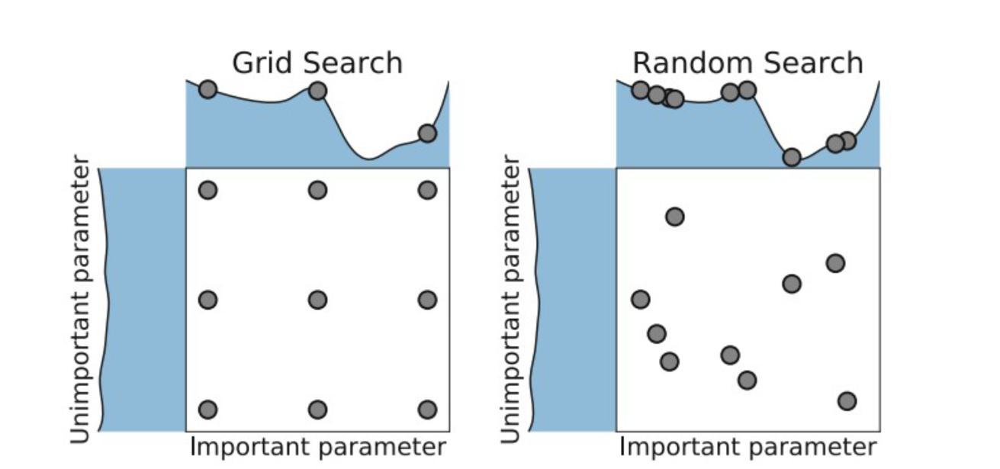
[Comparing Grid Search and Random Search algorithms.](https://www.studyguide.tudelft.nl/courses/study-guide/educations/14789)

2. **Performance curve prediction**. Another reasonable approach is to try and model the performance curve of the model as a function of the hyperparameters that have already been used. The predicted performance can then be used with i.e. Bayesian optimization to try and find the next possible minimum, which can potentially indicate the desired hyperparameter value. In the figure below, the dark line represents the model's performance mean prediction (with the confidence interval in blue), while the black dots are points with hyperparameter values found during training. Fitting a nonlinear regression between those points while taking the mean performance and confidence interval into account can provide a directed idea of where to find better options.

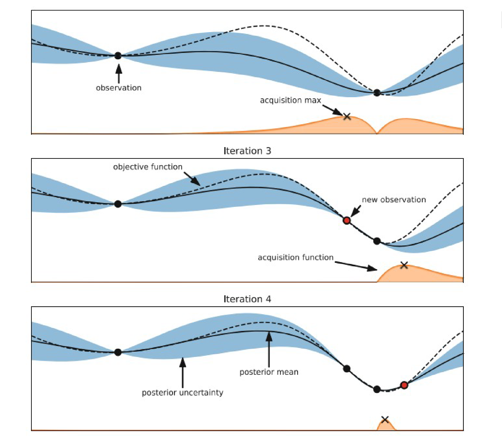
[Iterative hyperparameter tuning with performance curve prediction.](https://www.studyguide.tudelft.nl/courses/study-guide/educations/14789)

3. **Portfolio design**. Obtaining the original points can be done through the Random Search presented above, or even better, by leveraging previous experience. In **Portfolio design**, engineers keep a record of which hyperparameters worked well in the past. Unfortunately, in computer science, there is no such thing as a free lunch, and actually building a portfolio turns out to be [NP-Hard](https://en.wikipedia.org/wiki/NP-hardness), which means that it takes an exponential amount of time to finish computation. Alternatively, AI engineers perform approximations and try to link up dataset and problem features to hyperparameters and the algorithm's performance, as in the figure below. The most promising of these 'metafeatures' would be simple information about the dataset, such as NumberOfInstances, NumberOfClasses, Minority/MajorityClassSize etc. 'Landmarkers' were also used: the recorded performance of a very simple model (e.g. Decision Trees) on the dataset.

[Predicting the distribution of model performance based on multidimensional feature spaces.](https://www.studyguide.tudelft.nl/courses/study-guide/educations/14789)

It is clear that this field did not pass smoothly into the modern deep learning age. Therefore, significant research efforts are underway to bring it up to date. The features above are all 'hand-crafted', which was the modus operandi of the field before AI 'learned to learn'; AI/data researchers needed to select worthwhile features to focus on. Even though this rather field comprises ambiguous, non-descriptive hand-crafted features, its potential to improve the performance of AI workloads has incentivized continued research.

# Reducing the footprint of AI development
Modern AI development has seldom focused on reducing its environmental impact. Let's take a look at the implications of each step AI/data engineers take during the development cycle.

## Data acquisition
The very first task to be pursued is acquiring data for the model. It is difficult to properly measure the footprint of this part of the job, but it might be reasonable to [assume that data acquisition could represent a substantial part of the emissions the training process produces](https://www.iea.org/reports/energy-end-use-data-collection-methodologies-and-the-emerging-role-of-digital-technologies?utm_source=chatgpt.com).

- For example, LLMs literally use the entirety of the written internet as training data, as well as unknown amounts of preprocessing and [tokenization](https://en.wikipedia.org/wiki/Large_language_model#Tokenization), with all the storage and computational power involved in each.
- Alternatively, [ImageNET](https://www.image-net.org/) is a large-scale visual database containing **over 14 million images**, each hand-annotated with object labels. The dataset is organized according to the **WordNet hierarchy**, with more than **20,000 categories**, including objects, animals, scenes, and more. Even though one could argue that the value it has brought to the research community and therefore the world is immeasurable, its environmental impact is certainly measurable. 

- An example of a dataset that is extremely [difficult to obtain is high-resolution medical imaging data](https://pmc.ncbi.nlm.nih.gov/articles/PMC11566659/?utm_source=chatgpt.com) for rare brain diseases , such as intracranial aneurysms in children. Because these conditions occur infrequently, hospitals may only collect a handful of cases over many years, making it nearly impossible to train a deep learning model from scratch without [over fitting](https://en.wikipedia.org/wiki/Overfitting). 
- Another example of a dataset that is very costly in terms of energy to create is a large-scale autonomous driving dataset like [Waymo Open](https://waymo.com/open/) or Tesla’s internal driving data. Collecting this kind of data requires fleets of instrumented cars driving millions of kilometers, constantly recording high-resolution video, LiDAR scans, GPS data, and sensor readings. Not only does the physical data collection burn fuel or electricity for the vehicles themselves, but storing and processing the petabytes of raw sensor data demands massive data centers with significant cooling and compute power.

### Dataset transparency
Each of the above cases features a different data collection process. In reality, the gathering and labeling processes often lack structure and transparency. A [recent survey](https://arxiv.org/abs/1912.08320) of machine learning studies found that very few documented where the labeled data came from. Most did not explain who the annotators were, whether they had been trained, or how consistent the labeling was. Hardly anyone disclosed how labelers were compensated. In many cases, the data wasn't even shared.

This matters more than it might seem. Poor documentation means results cannot be trusted or replicated. The authors [argue](https://arxiv.org/abs/1912.08320) that we should treat data annotation more seriously, much like an experimental setup in science. That means publishing labeling guidelines, reporting inter-rater agreement, compensating labelers fairly, and making data accessible whenever possible. Doing these things helps us build machine learning systems that are not just accurate, but also fair and reliable.

To address the problem of datasets lacking transparency of origin, one paper proposed something very practical: [datasheets for datasets](https://arxiv.org/pdf/1803.09010). Just like components in electronics come with datasheets explaining how they work and how they should be used, datasets should also come with documentation. A datasheet would explain how the data was collected, who collected it, what it’s intended for, and what its limitations are. This kind of documentation helps prevent misuse.

This also supports better reproducibility; when other researchers understand how the dataset was created, they can replicate results or build upon them more confidently. Just as importantly, datasheets help researchers identify opportunities for reuse. Instead of collecting yet another dataset from scratch, a well-documented existing one might do the job, saving time, money, and energy.

### Dataset size and quality
In the industry, the most frequent tagline is that 'the more data, the better'. Although quantity is a quality on its own, this is only true in an environment where we do not know what we are doing. As an example, many deep learning tasks involve obtaining as much data as possible in order to allow the algorithm to determine patterns that reveal what we are actually searching for. However, in any other machine learning task, it may be that a small but very representative dataset can fulfill the same purpose as any number of unrelated samples.

Taking a real world use case, a [recent study](https://doi.org/10.3389/fpls.2021.811241) on datasets for agricultural pest control raises an important question about the idea that 'more is better'. This belief has driven agricultural researchers to collect massive datasets for crop pest recognition, which include thousands of labeled photographs of insects such as moths, beetles and caterpillars, species that can severely damage crops and cause significant economic losses. 

At first glance, the logic makes sense; more pest images should help the model learn to recognize them under different lighting, angles and growth stages. However, every additional image comes at a cost: time spent capturing it, expert effort to identify the species, storage space for files, and finally, the energy to process it during training. For research teams working with limited budgets and computing power (especially in developing regions where pest damage is most devastating), these costs are a serious problem. The authors [argue](https://doi.org/10.3389/fpls.2021.811241) that what truly matters is data quality. In pest recognition, redundancy is a real issue: many collected images are almost the same. Training on these duplicates adds little new knowledge but still consumes computational resources. 

[Relationship between model accuracy and data quantity for the agricultural pest control model.](https://doi.org/10.3389/fpls.2021.811241)

There are many ways to tackle this problem. This study in particular introduces the [Embedding Range Judgement](https://doi.org/10.3389/fpls.2021.811241) (ERJ) method. In this simple method, each image is passed through a neural network to generate a feature vector, a numerical summary of its visual characteristics. For each pest species, the method calculates the range of feature values found in the dataset. If a new image's features fall outside this range, it likely contains novel information and it is kept. If it falls inside, it is considered redundant and excluded. 

When models were trained on only the ERJ-selected “good” data, they performed as well as, and in some cases better than, models trained on the full dataset. Randomly selected subsets were less reliable, and datasets made of redundant images performed the worst. These results held true for both shallow and deep convolutional neural networks, suggesting the method is robust across architectures.

## Model training

It seems reasonable to assume that, by reducing the time required for training a model, we reduce its overall environmental impact. Optimizing training therefore becomes a worthwhile pursuit. For example, [**Fidelity Training**](https://www.studyguide.tudelft.nl/courses/study-guide/educations/14789) appears useful in cases where training takes rather long, but a high number of hyperparameter configurations needs to be tested. If successfully implemented, this strategy could help disregard unproductive solutions and continue with only the most promising options.

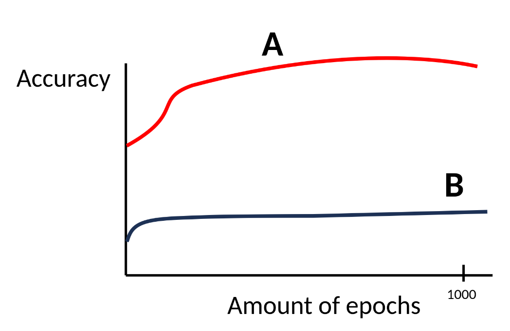
[The accuracy of the model does not always correlate with the time it takes to train.](https://www.studyguide.tudelft.nl/courses/study-guide/educations/14789)

Fidelity is represented in percentages: 100% fidelity means full training, while 10% means that training stops after 10% of the set training period. Evidently, lower fidelity is faster, with an inaccurate estimate of final performance, while higher fidelity takes longer but provides a more accurate estimate. Fidelity can be represented by number of epochs, training samples used, or number of features used.

A simple technique that uses fidelity training is **Successive halving**:
1. Start with N configurations with budget B (percentage of configs to remove).
2. Remove configs (discard lowest ranking ones).
3. Continue configs with budget B.
4. Repeat until you are left with one.

[Some configs may behave worse at the beginning, but better at the end of training.](https://www.studyguide.tudelft.nl/courses/study-guide/educations/14789)

## Transfer learning
Because of the enormous environmental and financial costs of building such datasets from scratch (sometimes impossible), researchers often rely on transfer learning from these large collections. 

[Transfer learning](https://doi.org/10.1186/s40537-016-0043-6) is a machine learning approach whereby a model trained on one task or domain is reused to improve performance on a different, but related, task or domain. Unlike traditional machine learning, which assumes that training and test data come from the same feature space and distribution, transfer learning allows knowledge to be transferred across different contexts.

The most prevalent transfer learning technique in modern literature is the concept of [fine-tuning](https://doi.org/10.1017/S1351324921000322), which could be viewed as a mechanism to correct for mismatches between training data and the population of interest that we previously mentioned. We tend to think of the test data as the population of interest, but actually, what really matters is the data that will be seen at inference time. Evaluations assume that the test set is representative of what real users will use the system for, but that may or may not be the case. In practice, the test set is often very similar to the training set, probably more similar than either are to what real users are likely to expect from a real product.

Factoring the training task into pre-training and fine-tuning makes it possible to amortize large upfront investments in pre-training over many use cases. The business case for factoring is attractive because fine-tuning is relatively inexpensive compared to pre-training. Instead of improving performance by making the model larger, engineers can choose to fine-tune multiple instances of their exiting model on different tasks. This is the idea behind [mixture of experts](https://en.wikipedia.org/wiki/Mixture_of_experts) models. This essentially works because the models have seen so much data that their "insides" become good at everything, therefore shifting the domain towards what we want it to be an "expert" in requires no extensive pre-training.

[This also works unexpectedly well in visual computing tasks](https://arxiv.org/abs/1409.1556). One could take a generic convolutional network trained on the vast amount of images in ImageNet, remove the last fully connected layers responsible for classification, create new ones for their particular task and train only those layers, which is relatively trivial. In as little time as a few hours, we could obtain a model that works almost as good as state of the art on particular tasks. 

## Post-training

Recent research has found that, rather than training, model inference is actually the stage during which most emissions [are created](https://www.technologyreview.com/2025/05/20/1116327/ai-energy-usage-climate-footprint-big-tech/). That does not mean that training resources can be freely wasted, but rather that small improvements in how much energy the models consume may transform into enormous numbers in the long run. Several versatile methods can be used to reduce the post-training impact of a model, with the focus being on reducing the computational 'size' of the model.

### Model distillation

[Model or knowledge distillation](https://doi.org/10.48550/arXiv.1503.02531) is a compression technique that involves a smaller 'student' model being trained to replicate the behavior of a larger, more accurate 'teacher' model. Instead of training the student directly on hard labels (e.g., class 1 is correct, others are incorrect), it learns from the softened output probabilities of the teacher. These "soft targets" provide richer information by revealing the teacher's relative confidence across all classes, not just the correct one.

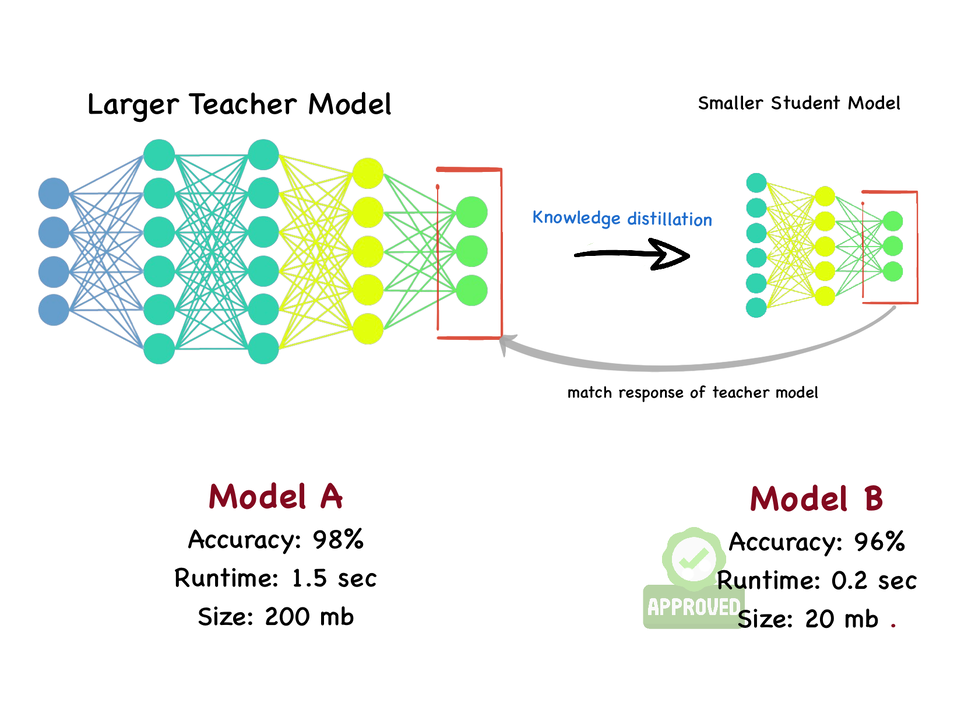
[Model distillation only mildly reduces the accuracy of the student model.](https://www.linkedin.com/pulse/model-compression-knowledge-distillation-swapnil-kangralkar-j8dbc/)

### Quantization

One of the most impactful ways to decrease the computational time and energy consumption of neural networks is [**quantization**](https://doi.org/10.48550/arXiv.2106.08295). In neural network quantization, the weights and activation tensors are stored in lower bit precision than the 16 or 32-bit precision they are usually trained in. When moving from 32 to 8 bits, the memory overhead of storing tensors decreases by a factor of 4 while the computational cost for matrix multiplication reduces quadratically by a factor of 16.

There are two main classes of algorithms: Post-Training Quantization (PTQ) and Quantization-Aware Training (QAT). PTQ requires no re-training or labelled data and is thus a lightweight push-button approach to quantization. In most cases, PTQ is sufficient for achieving 8-bit quantization with close to floating-point accuracy. QAT requires fine-tuning and access to labeled training data but enables lower bit quantization with competitive results.

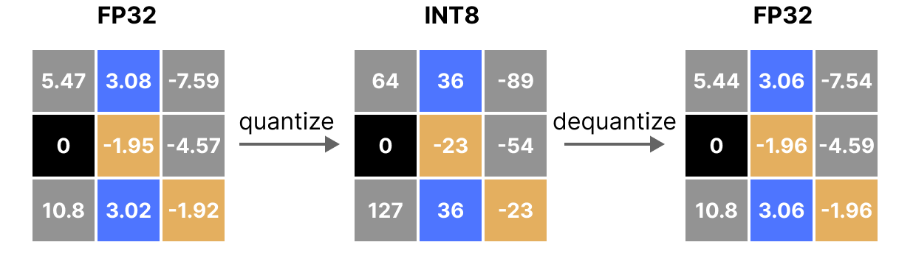 [Reducing resolution through quantization allows for the computational cost to be reduced.](https://www.maartengrootendorst.com/blog/quantization/)

- **[Post-training quantization](https://doi.org/10.48550/arXiv.2106.08295)** (PTQ) algorithms take a pre-trained FP32 network and convert it directly into a fixed-point network without the need for the original training pipeline. These methods can be data-free or may require a small calibration set, which is often readily available. Additionally, having almost no hyperparameter tuning makes them usable via a single API call as a black-box method to quantize a pretrained neural network in a computationally efficient manner. This frees the neural network designer from having to be an expert in quantization and thus allows for a much wider application of neural network quantization. Post-training quantization techniques are very effective and fast to implement because they do not require retraining of the network with labeled data. However, they have limitations, especially when aiming for low-bit quantization of activations, such as 4-bit and below. Post-training may not be enough to mitigate the large quantization error incurred by low-bit quantization. 

[The typical pipeline used for post-training quantization.](https://doi.org/10.48550/arXiv.2106.08295)

- [**Quantization Aware Training**](https://doi.org/10.48550/arXiv.2106.08295) models the quantization noise source during training. It simulates the effect of quantization during both the forward and backward passes. Although the actual computations in training remain in full precision (to preserve stability), fake-quantized versions of the weights and activations are used in the forward pass to mimic the behavior of the quantized model. This allows gradients to be computed as if the model was operating under quantization constraints. In practice, both weights and activations are quantized according to a defined quantization scheme. This allows the model to find more optimal solutions than post-training quantization. However, the higher accuracy comes with the usual costs of neural network training, i.e., longer training times, need for labeled data and hyper-parameter search.

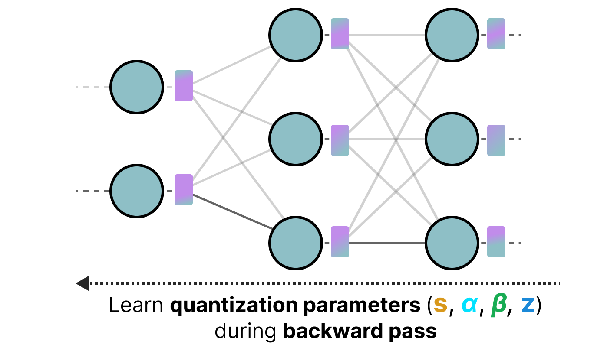 [Quantization aware training aims to learn the quantization procedure during training.](https://www.maartengrootendorst.com/blog/quantization/)

Both training methods involve [significant obstacles](https://www.maartengrootendorst.com/blog/quantization/). For example, training such a network requires back-propagation through the simulated quantizer block. This poses an issue because the gradient of the round-to-nearest operation in equation is either zero or undefined everywhere, which makes gradient-based training impossible. A way around this would be to approximate the gradient using the straight-through estimator, which approximates the gradient of the rounding operator as 1. However, this solution too will introduce its own toll on accuracy.

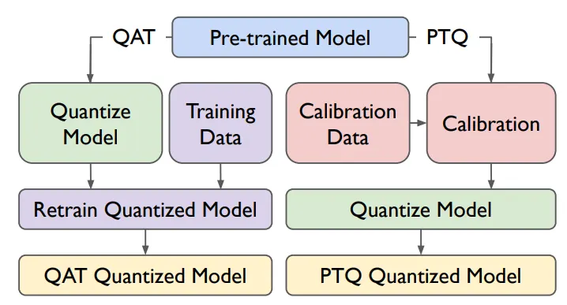 [Comparing PTQ and QAT procedures.](https://blent.ai/blog/a/quantization-llm)

Overall, building sustainable AI systems requires more than just clever algorithms, it demands thoughtful choices at every stage, from data acquisition to deployment. By reusing knowledge through transfer learning, refining models with fine-tuning, and reducing their environmental footprint via distillation and quantization, engineers can balance performance with responsibility. As future AI practitioners, recognizing these trade-offs ensures that innovation not only advances capability but also respects the finite resources of our planet.

# Feedback
We are happy to receive any feedback you may have on this lecture. Is there too much information in the slides/notes, or would you like to know more about a certain topic? Please let us know by [**filling in this form**](https://forms.cloud.microsoft/e/6YADd8Lbr2).
