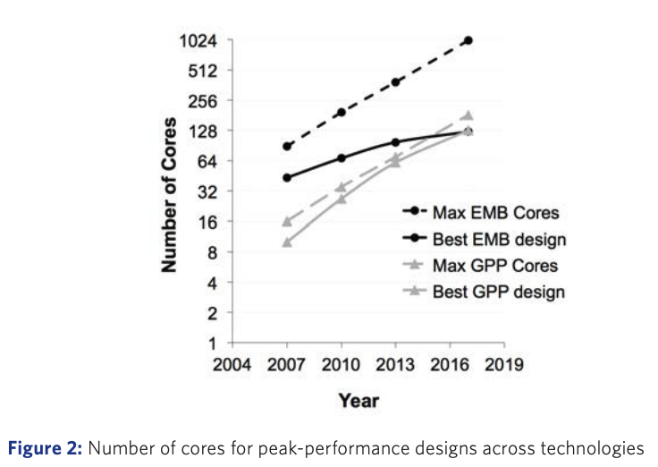

`Version: 2.0`
`Contributors: Liwia Padowska
`Publication date: 18.09.2026`


# 1) Central Processing Unit Scaling and Performance Limits

## 1.1) Instruction Level Parallelism Saturation Wall

### What is Instruction Level Parallelism?

**Instruction Level Parallelism (ILP)** refers to executing multiple instructions at the same time within a single Central Processing Unit (CPU) core (Fisher & Rau, 1991, Instruction-Level Parallel Processing). The CPU scans its upcoming instruction stream, looks for instructions that do not depend on each other, and overlaps their execution instead of running them strictly one after another (Fisher & Rau, 1991, Instruction-Level Parallel Processing). For example, if one instruction adds two numbers and another loads data from memory, and neither needs the other's result, the CPU can carry out both at once instead of waiting. This scanning and overlapping happens entirely inside the hardware and is invisible to the programmer.

ILP is limited mainly by two things: **dependencies** and **uncertainty** (Fisher & Rau, 1991, Instruction-Level Parallel Processing; Wall, 1991, Limits of Instruction-Level Parallelism).

**Dependencies**: when instruction B needs the result of instruction A, B simply has to wait. There is no way around this.

**Uncertainty**: branches (`if`/`else` statements) and memory accesses create outcomes the CPU cannot know in advance, which makes it hard to plan ahead and safely schedule work it is not yet sure about (Wall, 1991, Limits of Instruction-Level Parallelism).

### Dependency example

Instruction 2 below **depends** on instruction 1 (a read after write dependency), so they cannot truly run in parallel (Wall, 1991, Limits of Instruction-Level Parallelism):

```nasm
; r1 = r2 + r3
ADD r1, r2, r3

; r4 = r1 * r5   (needs r1 from the ADD)
MUL r4, r1, r5
```

The `MUL` cannot start until the `ADD` produces `r1`. That dependency chain limits ILP regardless of how much execution hardware the core has available (Wall, 1991, Limits of Instruction-Level Parallelism).

### Uncertainty example: branches (control dependency)

With a branch, the CPU does not know which path will execute until the condition is resolved, so it has to **predict** (Fisher & Rau, 1991, Instruction-Level Parallel Processing; Wall, 1991, Limits of Instruction-Level Parallelism):

```c
if (x > 0) {
  y = a + b;
} else {
  y = a - b;
}
z = y * 3;
```

In assembly like terms:

```nasm
CMP x, 0
JLE else_path
ADD y, a, b
JMP join
else_path:
SUB y, a, b
join:
MUL z, y, 3
```

The CPU speculatively executes one path based on a branch prediction (Fisher & Rau, 1991, Instruction-Level Parallel Processing). If the guess is wrong, it **throws away** that work in what is called a pipeline flush, which costs cycles and energy, since the CPU has to re fetch and re execute the correct path from scratch (Aragón, González, & González, 2006, Control Speculation for Energy-Efficient Next-Generation Superscalar Processors; Wall, 1991, Limits of Instruction-Level Parallelism).

### Uncertainty example: memory

Loads can be slow (a cache miss) and the CPU sometimes cannot be sure whether a later store affects an earlier load, a problem known as **aliasing** (Wall, 1991, Limits of Instruction-Level Parallelism).

**(a) Load latency and cache misses:**

```nasm
LOAD r1, [p]        ; could be fast (cache hit) or very slow (miss)
ADD  r2, r1, 1       ; depends on r1, stalls if LOAD is slow
```

The CPU tries to stay busy by executing other instructions that *do not* depend on `r1`, but if too much of the program depends on that one load, ILP collapses (Wall, 1991, Limits of Instruction-Level Parallelism).

**(b) Aliasing and ordering uncertainty (load versus store):**

```nasm
LOAD r1, [p]        ; read memory at p
STORE [q], r2        ; write memory at q
ADD  r3, r1, 5
```

If the CPU cannot prove that `p` and `q` are different addresses, it has to be conservative about reordering the load and store, which reduces ILP. Modern cores use memory disambiguation and speculation to relax this in practice, but a misspeculation can trigger a costly replay (Wall, 1991, Limits of Instruction-Level Parallelism).

### Micro architectural techniques that implement ILP

Modern CPUs implement ILP with a set of micro architectural techniques (Fisher & Rau, 1991, Instruction-Level Parallel Processing; Smith & Sohi, 1995, The Microarchitecture of Superscalar Processors).

- **Pipelining**: instruction execution is split into stages, for example fetch → decode → execute → write back, so that *different instructions occupy different stages at the same time* (Smith & Sohi, 1995, The Microarchitecture of Superscalar Processors). This raises *throughput* (instructions completed per cycle) even though each individual instruction still needs to pass through all four stages to finish.

---

**1. Fetch**: *"go get the instruction"*

The CPU reads the instruction from memory without yet knowing what it means, only retrieving the raw bytes.

```
Memory address 0x04: [ADD instruction bytes]  ← CPU fetches this
```

---

**2. Decode**: *"figure out what it means"*

The CPU interprets the instruction: this is an `ADD`, the inputs are the registers holding `a` and `b`, and the result goes into the register for `x`.

```
ADD  R1, R2, R3
      ↑   ↑   ↑
      x   a   b     ← CPU now knows: add R2 + R3, store in R1
```

---

**3. Execute**: *"actually do the work"*

The ALU (Arithmetic Logic Unit) performs the addition.

```
R2 = 5   (value of a)
R3 = 3   (value of b)

ALU: 5 + 3 = 8
```

---

**4. Write back**: *"save the result"*

The CPU writes the result (`8`) back into the destination register `R1`, which now holds `x`. This is the stage that commits the answer so later instructions can use it.

```
R1 ← 8    (x is now 8, available for the next instruction)
```

---

### Why pipelining matters

Without pipelining, the CPU would finish all four stages of one instruction before starting the next. With pipelining, each stage works on a *different* instruction at the same time once the pipeline has filled:

```
Cycle:       1       2       3       4       5       6
Instr. 1:  Fetch   Decode  Execute Write
Instr. 2:          Fetch   Decode  Execute Write
Instr. 3:                  Fetch   Decode  Execute Write
```

Each instruction still takes four cycles end to end, but once the pipeline is full the CPU completes close to one instruction every cycle instead of one every four. It is worth being precise here: during the very first cycles the pipeline is still filling, so not every stage is occupied yet (in cycle 1 above, only the fetch stage is doing useful work). The throughput gain is a steady state effect that appears once the pipeline has enough instructions in flight to occupy every stage every cycle (Smith & Sohi, 1995, The Microarchitecture of Superscalar Processors).

- **Multiple issue (superscalar)**: the core can start more than one instruction in the same cycle, provided the instructions are independent of each other and a free execution unit of the right type is available, such as a spare ALU for integer arithmetic, a floating point unit, or a load and store unit for memory access (Smith & Sohi, 1995, The Microarchitecture of Superscalar Processors).

Consider the CPU executing this code:

```c
x = a + b;
y = c * d;
z = e - f;
```

### Why these instructions can run in parallel

Each line uses completely different variables, so none of them depend on each other's result and the CPU can run all three in the same cycle:

```
x = a + b;   →   uses R1, R2        ✓ independent
y = c * d;   →   uses R3, R4        ✓ independent
z = e - f;   →   uses R5, R6        ✓ independent
```

### What a superscalar core does

A three way superscalar core has multiple execution units running in parallel, for example a separate ALU for each operation:

```
Cycle 1:
┌─────────────────┬─────────────────┬─────────────────┐
│   ALU Unit 1    │   ALU Unit 2    │   ALU Unit 3    │
│   a + b → x     │   c * d → y     │   e - f → z     │
└─────────────────┴─────────────────┴─────────────────┘
```

All three instructions complete in one cycle instead of three, but only because three independent instructions and three free ALUs happened to line up at the same time.

- **Out of order execution**: the CPU is allowed to **temporarily reorder** instructions internally so that independent ones can run earlier, **without changing the program's final results** (Smith & Sohi, 1995, The Microarchitecture of Superscalar Processors).

Consider the CPU executing this code:

```c
x = load(memory[100]);   // instruction 1, slow, fetches from RAM
y = x + 1;                // instruction 2, depends on x, must wait
z = a + b;                // instruction 3, independent, no reason to wait
w = c * d;                // instruction 4, independent, no reason to wait
```

### Without out of order execution

The CPU executes strictly in program order. Instructions 3 and 4 sit idle even though they have everything they need:

```
Cycle 1:   Instr 1 starts  → fetching x from RAM...
Cycle 2:   Instr 1 waiting → still fetching (RAM is slow, about 100 cycles)
Cycle 3:   Instr 1 waiting → still fetching...
...
Cycle 100: Instr 1 done    → x is ready
Cycle 101: Instr 2 runs    → y = x + 1
Cycle 102: Instr 3 runs    → z = a + b
Cycle 103: Instr 4 runs    → w = c * d

Total: about 103 cycles
```

### With out of order execution

The CPU looks ahead, spots that instructions 3 and 4 are independent, and runs them while waiting for the slow memory fetch:

```
Cycle 1:   Instr 1 starts  → fetching x from RAM...
Cycle 2:   Instr 3 runs    → z = a + b   ✓ (no need to wait)
Cycle 3:   Instr 4 runs    → w = c * d   ✓ (no need to wait)
...
Cycle 100: Instr 1 done    → x is ready
Cycle 101: Instr 2 runs    → y = x + 1

Total: about 101 cycles
```

Instructions 3 and 4 executed *before* instruction 2, out of the original program order, but the final values of `x`, `y`, `z`, and `w` are identical to what strict in order execution would have produced.

### What makes this possible

The CPU uses a structure called a **reorder buffer (ROB)**: a queue that tracks every in flight instruction in its original program order. Instructions can execute internally in any order, but their results only become visible to the rest of the program once they reach the front of the ROB queue, which is what guarantees the final outcome is always correct (Smith & Sohi, 1995, The Microarchitecture of Superscalar Processors).

**Speculative execution**: the CPU **guesses** what will happen next, most importantly which way an `if` branch will go, and starts executing down that path early; if the guess turns out to be wrong, the speculative results are discarded and execution restarts from the correct path (Fisher & Rau, 1991, Instruction-Level Parallel Processing; Wall, 1991, Limits of Instruction-Level Parallelism).

Consider the CPU executing this code:

```c
x = load(memory[100]);   // slow memory fetch (about 100 cycles)

if (x > 0) {
    y = a + b;             // branch A, taken if x is positive
} else {
    y = c * d;              // branch B, taken if x is zero or negative
}

z = y * 2;
```

### Without speculative execution

The CPU cannot touch the `if` block until `x` arrives from RAM. Everything stalls:

```
Cycle 1:    fetch x from RAM...
Cycle 2:    waiting...
Cycle 3:    waiting...
...
Cycle 100:  x = 42 arrives  → condition (x > 0) is TRUE
Cycle 101:  run: y = a + b
Cycle 102:  run: z = y * 2

Total: about 102 cycles, of which about 99 are wasted stalling
```

### With speculative execution

The branch predictor has seen this code run many times before and noticed that `x > 0` is almost always true. It guesses **branch A** and starts executing immediately, without waiting for `x`:

```
Cycle 1:    fetch x from RAM...  (in the background)
Cycle 2:    GUESS: x > 0 is likely true → speculatively run y = a + b
Cycle 3:    speculatively run z = y * 2
...
Cycle 100:  x = 42 arrives → condition confirmed TRUE ✓
Cycle 101:  commit results, y and z become visible to the program

Total: about 101 cycles
```

The CPU ran roughly 98 cycles ahead of the confirmation, with almost no stall at all.

### When the guess is wrong

Now imagine `x` comes back as `-5`:

```
Cycle 1:    fetch x from RAM...
Cycle 2:    GUESS: x > 0 → speculatively run y = a + b
Cycle 3:    speculatively run z = y * 2
...
Cycle 100:  x = -5 arrives → condition is FALSE ✗  wrong branch!
Cycle 101:  discard speculative y and z (never committed)
Cycle 102:  restart from the else branch → y = c * d
Cycle 103:  run: z = y * 2

Total: about 103 cycles, slightly worse than no speculation at all
```

This is called a **branch misprediction penalty**: the cycles and energy spent on the wrong path before it is discarded (Aragón, González, & González, 2006, Control Speculation for Energy-Efficient Next-Generation Superscalar Processors). It is why modern CPUs invest heavily in branch predictors: even though every wrong guess costs cycles and energy, the gains from the much more numerous correct guesses far outweigh the occasional penalty from wrong ones (Fisher & Rau, 1991, Instruction-Level Parallel Processing).

---

### Bernstein's conditions: when "parallel" is safe

A classic way to formalise *when two computations can be safely overlapped* is **Bernstein's conditions** (Bernstein, 1966, Analysis of Programs for Parallel Processing).

The computation, or "process," $p$ operates on two sets of data items (Bernstein, 1966, Analysis of Programs for Parallel Processing):

- $I$: the set of data items it **reads** (its *inputs*),
- $O$: the set of data items it **writes** (its *outputs*).

Two processes $a$ and $b$ can run in parallel without changing the result if, over their entire execution, neither process reads a value the other writes, and neither process writes to the same variable as the other (Bernstein, 1966, Analysis of Programs for Parallel Processing):

$$
I_a \cap O_b = \varnothing \qquad \text{(b does not write something a reads)}
$$

$$
I_b \cap O_a = \varnothing \qquad \text{(a does not write something b reads)}
$$

$$
O_a \cap O_b = \varnothing \qquad \text{(a and b do not write to the same location)}
$$

### Dependent versus independent example

Suppose the goal is to compute $a = x^2 + y^2 + z^2$. In simplified assembly:

```nasm
mul r0, r0, r0  ; step 1: r0 = r0*r0 (x²)              ⎫
mul r1, r1, r1  ; step 2: r1 = r1*r1 (y²)              ⎬ parallel
mul r2, r2, r2  ; step 3: r2 = r2*r2 (z²)              ⎭
add r0, r0, r1  ; step 4: r0 = r0 + r1 (x²+y²)      sequential (needs steps 1 and 2)
add r3, r0, r2  ; step 5: r3 = r0 + r2 (x²+y²+z²)   sequential (needs steps 3 and 4)
```

**Step 1: three independent multiplies (good ILP).**

Instructions 1 to 3 do not rely on each other, since each one reads and writes a different register (`r0`, `r1`, `r2`). The CPU is *allowed* to execute all three at the same time, but only if the hardware has multiple execution units of the right type available. A modern high performance core typically has 2 to 4 integer or floating point multiplier units, so if three multiplier units are free, instructions 1 to 3 can genuinely fire in the same cycle:

```
Cycle 1:
┌──────────────┬──────────────┬──────────────┐
│  Multiplier1 │  Multiplier2 │  Multiplier3 │
│  r0 = r0*r0  │  r1 = r1*r1  │  r2 = r2*r2  │
└──────────────┴──────────────┴──────────────┘
```

If the core only had one multiplier, all three instructions would have to queue up and execute one per cycle, even though they are logically independent. Independence in the code is necessary but not sufficient: the physical execution units also need to be available.

**Step 2: the additions cannot run in parallel because each one depends on a previous result.**

- Instruction 4 must wait for instructions 1 and 2, since it needs both $r0 = x^2$ and $r1 = y^2$ to be ready before it can compute their sum.
- Instruction 5 must wait for instruction 4 (it needs the updated $r0$) and also for instruction 3 (it needs $r2 = z^2$).

This can be seen as a "must happen before" graph:

```
instruction 1 → instruction 4 → instruction 5
instruction 2 → instruction 4
instruction 3 → instruction 5
```

So even though the code starts with three instructions that can run simultaneously, instructions 4 and 5 are forced to execute one after the other. The CPU cannot overlap them no matter how many execution units it has, because instruction 5 cannot even start until instruction 4 finishes. This is the same dependency chain problem described above: the program's own structure, not the hardware, becomes the bottleneck (Wall, 1991, Limits of Instruction-Level Parallelism).

### Diminishing returns of ILP

**Issue width** is how many instructions a core can *start* (hand off to its execution units) per cycle. For example, a core with an issue width of four can send up to four instructions to its ALUs, multipliers, and load and store units on every clock tick. "Issuing" an instruction is the moment the CPU commits to executing it: it has been fetched, decoded, checked for dependencies, and is now being handed to the hardware unit that will run it. This is limited by the size of the **issue queue**, a buffer that holds decoded instructions waiting to be dispatched; the core can only send as many instructions per cycle as that queue is built to release at once.

If programs always had enough independent work available, speedup would scale close to linearly with issue width:

```
Ideal world (enough independent instructions every cycle):
1 issue slot   →  ~1×
2 issue slots  →  ~2×
4 issue slots  →  ~4×
8 issue slots  →  ~8×
```

Real code rarely looks like that (Wall, 1991, Limits of Instruction-Level Parallelism). A more realistic per cycle view for a core with four issue slots is:

```
4 issue slots per cycle: [ _  _  _  _ ]
```

**Case A: lots of independence (rare for long stretches)**

```
cycle 1: [ A  B  C  D ]   →  4 instructions started
cycle 2: [ E  F  G  H ]   →  4 instructions started
```

**Case B: a dependency chain (very common)**

```
cycle 1: [ A  _  _  _ ]
cycle 2: [ B  _  _  _ ]   (B must wait for A's result)
cycle 3: [ C  _  _  _ ]
```

**Case C: typical mixed code**

```
cycle 1: [ A  B  _  _ ]
cycle 2: [ C  _  _  _ ]   (branch, memory, or dependency stalls)
cycle 3: [ D  E  _  _ ]
```

So even with four issue slots built into the hardware, the program often only supplies one or two "ready" instructions at a time, which is why the measured speedup curve **flattens** well below the theoretical maximum (Wall, 1991, Limits of Instruction-Level Parallelism). A helpful mental model is **lane utilisation**: a core with four issue slots that on average only fills two of them delivers roughly two instructions per cycle on average, and widening it to eight issue slots does not help much if the program still only supplies two or three independent instructions most of the time.

This is the **ILP wall**: beyond a few instructions per cycle, the program's own dependency structure, together with branch and memory uncertainty, prevents wide cores from staying busy (Wall, 1991, Limits of Instruction-Level Parallelism). Wall (1991) measured real programs and found that even under idealised conditions, meaning perfect branch prediction, infinite registers, and unlimited hardware, most programs only expose on the order of **5 to 7 instructions** worth of parallelism on average, far below what a wide superscalar machine could theoretically consume (Wall, 1991, Limits of Instruction-Level Parallelism). This is the fundamental ceiling of ILP: the limit lives in the code's own dependency structure, not in the chip.

### Modern CPU example: Apple M4 Pro

---

The Apple M4 Pro is a high performance ARM based system on chip built on TSMC's 3 nanometre process, with 14 cores (10 performance cores plus 4 efficiency cores) and support for up to 64 GB of unified memory (Apple, 2024, Apple Introduces M4 Pro and M4 Max). Like other modern high performance cores, it relies on the ILP techniques covered above: an out of order execution engine with wide superscalar dispatch, deep pipelining that keeps execution units fed across branch mispredictions, register renaming, dynamic scheduling, and speculative execution, all working together so that independent instructions can execute out of program order while results are still committed correctly (Smith & Sohi, 1995, The Microarchitecture of Superscalar Processors).

Apple does not officially publish the exact issue width or branch predictor accuracy of the M4 Pro's core. Independent microarchitectural analyses place modern high end cores like this one among the widest currently shipping, but those specific numbers should be treated as third party estimates rather than confirmed specifications, so they are intentionally left out of the table below.

| Property | Value |
| --- | --- |
| Cores | 14 (10 performance + 4 efficiency) |
| Process node | 3 nm (TSMC) |
| Max unified memory | 64 GB |
| Announced | October 2024 |

## 1.2) Transistor Count (Power Wall)

### Moore's Law kept giving more transistors, but not "free speed"

For a long time, the industry got a *double win* every generation (Sutter, 2005, The Free Lunch Is Over):

1. **More transistors** (denser chips)
2. **Higher clock speeds** *without blowing the power budget*

That "free lunch" ended in the middle of the 2000s: manufacturers could still add transistors, but could no longer keep raising frequency and voltage without hitting thermal limits (Sutter, 2005, The Free Lunch Is Over; COMSOL, 2014, Haven't CPU Clock Speeds Increased in the Last Few Years?). Herb Sutter popularised this turning point in a widely read 2005 article titled *"The Free Lunch Is Over"* (Sutter, 2005, The Free Lunch Is Over).

---

### Why frequency hit a wall

### The key relationship (why GHz gets hot fast)

A widely used approximation for **dynamic (switching) power** in CMOS is (Rabaey, Chandrakasan, & Nikolić, 2003, Digital Integrated Circuits: A Design Perspective):

$$
P \approx C \cdot V^2 \cdot f
$$

$C$: effective capacitance being switched

$V$: supply voltage

$f$: clock frequency

So (Rabaey, Chandrakasan, & Nikolić, 2003, Digital Integrated Circuits: A Design Perspective):

- doubling **frequency** tends to roughly double power
- increasing **voltage** is particularly costly because of the V^2 term: a modest voltage increase produces a disproportionately large rise in power consumption

**Concrete example (why simply raising GHz becomes thermally unsustainable):**

Assume the chip starts at:

$$
V = 1.0, \quad f = 3\text{ GHz} \quad \Rightarrow \quad P \propto 1.0^2 \cdot 3 = 3
$$

Now push the frequency to 6 GHz, which in practice needs a slightly higher voltage, say $V = 1.2$, to keep the chip electrically stable:

$$
P \propto 1.2^2 \cdot 6 = 1.44 \cdot 6 = 8.64
$$

That is a **doubling of frequency** producing close to a **threefold increase in power**: the chip now generates nearly three times as much heat for only twice the speed.

In principle more power could be supplied to the chip, but heat is the hard constraint: every watt consumed becomes a watt of heat that has to be physically removed from a piece of silicon roughly the size of a fingernail. Cooling has real limits; eventually fans, heat sinks, and even liquid cooling cannot extract heat fast enough to keep the chip below its maximum safe operating temperature. Exceeding that temperature causes transistors to malfunction, produce incorrect results, or degrade permanently. Even before that point, the cooling hardware required becomes impractically large, loud, or expensive for a consumer product, and in a data centre the electricity bill simply scales with power: running a chip at three times the power to get twice the speed is not economical at scale. This is why frequency scaling stopped being a practical path to performance: the thermal and energy cost grows faster than the performance gain (Sutter, 2005, The Free Lunch Is Over; COMSOL, 2014, Haven't CPU Clock Speeds Increased in the Last Few Years?).

---

### End of Dennard scaling

**Dennard scaling**, the classic scaling theory, said that if transistors shrink, voltage and current can also be scaled down so that power density stays roughly constant while speed improves (Dennard, Gaensslen, Yu, Rideout, Bassous, & LeBlanc, 1974, Design of Ion-Implanted MOSFET's with Very Small Physical Dimensions).

Around **2005 to 2007**, voltage scaling largely stalled and leakage current became a much bigger share of total power (COMSOL, 2014, Haven't CPU Clock Speeds Increased in the Last Few Years?). As a result, transistors kept shrinking, but chips stopped becoming proportionally more energy efficient.

### What happened in practice: clock rates plateaued

Clock speeds rose rapidly through the early 2000s and then flattened from roughly 2005 onward, with mainstream CPUs remaining in a similar GHz range since (COMSOL, 2014, Haven't CPU Clock Speeds Increased in the Last Few Years?; Sutter, 2005, The Free Lunch Is Over).

```
Before about 2005:
  smaller transistors → lower voltage possible → higher frequency
  (still fits within power and thermal limits)

After about 2005:
  smaller transistors → voltage can no longer drop much →
  pushing frequency higher makes power explode
```

---

### Dark silicon: transistors you cannot afford to switch on

If transistor count keeps growing while the chip's thermal design power (TDP) budget stays roughly bounded, then **not everything on the chip can be fully active at the same time** (Esmaeilzadeh, Blem, St. Amant, Sankaralingam, & Burger, 2011, Dark Silicon and the End of Multicore Scaling). Parts of the chip have to stay unpowered, or "dark," to keep the whole design within its power and temperature budget; the powered, active regions are conventionally drawn as "lit" and the unpowered regions as "dark" (Esmaeilzadeh, Blem, St. Amant, Sankaralingam, & Burger, 2011, Dark Silicon and the End of Multicore Scaling). This is **dark silicon**.



A well known illustration of this plots, on the horizontal axis, the year in which each successive manufacturing technology node becomes mainstream, and on the vertical axis, the number of cores that fit on a chip (Hardavellas, 2012, The Rise and Fall of Dark Silicon). One line (dashed) shows the maximum number of cores that physically fit on the die at that technology node, and another line (solid) shows the number of cores that a peak performance design actually uses according to power constrained models; the growing gap between the two lines is the dark silicon effect (Hardavellas, 2012, The Rise and Fall of Dark Silicon). At the 20 nm node, for example, as many as 1000 cores could physically fit on a single die, yet a design with roughly an order of magnitude fewer cores is closer to the power efficient optimum, because populating the chip with far more cores would require more power and bandwidth than the design can supply, forcing supply voltage down and the whole system to run slower (Hardavellas, 2012, The Rise and Fall of Dark Silicon).

*Legend: **Lit** = powered core · **Dark** = unpowered silicon.*

---

### Implication for CPU design

Once "more GHz" stopped working, designers used the extra transistor budget differently (Sutter, 2005, The Free Lunch Is Over):

- **More cores**: trading single thread GHz for parallel throughput
- **Bigger caches**: to reduce slow trips to main memory (see the memory wall section below)
- **Specialised accelerators**: carrying out specific tasks with a better performance per watt than a general purpose core

---

## 1.3) Memory Wall

### Core idea: CPU performance has improved much faster than memory performance

The **memory wall** is the widening gap between how quickly a CPU can execute operations and how quickly data can be delivered from main memory, or DRAM (Wulf & McKee, 1995, Hitting the Memory Wall: Implications of the Obvious).

A tangible way to state it:

> modern CPUs can complete a great deal of arithmetic work in the time it takes to service a single DRAM access.
> 

As a representative order of magnitude comparison (Hennessy & Patterson, 2019, Computer Architecture: A Quantitative Approach):

- about **4 cycles** for a multiply
- about **200 cycles** to access DRAM

While the CPU waits for that one DRAM access, it could in principle have completed dozens of arithmetic operations, but it cannot, simply because it is missing the data those operations need.

### A timeline illustration of what a stall feels like

```
CPU wants: load A[i] from DRAM

Cycles:
0      50     100    150    200
|------|------|------|------|
CPU:   waiting... waiting... waiting...  data arrives
```

During that wait, the core's execution units sit under used and overall performance becomes **memory bound**, meaning it is limited by memory rather than by compute (Hennessy & Patterson, 2019, Computer Architecture: A Quantitative Approach).

---

### Latency versus bandwidth: two different problems

- **Latency**: how long it takes until the first byte of requested data arrives; high latency causes stalls, because the next step cannot begin until the data shows up.
- **Bandwidth**: how many bytes per second can be streamed once a transfer is already underway; bandwidth describes a theoretical upper limit, while throughput is the rate actually achieved in practice.

(Hennessy & Patterson, 2019, Computer Architecture: A Quantitative Approach)

Different workloads are bottlenecked by one or the other of these two problems. **Graph algorithms** are typically latency bound: visiting the next node means first resolving a pointer from the current node, so each access has to wait for the previous one to finish, and the chain of dependent, unpredictable accesses is what dominates runtime. **Machine learning training**, by contrast, is typically bandwidth bound: it streams large, mostly independent batches of weights and activations, so the sustained rate of data delivery, not the delay of any single access, sets the pace (Hennessy & Patterson, 2019, Computer Architecture: A Quantitative Approach).

---

### Why caches exist, and why they use so many transistors

A **cache** is a small, fast memory placed close to the core that stores recently or frequently used data (Hennessy & Patterson, 2019, Computer Architecture: A Quantitative Approach). Caches work because most programs show **locality**:

- *temporal locality*: the same data tends to be reused again soon
- *spatial locality*: nearby addresses tend to be used again soon after

Architecturally, CPUs build this into a **cache hierarchy**:

```
Registers       (tiny, fastest)
   ↓
L1 cache        (small, very fast)
   ↓
L2 / L3 cache   (bigger, slower)
   ↓
  DRAM          (huge, slowest)
```

Performance is often summarised using the **average memory access time (AMAT)** (Hennessy & Patterson, 2019, Computer Architecture: A Quantitative Approach):

$$
AMAT = T_{\text{hit}} + (M_{\text{rate}} \times M_{\text{penalty}})
$$

where:

- $T_{\text{hit}}$ **(hit time)**: the time to access data that is already found in the cache, usually very fast, on the order of a few CPU cycles.
- $M_{\text{rate}}$ **(miss rate)**: the fraction of memory accesses that are not found in the cache; for example $M_{\text{rate}} = 0.05$ means 1 out of every 20 accesses misses.
- $M_{\text{penalty}}$ **(miss penalty)**: the extra time required to fetch the data after a miss, typically involving lower levels of memory such as L2, L3, or DRAM, which can take tens to hundreds of cycles.

This formula captures why misses that fall all the way through to DRAM are so costly: because the miss penalty term is multiplied in, even a small miss rate can significantly increase AMAT (Hennessy & Patterson, 2019, Computer Architecture: A Quantitative Approach).

---

### Mitigations help, but do not remove the wall

Architects try to hide memory latency with several complementary techniques.

**Prefetching** brings data into the cache before it is actually requested, so that by the time the CPU needs it, the data is already waiting in fast cache rather than sitting in slow RAM. A hardware prefetcher watches the pattern of memory accesses and tries to predict what will be needed next; if it observes accesses to `A[0]`, `A[1]`, `A[2]` in sequence, it will speculatively load `A[3]`, `A[4]`, and so on ahead of time in the background. This works well for predictable, sequential access patterns, but fails for irregular or pointer chasing patterns where the next address cannot be guessed until the previous load completes:

```c
// ✓ prefetcher works well: sequential, predictable
for (i ...) sum += A[i];   // prefetcher sees the pattern and runs ahead

// ✗ prefetcher cannot help: each address depends on the previous load
node = head;
while (node) {
    sum += node->value;
    node = node->next;    // next address is unknown until this load finishes
}                          // every step is a potential cache miss, with no way to prefetch
```

Traversing a linked list is one of the most difficult access patterns for a cache to help with, because each pointer dereference has to wait for the previous one to complete before the CPU even knows where to look next (Hennessy & Patterson, 2019, Computer Architecture: A Quantitative Approach).

**Out of order execution** lets the core do other independent work while a memory load is pending; this is the same mechanism described in section 1.1 above. When the CPU issues a slow memory fetch, it does not stall immediately; instead it looks ahead in the instruction stream and executes any independent instructions that do not need the result of that fetch. The memory wall is precisely what makes out of order execution valuable in practice: without long memory latencies there would be little idle time to fill.

```c
x = load(memory[100]);   // slow, triggers a cache miss, about 100 cycle wait
y = x + 1;                 // blocked, needs x, cannot proceed
z = a + b;                 // ✓ independent, out of order engine runs this now
w = c * d;                 // ✓ independent, and this
// ...if there are no more independent instructions, the core stalls anyway
```

But if the program keeps missing cache because of poor locality, the core still spends a lot of time stalled; out of order execution can only cover the gap when there is enough independent work available, and in memory bound programs there often is not enough (Hennessy & Patterson, 2019, Computer Architecture: A Quantitative Approach).

---

### Why this matters, especially for modern workloads

The memory wall is one reason performance gains increasingly come from (Hennessy & Patterson, 2019, Computer Architecture: A Quantitative Approach):

- **improving locality** (algorithm and data layout)
- **increasing parallelism** (many threads)
- **using architectures that tolerate latency**
- **moving compute closer to data**

**Improving locality** means arranging data so the CPU finds what it needs already sitting in fast cache rather than fetching it from slow RAM. Think of it like a chef: instead of walking to the storage room for every single ingredient, a good chef brings everything needed for a dish to the countertop first. The CPU does something similar: it loads a whole chunk of nearby memory, a **cache line**, at once, so if data is laid out sequentially, neighbouring values come along for free. Jumping around randomly turns every access into a separate trip to the storage room.

A classic example is matrix traversal. In C, rows are stored contiguously in memory, so:

```c
// ✓ GOOD: row by row, neighbours are loaded for free in the same cache line
for (i ...) for (j ...) sum += A[i][j];

// ✗ BAD: column by column, each step jumps to a different part of memory
for (j ...) for (i ...) sum += A[i][j];
```

Same computation, same hardware, but the column major version can be **5 to 10 times slower** purely because of cache misses (Hennessy & Patterson, 2019, Computer Architecture: A Quantitative Approach).

**Increasing parallelism** and **using architectures that tolerate latency** both attack the same problem from a different angle. Graphics Processing Units (GPUs), for example, hide memory wait times by switching almost instantly to another thread: when one thread stalls waiting for data from RAM, the GPU simply moves on to run a different thread that is already ready to go, keeping the hardware busy at all times. Because a GPU typically has thousands of threads in flight simultaneously, there is almost always another thread ready to execute, so the wait is effectively hidden behind useful work (Hennessy & Patterson, 2019, Computer Architecture: A Quantitative Approach).

Finally, **moving compute closer to data**, through near memory or processing in memory designs, attacks the problem at its root by shortening the physical and electrical distance data has to travel in the first place (Hennessy & Patterson, 2019, Computer Architecture: A Quantitative Approach).

## 1.4) Energy Efficiency Wall (Physical Limits of FLOP/J in CMOS)

Even with continued improvements in chip design, there are **physical and architectural limits** to how energy efficient *CMOS microprocessors* can become (Ho, Erdil, & Besiroglu, 2023, Limits to the Energy Efficiency of CMOS Microprocessors). The goal of this section is to estimate an **upper bound** on energy efficiency, measured in floating point operations per joule (**FLOP/J**), for CMOS processors under the **current hardware paradigm** (Ho, Erdil, & Besiroglu, 2023, Limits to the Energy Efficiency of CMOS Microprocessors).

### Why this matters, after the end of Dennard scaling

Historical efficiency gains in computing have been enormous, but Ho, Erdil, and Besiroglu (2023) argue that those gains are likely to slow further as the industry approaches fundamental physical limits, which makes it useful to model what the ceiling could actually be. Rather than extrapolating near term industry roadmaps, the paper takes a transparent, first principles and engineering based approach, and it explicitly reports uncertainty ranges around its estimates (Ho, Erdil, & Besiroglu, 2023, Limits to the Energy Efficiency of CMOS Microprocessors).

### Core idea: total energy per FLOP is dominated by a small number of components

The paper's central claim is that, in an optimised CMOS processor, the energy per FLOP can be approximated as the sum of a small number of dominant components: the energy to switch transistors, the energy to charge and discharge wire capacitances, and static leakage power (Ho, Erdil, & Besiroglu, 2023, Limits to the Energy Efficiency of CMOS Microprocessors):

$$
E_{\text{total}} \approx E_{\text{transistor}} + E_{\text{interconnect}} + E_{\text{leakage}}
$$

where $E_{\text{transistor}}$ is the dynamic energy to switch transistors and $E_{\text{interconnect}}$ is the dynamic energy to charge and discharge wire capacitances. Static leakage power is analysed in the paper as well, but the authors argue it is unlikely to be the dominant limiter in their optimistic upper bound scenario, so the two dynamic terms are the main focus (Ho, Erdil, & Besiroglu, 2023, Limits to the Energy Efficiency of CMOS Microprocessors).

---

### A) Transistor switching limit (logic energy)

The transistor switching component is modelled as:

$$
E_{\text{transistor}} = Q_S \cdot N_T
$$

- $Q_S$: energy dissipated per transistor switch
- $N_T$: number of transistor switches needed per FLOP

(Ho, Erdil, & Besiroglu, 2023, Limits to the Energy Efficiency of CMOS Microprocessors)

**Landauer's principle and reliability overhead: why "near zero" is not possible**

A theoretical floor for $Q_S$ comes from **Landauer's principle**: any irreversible bit operation must dissipate at least

$$
E_{\min} = k_B \, T \, \ln 2
$$

of energy per bit erased, where $k_B$ is Boltzmann's constant and $T$ is the operating temperature (Ho, Erdil, & Besiroglu, 2023, Limits to the Energy Efficiency of CMOS Microprocessors). At room temperature ($T = 300\text{ K}$), this floor works out to approximately

$$
E_{\min} \approx 2.9 \times 10^{-21}\text{ J per bit}
$$

In practice, however, computing needs reliability margins to avoid errors from thermal noise, which pushes real minimum switching energies **1 to 2 orders of magnitude** above the pure Landauer value (Ho, Erdil, & Besiroglu, 2023, Limits to the Energy Efficiency of CMOS Microprocessors).

**Overhead per FLOP matters (control logic versus pure arithmetic)**

Even if an arithmetic unit itself can be built from relatively few transistors, real processors need substantial additional circuitry for control, scheduling, routing, and robustness, which increases the effective $N_T$ per FLOP well above the bare arithmetic minimum. The paper uses real hardware, including NVIDIA's H100 GPU, as a sanity check to argue that the FLOPs a chip actually delivers to a user sit on top of substantial transistor overhead beyond the arithmetic core itself (Ho, Erdil, & Besiroglu, 2023, Limits to the Energy Efficiency of CMOS Microprocessors).

---

### B) Interconnect limit (wire energy, the cost of moving bits)

A major contribution of the paper is to stress that **interconnect energy** can come to dominate total energy as logic itself gets cheaper to switch (Ho, Erdil, & Besiroglu, 2023, Limits to the Energy Efficiency of CMOS Microprocessors). Interconnect energy is driven by charging and discharging wire capacitance, following the standard relation:

$$
E = \tfrac{1}{2} C V^2
$$

The paper rewrites the interconnect cost per FLOP in terms of:

- $C_L$: capacitance per unit length of wire
- $L$: average wire length switched
- $N$: number of wires charged per FLOP
- $V$: supply voltage

giving a relation of the form:

$$
E_{\text{interconnect}} \propto C_L \cdot L \cdot N \cdot V^2
$$

The key takeaway is: **even if transistor switching approaches its fundamental limits, signals still have to physically travel across wires**, and that cost is hard to scale down. The paper argues that capacitance per unit length has not improved much historically, and reducing it further tends to trade off against signal delay, materials constraints, or practical layout considerations (Ho, Erdil, & Besiroglu, 2023, Limits to the Energy Efficiency of CMOS Microprocessors).

---

### C) The paper's headline ceiling estimate

To make the estimate as optimistic and forward looking as possible, the paper focuses on low precision compute (4 bit floating point, FP4) and builds a Monte Carlo model over plausible ranges for its parameters (Ho, Erdil, & Besiroglu, 2023, Limits to the Energy Efficiency of CMOS Microprocessors). The resulting distribution has a reported **geometric mean** maximum efficiency of:

$$
\approx 4.7 \times 10^{15}\ \text{FP4 operations per joule}
$$

with substantial uncertainty of roughly 0.7 orders of magnitude in log space (Ho, Erdil, & Besiroglu, 2023, Limits to the Energy Efficiency of CMOS Microprocessors).

Relative to the most efficient dense GPU accelerators available at the time the paper was published in 2023 (for example NVIDIA's H100), the authors estimate substantial remaining headroom before this physical ceiling binds, on the order of **two to three orders of magnitude** at comparable precision, with a more specific figure of roughly **200 times** reported for a comparison at 16 bit precision (Ho, Erdil, & Besiroglu, 2023, Limits to the Energy Efficiency of CMOS Microprocessors). Because hardware efficiency continues to improve year over year, any such headroom figure should be read as relative to the 2023 state of the art at the time of publication, not as a fixed constant.

---

### D) Scope and assumptions (what this ceiling does not cover)

This limit applies to CMOS operating within its **current paradigm**, and the paper explicitly assumes **irreversible** switching throughout (Ho, Erdil, & Besiroglu, 2023, Limits to the Energy Efficiency of CMOS Microprocessors). The estimate is **not** intended to bound fundamentally different future paradigms, such as fully **reversible or adiabatic CMOS**, optical or spin based computing, or in memory computing architectures (Ho, Erdil, & Besiroglu, 2023, Limits to the Energy Efficiency of CMOS Microprocessors).

---

### How this connects back to the CPU and GPU story

- This explains why simply adding more transistors does not keep improving efficiency indefinitely: eventually **physics and wires** dominate (Ho, Erdil, & Besiroglu, 2023, Limits to the Energy Efficiency of CMOS Microprocessors).
- It also reinforces the memory wall lesson from section 1.3: **data movement dominates energy** just as it dominates latency, which is consistent with interconnect energy being a core limiter at scale (Ho, Erdil, & Besiroglu, 2023, Limits to the Energy Efficiency of CMOS Microprocessors).
- Finally, it motivates specialised accelerators such as TPUs and NPUs: specialisation can reduce control and routing overhead and improve FLOP/J *within CMOS*, but any such design still operates under the same broad physical constraints described in this section (Ho, Erdil, & Besiroglu, 2023, Limits to the Energy Efficiency of CMOS Microprocessors).


# Running example: one artificial neuron

From here on we follow one and the same computation through a CPU, a GPU, a TPU and an NPU, so that we can compare the four chips on equal terms.

$$
y = \mathrm{ReLU}(w_1x_1 + w_2x_2 + w_3x_3 + w_4x_4 + b)
$$

**Why this operation?** Every layer of every neural network is millions of copies of exactly this pattern: multiply, accumulate, add a bias, apply a nonlinearity ([Jouppi et al., 2017, In Datacenter Performance Analysis of a Tensor Processing Unit](https://arxiv.org/abs/1704.04760)).

**What is ReLU?** ReLU(z) = max(0, z). It lets positive signals pass unchanged and turns negative ones into zero ([Jouppi et al., 2017, In Datacenter Performance Analysis of a Tensor Processing Unit](https://arxiv.org/abs/1704.04760)).

For one neuron with 4 inputs we need:

* 4 multiply accumulates (MACs), one per input pair wᵢ·xᵢ
* 1 bias add (+b)
* 1 activation check (ReLU, a compare against 0)

Broken into the six operation types that every chip has to perform:

* **Load** xᵢ and wᵢ (×4 pairs)
* **Multiply** xᵢ·wᵢ (×4)
* **Accumulate** the products (×4)
* **Add bias** b
* **Compare vs 0** (ReLU)
* **Store** y

***

# 2) How does a Central Processing Unit Work?

## 2.0 What does a CPU look like?

A CPU chip contains a few large cores (for example Core 0 to Core 3). Each core has its own arithmetic units (ALU) but also a lot of control logic: a branch predictor, an out of order (OoO) scheduler and speculation hardware. The cores share a large L2/L3 cache, and the chip has a memory controller and I/O ([Superuser, What is meant by the terms CPU, Core, Die and Package?](https://superuser.com/questions/324284/what-is-meant-by-the-terms-cpu-core-die-and-package)).

Key things to remember:

* Each core spends real silicon area on control logic that most people never think about (branch prediction, out of order scheduling, speculation), not only on the arithmetic units ([Sutter, 2005, The Free Lunch Is Over](http://www.gotw.ca/publications/concurrency-ddj.htm)).
* Memory takes a large share of the chip. In a 40 nm, 8 core server processor, more than 50% of the processor energy goes to caches and register files ([Horowitz, 2014, Computing's Energy Problem](https://ieeexplore.ieee.org/document/6757323)).
* This is exactly why every instruction pays a high, fixed fetch, decode and control "energy tax" of about **70 pJ** before any useful work happens ([Horowitz, 2014, Computing's Energy Problem](https://ieeexplore.ieee.org/document/6757323)).

## 2.1 Warm up example in assembly

Consider the following code snippet in Assembly (Cheng, n.d., Chapter 1 Lecture Notes):

```nasm
SECTION .data    ; This section is used to store data

	extern printf  ; Tells the assembler that the function printf exists elsewhere (in the C standard library)

	global main    ; Program entry point, makes the label main available to the linker

SECTION .text    ; This section contains executable code

main:            ; Start of the main function

		mov eax, 14  ; Move the value 14 to the EAX register

		mov ebx, 10  ; Move the value 10 to the EBX register

		add eax, ebx ; Add the value in EBX to EAX, result: EAX = 14 + 10 = 24

		push eax     ; Push the value in EAX (24) onto the stack

		call printf  ; Call a function that will use the value pushed onto the stack
```

**Note on the energy numbers:** all energy values below come from Horowitz's table for a **45 nm process at 0.9 V**. They are not measurements of one specific Intel CPU, and the absolute values are old (2014). What still holds today is the **ratio** between overhead, memory and arithmetic ([Horowitz, 2014, Computing's Energy Problem](https://ieeexplore.ieee.org/document/6757323)).

CPUs execute instructions in a pipeline with stages (Cheng, n.d., Chapter 1 Lecture Notes):

* **Fetch:** the CPU reads the next instruction from memory
* **Decode:** the CPU figures out what the instruction means and what it needs
* **Execute:** the CPU actually performs the operation (e.g. adds two numbers)
* **Memory Access:** if the instruction needs to read or write data in RAM, it does so here; if not, this stage is skipped
* **Write Back:** the result is saved back into a register so the next instruction can use it

At each stage, different hardware units consume energy. Very often the **overhead** of processing an instruction (fetching it from the cache, decoding it and tracking it through the pipeline) is far larger than the cost of the actual arithmetic. A 32 bit integer add costs about **0.1 pJ**, while the whole instruction costs about **70 pJ**. Horowitz splits these 70 pJ roughly into about 25 pJ for the instruction cache access, about 6 pJ for register file accesses, and the rest mostly for control ([Horowitz, 2014, Computing's Energy Problem](https://ieeexplore.ieee.org/document/6757323)).

Hardavellas makes the same point even more strongly for big out of order cores: a simple arithmetic operation needs only about 0.5 to 20 pJ, but a modern core spends about 2000 pJ to schedule it. Fetching, decoding, tracking instructions in flight, renaming registers, reordering and predicting branches all add to this overhead, which is the price we pay for general purpose computing ([Hardavellas, 2012, The Rise and Fall of Dark Silicon](https://www.usenix.org/publications/login/april-2012/rise-and-fall-dark-silicon)).

Now, let's go line by line (Cheng, n.d., Chapter 1 Lecture Notes):

## 2.2 Mov

```nasm
mov eax, 14  ; Move the value 14 to the EAX register
```

This instruction loads a constant into a register in the following way (Cheng, n.d., Chapter 1 Lecture Notes; [Horowitz, 2014, Computing's Energy Problem](https://ieeexplore.ieee.org/document/6757323)):

* **Fetch:** The CPU reads the operation code `mov eax` and the immediate `14`. An "immediate" is a constant embedded in the instruction itself, so it is not stored separately in memory. This uses the **L1 instruction cache** and the **branch prediction unit**, which predicts the address of the next instruction (Cheng, n.d., Chapter 1 Lecture Notes). A cache access costs about **10 pJ** for a small 8 KB cache and about **20 pJ** for a 32 KB cache ([Horowitz, 2014, Computing's Energy Problem](https://ieeexplore.ieee.org/document/6757323)). We assume the instruction is already in the cache; a miss would force an L2 access (about 100 pJ) or a DRAM access (1 to 2 nJ, i.e. 1000 to 2000 pJ) ([Horowitz, 2014, Computing's Energy Problem](https://ieeexplore.ieee.org/document/6757323)).
* **Decode:** The x86 **instruction decoder** translates the machine code into an internal micro operation (μop). This activates the decoder circuits and control logic (Cheng, n.d., Chapter 1 Lecture Notes). This is part of the ~70 pJ per instruction overhead ([Horowitz, 2014, Computing's Energy Problem](https://ieeexplore.ieee.org/document/6757323)). Measurements on an Intel Haswell CPU showed that the x86 decoders use **3% to 10% of the package power**, and only in the worst case when the μop cache (which stores already decoded instructions) overflows; normally the μop cache lets the decoders stay idle ([Hirki et al., 2016, Empirical Study of the Power Consumption of the x86 64 Instruction Decoder](https://www.usenix.org/conference/cooldc16/workshop-program/presentation/hirki)).
* **Execute:** The **register file and ALU** are used. For an immediate move no real arithmetic is needed: the value `14` is simply routed to the destination register. The **register renaming logic** allocates a physical register for EAX and the value travels over an internal bus (Cheng, n.d., Chapter 1 Lecture Notes). The ALU energy is negligible. Reading or writing one 32 bit register costs about **1 pJ** ([Dally, 2015, High Performance Hardware for Machine Learning](https://media.nips.cc/Conferences/2015/tutorialslides/Dally-NIPS-Tutorial-2015.pdf)). No data memory is accessed, because both operands are internal (an immediate and a register) (Cheng, n.d., Chapter 1 Lecture Notes).
* **Memory Access:** For a `mov` into a register there is no load or store to the data cache, so this stage is idle apart from bookkeeping. (The instruction itself was already read in the Fetch stage.) (Cheng, n.d., Chapter 1 Lecture Notes)
* **Write Back:** The value `14` is written to the **architectural register EAX**. On an out of order core this means marking a physical register as ready and updating the reorder buffer. The retirement unit later commits the result, making it visible to the program (Cheng, n.d., Chapter 1 Lecture Notes). The register write costs about 1 pJ ([Dally, 2015, High Performance Hardware for Machine Learning](https://media.nips.cc/Conferences/2015/tutorialslides/Dally-NIPS-Tutorial-2015.pdf)).

**In summary:** the `mov` instruction's energy is dominated by overhead (fetch, decode, control and register access). A simple 32 bit instruction costs roughly **70 pJ** in total, while the useful work is about **0.1 pJ** or less ([Horowitz, 2014, Computing's Energy Problem](https://ieeexplore.ieee.org/document/6757323)).

## 2.3 Add

```nasm
add eax, ebx ; Add the value in EBX to EAX, result: EAX = 14 + 10 = 24
```

This is an ALU operation that adds two registers (EAX += EBX) (Cheng, n.d., Chapter 1 Lecture Notes; [Horowitz, 2014, Computing's Energy Problem](https://ieeexplore.ieee.org/document/6757323)):

* **Fetch:** The instruction cache delivers the `ADD` opcode and operands, just like for `MOV` (about 10 to 20 pJ) ([Horowitz, 2014, Computing's Energy Problem](https://ieeexplore.ieee.org/document/6757323)). The branch predictor supplies the next sequential address. `ADD` does not change the control flow, so it is fetched and executed in line (Cheng, n.d., Chapter 1 Lecture Notes).
* **Decode:** The decoder translates `add eax, ebx` into a single μop that tells the ALU to add two registers. The rename stage assigns physical registers, and EAX and EBX are read from the register file (Cheng, n.d., Chapter 1 Lecture Notes). Decode and scheduling are part of the ~70 pJ overhead ([Horowitz, 2014, Computing's Energy Problem](https://ieeexplore.ieee.org/document/6757323)); reading two 32 bit registers costs about 2 pJ ([Dally, 2015, High Performance Hardware for Machine Learning](https://media.nips.cc/Conferences/2015/tutorialslides/Dally-NIPS-Tutorial-2015.pdf)).
* **Execute:** The integer ALU adds 14 and 10. The switching energy of a 32 bit add is tiny, about **0.1 pJ** ([Horowitz, 2014, Computing's Energy Problem](https://ieeexplore.ieee.org/document/6757323)). The ALU also sets condition flags, which costs very little extra (Cheng, n.d., Chapter 1 Lecture Notes).
* **Memory Access:** Adding registers does not touch data memory, so this stage just passes the result on (Cheng, n.d., Chapter 1 Lecture Notes).
* **Write Back:** The sum (24) is written to EAX and the μop retires (Cheng, n.d., Chapter 1 Lecture Notes). The register write costs about 1 pJ ([Dally, 2015, High Performance Hardware for Machine Learning](https://media.nips.cc/Conferences/2015/tutorialslides/Dally-NIPS-Tutorial-2015.pdf)).

## 2.4 Push

```nasm
push eax     ; Push the value in EAX (24) onto the stack
```

`PUSH EAX` places a value on the stack by (1) decreasing the stack pointer (ESP) and (2) storing the value at the new stack address (Cheng, n.d., Chapter 1 Lecture Notes):

* **Fetch:** The CPU fetches `PUSH EAX` from the L1 instruction cache (about 10 to 20 pJ) ([Horowitz, 2014, Computing's Energy Problem](https://ieeexplore.ieee.org/document/6757323)). The branch predictor treats it as a normal sequential instruction (Cheng, n.d., Chapter 1 Lecture Notes).
* **Decode:** The decoder turns `push eax` into μops that write EAX to memory and update ESP. On modern Intel CPUs the address calculation and the store can be "micro fused" into one μop (Cheng, n.d., Chapter 1 Lecture Notes). Decode and control belong to the ~70 pJ overhead ([Horowitz, 2014, Computing's Energy Problem](https://ieeexplore.ieee.org/document/6757323)).
* **Execute:** The stack pointer logic subtracts 4 bytes from ESP (Cheng, n.d., Chapter 1 Lecture Notes); this is an add sized operation of about 0.1 pJ ([Horowitz, 2014, Computing's Energy Problem](https://ieeexplore.ieee.org/document/6757323)). EAX is read from the register file (about 1 pJ) ([Dally, 2015, High Performance Hardware for Machine Learning](https://media.nips.cc/Conferences/2015/tutorialslides/Dally-NIPS-Tutorial-2015.pdf)).
* **Memory Access:** The value is stored at the new stack address in the **L1 data cache** (about 10 to 20 pJ). If the stack line is not in L1, an L2 access (about 100 pJ) or even a DRAM access (1 to 2 nJ) is needed ([Horowitz, 2014, Computing's Energy Problem](https://ieeexplore.ieee.org/document/6757323)). The TLB (translation lookaside buffer) translates the virtual stack address to a physical one; on a TLB miss the CPU must read the page table from memory (Cheng, n.d., Memory Hierarchy Lecture Notes).
* **Write Back:** The new ESP is written back to the register file (about 1 pJ) and the store is committed from the store buffer to L1. The instruction retires once both are done or queued (Cheng, n.d., Chapter 1 Lecture Notes).

## 2.5 Call

```nasm
call printf  ; Call a function that will use the value pushed onto the stack
```

`CALL` is a control flow instruction. On x86 it does two things: **push the return address onto the stack** and **jump to the target address** (Cheng, n.d., Chapter 1 Lecture Notes):

* **Fetch:** `CALL` is fetched from the L1 instruction cache (about 10 to 20 pJ) ([Horowitz, 2014, Computing's Energy Problem](https://ieeexplore.ieee.org/document/6757323)). The branch predictor and the **Branch Target Buffer (BTB)** predict the target (`printf`) so the pipeline does not stall. If the prediction is correct, no pipeline flush occurs (Cheng, n.d., Chapter 1 Lecture Notes).
* **Decode:** `CALL printf` becomes two μops: a store of the return address and a branch. The **Return Address Stack (RAS)** is updated with the expected return address (Cheng, n.d., Chapter 1 Lecture Notes). Prediction, decode and control are all part of the ~70 pJ per instruction overhead ([Horowitz, 2014, Computing's Energy Problem](https://ieeexplore.ieee.org/document/6757323)).
* **Execute:** The CPU calculates the return address, decreases ESP and redirects the instruction pointer to `printf` (Cheng, n.d., Chapter 1 Lecture Notes). The stack pointer arithmetic is again about 0.1 pJ ([Horowitz, 2014, Computing's Energy Problem](https://ieeexplore.ieee.org/document/6757323)).
* **Memory Access:** The return address is written to the stack through the L1 data cache (about 10 to 20 pJ) ([Horowitz, 2014, Computing's Energy Problem](https://ieeexplore.ieee.org/document/6757323)). Because the stack was just used by `PUSH`, this is very likely a cache hit (Cheng, n.d., Memory Hierarchy Lecture Notes). At the same time, instruction fetch starts at `printf` (Cheng, n.d., Chapter 1 Lecture Notes).
* **Write Back:** The new ESP is written to the register file and the `CALL` retires. The RAS keeps the return address so that the later `RET` can be predicted cheaply (Cheng, n.d., Chapter 1 Lecture Notes).

**Why PUSH and CALL are special:** both touch memory (the stack), so their cost depends heavily on whether that memory is in the cache ([Horowitz, 2014, Computing's Energy Problem](https://ieeexplore.ieee.org/document/6757323)).

## 2.6 Other instructions

### 2.6.1 L1 Data Cache Read (Memory Load)

Reads data from memory (cache or RAM) into a register (Cheng, n.d., Memory Hierarchy Lecture Notes). This did not happen in the example above, because all values were immediates (`mov eax, 14`) or registers (`add eax, ebx`) (Cheng, n.d., Chapter 1 Lecture Notes).

**Example:**

```nasm
mov eax, [counter]  ; load a variable from memory into a register
```

**Energy cost** ([Horowitz, 2014, Computing's Energy Problem](https://ieeexplore.ieee.org/document/6757323)):

* L1 cache **read hit**: about 10 pJ (8 KB cache) to 20 pJ (32 KB cache)
* L2 cache (about 1 MB): about 100 pJ
* DRAM: about **1,000 to 2,000 pJ (1 to 2 nJ)**

The five instructions of our warm up example cost together roughly 5 × 70 pJ ≈ 350 to 400 pJ. So **one** DRAM access costs about **3 to 5 times as much as the whole program**, and about 10,000 to 20,000 times as much as the add itself ([Horowitz, 2014, Computing's Energy Problem](https://ieeexplore.ieee.org/document/6757323)). That is why data locality (keeping data close to the core) is critical for energy efficiency.

***

### 2.6.2 Floating Point Arithmetic

Real number math (numbers with decimals) runs on the floating point unit (FPU).

**Example instruction:**

```nasm
fld qword [x]     ; load a float from memory
fadd st(0), st(1) ; add two floats
```

**Energy cost (45 nm)** ([Horowitz, 2014, Computing's Energy Problem](https://ieeexplore.ieee.org/document/6757323)):

* **32 bit float multiply:** about 3.7 pJ
* **32 bit float add:** about 0.9 pJ
* (for comparison: 32 bit integer multiply about 3.1 pJ, 32 bit integer add about 0.1 pJ)

So a 32 bit float add costs about **9 times** and a float multiply about **37 times** as much energy as a 32 bit integer add ([Horowitz, 2014, Computing's Energy Problem](https://ieeexplore.ieee.org/document/6757323)). Horowitz also points out that FP arithmetic still costs only about 1/10 of the energy of a simple instruction, which is why GPUs run the same FP operation on many data lanes at once: the lanes share one instruction and the overhead gets spread out ([Horowitz, 2014, Computing's Energy Problem](https://ieeexplore.ieee.org/document/6757323)).

***

### 2.6.3 Branch Misprediction And Pipeline Flush

When the CPU guesses the outcome of a conditional branch (e.g. an `if` statement) wrongly, it has to throw away all the work it did speculatively on the wrong path.

**Example instruction:**

```nasm
cmp eax, 10
jne not_equal      ; conditional branch
```

**Cost:**

* On modern x86 CPUs a misprediction costs about **15 to 20 clock cycles** ([Fog, Microarchitecture of Intel, AMD and VIA CPUs](https://www.agner.org/optimize/microarchitecture.pdf); [Chips and Cheese, Analyzing Zen 2's Cinebench R15 Lead](https://chipsandcheese.com/p/analyzing-zen-2s-cinebench-r15-lead)).
* Rough energy estimate: if about 15 instructions have to be thrown away and each already cost part of its ~70 pJ, the waste is on the order of **1,000 pJ** (15 × 70 pJ ≈ 1,050 pJ). This is our own back of the envelope estimate built on Horowitz's 70 pJ figure, not a measured value ([Horowitz, 2014, Computing's Energy Problem](https://ieeexplore.ieee.org/document/6757323)).

Branch predictors are right most of the time, but each miss wastes more energy than a dozen correct instructions. Branch prediction is also one of the tricks that limits how much instruction level parallelism CPUs can find: even with "impossibly good" hardware, typical programs rarely offer more than about 5 to 7 independent instructions at a time ([Wall, 1991, Limits of Instruction Level Parallelism](https://people.ee.duke.edu/~sorin/ece652/wall.pdf)).

***

### 2.6.4 DRAM Access (Main Memory Load/Store)

Reads from or writes to main memory because the data is not in any cache (a cache miss).

**Example instruction:**

```nasm
mov eax, [0x80000000] ; uncached or evicted memory access
```

**Energy cost** ([Horowitz, 2014, Computing's Energy Problem](https://ieeexplore.ieee.org/document/6757323)):

* **DRAM access:** about 1 to 2 nJ (we use ~2,000 pJ as the round number)

A DRAM access is about **20,000 times** more energy hungry than an integer add (~0.1 pJ). Part of this comes from the energy inefficient I/O interface of DRAM (over 20 pJ per bit) ([Horowitz, 2014, Computing's Energy Problem](https://ieeexplore.ieee.org/document/6757323)). This makes **memory access the dominant energy consumer** in many applications. On top of the energy cost there is a time cost: processors have become faster much more quickly than DRAM, so a cache miss costs more and more clock cycles (the "memory gap" or "memory wall") ([Wulf & McKee, 1995, Hitting the Memory Wall](https://dl.acm.org/doi/10.1145/216585.216588); [Wilkes, 2001, The Memory Gap and the Future of High Performance Memories](https://www.cl.cam.ac.uk/research/dtg/attarchive/pub/docs/ORL/tr.2001.4.pdf)).

**Note on two different DRAM numbers in this lecture:** in the CPU part we use **~2,000 pJ** per DRAM access (Horowitz's 1 to 2 nJ for a 64 bit access). In the GPU part we use **640 pJ** for a **32 bit** DRAM read (Dally's table, which is based on the same Horowitz data). Both come from the same source; they just count a different number of bits ([Dally, 2015, High Performance Hardware for Machine Learning](https://media.nips.cc/Conferences/2015/tutorialslides/Dally-NIPS-Tutorial-2015.pdf)).

***

### 2.6.5 Division (Integer or Floating Point)

Division is much more complex than addition and has a much longer latency.

**Example instruction:**

```nasm
mov eax, 100
mov ebx, 7
div ebx          ; EAX = EAX / EBX
```

Division hardware works **iteratively** (it needs many steps to produce the result), so a single division takes many clock cycles, roughly **tens of cycles** for a 32 bit integer division on recent x86 CPUs, compared with 1 cycle for an add ([Fog, Instruction Tables](https://www.agner.org/optimize/instruction_tables.pdf)). Horowitz's table does **not** list an energy value for division, so we do not give a pJ number here. Because it keeps the divider busy for many cycles, it is clearly more expensive than a single add or multiply.

***

## 2.7 CPU: energy cost of each pipeline stage (summary)

The same five stages, now with their typical energy cost (45 nm class CPU) ([Horowitz, 2014, Computing's Energy Problem](https://ieeexplore.ieee.org/document/6757323); [Dally, 2015, High Performance Hardware for Machine Learning](https://media.nips.cc/Conferences/2015/tutorialslides/Dally-NIPS-Tutorial-2015.pdf)):

* **Fetch:** read the instruction from the L1 instruction cache, about **10 pJ** (small cache) to 25 pJ (Horowitz's instruction breakdown)
* **Decode:** translate the opcode into μops, part of the **~70 pJ overhead**
* **Execute:** the ALU does the arithmetic, about **0.1 pJ** (tiny!)
* **Memory Access:** data cache access, about **10 pJ** on a hit, up to **~2,000 pJ** when DRAM is needed
* **Write Back:** save the result to the register file, about **1 to 3 pJ**

**Takeaway:** the overhead of fetching, decoding and scheduling an instruction usually outweighs the actual arithmetic by far.

## 2.8 CPU: operation cost comparison

Approximate energy per operation (45 nm), from cheapest to most expensive ([Horowitz, 2014, Computing's Energy Problem](https://ieeexplore.ieee.org/document/6757323); [Dally, 2015, High Performance Hardware for Machine Learning](https://media.nips.cc/Conferences/2015/tutorialslides/Dally-NIPS-Tutorial-2015.pdf)):

* Integer ADD (ALU): **0.1 pJ**
* Register file access: **about 1 to 2 pJ**
* L1 cache access: **about 10 pJ**
* Instruction overhead of a `mov`/`add`: **about 70 pJ**
* L2 cache access: **about 100 pJ**
* DRAM access: **about 2,000 pJ**

These values span more than **four orders of magnitude**, so on a slide they are best drawn on a logarithmic scale.

**Why DRAM dominates:** one DRAM access costs several times more than all the instructions of a small addition program together, and `PUSH` and `CALL` both touch the stack in memory, so their cost depends heavily on whether that memory is cached ([Horowitz, 2014, Computing's Energy Problem](https://ieeexplore.ieee.org/document/6757323)).

## 2.9 Our neuron on a CPU: energy cost, instruction by instruction

y = ReLU(x₁w₁ + x₂w₂ + x₃w₃ + x₄w₄ + b) as simplified x86 style assembly (the syntax is simplified for teaching; real x86 would use e.g. `vfmadd231ss` and `maxss` with a zero register):

```nasm
; 8 loads: bring every input and weight into a register
movss  xmm0, [x1]      ; load x1
movss  xmm1, [w1]      ; load w1
movss  xmm2, [x2]      ; load x2
movss  xmm3, [w2]      ; load w2
movss  xmm4, [x3]      ; load x3
movss  xmm5, [w3]      ; load w3
movss  xmm6, [x4]      ; load x4
movss  xmm7, [w4]      ; load w4

; 4 fused multiply adds (FMA): acc = acc + x_i * w_i
fmadd  acc, xmm0, xmm1
fmadd  acc, xmm2, xmm3
fmadd  acc, xmm4, xmm5
fmadd  acc, xmm6, xmm7

add    acc, bias       ; add the bias b
max    acc, 0          ; ReLU: keep the value if positive, else 0
movss  [y], acc        ; store the result y
```

**How the energy is estimated** (per instruction energy = ~70 pJ fixed overhead + the cost of the operation itself; 45 nm numbers) ([Horowitz, 2014, Computing's Energy Problem](https://ieeexplore.ieee.org/document/6757323); [Dally, 2015, High Performance Hardware for Machine Learning](https://media.nips.cc/Conferences/2015/tutorialslides/Dally-NIPS-Tutorial-2015.pdf)):

* **Load/store:** 70 pJ + 10 pJ (L1 hit, data assumed to be in cache) = **80 pJ each** × 9 (8 loads + 1 store) = **720 pJ**
* **FMA:** 70 pJ + 4.6 pJ (32 bit float multiply 3.7 pJ + float add 0.9 pJ) = **74.6 pJ each** × 4 = **298.4 pJ**
* **Bias add:** 70 pJ + 0.9 pJ (32 bit float add) = **70.9 pJ**
* **ReLU compare:** Horowitz does not list a separate compare cost, so we approximate it with the cost of an add: **70.9 pJ**

**Total:** 720 + 298.4 + 70.9 + 70.9 = **1,160.2 pJ ≈ 1,160 pJ** for **15 separate instructions** (8 loads + 4 FMAs + 1 bias add + 1 ReLU compare + 1 store).

**Reading the numbers:**

* Every one of these 15 instructions pays its own ~70 pJ fetch, decode and dispatch cost. A CPU core cannot share that cost across many data elements the way the GPU and TPU do.
* The 4 FMA instructions each combine a multiply and an add, yet each still costs about 75 pJ. Almost all of this is overhead; the actual multiply add work is only about **4.6 pJ** per FMA.
* The 9 memory instructions (8 loads + 1 store) dominate: **720 of the 1,160 pJ** go into moving operands in and out, before and after any math happens.

## 2.10 CPU: neuron energy cost summarized

Energy for one neuron (≈1,160 pJ in total) ([Horowitz, 2014, Computing's Energy Problem](https://ieeexplore.ieee.org/document/6757323); [Dally, 2015, High Performance Hardware for Machine Learning](https://media.nips.cc/Conferences/2015/tutorialslides/Dally-NIPS-Tutorial-2015.pdf)):

* 9 loads/store: **720 pJ**
* Overhead of the 6 arithmetic instructions (6 × 70 pJ): **420 pJ**
* Actual arithmetic (4 × 4.6 + 0.9 + 0.9): **≈20 pJ**

**Why instruction overhead dominates:** of the ~440 pJ spent on the 6 arithmetic instructions, about **420 pJ** is the ~70 pJ per instruction overhead and only about 20 pJ is real math. The general principle that data movement and overhead, not arithmetic, dominate the energy of neural network hardware is also a central message of [Sze et al., 2017, Efficient Processing of Deep Neural Networks](https://arxiv.org/abs/1703.09039).

**Caveat:** these are 45 nm numbers from 2014, so the absolute pJ values are old. What still holds is the **ratio** between instruction overhead and arithmetic, which is the actual point here.

***

# 3. How does a GPU Work?

## 3.1 Mental model: threads, warps, thread blocks, grid

A **thread** is the smallest unit of execution ("one lane" doing work). Threads are grouped into **warps of 32 threads** on NVIDIA GPUs ([NVIDIA Docs, CUDA C++ Programming Guide](https://docs.nvidia.com/cuda/cuda-c-programming-guide/)).

The full hierarchy is ([NVIDIA Docs, CUDA C++ Programming Guide](https://docs.nvidia.com/cuda/cuda-c-programming-guide/)):

* **Thread:** one lane, working on one data element, with no control logic of its own
* **Warp:** 32 threads that execute together
* **Thread block:** up to 1024 threads that share one pool of on chip memory (shared memory) and can synchronise with each other
* **Grid:** all thread blocks launched for one kernel call

Instead of a few large cores, a GPU has **many small Streaming Multiprocessors (SMs)**. All SMs share an L2 cache and a GDDR or HBM memory interface. The programmer chooses the number of threads per block (blockDim) and the number of blocks (gridDim) when launching a kernel. The hardware then assigns whole thread blocks to SMs and splits each block into warps of 32 for execution ([NVIDIA Docs, CUDA C++ Programming Guide](https://docs.nvidia.com/cuda/cuda-c-programming-guide/)).

**A CPU thread is not the same as a GPU thread.** A CPU thread is an independent instruction stream with its own control logic. A GPU thread is one lane in a 32 wide group; the warp scheduler controls all 32 at once ([NVIDIA Docs, CUDA C++ Programming Guide](https://docs.nvidia.com/cuda/cuda-c-programming-guide/)).

!image.png

https://www.deskdecode.com/graphics-card/

## 3.2 SIMT: one instruction, many lanes

A warp runs in **SIMT** mode: *Single Instruction, Multiple Threads*. The GPU fetches and decodes **one instruction for the whole warp** and then executes it for all **active** threads, each on its own data ([NVIDIA Docs, CUDA C++ Programming Guide](https://docs.nvidia.com/cuda/cuda-c-programming-guide/)).

* **CPU:** 1 instruction fetched → 1 ALU operation executed
* **GPU (SIMT):** 1 instruction fetched → up to 32 ALU operations executed (one per lane)

This is exactly the trick Horowitz describes: if the same operation is done on many data lanes, the instruction energy is shared and the machine's energy becomes dominated by the useful operation instead of the overhead ([Horowitz, 2014, Computing's Energy Problem](https://ieeexplore.ieee.org/document/6757323)).

**Branch divergence:** if an `if/else` in the code is taken by only some lanes of a warp, the warp executes **each path one after the other**, switching off the lanes that should not take that path ([NVIDIA Docs, CUDA C++ Programming Guide](https://docs.nvidia.com/cuda/cuda-c-programming-guide/)). So divergence does not save fetch and decode work; it multiplies it.

With **only 3 threads**, you still occupy **one warp**, but only lanes 0 to 2 are active ([NVIDIA Docs, CUDA C++ Programming Guide](https://docs.nvidia.com/cuda/cuda-c-programming-guide/)):

```yaml
warp lanes: [0] [1] [2]   [3] ... [31]
active?     yes yes yes   no  ... no
```

## 3.3 Memory hierarchy and hiding latency

**Memory used in our examples** ([NVIDIA Developer, Using Shared Memory in CUDA C/C++](https://developer.nvidia.com/blog/using-shared-memory-cuda-cc/)):

* **Global memory** = off chip DRAM: big, slow, energy expensive. This is where the kernel's inputs and outputs live.
* **Shared memory** = on chip SRAM shared within a thread block: small, and much cheaper per access than DRAM.

**Why an SM keeps many warps resident at once:** a warp that waits for a DRAM read (hundreds of cycles) would leave its ALUs idle. So an SM keeps many warps "resident" (loaded and ready) at the same time. As soon as one warp stalls, the scheduler switches to another warp that is ready ([NVIDIA Docs, CUDA C++ Programming Guide](https://docs.nvidia.com/cuda/cuda-c-programming-guide/)):

* Warp A: running
* Warp B: waiting on DRAM
* When A stalls, the scheduler immediately runs B (or any other ready warp)

This switch is essentially free, because every resident warp already has its own registers on chip, so nothing needs to be saved or restored ([NVIDIA Docs, CUDA C++ Programming Guide](https://docs.nvidia.com/cuda/cuda-c-programming-guide/)). That is why GPUs need **thousands of threads in flight**: there must always be another warp ready to run while others wait on memory.

This is **throughput oriented latency hiding**, the opposite of a CPU's approach: a CPU uses large caches and branch prediction to try to **avoid** the stall in the first place ([NVIDIA Docs, CUDA C++ Best Practices Guide](https://docs.nvidia.com/cuda/cuda-c-best-practices-guide/); [Sutter, 2005, The Free Lunch Is Over](http://www.gotw.ca/publications/concurrency-ddj.htm)).

## 3.4 Warm up example: adding 3 numbers on a GPU

**Energy numbers we use (pJ per operation, 45 nm)**. This commonly used table comes from Bill Dally's NIPS 2015 tutorial, which takes the values from Horowitz ([Dally, 2015, High Performance Hardware for Machine Learning](https://media.nips.cc/Conferences/2015/tutorialslides/Dally-NIPS-Tutorial-2015.pdf); also reproduced in [Stanford CS231n, 2017, Lecture 15](https://cs231n.stanford.edu/slides/2017/cs231n_2017_lecture15.pdf)):

* **INT32 add:** 0.1 pJ
* **32 bit float add:** 0.9 pJ
* **32 bit float multiply:** 3.7 pJ
* **32 bit SRAM read** (8 KB on chip memory, similar to "shared memory"): 5 pJ
* **32 bit DRAM read** (global memory): 640 pJ

These are not values for "your exact GPU", but they are great for *order of magnitude* comparisons.

**Kernel goal**

Inputs in global memory: `in = [14, 10, 7]`
Output in global memory: `out[0] = 31`

We launch **1 block with 3 threads**. The GPU computes the sum and **stores it to memory**. Later, the **CPU** copies `out[0]` back and calls `printf` (printing is typically done on the CPU side in real applications).

**PTX style "assembly" for the GPU kernel, adding 3 numbers:**

```nasm
// == global memory pointers (conceptual) ==
// in  : pointer to 3x u32 in global memory
// out : pointer to 1x u32 in global memory

.visible .entry sum3_kernel(.param .u64 in_ptr, .param .u64 out_ptr) {
    // Registers
    .reg .u32 r_tid, r_val, r_sum;
    .reg .u64 r_in, r_out;

    // Shared memory (on chip SRAM)
    .shared .u32 shmem[3];

    // == get thread id (0,1,2) ==
    // (conceptual; real PTX uses special registers)
    mov.u32 r_tid, %tid.x;

    // == load input pointer, output pointer ==
    ld.param.u64 r_in,  [in_ptr];
    ld.param.u64 r_out, [out_ptr];

    // == each thread loads one number from global and writes it to shared ==
    // r_val = in[r_tid]
    ld.global.u32 r_val, [r_in + 4*r_tid];
    st.shared.u32 [shmem + 4*r_tid], r_val;

    // == barrier: ensure all shared stores are visible ==
    bar.sync 0;

    // == thread 0 adds shmem[0] + shmem[1] + shmem[2] ==
    @ (r_tid == 0) {
        .reg .u32 a,b,c,t;

        ld.shared.u32 a, [shmem + 0];
        ld.shared.u32 b, [shmem + 4];
        ld.shared.u32 c, [shmem + 8];

        add.u32 t, a, b;
        add.u32 r_sum, t, c;

        // store result to system wide memory
        st.global.u32 [r_out + 0], r_sum;
    }

    ret;
}
```

`bar.sync` is the PTX barrier: it synchronises the threads of a block and makes earlier writes visible to all of them ([NVIDIA Docs, Parallel Thread Execution ISA](https://docs.nvidia.com/cuda/parallel-thread-execution/)).

We assume:

* the three input loads come from **DRAM/global** memory (worst case)
* shared memory behaves like **SRAM** (cheap)
* DRAM **writes** cost the same order of magnitude as DRAM reads, so we use the 640 pJ read value as the anchor ([Dally, 2015, High Performance Hardware for Machine Learning](https://media.nips.cc/Conferences/2015/tutorialslides/Dally-NIPS-Tutorial-2015.pdf))

### Threads 0, 1, 2 (same instruction, different lane)

**A) `ld.global.u32 r_val, [in + 4*tid]`**

Each active thread loads one 32 bit number from **global DRAM**. Threads active: **3**. Energy per 32 bit DRAM read: **640 pJ** ([Dally, 2015, High Performance Hardware for Machine Learning](https://media.nips.cc/Conferences/2015/tutorialslides/Dally-NIPS-Tutorial-2015.pdf)).

**Energy:** `3 × 640 pJ = 1920 pJ`

**B) `st.shared.u32 shmem[tid] = r_val`**

Each thread writes its value into **shared memory (on chip SRAM)** ([NVIDIA Developer, Using Shared Memory in CUDA C/C++](https://developer.nvidia.com/blog/using-shared-memory-cuda-cc/)). The table gives **32 bit SRAM read = 5 pJ**; writes are of a similar size ([Dally, 2015, High Performance Hardware for Machine Learning](https://media.nips.cc/Conferences/2015/tutorialslides/Dally-NIPS-Tutorial-2015.pdf)).

**Energy (approx):** `3 × 5 pJ = 15 pJ`

**C) `bar.sync 0`**

All threads wait until everyone has written to shared memory; after the barrier, thread 0 can safely read `shmem[0..2]` ([NVIDIA Docs, Parallel Thread Execution ISA](https://docs.nvidia.com/cuda/parallel-thread-execution/)).

**Energy:** not in the table (it is control and scheduling), but in this toy example it is small compared with DRAM.

### Only thread 0 continues (reduction)

**D) `ld.shared.u32 a,b,c`**

Thread 0 reads three 32 bit values from shared memory: 3 reads × **5 pJ** ([Dally, 2015, High Performance Hardware for Machine Learning](https://media.nips.cc/Conferences/2015/tutorialslides/Dally-NIPS-Tutorial-2015.pdf)).

**Energy:** `3 × 5 pJ = 15 pJ`

**E) `add.u32 t=a+b; add.u32 sum=t+c`**

Two INT32 adds: 2 × **0.1 pJ** ([Dally, 2015, High Performance Hardware for Machine Learning](https://media.nips.cc/Conferences/2015/tutorialslides/Dally-NIPS-Tutorial-2015.pdf)).

**Energy:** `2 × 0.1 pJ = 0.2 pJ`

**F) `st.global.u32 [out] = sum`**

Thread 0 stores the result to global memory (DRAM) ([NVIDIA Docs, CUDA C++ Best Practices Guide](https://docs.nvidia.com/cuda/cuda-c-best-practices-guide/)). We use the DRAM read value as the scale anchor ([Dally, 2015, High Performance Hardware for Machine Learning](https://media.nips.cc/Conferences/2015/tutorialslides/Dally-NIPS-Tutorial-2015.pdf)).

**Energy (order of magnitude):** ~**640 pJ**

**Total energy for this 3 thread sum (dominated by memory):**

* Global loads: **1920 pJ**
* Shared writes (approx SRAM scale): **15 pJ**
* Shared reads: **15 pJ**
* Adds: **0.2 pJ**
* Global store (order of magnitude): **~640 pJ**

**Total ≈ 1920 + 15 + 15 + 0.2 + 640 = 2590.2 pJ**

The punchline:

```
Compute (2 adds):             ~0.2 pJ   (tiny)
On chip shared accesses:      ~30 pJ    (small)
Off chip global DRAM traffic: ~2560 pJ  (dominates)
```

## 3.5 Our neuron on a GPU: energy cost, thread by thread

Same neuron, now with **8 threads**: each thread loads **one** number (x₁..x₄ or w₁..w₄) from global memory and parks it in shared memory; then thread 0 multiplies the pairs, accumulates, adds the bias, applies ReLU and stores the result. Illustrative PTX style pseudocode:

```nasm
// all 8 threads (tid = 0..7): tid 0..3 hold x1..x4, tid 4..7 hold w1..w4
ld.global.f32  %v, [buf + tid*4]    // read one number from global memory (DRAM)
st.shared.f32  smem[tid], %v        // write it to on chip shared memory
bar.sync 0                          // wait until all 8 numbers are in shared memory

// thread 0 only: multiply, reduce, bias, ReLU
ld.shared.f32  %s, smem[0..7]       // read the 8 numbers back from shared memory
fma.f32        %acc, x_i, w_i, %acc // 4x: acc = acc + x_i * w_i
add.f32        %acc, %acc, %bias    // add the bias b
max.f32        %acc, %acc, 0.0      // ReLU
st.global.f32  [y], %acc            // write the result y back to global memory (DRAM)
```

Note: there is **no ~70 pJ fetch cost per thread** here, because one instruction dispatch covers the whole warp. Instead, the cost is almost entirely in the DRAM round trips.

**Energy breakdown** ([Dally, 2015, High Performance Hardware for Machine Learning](https://media.nips.cc/Conferences/2015/tutorialslides/Dally-NIPS-Tutorial-2015.pdf); [Horowitz, 2014, Computing's Energy Problem](https://ieeexplore.ieee.org/document/6757323)):

* 8 × `ld.global` (DRAM read) @ 640 pJ = **5,120 pJ**
* 8 × `st.shared` @ 5 pJ = **40 pJ**
* 8 × `ld.shared` @ 5 pJ = **40 pJ**
* Compute (4 FMA @ 4.6 pJ = 18.4 pJ, + bias add 0.9 pJ + ReLU compare ~0.9 pJ) = **≈20 pJ**
* 1 × `st.global` (DRAM write) @ ~640 pJ = **640 pJ**
* **Total = 5,120 + 40 + 40 + 20.2 + 640 = 5,860.2 pJ ≈ 5,860 pJ**

**Worse, not better:**

* Compute (4 FMA + bias + ReLU): ~20 pJ
* On chip shared accesses: ~80 pJ
* Off chip DRAM traffic: ~5,760 pJ (**~98%**)

**Why is this about 5 times worse than the CPU (1,160 pJ), if GPUs are supposed to be the efficient option?** A GPU's efficiency comes from parallel **throughput**, not from any single operation being cheap. Two things are true at once:

1. A GPU does **not** pay a ~70 pJ front end tax per thread per instruction the way a CPU does: in SIMT, one instruction fetch and decode is shared by up to 32 threads ([NVIDIA Docs, CUDA C++ Programming Guide](https://docs.nvidia.com/cuda/cuda-c-programming-guide/)). On that point the GPU looks good.
2. But in our example the GPU has to pull every input and weight from off chip DRAM (640 pJ each), while in the CPU example we **assumed** all data was already in the L1 cache (10 pJ each). A big part of the difference therefore comes from **where the data lives**, not only from the chip type ([Dally, 2015, High Performance Hardware for Machine Learning](https://media.nips.cc/Conferences/2015/tutorialslides/Dally-NIPS-Tutorial-2015.pdf)).

One isolated neuron cannot fill a GPU's 32 wide warp: our kernel uses only 8 threads, a quarter of one warp, and there are no other warps to switch to while it waits on DRAM. So the latency hiding mechanism (the main reason GPUs are efficient) cannot work at all. GPUs only win when there is **enough work** to spread the fixed cost of each DRAM access over thousands of threads that **reuse** the same loaded values (e.g. batching thousands of neurons or tokens through the same weights). This is the **roofline model** idea: a processor needs high **arithmetic intensity** (many operations per byte moved from memory) to reach its peak, and one neuron has very low arithmetic intensity ([Williams et al., 2009, Roofline](https://dl.acm.org/doi/10.1145/1498765.1498785)).

**Caveat:** these are again 45 nm era numbers, so treat this as an order of magnitude illustration, not a measurement on real silicon.

And that's why GPUs (and accelerators in general) care about reusing data on chip (shared memory, L2, registers), doing lots of math per byte loaded, and running many threads so memory latency can be hidden by switching warps ([NVIDIA Docs, CUDA C++ Best Practices Guide](https://docs.nvidia.com/cuda/cuda-c-best-practices-guide/)).

***

# 4) CPU vs GPU

## 4.1 Why do GPUs beat CPUs for Machine Learning?

A **CPU** spends a lot of silicon and energy on *general purpose control*: branch prediction, speculative execution, out of order scheduling, big caches, etc. ([Sutter, 2005, The Free Lunch Is Over](http://www.gotw.ca/publications/concurrency-ddj.htm); [Hardavellas, 2012, The Rise and Fall of Dark Silicon](https://www.usenix.org/publications/login/april-2012/rise-and-fall-dark-silicon)). That makes CPUs great for **latency sensitive, branchy, irregular** workloads.

A **GPU** spends silicon on *many simple lanes* plus high memory bandwidth: thousands of threads, SIMT throughput, and hardware that hides memory latency by swapping warps ([NVIDIA Docs, CUDA C++ Programming Guide](https://docs.nvidia.com/cuda/cuda-c-programming-guide/)). That makes GPUs great for **regular, data parallel, high arithmetic intensity** workloads (ML training and inference, dense linear algebra, image and video processing, simulations) ([NVIDIA Docs, CUDA C++ Best Practices Guide](https://docs.nvidia.com/cuda/cuda-c-best-practices-guide/)).

**Key contrast:**

> CPUs optimise the time to the first result for one thread; GPUs optimise results per second for many threads.

## 4.2 Parallelism type: ILP vs TLP

A CPU uses **ILP** (instruction level parallelism) inside a core: it looks for independent instructions in one instruction stream and runs them at the same time ([Rau & Fisher, 1993, Instruction Level Parallel Processing: History, Overview, and Perspective](https://doi.org/10.1007/BF01205181)). This has a limit: real programs expose only about 5 to 7 independent instructions at a time (the "ILP wall") ([Wall, 1991, Limits of Instruction Level Parallelism](https://people.ee.duke.edu/~sorin/ece652/wall.pdf)). A GPU uses **TLP** (thread level parallelism): if one warp stalls on memory, the SM runs another warp ([NVIDIA Docs, CUDA C++ Programming Guide](https://docs.nvidia.com/cuda/cuda-c-programming-guide/)).

## 4.3 Memory model: cache hierarchy vs bandwidth and locality discipline

A CPU uses a deep cache hierarchy to reduce DRAM stalls (Cheng, n.d., Memory Hierarchy Lecture Notes). This is its answer to the memory wall, the growing gap between processor speed and memory speed ([Wulf & McKee, 1995, Hitting the Memory Wall](https://dl.acm.org/doi/10.1145/216585.216588); [Wilkes, 2001, The Memory Gap and the Future of High Performance Memories](https://www.cl.cam.ac.uk/research/dtg/attarchive/pub/docs/ORL/tr.2001.4.pdf)). A GPU expects **you** to structure memory accesses (coalescing, reuse in shared memory and L2), because DRAM traffic dominates energy ([Dally, 2015, High Performance Hardware for Machine Learning](https://media.nips.cc/Conferences/2015/tutorialslides/Dally-NIPS-Tutorial-2015.pdf); [NVIDIA Docs, CUDA C++ Best Practices Guide](https://docs.nvidia.com/cuda/cuda-c-best-practices-guide/)).

***

# 5) TPU (Tensor Processing Unit)

## 5.1 What is a TPU? Built around one operation: matmul

A **TPU** is an accelerator designed around **tensor contractions**, especially **matrix multiplication (matmul, also called GEMM)**, because modern ML workloads reduce to repeated matmul like operations ([Jouppi et al., 2017, In Datacenter Performance Analysis of a Tensor Processing Unit](https://arxiv.org/abs/1704.04760)).

* A **CPU** uses many instructions and strong control flow.
* A **GPU** uses many threads plus tensor cores as a general accelerator.
* A **TPU** takes a "matmul first" design, with a compiler/runtime that maps the model graph onto systolic matrix hardware ([Jouppi et al., 2017, In Datacenter Performance Analysis of a Tensor Processing Unit](https://arxiv.org/abs/1704.04760)).

The canonical tensor operation is:

$$
Y = XW + b
$$

**Why matmul is (almost) all a TPU needs to be fast at:**

* **Dense/linear layers:** y = Wx + b is a matmul ([Jouppi et al., 2017, In Datacenter Performance Analysis of a Tensor Processing Unit](https://arxiv.org/abs/1704.04760)).
* **Attention:** Q·Kᵀ and then the multiplication with V are two chained matmuls ([Vaswani et al., 2017, Attention Is All You Need](https://arxiv.org/abs/1706.03762)).
* **Convolution:** can be unrolled into a matmul (e.g. with the "im2col"/Toeplitz trick) ([Sze et al., 2017, Efficient Processing of Deep Neural Networks](https://arxiv.org/abs/1703.09039)). The TPU v1 matrix unit can directly perform either a matrix multiply or a convolution ([Jouppi et al., 2017, In Datacenter Performance Analysis of a Tensor Processing Unit](https://arxiv.org/abs/1704.04760)).

## 5.2 What does a TPU look like inside?

Using Google's first TPU (TPU v1) as the example ([Jouppi et al., 2017, In Datacenter Performance Analysis of a Tensor Processing Unit](https://arxiv.org/abs/1704.04760)):

* **Systolic MAC array (Matrix Multiply Unit):** 256 × 256 = **65,536** 8 bit multiply accumulate cells.
* **Unified Buffer (SRAM):** 24 MiB on chip memory for intermediate results (28 MiB of on chip memory in total).
* **Control and host I/O:** the host server sends instructions over PCIe; the TPU does not fetch its own instructions.

**Why the array dominates the die:** the TPU has none of the features that CPUs and GPUs use to speed up the average case: no caches, no branch prediction, no out of order execution, no multithreading. Matmul has no branches to predict. On the TPU v1 die, the Unified Buffer takes almost a third and the matrix unit a quarter, so the datapath is nearly two thirds of the die, while **control is only 2%** ([Jouppi et al., 2017, In Datacenter Performance Analysis of a Tensor Processing Unit](https://arxiv.org/abs/1704.04760)).

## 5.3 How a systolic array actually computes it

Two ways to describe the same matmul for our neuron:

**① What the compiler sees:** one high level operation, with no separate loads, multiplies or adds (simplified MHLO/StableHLO style; the bias add and ReLU are separate operations) ([OpenXLA, StableHLO Specification](https://openxla.org/stablehlo/spec)):

```nasm
%z = "stablehlo.dot_general"(%x, %w)   // tensor<1x4xf32> · tensor<4x1xf32> → tensor<1x1xf32>
%y = "stablehlo.add"(%z, %b)           // + bias
%r = "stablehlo.maximum"(%y, %zero)    // ReLU
```

**② What the array executes:** one dispatch drives all 4 MACs:

```nasm
LOAD    w[0..3] → PE[0..3]      // weights enter from the top and stay in place
STREAM  x[0..3] → array         // activations flow in from the left
MAC     x[i]*w[i], all 4        // every PE multiplies and adds, all at once
DRAIN   sum → +bias → y         // finished sum leaves the array, bias and ReLU are applied
```

**How it works** ([Jouppi et al., 2017, In Datacenter Performance Analysis of a Tensor Processing Unit](https://arxiv.org/abs/1704.04760)):

* **Weights (w)** are loaded once from the top and stay resident in each Processing Element (PE).
* **Activations (x)** stream in from the left, one row per cycle.
* Each PE does one multiply accumulate per cycle and passes its result to its neighbour; **partial sums accumulate down each column** and leave the array at the bottom already summed.
* A wave of computation moves diagonally across the array without a single extra instruction fetch. The array's own wiring moves the data between operations, instead of a fetched instruction per step.
* Why systolic? Reading a large SRAM costs much more energy than arithmetic, and the systolic design saves energy by **reducing reads and writes of the Unified Buffer**.

**Compare:** the CPU needed **15 instructions** for this neuron; the TPU needs one matrix operation.

## 5.4 Our neuron on a TPU

A single isolated neuron cannot show a TPU's real advantage, but we can estimate the **best case energy per operation** from published chip specs:

* **Edge TPU:** Google specifies **4 TOPS at 2 W**, i.e. **2 TOPS per watt** ([Google Coral, Edge TPU FAQ](https://coral.ai/docs/edgetpu/faq/)). 1 / (2 × 10¹² ops/J) = **0.5 pJ per operation**.
* **TPU v1:** 92 TOPS peak (8 bit), and it typically draws **40 W** while busy (its TDP, the power the cooling must be designed for, is **75 W**) ([Jouppi et al., 2017, In Datacenter Performance Analysis of a Tensor Processing Unit](https://arxiv.org/abs/1704.04760)). 40 W / 92 × 10¹² ops/s ≈ **0.43 pJ per operation** (≈0.8 pJ per operation if you use the 75 W TDP).

**Careful: "per operation" is not "per MAC".** TOPS counts one MAC as **two** operations (a multiply and an add). You can check this for TPU v1: 65,536 MACs × 700 MHz × 2 = 91.8 × 10¹² ≈ 92 TOPS ([Jouppi et al., 2017, In Datacenter Performance Analysis of a Tensor Processing Unit](https://arxiv.org/abs/1704.04760)). So the energy per **MAC** is about **0.9 pJ** for TPU v1 (at 40 W) and about **1 pJ** for the Edge TPU (assuming Google uses the same convention).

**These numbers are a floor, not a prediction for our neuron.** They assume the whole array is kept busy. Our 4 input neuron would use ~4 of the 65,536 MACs (about 0.006% utilisation).

**Why TPUs are efficient anyway:**

* **Weight stationary reuse:** weights stay resident in the array across thousands of MACs instead of making a DRAM round trip for every neuron ([Jouppi et al., 2017, In Datacenter Performance Analysis of a Tensor Processing Unit](https://arxiv.org/abs/1704.04760)).
* **One instruction drives a whole array of MACs**, so the CPU style ~70 pJ fetch and decode tax is paid once, not per operation. TPU instructions are long and complex (CISC style) and a single matrix instruction keeps the array busy for many cycles ([Jouppi et al., 2017, In Datacenter Performance Analysis of a Tensor Processing Unit](https://arxiv.org/abs/1704.04760)).
* Horowitz makes the same point in general terms: the best energy efficiency needs very cheap operations (short integers, 8 to 16 bit) **and** extreme locality, with tens of operations per local memory fetch and roughly a thousand operations per DRAM fetch, exactly the pattern of matmul and convolution ([Horowitz, 2014, Computing's Energy Problem](https://ieeexplore.ieee.org/document/6757323)).

***

# 6) NPU (Neural Processing Unit)

## 6.1 What is an NPU?

An **NPU** is the on device, "always there" accelerator for neural networks (mostly matmul, convolution and attention kernels). It is designed to be power efficient (high TOPS per watt), good at low precision inference (INT8 and similar), and it is integrated into laptops and phones next to the CPU and GPU ([IEEE Spectrum, 2025, Your Laptop Isn't Ready for LLMs. That's About to Change](https://spectrum.ieee.org/ai-models-locally)). IEEE Spectrum frames the shift to local AI in exactly this way: the most obvious way to boost a laptop's AI performance is to place a powerful NPU next to the CPU, and because NPUs are built only for matrix operations (and not for things like 3D graphics) they are more power efficient than GPUs ([IEEE Spectrum, 2025, Your Laptop Isn't Ready for LLMs. That's About to Change](https://spectrum.ieee.org/ai-models-locally)).

## 6.2 What does an NPU look like inside?

**The NPU is not a separate chip.** It is a block inside the same laptop SoC package as the CPU and GPU cores, and it shares the package's power budget and memory ([Hot Hardware, 2023, Meteor Lake Architecture Revealed](https://hothardware.com/reviews/intel-meteor-lake-architecture?page=4); [Chips and Cheese, 2024, Intel Meteor Lake's NPU](https://chipsandcheese.com/p/intel-meteor-lakes-npu)). (Depending on the design, it sits on the same die, like AMD's Ryzen AI 300, or on a separate tile of the same package, like the SoC tile of Intel's Meteor Lake.)

Inside a typical NPU (Intel Meteor Lake as the example) ([Hot Hardware, 2023, Meteor Lake Architecture Revealed](https://hothardware.com/reviews/intel-meteor-lake-architecture?page=4); [Chips and Cheese, 2024, Intel Meteor Lake's NPU](https://chipsandcheese.com/p/intel-meteor-lakes-npu)):

* **MAC array:** a grid of multiply accumulate units for low precision data. Meteor Lake has 2 Neural Compute Engines with 2,048 MACs per cycle each, supporting INT8 and FP16 (other NPUs also support INT4 or block FP16).
* **SRAM scratchpad:** a local memory that keeps weights and activations close to the MACs, so the NPU does not have to go to main memory all the time.
* **DMA engine:** moves data from shared system memory into the scratchpad.
* **Shared system memory controller (LPDDR):** the NPU has **no dedicated HBM of its own**; it uses the same system memory as the CPU and GPU.

## 6.3 How an NPU actually works

* A **small array of INT8/INT4 MAC units**: far fewer than a GPU has, but built for exactly this operation. Example: Meteor Lake has 4,096 MACs; 4,096 × 1.4 GHz × 2 operations per MAC ≈ **11.5 TOPS**, which is where the "11 TOPS" figure comes from ([Fei & Abdelfattah, 2024, NITRO: LLM Inference on Intel Laptop NPUs](https://arxiv.org/abs/2412.11053)).
* A **local SRAM scratchpad** keeps weights and activations close to the MACs; a **DMA engine** streams data in from shared system memory ([Hot Hardware, 2023, Meteor Lake Architecture Revealed](https://hothardware.com/reviews/intel-meteor-lake-architecture?page=4)).
* **Fixed function, not general purpose:** it runs a narrow set of neural network operators well instead of arbitrary code, so it needs little of a CPU's or GPU's control logic ([IEEE Spectrum, 2025, Your Laptop Isn't Ready for LLMs. That's About to Change](https://spectrum.ieee.org/ai-models-locally)).
* **Tuned for small batches** (often a single inference at a time) at a few watts.

## 6.4 Why NPUs suddenly matter for the "AI" wave

Microsoft's Copilot+ PC guidance states that many new Windows AI features require an NPU that can run at **40+ TOPS** ([Microsoft Learn, Copilot+ PCs developer guide](https://learn.microsoft.com/windows/ai/npu-devices)). That is the clear market hook for "why NPUs suddenly show up everywhere". Local LLM inference needs sustained low power AI compute, and laptops increasingly add NPUs next to the CPU and GPU to make local inference feasible ([IEEE Spectrum, 2025, Your Laptop Isn't Ready for LLMs. That's About to Change](https://spectrum.ieee.org/ai-models-locally)).

**NPU performance (TOPS, marketed figures):**

* Intel Core Ultra (Meteor Lake): **11 TOPS** ([Notebookcheck, Intel Core Ultra 7 155H](https://www.notebookcheck.net/Intel-Core-Ultra-7-155H-Processor-Benchmarks-and-Specs.783323.0.html))
* AMD Ryzen AI 300 series: **50 TOPS** ([AnandTech, 2024, AMD Announces the Ryzen AI 300 Series](https://www.anandtech.com/show/21419/amd-announces-the-ryzen-ai-300-series-for-mobile-zen-5-with-rdna-35-and-xdna2-npu-with-50-tops))
* Qualcomm Snapdragon X: **45 TOPS** ([Qualcomm, 2024, Snapdragon X Series press release](https://www.edge-ai-vision.com/?p=48050))

Note that Meteor Lake (11 TOPS) does **not** reach the 40 TOPS Copilot+ requirement, while Ryzen AI 300 and Snapdragon X do ([Microsoft Learn, Copilot+ PCs developer guide](https://learn.microsoft.com/windows/ai/npu-devices)).

## 6.5 Our neuron on an NPU: no honest pJ number exists

We cannot give a pJ per MAC value for an NPU the way we did for the TPU. AMD, Qualcomm and Intel publish **whole chip TOPS** and a **whole SoC power envelope** (e.g. 15 to 54 W configurable TDP for the Ryzen AI 9 HX 370), but **not the power draw of the NPU block on its own**, because the NPU shares one die (or package) and one power budget with the CPU and GPU cores ([AnandTech, 2024, AMD Announces the Ryzen AI 300 Series](https://www.anandtech.com/show/21419/amd-announces-the-ryzen-ai-300-series-for-mobile-zen-5-with-rdna-35-and-xdna2-npu-with-50-tops)). Asking for "the NPU's wattage" means asking to split one shared power rail.

The closest thing to an efficiency figure is a marketing claim: Qualcomm states its Hexagon NPU can reach "up to 24 TOPS/W" peak in specific use cases such as super resolution ([Qualcomm, 2024, Snapdragon X Series press release](https://www.edge-ai-vision.com/?p=48050)). That would be about 0.04 pJ per operation, but it is a best case vendor number for one workload, not an independently measured value, so we do not use it for comparison.

This is the structural difference with the TPU: a TPU (like the Edge TPU) is sold as its own chip with its own power supply, so its efficiency can be measured on its own. An NPU is a block embedded in someone else's SoC, so it cannot.

***

# 7) Some hardware examples

Transistor counts and exact memory details are **not always publicly disclosed** for laptop SoCs and NPUs; when they aren't, we say so rather than guess.

## 7.1 Representative examples (2025 to early 2026)

### CPU example (laptop SoC / general compute)

**Intel Core Ultra 7 155H (Meteor Lake)** ([Intel, Core Ultra 7 155H product page](https://www.intel.com/content/www/us/en/products/sku/236847/intel-core-ultra-7-processor-155h-24m-cache-up-to-4-80-ghz/ordering.html); [Notebookcheck, Intel Core Ultra 7 155H](https://www.notebookcheck.net/Intel-Core-Ultra-7-155H-Processor-Benchmarks-and-Specs.783323.0.html)):

* Base power **28 W**, max turbo power **115 W**, 24 MB cache.
* 16 cores (6 performance + 10 efficiency), NPU with **11 TOPS** (INT8).
* Meteor Lake uses a **multi tile** design: the CPU tile is made in Intel 4, the graphics tile in TSMC N5 and the SoC and I/O tiles in TSMC N6, all stacked on a 22 nm base tile with Intel's Foveros packaging ([Notebookcheck, Intel Core Ultra 7 155H vs 165H](https://www.notebookcheck.com/Ultra-7-155H-vs-Ultra-7-165H_16906_16905.247552.0.html)).

### GPU example (discrete high end, very clear public specs)

**NVIDIA GeForce RTX 4090** ([TechPowerUp, GeForce RTX 4090 specifications](https://www.techpowerup.com/gpu-specs/geforce-rtx-4090.c3889); [Engadget, 2022, NVIDIA's $1,599 GeForce RTX 4090](https://www.engadget.com/nvidia-rtx-4090-announced-152529456.html)):

* 24 GB GDDR6X memory.
* Made in TSMC's **4N** process, developed together by NVIDIA and TSMC.
* Total graphics power **450 W**; launch price **$1,599** (October 2022).
* The AD102 chip has **76.3 billion** transistors on a 608 mm² die ([TechPowerUp, NVIDIA AD102 Ada](https://www.techpowerup.com/forums/goto/post?id=4839072)).

### TPU example (edge inference accelerator)

**Google Coral Edge TPU (M.2 / Mini PCIe accelerators)** ([Google Coral, Mini PCIe Accelerator](https://www.coral.ai/products/pcie-accelerator); [Google Coral, Edge TPU FAQ](https://coral.ai/docs/edgetpu/faq/)):

* Accelerator cards start at **$24.99** (MSRP of the Mini PCIe version).
* **4 TOPS at 2 W** (2 TOPS per watt).

### NPU examples (integrated into "AI PCs")

* **AMD Ryzen AI 300 series:** XDNA 2 NPU, up to **50 TOPS**, built on a 4 nm process ([AnandTech, 2024, AMD Announces the Ryzen AI 300 Series](https://www.anandtech.com/show/21419/amd-announces-the-ryzen-ai-300-series-for-mobile-zen-5-with-rdna-35-and-xdna2-npu-with-50-tops)).
* **Qualcomm Snapdragon X series:** Hexagon NPU, **45 TOPS** ([Qualcomm, 2024, Snapdragon X Series press release](https://www.edge-ai-vision.com/?p=48050)).
* **Intel Core Ultra (Meteor Lake):** **11 TOPS** NPU; the whole chip (CPU + GPU + NPU) adds up to about 34 TOPS ([Notebookcheck, Intel Core Ultra 7 155H](https://www.notebookcheck.net/Intel-Core-Ultra-7-155H-Processor-Benchmarks-and-Specs.783323.0.html); [Fei & Abdelfattah, 2024, NITRO](https://arxiv.org/abs/2412.11053)).

## 7.2 Chips comparison (2025 to 2026)

**What is TDP?** TDP (Thermal Design Power) is the amount of heat the cooling system must be able to remove when the chip runs at full load. It sets how much power and cooling has to be provisioned. It is **not** the same as the power a chip actually draws at a given moment, which is often lower (and can briefly be higher, e.g. during "turbo") ([Jouppi et al., 2017, In Datacenter Performance Analysis of a Tensor Processing Unit](https://arxiv.org/abs/1704.04760)). For example, TPU v1 has a 75 W TDP but typically draws about 40 W when busy. Intel uses "base power" (28 W for the 155H) and "max turbo power" (115 W) instead of one TDP number.

* **CPU: Intel Core Ultra 7 155H**
  * Power: 28 W base / 115 W max turbo
  * Memory: system RAM (DDR5/LPDDR5x) + 24 MB cache
  * Node: multi tile (Intel 4 + TSMC N5/N6)
* **GPU: NVIDIA RTX 4090**
  * Power: ~450 W total graphics power
  * Memory: 24 GB GDDR6X
  * Node: TSMC 4N
* **TPU (edge): Google Coral Edge TPU**
  * Power: ~2 W
  * Memory: small on chip SRAM + host RAM
  * Node: not publicly disclosed
* **NPU: AMD Ryzen AI 300**
  * Power: whole laptop SoC TDP (e.g. 15 to 54 W for the HX 370); NPU alone: not published
  * Memory: unified system memory
  * Node: 4 nm (whole SoC)
* **NPU: Qualcomm Snapdragon X**
  * Power: whole mobile SoC envelope; NPU alone: not published
  * Memory: unified system memory (LPDDR5x)
  * Node: SoC from the vendor, not relevant separately for the NPU

Transistor counts for laptop SoCs and NPUs are often not disclosed.

***

# 8) The physical cost of making the chip at all

Every chip in this lecture has a footprint **before it computes a single FLOP**: the one left when it is manufactured.

## 8.1 Manufacturing dominates

* **Laptops:** for many laptops the manufacturing phase is the biggest part of the lifetime carbon footprint. For example, Dell's own product carbon footprint for the XPS 13 9340 attributes **83.4%** to manufacturing ([Dell, XPS 13 9340 Product Carbon Footprint](https://www.delltechnologies.com/asset/zh-tw/products/laptops-and-2-in-1s/technical-support/xps-13-9340-pcf-datasheet.pdf)). Across Dell's recent business laptops the manufacturing share ranges from roughly 62% to 78% ([Climatiq, Dell Latitude 7450 product data](https://www.climatiq.io/data/product/dell-technologies-inc-latitude-7450-europe-0ff25a8b-363e-4b4b-bb70-bfc820ee21f2); [Climatiq, Dell Latitude 5455 product data](https://www.climatiq.io/data/product/dell-technologies-inc-latitude-5455-usa-c926fcc9-5d9a-4d9e-aa6d-62dd1aaee9fe)). So manufacturing typically accounts for **about 60% to 85%** of a laptop's footprint, before it ever runs on battery power.
* **Chips worldwide:** the production of integrated circuits alone causes about **185 million tonnes of CO₂ equivalent per year** ([imec, 2025, How can we reduce the environmental impact of chip manufacturing?](https://www.imec-int.com/en/articles/how-can-we-reduce-environmental-impact-chip-manufacturing), originally published in Semiconductor Digest).
* **AI data centres:** about **30%** of the total carbon footprint of an AI data centre is embodied in the chips themselves ([imec, 2025, How can we reduce the environmental impact of chip manufacturing?](https://www.imec-int.com/en/articles/how-can-we-reduce-environmental-impact-chip-manufacturing)).

## 8.2 Water and chemicals, not just carbon

* **Water:** a large chip fab can use up to **38 million litres of water per day** ([Taiwan News, 2023, Water use in semiconductor manufacturing](https://www.taiwannews.com.tw/en/news/4970665)). TSMC reports a total water usage of about **104.7 million m³ (≈105 billion litres) in 2022** ([TSMC, 2022 Annual Report, p. 161](https://investor.tsmc.com/static/annualReports/2022/english/ebook/files/basic-html/page161.html)).
* **Chemicals and process steps:** manufacturing a single semiconductor chip requires about **500 different process chemicals** ([American Chemistry Council, Chemistry in Semiconductors and Electronics](https://americanchemistry.com/content/download/16791/file/Chemistry-in-Semiconductors-and-Electronics.pdf)), and the number of front end processing steps can easily exceed **1,000** ([Infineon, From Sand to Smart City](https://www.infineon.com/cms/en/product/promopages/from-sand-to-smart-city/)).

## 8.3 What this means

Extending a device's working life, and only buying hardware you will actually use, is one of the most effective levers available, often more effective than any software optimisation.

It is also not just an energy story. A frontier accelerator like the NVIDIA H100 is made on TSMC's **4N** node (the newer Blackwell B200 on **4NP**) and depends on **CoWoS** advanced packaging. The four largest AI chip designers (NVIDIA, Google, AMD, Amazon) consumed **over 90%** of the world's CoWoS packaging capacity and HBM memory supply in 2025, with NVIDIA as the largest single buyer ([Epoch AI, AI chip supply chain constraints](https://epoch.ai/data-insights/ai-chip-supply-chain-constraints)). **Concentration risk, not only carbon**, is part of the true cost of a chip.

***

# 9) The anatomy of an NVIDIA GPU

Following one accelerator from design to a server rack:

1. **TSMC (Taiwan):** makes the 4N/4NP logic die and does the CoWoS packaging ([Epoch AI, AI chip supply chain constraints](https://epoch.ai/data-insights/ai-chip-supply-chain-constraints)).
2. **SK Hynix / Samsung / Micron:** make the HBM memory stacks. HBM is produced by only these three companies ([Epoch AI, AI Chip Components documentation](https://epoch.ai/data/ai-chip-components-documentation/faq)).
3. **NVIDIA (USA design, global assembly):** module assembly and validation.
4. **OEM partners (Dell, HPE, Supermicro, ...):** server and rack integration ([Introl, 2026, xAI's Memphis Colossus](https://introl.com/blog/xai-memphis-colossus-100000-gpu-supercomputer-infrastructure)).

**What is on the module (schematic cross section):** the GPU logic die in the middle, with HBM stacks next to it, side by side on a **CoWoS silicon interposer** (a thin silicon wiring layer that allows dense, short connections between logic and memory), which sits on a package substrate ([Epoch AI, 2026, Introducing the AI Chip Components Explorer](https://epoch.ai/blog/introducing-the-ai-chip-components-explorer)).

**Key numbers:**

* **Price:** an H100 typically sells for about **$25,000 to $40,000** per GPU, and a B200 for about $30,000 to $50,000. NVIDIA has never published an official list price for its data centre GPUs, so these are market estimates ([IntuitionLabs, 2026, NVIDIA AI GPU Pricing Guide](https://intuitionlabs.ai/articles/nvidia-ai-gpu-pricing-guide)).
* **Lead time:** as of early 2026, GPU procurement lead times were reported at **36 to 52 weeks** (hyperscaler allocation, HBM and CoWoS all constrained at once) ([Axe Compute, 2026, Full Year 2025 Financial Results](https://app.edgar.tools/filing/1446159/0001171843-26-003492/exh_991.htm)). Note: this figure comes from a company that sells GPU capacity.
* **TSMC 4N/4NP:** a customised 5 nm class process, developed together by NVIDIA and TSMC ([Engadget, 2022, NVIDIA's $1,599 GeForce RTX 4090](https://www.engadget.com/nvidia-rtx-4090-announced-152529456.html); [Epoch AI, AI Chip Components documentation](https://epoch.ai/data/ai-chip-components-documentation)).
* **CoWoS packaging:** the advanced packaging step that bottlenecked AI chip production in late 2024 and early 2025; the top four designers still take roughly 80% to 85% of total CoWoS supply ([Epoch AI, 2026, Introducing the AI Chip Components Explorer](https://epoch.ai/blog/introducing-the-ai-chip-components-explorer)).

**How many suppliers does one GPU module depend on?** At minimum: the logic die and advanced packaging (TSMC), HBM memory (SK Hynix, Samsung or Micron), the package substrate, power delivery components, the board and the thermal solution. In practice a single GPU module depends on many specialised suppliers across memory, substrate and power delivery before it ever reaches a server (the exact number is not published).

***

# 10) From one GPU to a data centre

A concrete example of a very large AI data centre: **xAI's Colossus cluster in Memphis** ([Introl, 2026, xAI's Memphis Colossus](https://introl.com/blog/xai-memphis-colossus-100000-gpu-supercomputer-infrastructure)):

* **~230,000 GPUs:** 150,000 H100 + 50,000 H200 + 30,000 GB200.
* **~250 MW** power draw; on site power includes **35 gas turbines** (up to 420 MW) and **208 Tesla Megapacks** (batteries).
* **Racks:** Supermicro liquid cooled racks with **64 GPUs per rack**; the first 100,000 GPU phase used about **1,500 racks**.
* **Build time:** **122 days** for the first 100,000 GPUs, then **92 more days** to double to 200,000.

Scale this up: the ~185 Mt CO₂e per year from chip manufacturing (Section 8) is exactly what clusters like this multiply, accelerator by accelerator. And every one of those GPUs is still running the same four input neuron, multiplied by billions.

***

# 11) Same constraints, four different bets

* **CPU**
  * Optimises single thread latency
  * ILP within one core
  * Deep caches hide DRAM stalls
  * Best for: branchy, irregular code
* **GPU**
  * Optimises many thread throughput
  * TLP across warps
  * Bandwidth + shared memory reuse
  * Best for: regular, data parallel math
* **TPU**
  * Optimises matmul throughput
  * One instruction drives thousands of MACs
  * Weight stationary reuse
  * Best for: large, batched linear algebra
* **NPU**
  * Optimises TOPS per watt at low power
  * Same idea as the TPU, tuned for always on edge use
  * Shares the SoC die/package and power budget
  * Best for: sustained on device AI (Copilot+ features, local LLMs)

(Sources: [Sutter, 2005, The Free Lunch Is Over](http://www.gotw.ca/publications/concurrency-ddj.htm); [NVIDIA Docs, CUDA C++ Programming Guide](https://docs.nvidia.com/cuda/cuda-c-programming-guide/); [Jouppi et al., 2017, In Datacenter Performance Analysis of a Tensor Processing Unit](https://arxiv.org/abs/1704.04760); [IEEE Spectrum, 2025, Your Laptop Isn't Ready for LLMs. That's About to Change](https://spectrum.ieee.org/ai-models-locally))

***

# 12) Recap

* **ILP wall:** real code exposes only about 5 to 7 independent instructions at a time, so making cores wider stops paying off ([Wall, 1991, Limits of Instruction Level Parallelism](https://people.ee.duke.edu/~sorin/ece652/wall.pdf)).
* **Power wall:** dynamic power is P ≈ C·V²·f. Because supply voltage stopped scaling while clock frequency kept rising, processors hit the air cooling limit of about 100 W, and increasing GHz became thermally and economically unsustainable ([Horowitz, 2014, Computing's Energy Problem](https://ieeexplore.ieee.org/document/6757323)).
* **Memory wall:** a DRAM access takes **hundreds of clock cycles** (already about 128 cycles on a 2000 era workstation, and more today), while a floating point multiply takes only about **4 cycles**. Caches only partly help ([Wilkes, 2001, The Memory Gap and the Future of High Performance Memories](https://www.cl.cam.ac.uk/research/dtg/attarchive/pub/docs/ORL/tr.2001.4.pdf); [Fog, Instruction Tables](https://www.agner.org/optimize/instruction_tables.pdf)).
* **Energy efficiency ceiling:** CMOS has a physical limit on how many operations per joule it can deliver; with voltage scaling over, power (not transistor count) is now the main limit on computing performance ([Horowitz, 2014, Computing's Energy Problem](https://ieeexplore.ieee.org/document/6757323)).
* **Different bets:** the CPU chases single thread latency; the GPU chases many thread throughput.
* **Specialisation wins:** TPUs and NPUs trade generality for far better performance per watt on matmul heavy AI workloads. Specialised hardware can be 2 to 3 orders of magnitude more energy efficient than a processor based solution ([Horowitz, 2014, Computing's Energy Problem](https://ieeexplore.ieee.org/document/6757323); [Jouppi et al., 2017, In Datacenter Performance Analysis of a Tensor Processing Unit](https://arxiv.org/abs/1704.04760)).

**Sustainability recommendation:** these accelerators are indispensable, but they typically come with a hardware warranty of only about **3 years** from the OEM ([NVIDIA Docs, Virtual GPU Software Lifecycle](https://docs.nvidia.com/vgpu/news/vgpu-software-lifecycle-on-supported-gpus/index.html)); longer support (e.g. 4 or 5 years) usually has to be bought separately as a support contract ([Scan, NVIDIA DGX Support](https://scan.co.uk/business/nvidia-dgx-system-support)). In practice many are replaced by newer generations rather than upgraded once that window closes. Plan hardware lifecycles around this reality, not around the theoretical lifespan of the silicon.

***

# Sources

* Horowitz, M. (2014). 1.1 Computing's energy problem (and what we can do about it). ISSCC 2014, pp. 10 to 14. [IEEE Xplore](https://ieeexplore.ieee.org/document/6757323) · [free PDF](https://gwern.net/doc/cs/hardware/2014-horowitz-2.pdf)
* Dally, W. (2015). High Performance Hardware for Machine Learning. NIPS 2015 Tutorial. [Slides](https://media.nips.cc/Conferences/2015/tutorialslides/Dally-NIPS-Tutorial-2015.pdf) · table reproduced in [Stanford CS231n 2017, Lecture 15](https://cs231n.stanford.edu/slides/2017/cs231n_2017_lecture15.pdf)
* Hardavellas, N. (2012). The Rise and Fall of Dark Silicon. USENIX ;login: 37(2). [USENIX](https://www.usenix.org/publications/login/april-2012/rise-and-fall-dark-silicon) · [PDF](https://users.cs.northwestern.edu/~hardav/paragon/papers/2012-USENIXLogin-DarkSilicon-Hardavellas.pdf)
* Hirki, M., Ou, Z., Khan, K. N., Nurminen, J. K., & Niemi, T. (2016). Empirical Study of the Power Consumption of the x86 64 Instruction Decoder. USENIX CoolDC '16. [USENIX](https://www.usenix.org/conference/cooldc16/workshop-program/presentation/hirki)
* Wall, D. W. (1991). Limits of Instruction Level Parallelism. ASPLOS IV, pp. 176 to 188. [PDF](https://people.ee.duke.edu/~sorin/ece652/wall.pdf)
* Rau, B. R., & Fisher, J. A. (1993). Instruction Level Parallel Processing: History, Overview, and Perspective. The Journal of Supercomputing 7. [Springer](https://doi.org/10.1007/BF01205181)
* Wulf, W. A., & McKee, S. A. (1995). Hitting the Memory Wall: Implications of the Obvious. Computer Architecture News 23(1). [ACM](https://dl.acm.org/doi/10.1145/216585.216588)
* Wilkes, M. V. (2001). The Memory Gap and the Future of High Performance Memories. AT&T Laboratories Cambridge. [PDF](https://www.cl.cam.ac.uk/research/dtg/attarchive/pub/docs/ORL/tr.2001.4.pdf)
* Sutter, H. (2005). The Free Lunch Is Over. Dr. Dobb's Journal 30(3). [gotw.ca](http://www.gotw.ca/publications/concurrency-ddj.htm)
* Fog, A. The microarchitecture of Intel, AMD and VIA CPUs. [PDF](https://www.agner.org/optimize/microarchitecture.pdf) · Instruction tables. [PDF](https://www.agner.org/optimize/instruction_tables.pdf)
* Williams, S., Waterman, A., & Patterson, D. (2009). Roofline: An Insightful Visual Performance Model for Multicore Architectures. CACM 52(4). [ACM](https://dl.acm.org/doi/10.1145/1498765.1498785)
* Sze, V., Chen, Y. H., Yang, T. J., & Emer, J. (2017). Efficient Processing of Deep Neural Networks: A Tutorial and Survey. Proc. IEEE 105(12). [arXiv](https://arxiv.org/abs/1703.09039)
* Jouppi, N. et al. (2017). In Datacenter Performance Analysis of a Tensor Processing Unit. ISCA 2017. [arXiv](https://arxiv.org/abs/1704.04760)
* Vaswani, A. et al. (2017). Attention Is All You Need. [arXiv](https://arxiv.org/abs/1706.03762)
* NVIDIA. [CUDA C++ Programming Guide](https://docs.nvidia.com/cuda/cuda-c-programming-guide/) · [CUDA C++ Best Practices Guide](https://docs.nvidia.com/cuda/cuda-c-best-practices-guide/) · [Parallel Thread Execution ISA](https://docs.nvidia.com/cuda/parallel-thread-execution/) · [Using Shared Memory in CUDA C/C++](https://developer.nvidia.com/blog/using-shared-memory-cuda-cc/) · [vGPU Software Lifecycle](https://docs.nvidia.com/vgpu/news/vgpu-software-lifecycle-on-supported-gpus/index.html)
* OpenXLA. [StableHLO Specification](https://openxla.org/stablehlo/spec)
* Google Coral. [Edge TPU FAQ](https://coral.ai/docs/edgetpu/faq/) · [Mini PCIe Accelerator](https://www.coral.ai/products/pcie-accelerator)
* Microsoft. [Copilot+ PCs developer guide](https://learn.microsoft.com/windows/ai/npu-devices)
* Smith, M. S. (2025). Your Laptop Isn't Ready for LLMs. That's About to Change. IEEE Spectrum. [Spectrum](https://spectrum.ieee.org/ai-models-locally)
* Intel. [Core Ultra 7 155H](https://www.intel.com/content/www/us/en/products/sku/236847/intel-core-ultra-7-processor-155h-24m-cache-up-to-4-80-ghz/ordering.html) · Notebookcheck. [Core Ultra 7 155H](https://www.notebookcheck.net/Intel-Core-Ultra-7-155H-Processor-Benchmarks-and-Specs.783323.0.html)
* Hot Hardware (2023). [Meteor Lake Architecture Revealed](https://hothardware.com/reviews/intel-meteor-lake-architecture?page=4) · Chips and Cheese (2024). [Intel Meteor Lake's NPU](https://chipsandcheese.com/p/intel-meteor-lakes-npu) · Fei & Abdelfattah (2024). [NITRO](https://arxiv.org/abs/2412.11053)
* AnandTech (2024). [AMD Announces the Ryzen AI 300 Series](https://www.anandtech.com/show/21419/amd-announces-the-ryzen-ai-300-series-for-mobile-zen-5-with-rdna-35-and-xdna2-npu-with-50-tops) · Qualcomm (2024). [Snapdragon X Series press release](https://www.edge-ai-vision.com/?p=48050)
* TechPowerUp. [GeForce RTX 4090](https://www.techpowerup.com/gpu-specs/geforce-rtx-4090.c3889) · Engadget (2022). [NVIDIA's $1,599 GeForce RTX 4090](https://www.engadget.com/nvidia-rtx-4090-announced-152529456.html)
* imec (2025). [How can we reduce the environmental impact of chip manufacturing?](https://www.imec-int.com/en/articles/how-can-we-reduce-environmental-impact-chip-manufacturing)
* Dell. [XPS 13 9340 Product Carbon Footprint](https://www.delltechnologies.com/asset/zh-tw/products/laptops-and-2-in-1s/technical-support/xps-13-9340-pcf-datasheet.pdf)
* TSMC. [2022 Annual Report, p. 161](https://investor.tsmc.com/static/annualReports/2022/english/ebook/files/basic-html/page161.html) · Taiwan News. [Water use in semiconductor manufacturing](https://www.taiwannews.com.tw/en/news/4970665)
* American Chemistry Council. [Chemistry in Semiconductors and Electronics](https://americanchemistry.com/content/download/16791/file/Chemistry-in-Semiconductors-and-Electronics.pdf) · Infineon. [From Sand to Smart City](https://www.infineon.com/cms/en/product/promopages/from-sand-to-smart-city/)
* Epoch AI. [AI chip supply chain constraints](https://epoch.ai/data-insights/ai-chip-supply-chain-constraints) · [Introducing the AI Chip Components Explorer](https://epoch.ai/blog/introducing-the-ai-chip-components-explorer)
* IntuitionLabs (2026). [NVIDIA AI GPU Pricing Guide](https://intuitionlabs.ai/articles/nvidia-ai-gpu-pricing-guide) · Axe Compute (2026). [Full Year 2025 Results](https://app.edgar.tools/filing/1446159/0001171843-26-003492/exh_991.htm)
* Introl (2026). [xAI's Memphis Colossus](https://introl.com/blog/xai-memphis-colossus-100000-gpu-supercomputer-infrastructure)
* Superuser. [What is meant by the terms CPU, Core, Die and Package?](https://superuser.com/questions/324284/what-is-meant-by-the-terms-cpu-core-die-and-package)
* Cheng (n.d.). Chapter 1 Lecture Notes; Memory Hierarchy Lecture Notes. (no public link)
* Apple (2024, October 30). Apple introduces M4 Pro and M4 Max. Apple Newsroom. [Apple Newsroom](https://www.apple.com/newsroom/2024/10/apple-introduces-m4-pro-and-m4-max/)
* Aragón, J. L., González, J., & González, A. (2006). Control speculation for energy efficient next generation superscalar processors. IEEE Transactions on Computers 55(3), pp. 281 to 291. [IEEE](https://doi.org/10.1109/TC.2006.32) · [free PDF](https://webs.um.es/jlaragon/papers/aragon_TC06.pdf)
* Bernstein, A. J. (1966). Analysis of programs for parallel processing. IEEE Transactions on Electronic Computers EC 15(5), pp. 757 to 763. [IEEE](https://doi.org/10.1109/PGEC.1966.264565)
* COMSOL (2014, November 13). Why haven't CPU clock speeds increased in the last few years? COMSOL Blog. [COMSOL Blog](https://www.comsol.com/blogs/havent-cpu-clock-speeds-increased-last-years/)
* Dennard, R. H., Gaensslen, F. H., Yu, H. N., Rideout, V. L., Bassous, E., & LeBlanc, A. R. (1974). Design of ion implanted MOSFET's with very small physical dimensions. IEEE Journal of Solid State Circuits 9(5), pp. 256 to 268. [IEEE](https://doi.org/10.1109/JSSC.1974.1050511)
* Esmaeilzadeh, H., Blem, E., St. Amant, R., Sankaralingam, K., & Burger, D. (2011). Dark silicon and the end of multicore scaling. ISCA '11, pp. 365 to 376. [ACM](https://doi.org/10.1145/2000064.2000108) · [free PDF (UW Madison)](https://research.cs.wisc.edu/vertical/wiki/index.php/Pubs/B2hd-isca11darksilicon)
* Fisher, J. A., & Rau, B. R. (1991). Instruction level parallel processing. Science 253(5025), pp. 1233 to 1241. [Science](https://doi.org/10.1126/science.253.5025.1233)
* Hardavellas, N. (2012). The rise and fall of dark silicon. USENIX ;login: 37(2), pp. 7 to 17. [USENIX](https://www.usenix.org/publications/login/april-2012/rise-and-fall-dark-silicon) · [free PDF](https://users.cs.northwestern.edu/~hardav/paragon/papers/2012-USENIXLogin-DarkSilicon-Hardavellas.pdf)
* Hennessy, J. L., & Patterson, D. A. (2019). Computer architecture: A quantitative approach (6th ed.). Morgan Kaufmann. [Elsevier](https://shop.elsevier.com/books/computer-architecture/hennessy/978-0-12-811905-1)
* Ho, A., Erdil, E., & Besiroglu, T. (2023). Limits to the energy efficiency of CMOS microprocessors. [arXiv:2312.08595](https://arxiv.org/abs/2312.08595)
* Rabaey, J. M., Chandrakasan, A., & Nikolić, B. (2003). Digital integrated circuits: A design perspective (2nd ed.). Prentice Hall.
* Smith, J. E., & Sohi, G. S. (1995). The microarchitecture of superscalar processors. Proceedings of the IEEE 83(12), pp. 1609 to 1624. [IEEE](https://doi.org/10.1109/5.476078) · [free PDF](https://ftp.cs.wisc.edu/sohi/papers/1995/ieee-proc.superscalar.pdf)
* Stanford Institute for Human Centered AI (2024). The 2024 AI Index report. [full report PDF](https://aiindex.stanford.edu/wp-content/uploads/2024/04/HAI_AI-Index-Report-2024.pdf)
* Strubell, E., Ganesh, A., & McCallum, A. (2019). Energy and policy considerations for deep learning in NLP. ACL 2019, pp. 3645 to 3650. [ACL Anthology](https://aclanthology.org/P19-1355/)
* Sutter, H. (2005). The free lunch is over: A fundamental turn toward concurrency in software. Dr. Dobb's Journal 30(3), pp. 16 to 20. [gotw.ca](http://www.gotw.ca/publications/concurrency-ddj.htm)
* Wall, D. W. (1991). Limits of instruction level parallelism. ACM SIGPLAN Notices 26(4) (ASPLOS IV), pp. 176 to 188. [ACM](https://doi.org/10.1145/106972.106991) · [free technical report version: DEC WRL Research Report 93/6](https://www.csd.uoc.gr/~hy425/2012f/lectures/wall-ilp.pdf)
* Wulf, W. A., & McKee, S. A. (1995). Hitting the memory wall: Implications of the obvious. ACM SIGARCH Computer Architecture News 23(1), pp. 20 to 24. [ACM](https://dl.acm.org/doi/10.1145/216585.216588)