`Version: 1.0`
`Contributors: Alex Nedelcu, Cristian Cutitei`
`Publication date: 25.09.2025`

# How data centers work
Up until now, we've studied the sustainability of software we work with, and soon we will also investigate the electronics we run it on. That's all well and good, but most computations nowadays don't really happen on your own electronics - they happen in the cloud. Of course, this doesn't mean that there isn't a physical computer making computations - rather, it means that all these computers are centralized inside a data center, which is the focus of this lecture.

## Definitions
Let's start by making sure that we are all on the same page. A data center is a space that contains ICT equipment such as computers, ranging from a server the size of a closet to tens of thousands of square meters. Historically, [most data centers](https://ifp.org/how-to-build-an-ai-data-center/) have been rooms or floors in multi-use buildings (colocation). In contrast, modern data centers involve tens of thousands of computers and their supporting infrastructure in a specially-designed building. This is what we call cloud computing: warehouses with a lot of servers stacked in boxes and all the cooling and power equipment required to keep them running. 

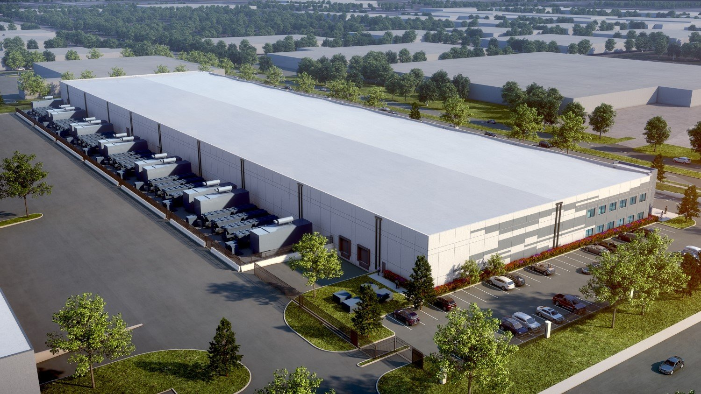 
[A data center is basically a big warehouse with computers inside.](https://baxtel.com/news/skybox-datacenters-finishes-construction-on-illinois-data-center)

We usually [classify](https://ifp.org/how-to-build-an-ai-data-center/) data centers according to the continuous power load they draw from the electricity grid to function at full capacity. This is their capacity in megawatts (MW), and includes more than just computing activities! As we will see later on, some are already being planned at GW level.

Importantly, if we want to compare the efficiency of one data center to that of another, we can't just use the capacity (even though larger, dedicated data centers tend to be more energy efficient than colocated ones). We are also interested in the [utilization rate](https://semianalysis.com/2024/10/14/datacenter-anatomy-part-1-electrical/) of the data center, or the percentage of time that the computing equipment is in operation. Some enterprise workloads have less than 50% utilization, while cloud computing is between 50-60% and AI training is above 80%. Low utilization means that servers are laying idle most of the time.

We have two more metrics we are interested in: the power usage effectiveness (PUE) and water usage effectiveness (WUE). These were both designed by The Green Grid, an industry consortium collaborating to improve the resource efficiency of data centers. PUE is [defined](https://datacenters.lbl.gov/sites/default/files/WP49-PUE%20A%20Comprehensive%20Examination%20of%20the%20Metric_v6.pdf) as the ratio of total data center energy consumption and energy used specifically for computing activities. Therefore, a PUE of 1 is optimal, and the lower, the better, since less energy is used for something other than computing. 
$$\mathrm{PUE}=\frac{\mathrm{Total \; facility \; energy} \; [kWh]}{\mathrm{IT \; equipment \; energy}\; [kWh]} > 1$$

Then, WUE is [defined](https://airatwork.com/wp-content/uploads/The-Green-Grid-White-Paper-35-WUE-Usage-Guidelines.pdf) as the ratio between the annual water consumption in liters and the energy used for computing activities in kWh. 
$$\mathrm{WUE}=\frac{\mathrm{Annual \; water \; usage}}{\mathrm{IT \; equipment \; energy}} \; \; \; \; [L/kWh]$$

These metrics are [not perfect](https://datacentremagazine.com/articles/power-usage-effectiveness-not-the-whole-story), and do not take into account many sustainability-related aspects, but they pretty clearly address what we are interested in. Even though TGG has also defined [other, more complex metrics](https://lists.itic.org/news-events/news-releases/amid-growing-energy-demand-the-green-grid-launches-new-data-center-effectiveness-tool), we'll focus on these two for now to keep it simple.

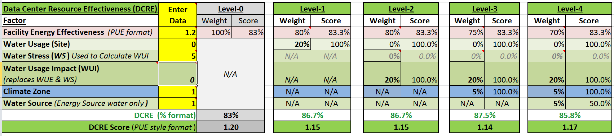 [Calculation method for TGG's data center resource effectiveness metric.](https://www.thegreengrid.org/resources/library-and-tools/wp93-data-center-resource-effectiveness-dcre-metric)

The final metric we should be aware of is related to data center reliability. Because we want cloud computing to operate without interruptions, data centers are designed to minimize the risk of downtime. The Uptime Institute, another trade organization, [classifies](https://uptimeinstitute.com/tiers) data centers according to four tiers, with Tier I being the least reliable and Tier IV being the most reliable (with a theoretical uptime of 99.995%). They achieve this by avoiding single points of failure, with backup diesel generators and redundant cooling and power systems. 

## Data center architecture: computing
In a data center, computers are stacked vertically in large racks, each holding several dozen computers, together with network switches, power electronics, and sometimes backup batteries. The racks are organized in lines and form corridors inside the data halls. 

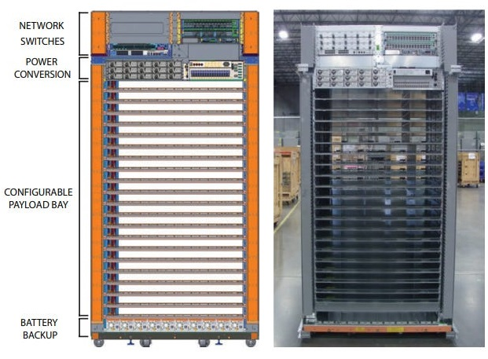 
[Server racks.](https://ifp.org/how-to-build-an-ai-data-center/)

Each server contains a variety of ICT electronics: CPUs, GPUs and more. Some, such as specialized [AI Neoclouds](https://semianalysis.com/2024/10/03/ai-neocloud-playbook-and-anatomy/ ), focus on GPU compute rental, and therefore downgrade their CPUs and beef up their internal data transfer networks to optimize for LLM training. In Lecture 6, you will see that a single processor requires dozens of elements. Multiply that by 2048 (for a Neocloud) or by several tens of thousands (for a hyperscale data center) - what kind of material footprint are we looking at?

There's also all the data storage and [data transfer networks](https://semianalysis.com/2024/10/03/ai-neocloud-playbook-and-anatomy/ ) that need to be set up between servers: frontend (Ethernet), backend (InfiniBand), and the status data for the servers themselves. In designing data center architectures, there are always trade-offs: for example, [increasing server density](https://semianalysis.com/2024/10/14/datacenter-anatomy-part-1-electrical/ ) by bringing everything closer together will allow you to use copper instead of fiber optics for data transmission, but will increase your need for cooling. Sustainability is not often taken into account in these trade-offs.

Let's start with an individual processor, which uses electrical power to perform computations. This electrical power is downgraded to heat: one kW of electricity results in approximately one kW of heat. Chipmakers design chips for a [thermal design power](https://en.wikipedia.org/wiki/Thermal_design_power) (TDP): the maximum heat it can handle. This value has been continuously increasing over the past 10 years, and continues to accelerate with AI-specific equipment reaching [1500W](https://www.tomshardware.com/pc-components/cooling/future-ai-processors-said-to-consume-up-to-15-360w-massive-power-draw-will-demand-exotic-immersion-and-embedded-cooling-tech).

In a typical air-cooled server, the chip is [connected](https://semianalysis.com/2025/02/13/datacenter-anatomy-part-2-cooling-systems/) to a thermal interface material (TIM), which conducts heat from the chip package to a heat sink. The heat sink increases the surface area of heat flux, improving cooling performance. The higher TDP of the chip, the bigger the heat sink needs to be, so fewer modern chips (such as the NVIDIA H100) can fit in the same rack. The heat from the heat sink is then evacuated by server fans into the data halls.

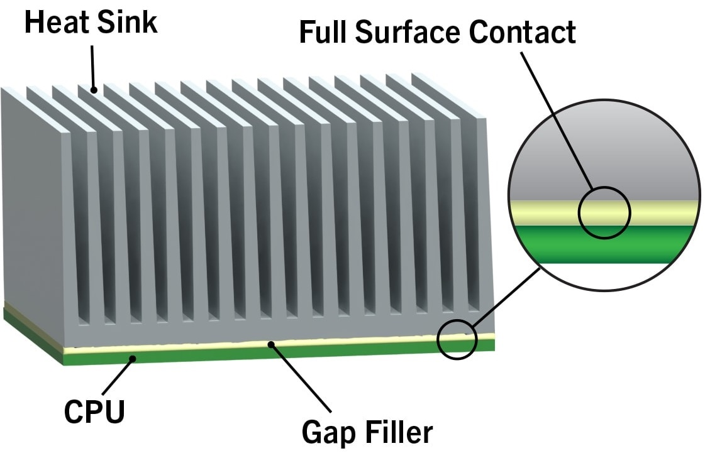 [Thermal interface material and heat sink.](https://mgchemicals.com/knowledgebase/white-papers/properties-of-thermal-interface-material/)

Once the hot air is in the data hall, outside the server rack, it's the job of the cooling system to get rid of it.

## Data center architecture: cooling
Thirty years ago, data center cooling systems used to be the same as air conditioning for office buildings. Modern data centers, however, [generate](https://semianalysis.com/2025/02/13/datacenter-anatomy-part-2-cooling-systems) more than 50 times the heat per square meter and exhaust several MW of heat in total. For this reason, specialized, highly complex systems are required. 

Where we left off, the server exhausted heat from the chip into the corridor of the data hall. [Inside each data hall](https://semianalysis.com/2025/02/13/datacenter-anatomy-part-2-cooling-systems) is a computer room air conditioner (CRAC) or a computer room air handler (CRAH) that takes in the hot air and blows it over coils with cold water, cooling the air and warming up the water. [Some](https://semianalysis.com/2025/02/13/datacenter-anatomy-part-2-cooling-systems) data centers may also use fan walls or rear-door heat exchangers (RDHx) for each server rack, each with their own cost-efficiency trade-offs. The cool air is then recirculated inside the data hall.

Traditional data centers used to feature a lot of mixing between the intake cool air and the exhaust hot air, which meant that the air conditioners needed to work even harder to maintain a low temperature. It's as if you wanted to cool down a room in summer while leaving the window open! Nowadays, airflow within the data center is [managed](https://semianalysis.com/2025/02/13/datacenter-anatomy-part-2-cooling-systems) very carefully, and corridors are contained either through hot aisle containment or cold aisle containment. This means that the cool air flows are kept separate from the hot air flows, which makes everything more efficient. Companies also perform computational fluid dynamics studies of the airflow to optimize it as much as possible.

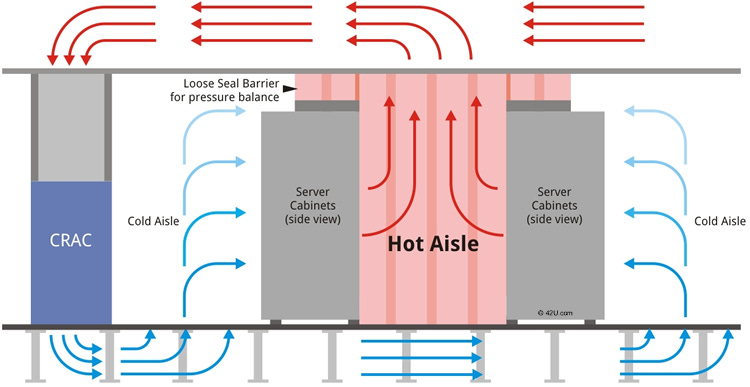
 [Hot aisle containment.](https://ifp.org/how-to-build-an-ai-data-center/)

The warm water from the CRAC/CRAH is then [taken](https://semianalysis.com/2025/02/13/datacenter-anatomy-part-2-cooling-systems) to a central chiller to be cooled down. The chiller is a large-scale, energy-intensive component (in fact, one of the most expensive in the data center) that performs a full refrigeration cycle. Like a fridge, it takes in the warm water and cools it. 

The [refrigeration cycle](https://en.wikipedia.org/wiki/Heat_pump_and_refrigeration_cycle) has four steps. First, a refrigerant liquid absorbs heat from the water and evaporates. The refrigerant in vapor form goes through a compressor, increasing its pressure and temperature and therefore increasing its capacity to transfer heat. Then, it enters a condenser, where it transfers heat to a separate medium that goes into the outdoor cooling loop. Finally, an expansion valve reduces pressure and thereby temperature, returning the refrigerant to a liquid state at very low temperature.

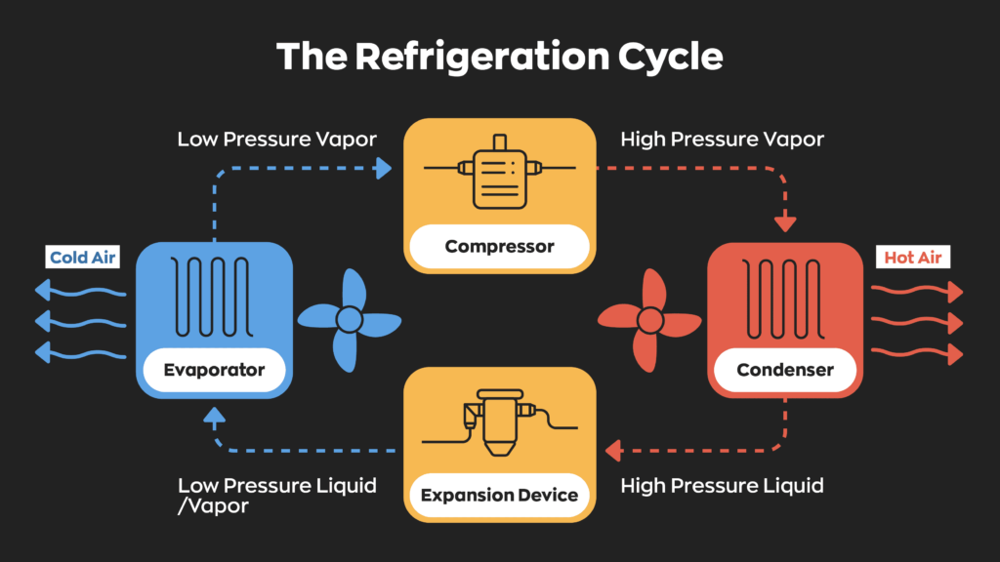
 [Refrigeration cycle.](https://www.inflowinventory.com/blog/refrigeration-cycle-diagram/)

The end result is that heat is moved to the external cooling towers, which can either be dry or wet. A dry cooling tower has a closed-loop system, in which water flows through a coil and is cooled by a fan. In contrast, wet coolers spray water from the condenser loop, increasing cooling capacity through evaporation (just like sweat) while also increasing water consumption. Wet coolers [perform](https://semianalysis.com/2025/02/13/datacenter-anatomy-part-2-cooling-systems) best in dry locations with low background humidity, while dry coolers perform best in wet locations, and require more electricity because of their lower cooling capacity. Some data centers also use more complex adiabatic coolers or reuse their waste heat, though we'll discuss that later. 

 [Dry cooling tower.](https://youtu.be/vZkA0z9JRgw)

 [Wet cooling tower.](https://youtu.be/vZkA0z9JRgw)

Nowadays, a lot of the energy efficiency low hanging fruit [have been picked](https://semianalysis.com/2025/02/13/datacenter-anatomy-part-2-cooling-systems). Servers have been specifically designed to run at the highest temperature possible (up to 45 degrees Celsius!), and their fans have increased in size, because larger fans can produce the same airflow for less power. Airflow is optimized and contained, and new designs rely much more on free cooling. In free cooling systems, the outside environment is used to cool the data center; for example, exterior air is used in colder climates, eliminating the need for a chiller. Other data centers use multiple cooling loops, and might even have large water storage systems that can hold a lot of heat.

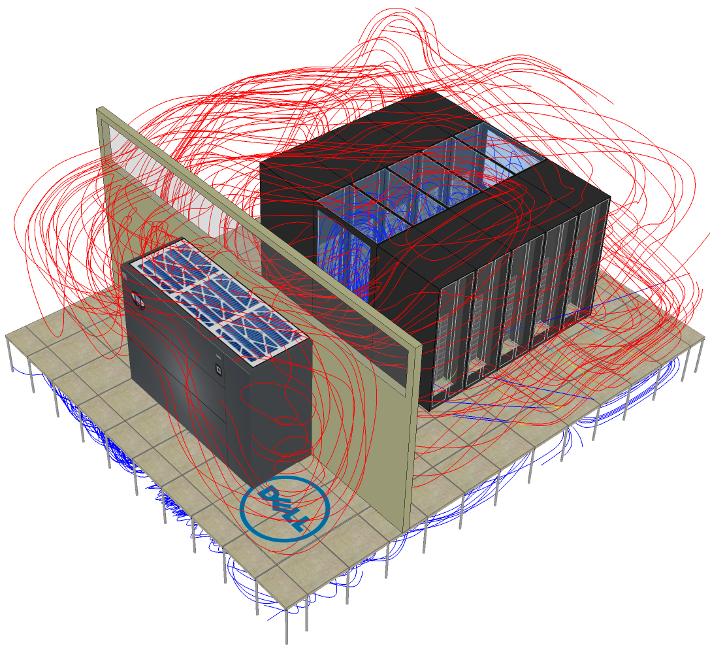
 [Computational fluid dynamics modeling of data center airflows.](https://mediafieldsjournal.org/air-conditioning-the-internet/)

All these cooling systems are ultimately critical to the functioning of the data center. Even though operators power the cooling system through highly redundant architectures, as we'll see below, if catastrophe did strike and the air conditioning system were shut off, it would take [twenty minutes](https://mediafieldsjournal.org/air-conditioning-the-internet/) before the temperature in the data hall rose to what we can call total heat death. Air conditioning keeps the internet alive.
## Data center architecture: power
The computers and cooling equipment that we discussed above also need power. Data centers have sophisticated, redundant architectures for delivering constant stable electricity to each individual server. As a matter of principle, voltage is [kept](https://semianalysis.com/2024/10/14/datacenter-anatomy-part-1-electrical/) as high as possible until close to the servers, because power losses scale with the square of current and higher voltage means lower current. High voltage is quite dangerous, however, so this voltage is stepped down in the data hall.
$$\mathrm{P}=\mathrm{I} \;[A]  \cdot \mathrm{U}\; [V] = \mathrm{I^2} \; [A^2] \cdot \mathrm{R} \; [\Omega] \; \; \; \; [W] $$

The utility delivers high voltage (HV) electricity to the data center, and power transformers convert it to medium voltage (MV). These transformers [are set up](https://semianalysis.com/2024/10/14/datacenter-anatomy-part-1-electrical/) in a redundant N+1 configuration: for example, three transformers share the load at two thirds of their rated capacity, so that, if one fails upon initial activation, two can maintain full operation. They are also kept in partial operation because completely unused transformers can deteriorate. These transformers need copper for their coils and steel for the transformer core. The steel is of a very specific type: rare and costly grain oriented electrical steel.

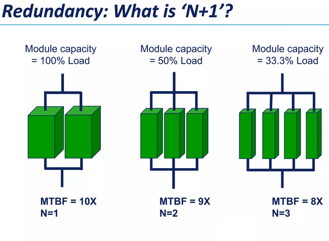 [Redundant N+1 power supply.](https://www.slideshare.net/JohannHendry/thefutureofdatacentresprofianbitterlinemerson)

From the transformers, there are [two](https://semianalysis.com/2024/10/14/datacenter-anatomy-part-1-electrical/) transmission paths: one is an uninterruptible power supply (UPS) to the servers, and the other is the path to the cooling equipment. We will focus on the former in what follows.

The data center building has multiple data halls, and each data hall [has](https://semianalysis.com/2024/10/14/datacenter-anatomy-part-1-electrical/) multiple pods, each with its own dedicated switchgear and generator. The switchgear distributes, protects, and meters power; it contains circuit breakers, metering components, relays, current and voltage transformers, a switch, and cabling. All these components aren't all that important to us - what matters is the scale and materiality of the processes we are working with. Alongside this switchgear is a diesel generator which can take over in the case of an outage. Data centers store 24 to 48 hours of fuel at full load - at every outage, we are burning diesel!

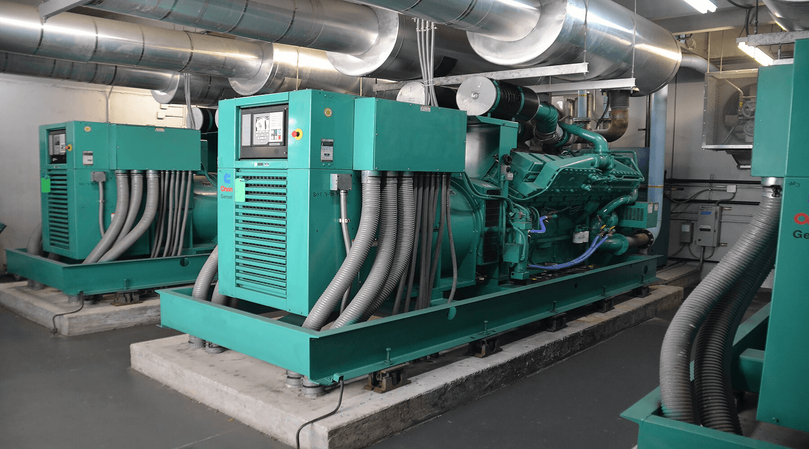 [Backup diesel generators lie in wait.](https://csdieselgenerators.com/why-a-standby-data-center-generator-is-critical/)

Downstream from the switchgear is a bank of batteries, which [take over instantly](https://semianalysis.com/2024/10/14/datacenter-anatomy-part-1-electrical/) in the case of an outage until the generators turn on and reach full capacity in 60 seconds. Then, at rack level, the power is distributed either through an overhead busway (a solid bar of conducting metal, preferred for high power) or through flexible power cables. Each rack has its own vertical power distribution unit (PDU) connected to the servers; in practice, each has two, for 2N distribution redundancy.

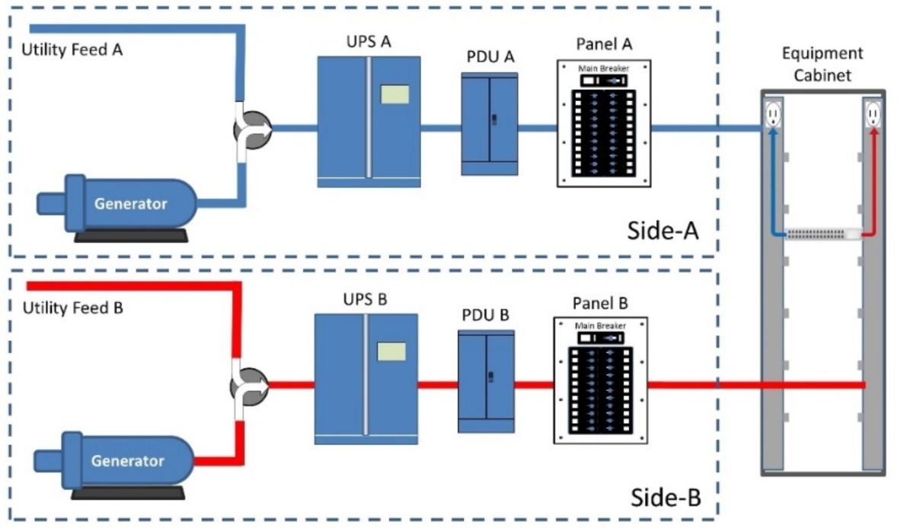
 [2N redundant power distribution system.](https://ifp.org/how-to-build-an-ai-data-center/)

Here, too, a lot of energy efficiency improvements have been made between traditional and modern data centers. The computers themselves [have become](https://ifp.org/how-to-build-an-ai-data-center/) more efficient: AC-DC rectifiers, which used to be the main source of inefficiency, are [close](https://www.vertiv.com/498eac/globalassets/documents/white-papers/98_percent_efficiency_esure_white_paper_253412.pdf) to their theoretical limit. Chips can now ramp down when idle, and smaller transistors have also helped. Meta's Open Compute Project [features](https://semianalysis.com/2024/10/14/datacenter-anatomy-part-1-electrical/) a power shelf with a single rectifier for the entire rack, which requires custom server design. These power shelves can also incorporate their own battery unit, eliminating the need for a central battery and halving the total battery capacity needed, but also requiring fire suppression in the racks.

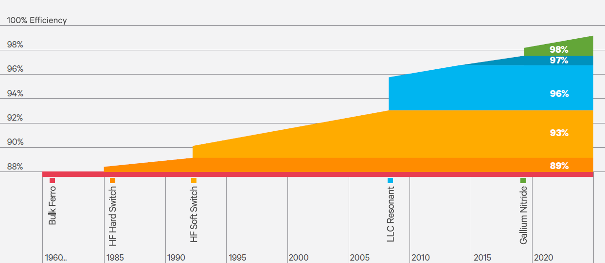 [Efficiency trends for modern rectifiers.](https://www.vertiv.com/498eac/globalassets/documents/white-papers/98_percent_efficiency_esure_white_paper_253412.pdf)

These efficiency trends look good, and have probably saved us quite a few greenhouse gas emissions. But exactly how impactful have they been?

# Data center impacts
In what follows, we will take a look at the energy, carbon, water, and material footprint of the data center industry, as well as on its impact on communities. Importantly, we will not only string a sequence of numbers on the screen, but also focus on how researchers have arrived at these figures; otherwise said, not only what the impacts are, but also how we can measure them ourselves.

One thing to remember before we start: for some reason, data center operators are not eager to make our work easy. The industry is remarkably [opaque](https://www.climatiq.io/blog/measure-greenhouse-gas-emissions-carbon-data-centres-cloud-computing) when it comes to its power consumption, and even majors like AWS or Azure only report scant data. This lack of transparency means that the data we are looking at often represents educated estimates that researchers have painstakingly put together. For this reason, it is important to always critically evaluate assumptions and methodologies, and understand that estimates can often go different ways.

## The carbon footprint of data centers
A frequent estimate that has been thrown around is Alex de Vries' [3Wh of energy](https://doi.org/10.1016/j.joule.2023.09.004) for an AI search-related inference, or more than ten times the power consumption for a regular Google search. A consequence for the addition of an AI search result to every Google query was calculated to amount to an energy consumption similar to that of the nation of Ireland. Another is the Shift Project's estimate of [3.7 percent of global GHG emissions](https://theshiftproject.org/en/publications/lean-ict/) being attributed to digital technologies (more than those of commercial aviation).

The carbon footprint of a data center is dependent on [three factors](https://www.climatiq.io/blog/measure-greenhouse-gas-emissions-carbon-data-centres-cloud-computing): the electricity consumption required to run its servers, the water consumption required to cool them down, and the lifetime of the equipment (which affects the frequency of manufacturing new replacements). Let's take a look at two methodologies which attempt to calculate this carbon footprint.

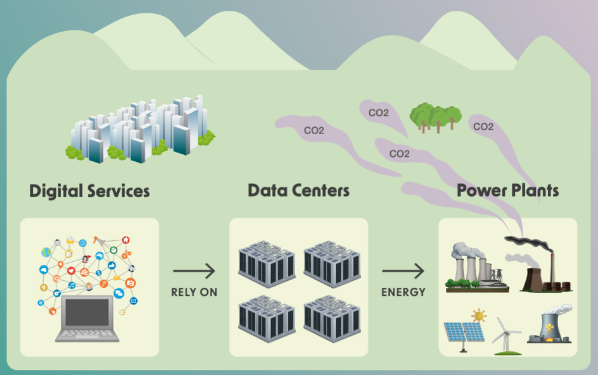 [How data centers produce emissions during operation.](https://arxiv.org/abs/2411.09786)

Our first method comes from a [large-scale 2024 assessment](https://arxiv.org/abs/2411.09786) of the environmental impact of data centers in the United States. Researchers identified and validated individual data center demand, found which power plants supplied electricity to each data center, identified the share of electricity supplied by each power plant and the fuel used to produce this electricity, and attributed the resulting emissions to each data center. They also made a neat [map](https://analysis-1.maps.arcgis.com/apps/dashboards/abc6fbecb1904325bd734392f47a7850) of these data centers.

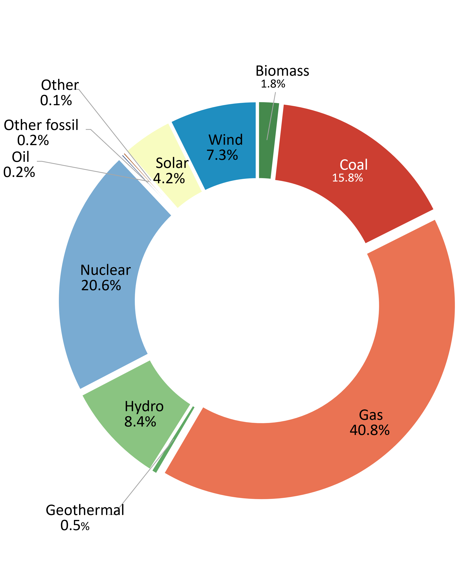 [Energy mix estimate for US data centers.](https://arxiv.org/abs/2411.09786)

The study found that the aggregated energy consumption of the data centers they included in the analysis was almost 5% of the country's total 2022 energy production. The average carbon intensity of a data center was estimated to be 548 gCO2-eq/kWh, about 50% percent higher than the national average, leading them to conclude that data centers are usually found in areas with more fossil-heavy energy sources. As the figure above shows, fossil fuels accounted for more than 50% of their energy consumption.

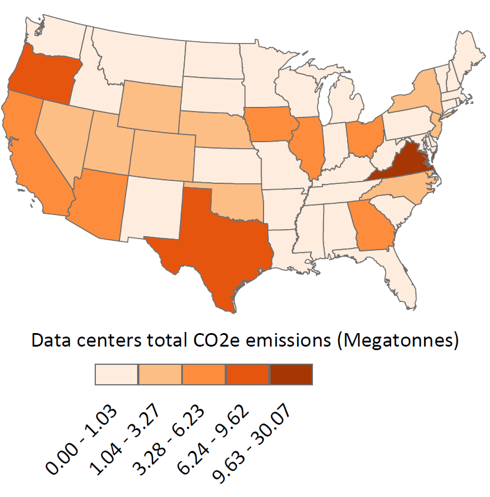 [Data center-related emissions in megatons CO2.](https://arxiv.org/abs/2411.09786)

Because this method is attributional (using external data and attributing the results to each data center), it was necessary to make quite a few assumptions which could significantly influence their results. The researchers assumed a utilization of 0.75 for all data centers, did not account for whether data centers where colocated or hyperscale, and estimated the power capacity of several data centers based on their size where data was not available. Notably, this methodology only calculates the operational, energy-related carbon footprint of data centers, because data on the internal components is simply not available. 

Finally, one aspect that is not taken into account in such an analysis is [power purchase agreements](https://assets.crowncommercial.gov.uk/wp-content/uploads/Power-Purchase-Agreements-PPA-An-Introduction-to-PPAs.pdf) (PPAs). Hyperscale data center operators like [Microsoft](https://www.microsoft.com/en-us/microsoft-cloud/blog/2024/09/20/accelerating-the-addition-of-carbon-free-energy-an-update-on-progress/) claim to cover most of their data center energy consumption through PPAs, which generally means that, for each GWh consumed, one GWH is produced from renewable energy sources somewhere else. Of course, [PPAs have their own problems](https://assets.publishing.service.gov.uk/government/uploads/system/uploads/attachment_data/file/263919/Baringa_report_on_PPA_market_liquidity___July_2013.pdf) and the actual data centers still consume energy from fossil sources, so it is up to you to decide whether this can be considered sufficient mitigation.

The same group of researchers did [something similar](https://doi.org/10.1038/s41467-025-58287-3) for Bitcoin mining in 2025. In the mining process, the data centers reveal their IP address, which the researchers used to establish their location. They then applied the same methodology, matching the estimated mining location data to the carbon intensity of electricity generation at that location. This allowed them to investigate the electricity mix of the Bitcoin network, which was found to be dominated by coal and natural gas.

Another earlier [study](https://doi.org/10.1016/j.joule.2022.02.005) from 2021 had applied this methodology to the entire world, finding that the carbon footprint of Bitcoin mining was comparable to that of the country of Greece in 2021. In 2019, Bitcoin mining was banned in China, so miners migrated to Kazakhstan and the United States, with the share of natural gas in the electricity mix of the industry doubling and higher-emitting plants being used. These estimates are already dated, so the carbon footprint of the industry may have increased in the meantime.

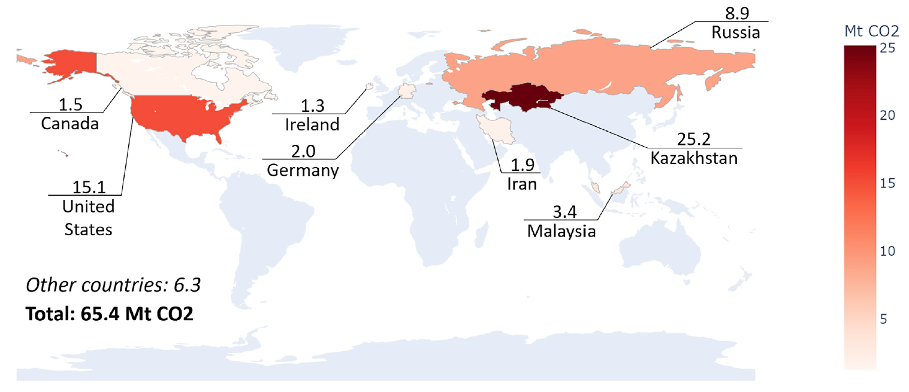 [The carbon footprint of Bitcoin and its geographical distribution.](https://doi.org/10.1016/j.joule.2022.02.005)

Our second methodology comes from the open-source [Cloud Carbon Footprint](https://www.cloudcarbonfootprint.org/docs/) (CCF) project. This tool can be used by someone using cloud services to estimate their environmental impact. In the process, it takes cloud provider usage data (compute, storage, networking), converts it into energy consumption, and then estimates the power usage effectiveness of the cloud provider's data centers and the carbon intensity of the region where the data center pulls power from. The emissions estimate is then calculated according to
$$
\mathrm{{CO2_{eq}}_{total}}=\mathrm{operational \; emissions } + \mathrm{embedded \; emissions}
$$
where
$$
\mathrm{operational \; emissions} = \mathrm{cloud \; provider\;  service\;  usage} \cdot \mathrm{cloud \; energy \; conversion \; factors} \; [kWh] \cdot \mathrm{cloud \; provider \; PUE} \cdot \mathrm{grid \; emissions \; factors } \; [metric \; tons \; CO2e]
$$
and
$$
\mathrm{embedded \; emissions} = \mathrm{estimated \; metric \; tons \; CO2e \; emissions \; from \; the \; manufacturing \; of \; servers}
$$

The CCF team uses [various estimates](https://www.cloudcarbonfootprint.org/docs/methodology) for the grid emissions factors and the [manufacturing-related emissions](https://www.cloudcarbonfootprint.org/docs/embodied-emissions) for computing hardware. This means that the results obtained with this methodology will not be perfectly equal to the real emissions, but it is a useful first step given the lack of transparency of cloud providers.

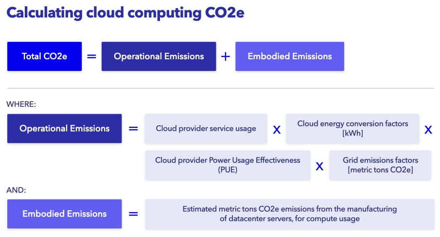 [CCF methodology for estimating data center emissions.](https://www.climatiq.io/blog/how-to-measure-carbon-footprint-cloud-computing-onpremise-hybrid-computing-infrastructure)

## The water footprint of data centers
Data centers are doing no better on the water front. Sadly, we once again have to rely on [estimates](https://iopscience.iop.org/article/10.1088/1748-9326/abfba1) for the United States, which find that data centers are among the top ten water-consuming activities in the country, with a fifth of data centers drawing from already stressed watersheds. Latin America has also been the [target](https://jacobin.com/2024/06/ai-data-center-energy-usage-environment) of significant data center development, with some facilities being set up around [drought-vulnerable](https://edition.cnn.com/2024/02/25/climate/mexico-city-water-crisis-climate-intl/index.html) Mexico City.

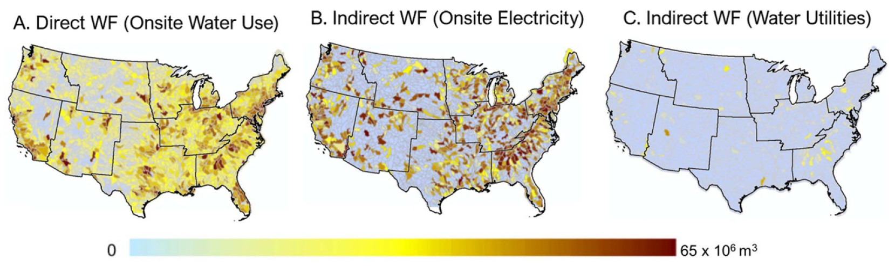[Direct (used for cooling) and indirect (used by power plant generating electricity) water footprint of US data centers in 2018.](https://iopscience.iop.org/article/10.1088/1748-9326/abfba1)

Same as for carbon emissions, cloud providers do not usually report their water consumption and the water stress levels of the areas their centers find themselves in. Therefore, researchers are once again forced to estimate the water footprint of data centers from first principles. To give you an idea of how this is done, we will follow along with a similar [methodology](https://arxiv.org/abs/2306.16668) to the ones above, based on a paper from a few years ago.

In the paper, the total water consumption of a certain compute job, a model M, is equal to the sum of the direct, or on-site water consumption (used for cooling) and the indirect, or off-site water consumption (used in the generation of the electricity used by the data centers, for example to cool a nuclear plant).
$$
W(M) = W_{\text{on}}(M) + W_{\text{off}}(M)
$$

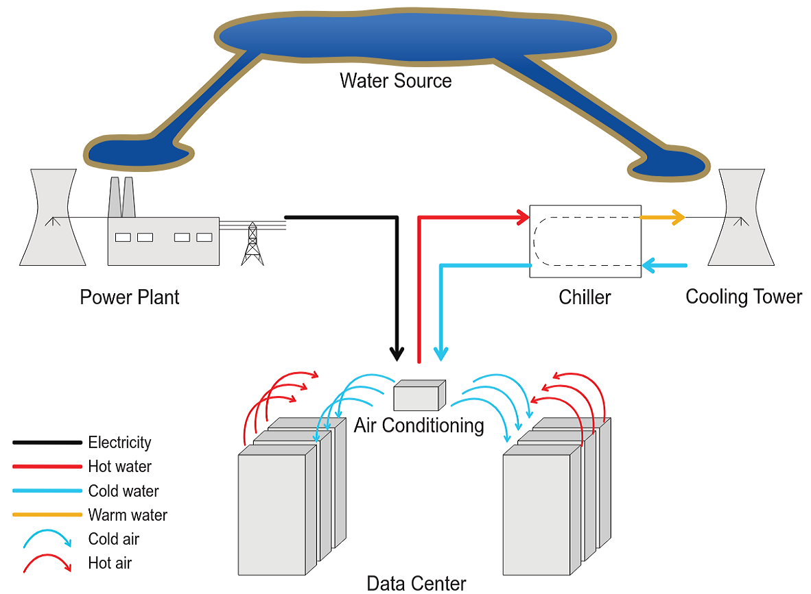 [Calculating the water footprint of a data center.](https://arxiv.org/abs/2306.16668)

The on-site water consumption is then [calculated](https://arxiv.org/abs/2306.16668) as a function of the energy use for the compute job and the water usage effectiveness of the data center during this job. 
$$
W_{\text{on}}(M) = \sum_{t=1}^{T} e(M, t) \cdot WUE_{\text{on}}(t)
$$
The water usage effectiveness at every point is estimated based on the temperature of the external environment, but the details are not very relevant to us here. Basically, higher temperatures result in more water being required to cool the data center.

The off-site water consumption is also calculated as a function of the energy use and the water usage effectiveness (this time, of the power plant!), but also as a function of the power usage effectiveness, since the data center needs more energy than just what is necessary for computations.
$$
W_{\text{off}}(M) = \sum_{t=1}^{T} e(M, t) \cdot PUE(t) \cdot WUE_{\text{off}}(t)
$$
The water usage effectiveness of the power plant is estimated based on the fuel it uses and its relative water intensity factor (how much water is required to produce a kWh of energy). 

The use of such a [methodology](https://arxiv.org/abs/2306.16668) allows us to recognize the inherent operational trade-offs of the data center. Strategies that reduce energy-related CO2 emissions may not necessarily result in lower water consumption. For example, if using solar power, no direct CO2 emissions are emitted, but it is only effective at daytime, when temperatures are highest, so more water may be required to cool the data center compared to using a fossil-fueled power plant at night-time.

When looking at the global water footprint of data centers, we need to make a few caveats, because this is a developing and [contentious](https://www.construction-physics.com/p/i-was-wrong-about-data-center-water) field. Data centers are just one water-consuming industry among many: for example, in most countries, [agriculture](https://www.slowboring.com/i/168643472/agriculture-especially-meat-is-the-big-water-user) and power generation are the most important consumers of water. Of course, this is not an argument in favor of letting data centers withdraw as much water as possible either, especially because, by being deployed where energy is cheap, data centers may draw from overstressed watersheds in arid, water-scarce regions. 

## The material footprint of data centers
As we saw above, researchers are doggedly fighting to estimate the carbon emissions embedded in the computing equipment of data centers. Entire [frameworks](https://www.boavizta.org/en/blog/empreinte-de-la-fabrication-d-un-serveur) for calculating the emissions during materials sourcing, manufacturing, transport, and end-of-life have been developed. However, the embedded emissions are not the only point of concern related to this computing equipment: we also care about the actual materials that go into it.

We will see in Lecture 6 that the materiality of electronics is important. GPU's, for example, are composed of a variety of chemicals, from rare earth metals (palladium, boron, cobalt, and tungsten) to heavy metals (lead and mercury) and complex plastics. All these ingredients need to be mined from the earth, processed, combined, and manufactured, which consumes further energy and sometimes results in toxic byproducts. The global scale of industrial chemical release is estimated to be as high as [220 gigatons per year](https://doi.org/10.1016/j.envint.2021.106616), of which greenhouse gases are only 20%. We are already aware of the material footprint of a single GPU. What about that of a data center with tens of thousands?

Once again, data center operators are tight-lipped about the lifetime of their servers, though servers usually get [switched out](https://www.climatiq.io/blog/measure-greenhouse-gas-emissions-carbon-data-centres-cloud-computing) every 3 to 5 years. Because of the miniaturized components, all this computing equipment tends to eschew recycling and join the fast growing e-waste stream. Globally, [62 million tons of e-waste were produced in 2022](https://unitar.org/about/news-stories/press/global-e-waste-monitor-2024-electronic-waste-rising-five-times-faster-documented-e-waste-recycling), and [70%](https://www.popsci.com/where-do-recycled-electronics-go/) of the toxic waste in US landfills is e-waste. All computing equipment has the potential to [threaten](https://www.who.int/news-room/fact-sheets/detail/electronic-waste-%28e-waste%29) health and the environment if its end-of-life is not handled properly.

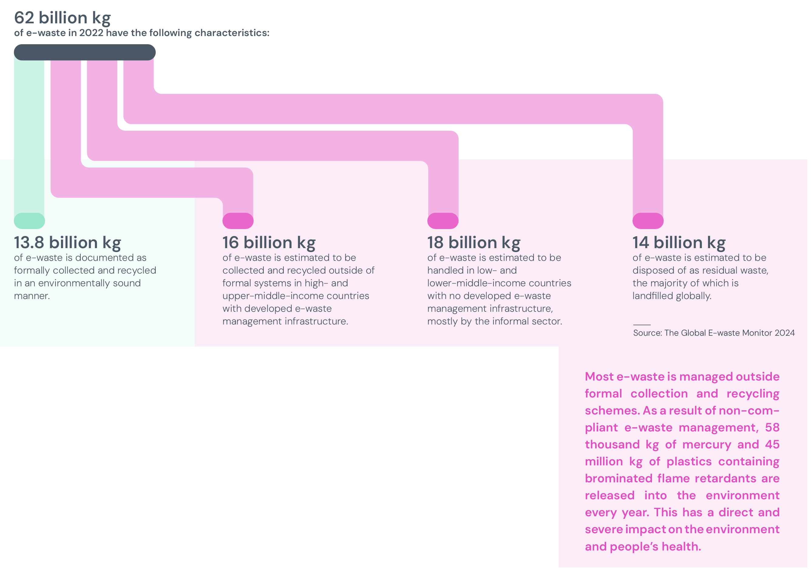 [Most e-waste is either landfilled or not recycled in an environmentally sound manner.](https://unitar.org/about/news-stories/press/global-e-waste-monitor-2024-electronic-waste-rising-five-times-faster-documented-e-waste-recycling)

Of course, as we saw before, data centers are more than just computers. They involve electrical systems, cooling systems, and all the construction and infrastructure required to keep them functioning. Data center construction requires carbon-intensive materials such as concrete and steel, and up to [a third](https://www.datacenterdynamics.com/en/analysis/sustainable-data-centers-require-sustainable-construction/) of data center emissions are embedded in the physical infrastructure. This means that a continued build-up of data centers can shift the discussion away from sustainable operations and towards sustainable construction practices.

## The human impacts of data centers
We went through some of the global impacts of data centers as an industry. But this is not the complete picture, because individual data centers also affect the community where they find themselves.

As we saw above, most of the energy powering data centers comes from fossil fuels. Even though the smokestacks of coal and gas power plants have been equipped with scrubbers and other equipment to reduce pollution, they still produce significant emissions of fine particle air pollution such as PM2.5, which are associated with [significant health risks](https://doi.org/10.1016/j.envadv.2024.100603). If data centers keep a fossil fuel power plant running, the air pollution from this plant is attributed to those data centers. The researchers studying the carbon footprint of Bitcoin mining above also evaluated the attributed PM2.5 pollution, and found that [46 million Americans](https://doi.org/10.1038/s41467-025-58287-3) living in 27 states had been exposed to measurable concentrations of Bitcoin mine-related pollution between 2022 and 2023.

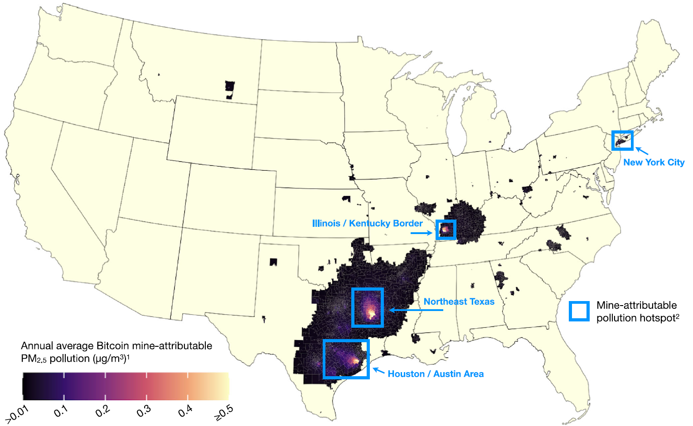 [Additional ambient PM2.5 pollution attributable to Bitcoin mines.](https://doi.org/10.1038/s41467-025-58287-3)

It's clear that what we consider environmental impacts are also local impacts on the communities that live close to data centers. The groundwater in a certain basin is not infinite, and unchecked consumption for data center cooling [depletes aquifers](https://iopscience.iop.org/article/10.1088/1748-9326/abfba1), risking that locals remain without water for agriculture, amenities, or even household activities and drinking. 

The final impact on local communities that we will discuss today is that on the electricity grid. Utility companies that provide electricity to consumers are regulated monopolies, which means that they are the only company providing this service and are therefore under some kind of government oversight to prevent abuse. Utilities [typically](https://eelp.law.harvard.edu/extracting-profits-from-the-public-how-utility-ratepayers-are-paying-for-big-techs-power/) include the costs of maintenance and grid expansion in the prices that industrial and residential consumers pay for their electricity, though any rate increases need to be approved by the oversight body.

However, there are a few special interests, such as large industrial users, that pay special negotiated rates with the utility. This means that the utility can [manipulate](https://eelp.law.harvard.edu/extracting-profits-from-the-public-how-utility-ratepayers-are-paying-for-big-techs-power/) these rate-setting processes to offer special individualized deals to favored customers that shift the costs of those discounts to their regular customers. 

Data centers are such customers, because they offer a stable income and consumption for years. This consumption needs to be [accommodated](https://eelp.law.harvard.edu/extracting-profits-from-the-public-how-utility-ratepayers-are-paying-for-big-techs-power/) with new infrastructure, so, to make it more enticing for the data center operator, suppliers sweeten the deal by offloading the cost of the new infrastructure on existing customers (you). The new infrastructure also needs to be maintained and then eventually dismantled. Finally, data centers can eat up power generation capacity from local low-cost energy sources such as nuclear plants, which once again increases the cost of electricity for the average consumer.

 A bad deal.

## Industry trends
The current environmental and human impacts of the data center industry do not paint a rosy picture. Well, at least we can be optimistic for the future, right?

Every single estimate for the data center industry growth shows a continuous increase. You could be excused for thinking that these ballooning projections are caused by hype for AI and its vertiginous growth, but even the baseline data center industry has been seeing enormous growth in its power demand, [doubling](https://www.goldmansachs.com/insights/goldman-sachs-research/gs-sustain-generational-growth-ai-data-centers-global-power) between 2019 and 2024.

Let's compare some projections of data center power consumption between 2024 and 2030. Goldman Sachs (which, remember, is a bank, so they [aren't supposed to be following unfounded hype](https://www.forbes.com/sites/halahtouryalai/2011/04/14/criminal-charges-loom-for-goldman-sachs-after-scathing-senate-report/)) sees non-cryptocurrency data center power demand growing between [80 and 240 percent by 2030](https://www.goldmansachs.com/insights/goldman-sachs-research/gs-sustain-generational-growth-ai-data-centers-global-power), with the United States seeing the share of power demand from data centers growing from 3% to 8%. Only 20% of this growth is expected to be derived from AI-related workloads. Other estimates, for example based on the expected production of AI chips, give much [sharper increases](https://ifp.org/future-of-ai-compute/) to equivalent to the power consumption of Japan.

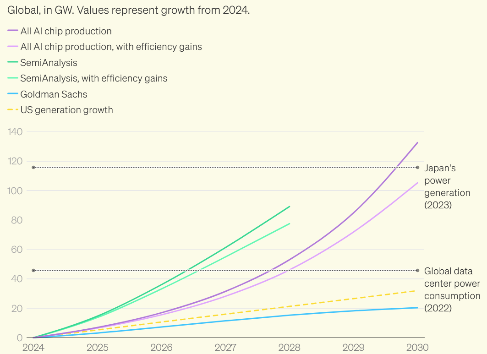
[Data center power demand growth for AI technologies.](https://ifp.org/future-of-ai-compute/)

These divergent estimates result from different assumptions on the growth of AI technologies. If we look at the recent growth in the amount of compute required for frontier AI models, such as OpenAI's GPT-3 and GPT-4, it becomes clear that the amount of compute follows a more or less [quintupling scaling law](https://ifp.org/future-of-ai-compute/), growing roughly 5x per year. This growth is driven by better hardware and data availability, which means that it is possible that a lack of appropriate training data will trigger a crisis for growth. There is no consensus on this issue at the moment. 

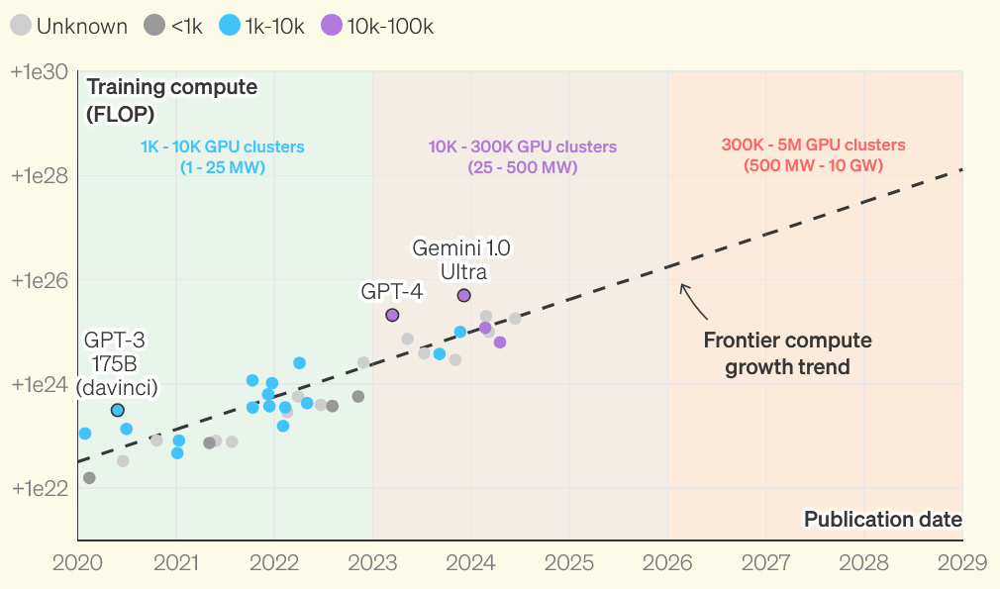 [The amount of training compute for frontier models has been increasing tremendously.](https://ifp.org/future-of-ai-compute/)

Energy efficiency trends are unfortunately not keeping up. Between 2015 and 2019, the power demand of data centers was [flat](https://www.goldmansachs.com/insights/goldman-sachs-research/gs-sustain-generational-growth-ai-data-centers-global-power) even though workload increased three times, because annual energy efficiency gains were about 15%. However, these efficiency gains have collapsed to 2-4% per year, and even though there are still some interesting efficiency increases such as the latest [NVIDIA DGX systems](https://www.goldmansachs.com/insights/goldman-sachs-research/gs-sustain-generational-growth-ai-data-centers-global-power), even these cannot catch up with the growth in demand caused by AI training and inference. And when compared to the compute trends above, even the best possible improvements in hardware utilization and longer training times will only reduce the required data throughput by 11 times, which offsets [a mere 18 months](https://ifp.org/future-of-ai-compute/) of demand for compute increases.

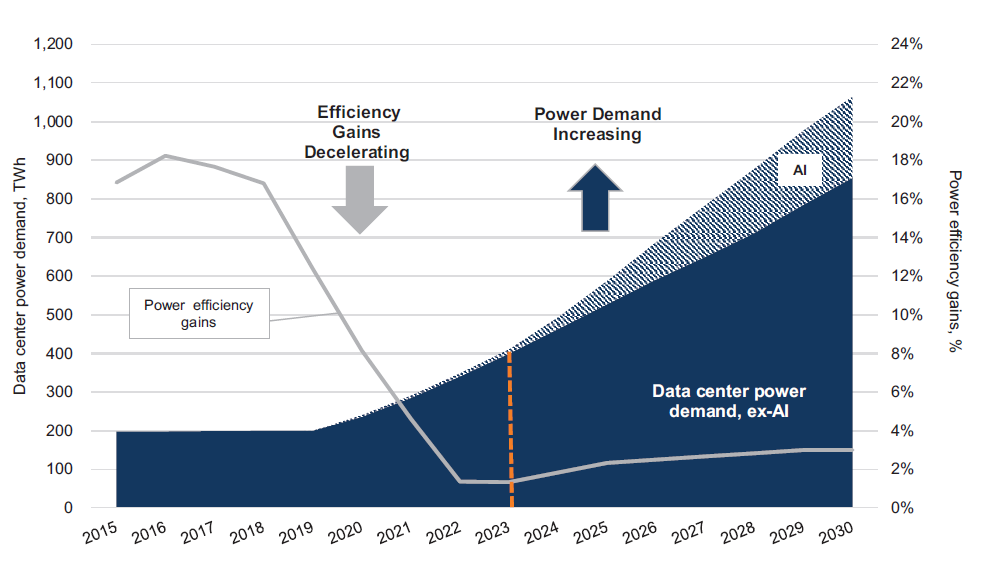 [Projected data center power demand growth and decreasing efficiency gains.](https://www.goldmansachs.com/insights/goldman-sachs-research/gs-sustain-generational-growth-ai-data-centers-global-power)

Until now, the largest data centers had tens of thousands of GPUs and power consumption to the order of tens of megawatts. Now, clusters ten times bigger are building built, and companies are even [planning](https://ifp.org/future-of-ai-compute/) gigawatt-level data centers. These projects would be so large that they could not be set up in a single building (nor could they be supported by a single power grid), so they would be split up into campuses connected by wide-area networks. To this end, data center builders have already started to [reserve](https://ifp.org/future-of-ai-compute/) significant fractions of global fiber cable manufacturing capacity. 

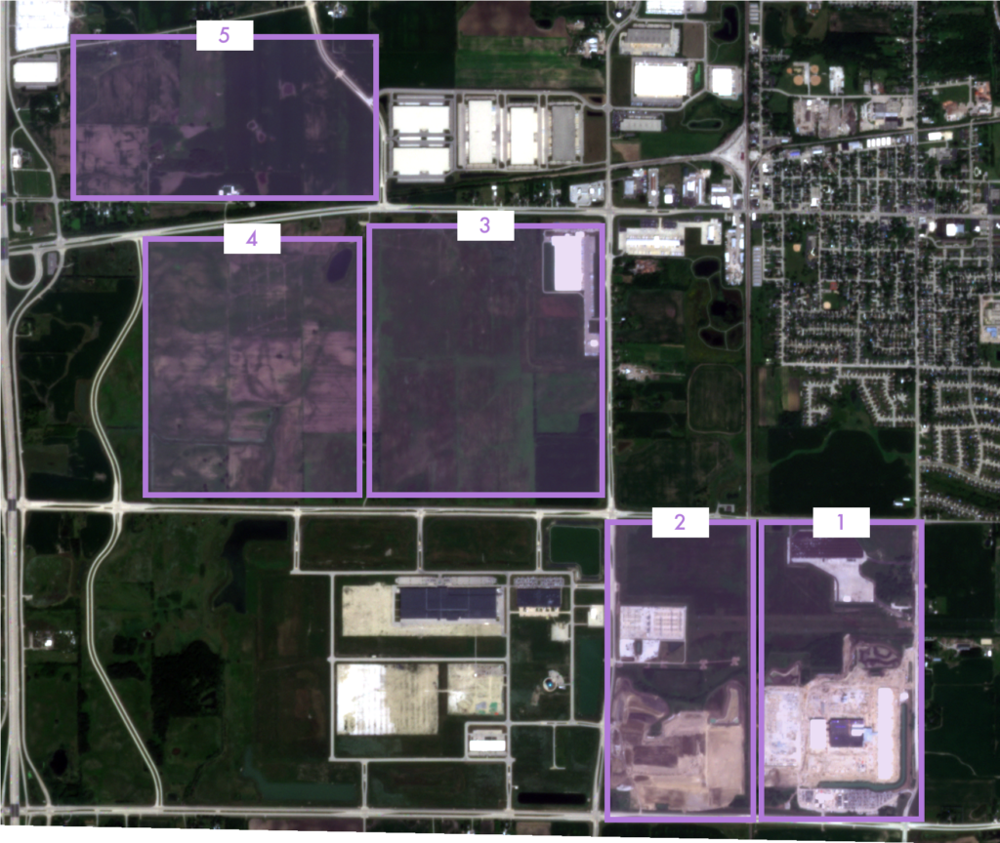 [Planned Microsoft/OpenAI data center campus.](https://ifp.org/future-of-ai-compute/)

Building a data center is not a particularly difficult endeavor as far as construction goes (they are warehouses, after all), but building all the power generation for this data center boom is sure to give utilities a headache. The buildout of renewable energy is [projected to not keep up](https://heated.world/p/ai-is-guzzling-gas) with demand, so companies are turning to rapid gas plant buildout instead.

Even recent data centers have stopped waiting for grid interconnection and have chosen to deploy [trailer-mounted gas turbines](https://ifp.org/future-of-ai-compute/) 'behind-the-meter', while several coal and gas plants that were slated for dismantling [are kept online](https://jacobin.com/2024/06/ai-data-center-energy-usage-environment) to power incoming data centers. Furthermore, fossil fuel companies like Exxon and Chevron are themselves [expanding](https://heated.world/p/ai-is-guzzling-gas) gas sales and power plant construction to capitalize on the new demand.

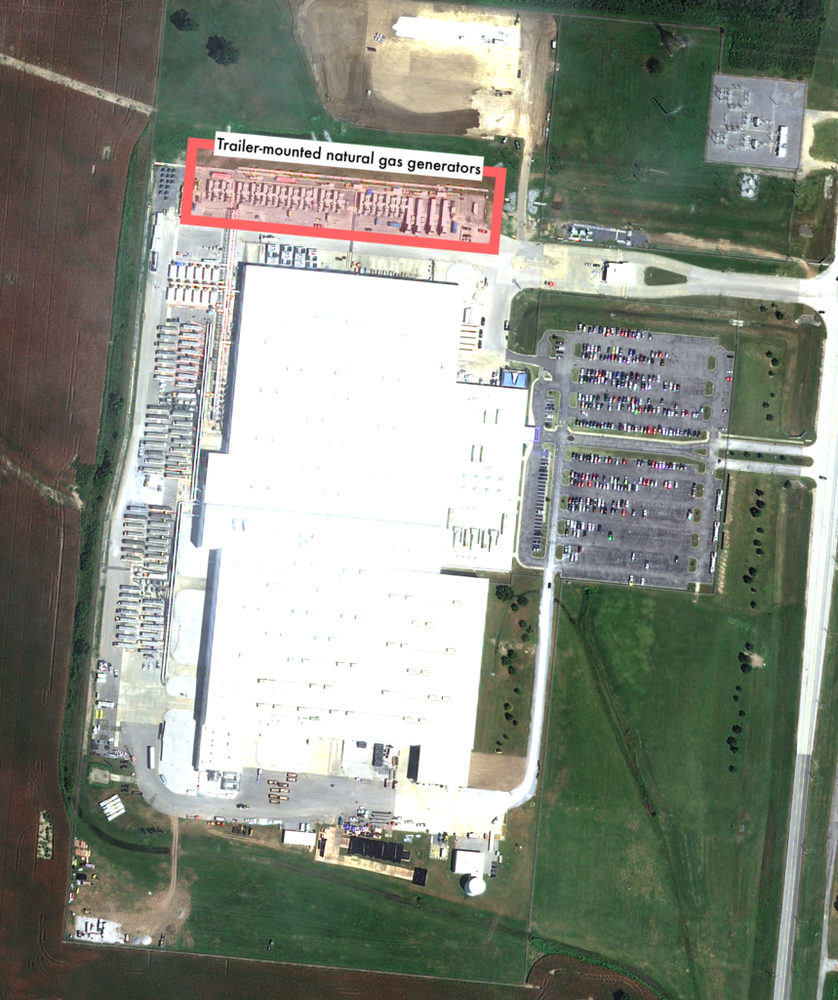 [xAI's data center uses 14 mobile natural gas generators.](https://ifp.org/future-of-ai-compute/)

Even though we already saw that data centers are not the cleanest industry, this parallel buildup of fossil fuel infrastructure means that they are slowing the transition to green energy and slated to increase their carbon emissions to even more unsustainable levels. It is clear that we need serious, effective solutions, and fast.

# Data center solutions
Overall, the trends in data center-related energy consumption and subsequent emissions paint quite a grim picture of the future. So let's think about how we can minimize the impacts we just discussed.

## 1. Economies of (hyper)scale
As we saw, hyperscale data centers tend to be less impactful due to economies of scale. [Some research has found](https://www.climatiq.io/blog/measure-greenhouse-gas-emissions-carbon-data-centres-cloud-computing) that they are up to five times less carbon-intensive than colocated or on-premise data centers, and almost six times more water-efficient, all due to their lower power usage efficiency. 

The problem is that these data centers still need to run continuously to accommodate varying demand for compute from all their customers, so the other solutions we will be talking about are going to be less effective. In any case, consolidating computing resources decreases the number of power electronics or redundant cooling and cabling infrastructure required.

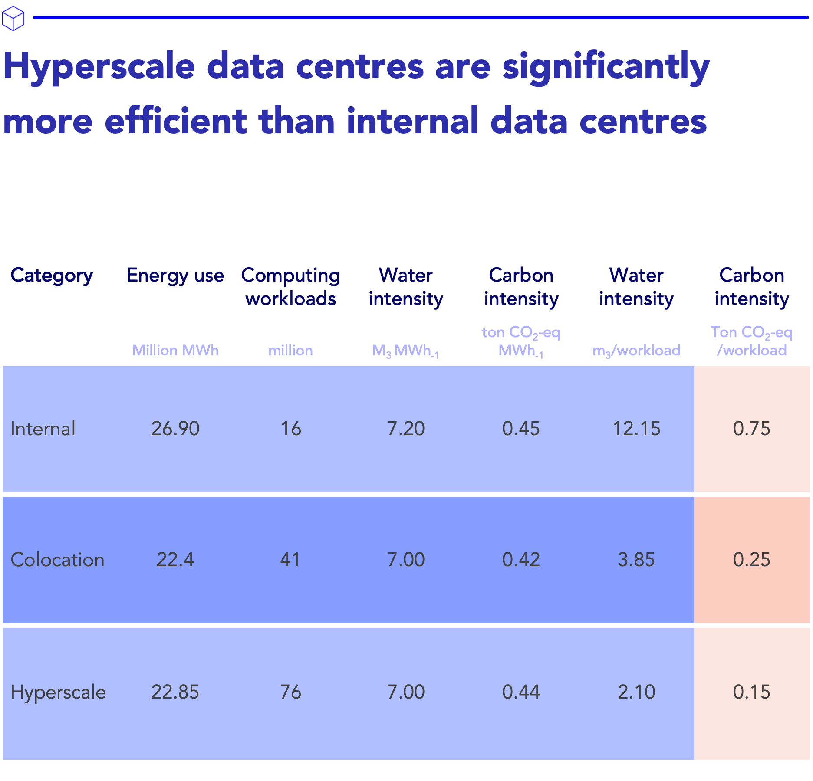[Comparing hyperscale, colocated, and on-prem data center environmental footprints.](https://www.climatiq.io/blog/measure-greenhouse-gas-emissions-carbon-data-centres-cloud-computing)

Another relevant aspect to the desirability of this centralization is where all these hyperscale data centers are found. On one hand, if cloud computing is displaced to [strategic regions](https://arxiv.org/abs/2408.08203), with desirable geographic, climatic, and demographic aspects, then we can reduce the compute-related energy and water consumption and maximize free, environmental cooling. On the other hand, if we just build them where it is cheapest, we might just compound the problem. 

## 2. On-demand and edge computing
A company's [cloud strategy](https://www.climatiq.io/blog/9-ways-reduce-computing-carbon-footprint) is also important. For example, you can get rid of idle or unused virtual machines, and work on-demand to only consume resources while the service is in use. Server loads are critical to maximizing energy efficiency. This is not only because you can make maximum use of renewable energy, but also because the power electronics in the data center are more efficient at higher utilization. 

This is why bundling up compute loads in a few heavy periods is more efficient than allowing the server to run continuously at low utilization. [Smart scheduling](https://cloud.google.com/blog/topics/sustainability/reduce-your-cloud-carbon-footprint-with-active-assist) allows you to batch jobs and run code only during periods of high utilization, allowing the server to shut down rather than run continuously at low utilization. [Edge computing](https://www.climatiq.io/blog/9-ways-reduce-computing-carbon-footprint), which happens at or near where data is produced, requires less energy to move data back and forth between the client and servers, and may produce fewer resulting emissions.

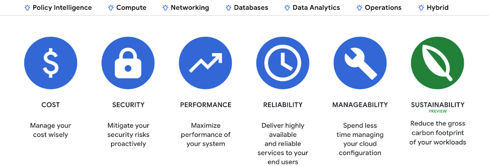[Google Cloud has started to integrate smart scheduling within its Active Assist portfolio.](https://cloud.google.com/blog/topics/sustainability/reduce-your-cloud-carbon-footprint-with-active-assist)

However, we need to note that every electronic component can reasonably satisfy only a set number of on/off cycles (power cycling) before it starts experiencing [thermal stress](https://learning-oreilly-com.tudelft.idm.oclc.org/library/view/upgrading-and-repairing/9780132682152/ch18.html) due to expansion and compression. This means that, if you only use a server for, say, eight hours a day at full utilization and then turn it off, you might be wearing it out more than if it had been running for twenty-four hours at partial utilization. 

Even though there are robust separate bodies of research on both [lifetime estimation through power cycling](https://doi.org/10.1016/j.microrel.2019.113460) and on [lifecycle assessment of electronics](https://ieeexplore.ieee.org/document/10173462), we haven't found any work on using power cycling models to compare partial and full utilization from a lifecycle perspective. So you could be the one to combine these fields in your thesis!

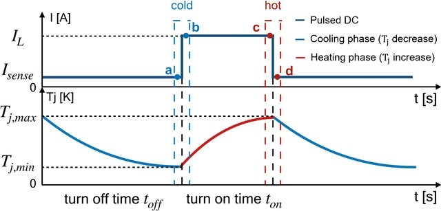 
[Power cycling experiments involve consecutive heating and cooling of components.](https://www.researchgate.net/publication/363848105_Condition_monitoring_indicators_for_Si_and_SiC_power_modules)

## 3. Renewable energy and demand response
Another important aspect is the use of renewable energy. Renewable energy sources [do not emit greenhouse gases](https://climate.mit.edu/explainers/renewable-energy) during operation, and as such all data centers should run off renewables. However, renewable energy's main problem is that of [intermittency](https://climate.mit.edu/explainers/renewable-energy): due to varying solar illumination and wind speeds, generation is not as stable as for traditional fossil-fueled plants.

There are two ways that this could be addressed. First, the [learning curves](https://caseyhandmer.wordpress.com/2024/03/12/how-to-feed-the-ais/) for both solar PV and large-scale batteries are quite favorable, which means that, if current trends continue, we will soon see data centers powered by solar-battery systems, maybe even disconnected from the grid. Second, data centers could apply demand response strategies; this could mean timing high utilization periods to the middle of the day, when solar energy is abundant, as well as shutting down servers if the grid is overburdened.

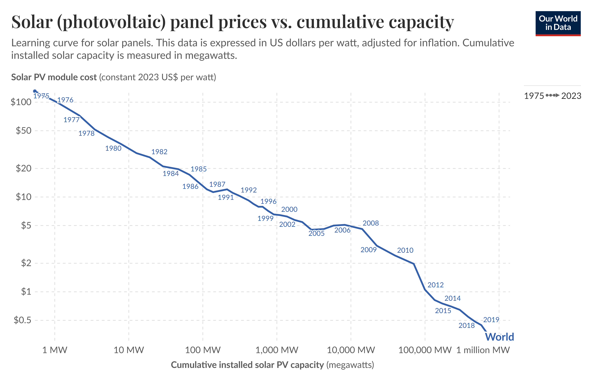
[Learning curve for solar PV (note logarithmic abscissa).](https://ourworldindata.org/grapher/solar-pv-prices-vs-cumulative-capacity)

A proposed solution is the use of parallelizable computing loads as variable demand that balances the renewable energy grid: for example, [some researchers](https://doi.org/10.1109/SusTech63138.2025.11025705) propose pooling Monte Carlo compute jobs into bundles that are actively placed in periods when energy is cheap and abundant. Rather than transport energy physically to every data center, data is more cheaply transported to whichever data center has access to the cheapest energy. 

However, compute jobs need to fulfil certain criteria to be used like this: they need to have low quality of service (no requirement for uninterruptible power supply), allow for pause and delay, and lack strong privacy or security requirements. Moreover, the implementation of such a system assumes that jobs can simply migrate from data center to data center, but the current data center economy is organized around contracts between operators (who manage the actual, physical data center) and users, which means that we would need a decentralized platform that can distribute these jobs on a national/continental/global scale.

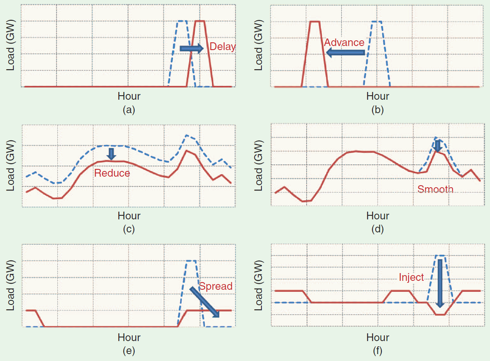
[Various versions of demand response: load shifting and load smoothing.](https://ieeexplore.ieee.org/document/6742689)

## 4. Server replacement
There are a lot of improvements that can be brought at a server level, too. In many cases, servers are replaced every three to five years, but if we can make them last longer by employing best practices in server maintenance, we will need to produce fewer overall and therefore reduce both the material footprint and the carbon footprint of the industry. However, [quoting Climatiq](https://www.climatiq.io/blog/9-ways-reduce-computing-carbon-footprint), "some of the latest generation hardware pieces are more energy-efficient and could reduce the energy consumption significantly - so understanding the trade-off of operating old equipment to improve the life-time emissions versus installing new components for better energy efficiency is crucial".

## 5. Cooling strategies
As we saw when we discussed cooling methods, there is always a trade-off between energy efficiency and water use efficiency. You can consume less energy by making use of an evaporative cooling tower, but then you have to evaporate water! 

There are also novel cooling architectures that rely on [liquids](https://doi.org/10.1038/s41586-025-08832-3) rather than air to cool servers. One big difference between, say, water and air is that water has a higher heat capacity, which means that it can store more thermal energy in the same volume ([around 3000 times more](https://en.wikipedia.org/wiki/Table_of_specific_heat_capacities) than dry air!). This property is used in more recent direct-to-chip (cold plate) cooling, as well as in proposed immersive cooling architectures which put the entire server inside a tank of coolant. 

These [liquid-based cooling architectures](https://doi.org/10.1038/s41586-025-08832-3) are definitely more energy-efficient than air-cooling, up to 50 percent more in the case of immersive cooling. However, they come with significant drawbacks. Firstly, you do have to make use of water, even though most of it can be kept in a closed cycle with minimal losses. Secondly, the coolant you have to use is not the most environmentally-friendly substance itself, and may even contain soon-to-be-banned PFAS (forever chemicals). Thirdly, a lot of these methods are still in development, so their costs have not yet been brought down by learning curves. Finally, immersing chips in liquid runs the risk of flooding said chips and leads to difficulties in performing maintenance or switching components.

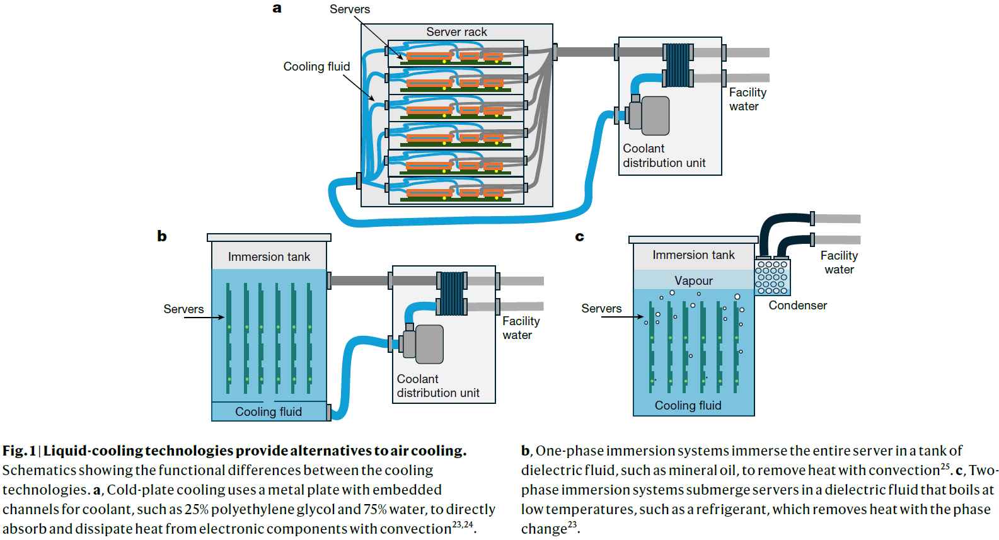
[Three types of liquid cooling: cold plate, one-phase and two-phase immersion systems.](https://doi.org/10.1038/s41586-025-08832-3)

Another interesting cooling strategy that has recently entered commercial application is [geothermal cooling](https://cleantechnica.com/2025/03/28/can-geothermal-cooling-tame-data-centers-energy-appetite/). At depths of 15 to 250 meters, the underground temperature is between 10 and 15 degrees Celsius, which can be effectively used by [digging boreholes and pumping warm water](https://open.library.ubc.ca/media/stream/pdf/24/1.0395216/4) from the data center to cool down. 

Depending on where you dig (for example, [Equinix](https://www.datacenterknowledge.com/cooling/equinix-is-latest-to-adapt-ground-water-for-cooling) has a geothermally-cooled data center in Amsterdam), geothermal cooling can cut your cooling bills by nearly half - and therefore significantly improve your power usage efficiency. However, geothermal cooling [may sometimes not be competitive](https://pangea.stanford.edu/ERE/pdf/IGAstandard/SGW/2018/Zurmuhl.pdf) with current cooling methods due to its high installation costs, compensating for its low operating costs.

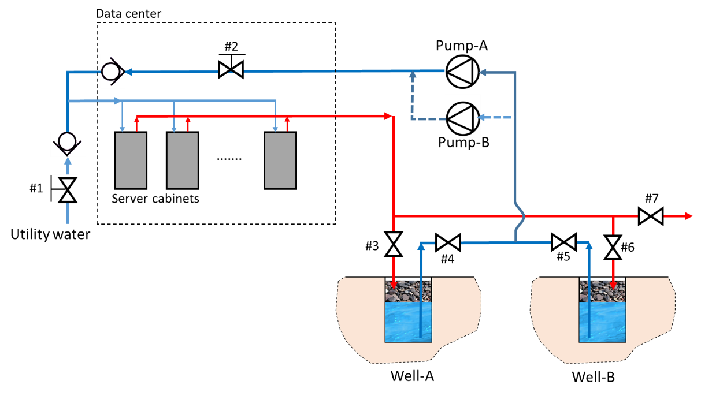
[Working principle of a geothermal cooling system. Note redundant cooling well.](https://open.library.ubc.ca/media/stream/pdf/24/1.0395216/4)

## 6. Waste heat reuse
But why waste that free heat when someone might need it? The waste heat from data centers can be integrated with someone who has demand for heat through [industrial symbiosis](https://en.wikipedia.org/wiki/Industrial_symbiosis).

An interesting [framework](https://www.researchgate.net/publication/221230056_Environmentally_Opportunistic_Computing_transforming_the_data_center_for_economic_and_environmental_sustainability) for waste heat reuse was developed at the University of Notre Dame in the United States, namely environmentally opportunistic computing (EOC). The idea is to place computing hardware in symbiosis with other facilities to "create heat where it is already needed, exploit cooling where it is already available, utilize energy when and where it is least expensive, and minimize the overall energy consumption by capitalizing on the dynamic mobility of virtualized services". 

These same researchers, for example, developed a [prototype](https://www.researchgate.net/publication/221230056_Environmentally_Opportunistic_Computing_transforming_the_data_center_for_economic_and_environmental_sustainability) distributed container-based data center that performs computations for the university while connected to a greenhouse. It allows computing jobs to migrate from personal workstations to a traditional data center to the prototype through the internet, and jobs within the prototype servers are batched and timed according to the greenhouse's temperature requirements: machines idle as the afternoon sun warms up the greenhouse, while jobs return in the cooler evening. This idea also found purchase in the Netherlands, which is rich in horticulture; a startup called [BlockHeating](https://shiftlimburg.nl/en/cases/blockheating-benefits-residual-heat-datacenters-for-heating-greenhouses) uses the same principle to warm up water for the greenhouses. 

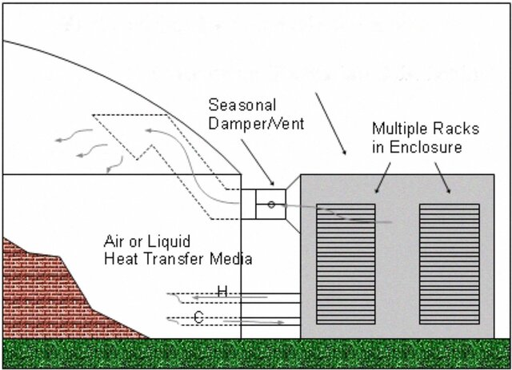
[Sustainable distributed data center prototype connected to a greenhouse.](https://www.researchgate.net/publication/221230056_Environmentally_Opportunistic_Computing_transforming_the_data_center_for_economic_and_environmental_sustainability)

An important obstacle to waste heat reuse is the demand profile of heating applications. There are very few activities that require a temporally-constant amount of heat. If we want to supply heat to, say, a neighborhood, we can only do so when they need that heat. Even so, there are several places in the world where tech giants have connected their data centers to local heat distribution networks, also called district heating.

For example, [Meta](https://tech.facebook.com/engineering/2020/07/odense-data-center-2/) (née Facebook) built a custom data center in Odense, Denmark, which is powered by renewable energy and recovers its waste heat through heating coils to a local heat pump. The heat is then more cheaply upgraded by the heat grid operator and sent out to the buildings in Odense. This data center was estimated by the company to reduce the city's demand for coal by up to 25%. While this is definitely on the upper end of Meta's data centers, and is undeniably a PR move for the company, it is also a great example of what could be achieved. Similar developments have been pursued by [Amazon](https://reasonstobecheerful.world/data-center-heat-green-energy/) and [Apple](https://www.computerweekly.com/news/366623832/Apple-to-play-modest-role-after-datacentre-heat-breakthrough-in-Denmark). There is another obstacle that we need to take into account here: usually, heat demand comes in the form of high value heat, around 50 degrees Celsius. However, data centers provide low value heat around 30-40 degrees Celsius. This means that the heat provided needs to be further upgraded to be of use.

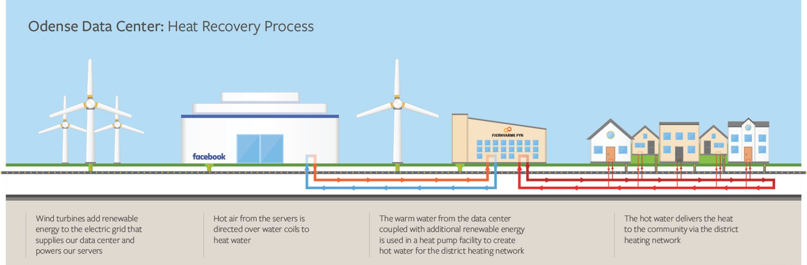
[Odense data center waste heat recovery.](https://tech.facebook.com/engineering/2020/07/odense-data-center-2/)

## The EcoDataCenter
We've already seen some examples of the sustainability solutions we've discussed. Now, let's take a look at an ambitious data center company that went for an all-of-the-above approach. Beyond their aggressive branding, the Sweden-based [EcoDataCenter](https://ecodatacenter.tech/sustainability-data-center/sustainability-report-2024) aims to put their money where their mouth is. Their facilities are found in a country with a cold climate, and they claim to use a power mix of 75% hydro and 25% wind power, and in 2024 they used 99.3% renewable energy (with some backup use of diesel generators, which they are switching for biofuel). 

They also claim to deliver waste heat to both district heating and industry needs, and have installed flexible cooling systems that can switch to dry cooling in periods of drought. Their electrical architecture is specially designed to increase the operating capacity from 50% to 75%, reducing the absolute number of power electronics components required. They also use water tanks as thermal buffers, allowing for cooling when energy is cheap and abundant (such as in the middle of the day with solar PV). 

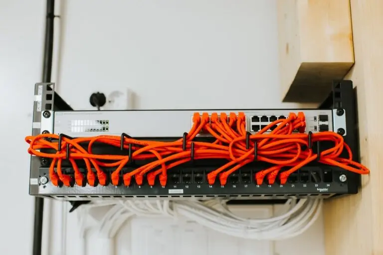
[EcoDataCenter's first building was constructed in wood.](https://businessfocusmagazine.com/2023/02/20/ecodatacenter-critical-data-infrastructure/)

## Conclusions
One important thing to note is that all our discussions so far have been focused on carbon intensity and energy intensity and material intensity. However, as we discussed in Lecture 2, our objective isn't just to increase efficiency, but to reduce the absolute environmental impact of ICT activities, including data centers. If we reduce the energy, material, and water intensity per unit of compute, or per server, then they become cheaper. If they're cheaper, then more individual units are used, resulting in higher absolute emissions! The increasing energy efficiency and decreasing cost of compute is an excellent illustration of the rebound effect, and exactly what we want to avoid.

The problem is that there aren't really technical solutions to this problem. The driving force of the build-out of data centers around the world is related to the business models of the companies which bankroll this build-out. Growth in the abundance of digital services, large language models, and associated applications is continuous, and, at the moment, seems to be exponential. The technical levers we as engineers have at our disposal are insufficient to contain this exponential growth, which may inconsistent with an [energy-constrained society](https://dothemath.ucsd.edu/2011/10/the-energy-trap/) on a finite planet. This means that, if ICT systems are to fit within a sustainable society, they may need to be addressed through policy levers.

# Feedback
We are happy to receive any feedback you may have on this lecture. Is there too much information in the slides/notes, or would you like to know more about a certain topic? Please let us know by [**filling in this form**](https://forms.cloud.microsoft/e/yNfYwQKM2X).

# Further reading
Want to know more about the topics in this lecture? Here are some sources that didn't quite make the cut.

## How data centers work
- [The Data Center Builder's Bible, Book 1](https://zlib.pub/book/the-data-center-builders-bible-book-1-defining-your-data-center-requirements-specifying-designing-building-and-migrating-to-new-data-centers-3qlld29resg0): the first part of a comprehensive series describing every aspect of data centers from the standpoint of a customer willing to purchase one.
- [The Datacenter as a Computer: Designing Warehouse-Scale Machines](https://link.springer.com/book/10.1007/978-3-031-01761-2): a high-level source that studies the architecture of data centers from the perspective of the industry.

## Sustainable data centers
- [Grow a Greener Data Center](https://vdoc.pub/download/grow-a-greener-data-center-networking-technology-23g37v3s605g): advice from an industry practitioner on specific measures to improve sustainability for data centers owners.
- [Energy Efficient Servers: Blueprints for Data Center Optimization](https://link.springer.com/book/10.1007/978-1-4302-6638-9): detailed source that suggests energy efficiency improvements for every subsystem of the data center.
- [Energy-Efficient Computing and Data Centers](https://z-library.sk/book/5225955/fafe58/energyefficient-computing-and-data-centers.html): similar to the above, but from a research perspective.
- [Orchestrating a Resource-aware Edge](http://dx.doi.org/10.3384/9789180757485): a doctoral thesis on resource management during edge computing.
- [Data Center Flexibility White Paper](https://www.datacenterflexibility.com/): a policy brief on the changes required to make data center demand response work in the United States.
- [How Data Centers Can Set the Stage for Larger Loads to Come](https://rmi.org/how-data-centers-can-set-the-stage-for-larger-loads-to-come/): a series of high-level strategies for reducing data centers' environmental impact.