`Version: 1.1`
`Contributors: Alex Nedelcu`
`Publication date: 16.10.2025`

# Introduction: why sustainable electronics?
Modern electronics, such as your phone or your laptop, contain dozens of elements. Gold, silver, and tin in [circuit boards](https://unitcircuits.com/what-are-printed-circuit-boards-made-of/), lithium and cobalt in batteries, indium in screens, silicon, boron, gallium, and germanium in [semiconductors](https://www.engineering.com/what-raw-materials-are-used-to-make-hardware-in-computing-devices/), rare earth metals for magnets. Hard polymer plastics in casings and supports, copper and aluminum in wiring. 

Electronics are miracles of engineering, but they are nightmares when it comes to supply chains and recycling concerns. When it comes to metals, there are two main problems. First, metal deposits on Earth are finite, and asteroid mining is quite far-off. As we use up the deposits that are cheap and easy to reach, [we need to dig deeper and spend more energy](https://doi.org/10.1038/s43247-020-0011-0) to extract the same amount of material. Second, even today extraction of materials such as [cobalt](https://www.npr.org/sections/goatsandsoda/2023/02/01/1152893248/red-cobalt-congo-drc-mining-siddharth-kara) is marred with environmental and social concerns. And when it comes to plastics, practically the entire world demand is covered by fossil-based [petrochemicals](https://www.iea.org/reports/the-future-of-petrochemicals). 

## The material basis of ICT
This has everything to do with ICT systems, because all electronics require raw materials. Running modern software needs a circuit board, data storage, connectors, and, if you want to take your software with you, a battery for portable energy storage. Let's take a look at the material requirements for some common devices.
1. [Circuit board](https://www.engineering.com/what-raw-materials-are-used-to-make-hardware-in-computing-devices/): fiberglass (epoxy, polyester resin, glass fiber) or polyimide monomer substrate, copper plate layer, gold, silver, or tin for soldering
2. [Hard disk drive](https://doi.org/10.1016/j.susmat.2017.10.001): neodymium, iron, and boron in magnets, cobalt, chromium, and platinum in data layers, nickel and tantalum in buffer layers, rubidium layers, chromium, titanium, and tantalum in seed layers, polymer lubricant and glass substrate
3. [Flash memory](https://doi.org/10.1016/j.susmat.2017.10.001): tantalum, aluminum oxide, and silicon oxide
4. [CPU/GPU](https://www.engineering.com/what-raw-materials-are-used-to-make-hardware-in-computing-devices/): silicon, tantalum and palladium transistors, copper, boron, tungsten, hafnium 
5. [Screen](https://ec.europa.eu/docsroom/documents/42881/attachments/1/translations/en/renditions/native): indium, glass
6. [Battery](https://ec.europa.eu/docsroom/documents/42881/attachments/1/translations/en/renditions/native): copper collector foil, graphite anode, titanium and niobium catalysts, cobalt or lithium cathodes, manganese and nickel

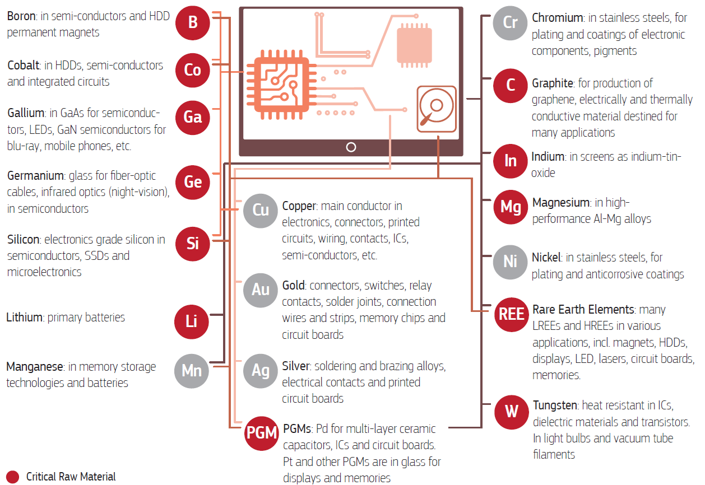
[Modern ICT devices require many materials and elements.](https://ec.europa.eu/docsroom/documents/42881/attachments/1/translations/en/renditions/native)

## Will recycling save us?
Well, no problem. Sure, we need all these materials, but then we make sure that, at end of life, we collect all these devices and recycle the materials for use in new devices. But [how much of each material in an ICT device are we currently recycling](https://link.springer.com/chapter/10.1007/978-3-319-09228-7_12)?

- Iron (used both in small-scale electronics and as a structural element in steel): 90%
- Aluminum (same as above): 85%
- Noble metals, silver, gold, and palladium: 80%
- Scarce metals: germanium, gallium, rare earth metals, tantalum: 1%
- Lithium, cobalt: 60-90%
- Plastics: unknown (!)

Let's split our discussion of recycling into three categories: the recycling of metals used in ICT devices, the recycling of plastics, and the recycling of batteries separately. 

### 1. Metal recycling
[Some metals are recovered better than others](https://link.springer.com/chapter/10.1007/978-3-319-09228-7_12). When it comes to steel or aluminum frames, screws, or other components that can be easily disassembled, these components can be easily reused or recycled, with recycled iron and aluminum being quite useful. In fact, most aluminum in use today is recycled. Other metals, such as tin, gold, and silver, are frequently recycled due to their high economic value. 

However, yet more elements, like tantalum, germanium, gallium, and indium, [are not recycled at all](https://link.springer.com/chapter/10.1007/978-3-319-09228-7_12 ). This is, on one hand, because the increasing miniaturization and complexity of electronics makes it harder and harder to disassemble components. On the other hand, recovery rates for some metals cannot be increased considerably due to the thermodynamic limits of the metallurgic processes of metal refining.

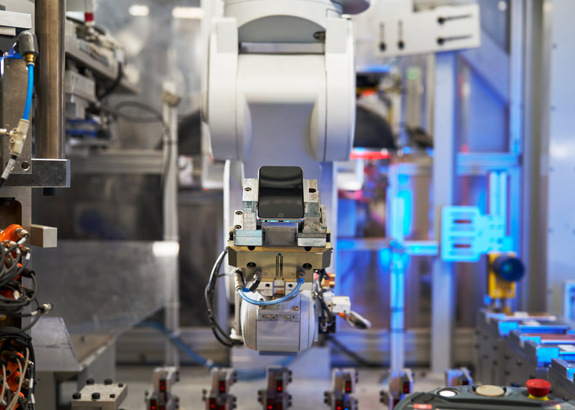
[Apple claims to be recycling a significant part of iPhone components.](https://www.apple.com/newsroom/2023/04/apple-will-use-100-percent-recycled-cobalt-in-batteries-by-2025/)

### 2. Plastics recycling
Plastics recycling is a very bad idea. Plastics are petrochemicals, and are currently [99% produced from fossil fuels](https://climateintegrity.org/uploads/media/Fraud-of-Plastic-Recycling-2024.pdf). The vast majority of plastics [cannot](https://climateintegrity.org/uploads/media/Fraud-of-Plastic-Recycling-2024.pdf) be recycled. Even for those who have the capability of being recycled, recycling has a multitude of obstacles, from the difficulty of sorting and separating the more than a thousand types of plastic (as well as additives and colorants!), to the high energy requirements, as well as unavoidable chemical degradation and high costs of the process. 

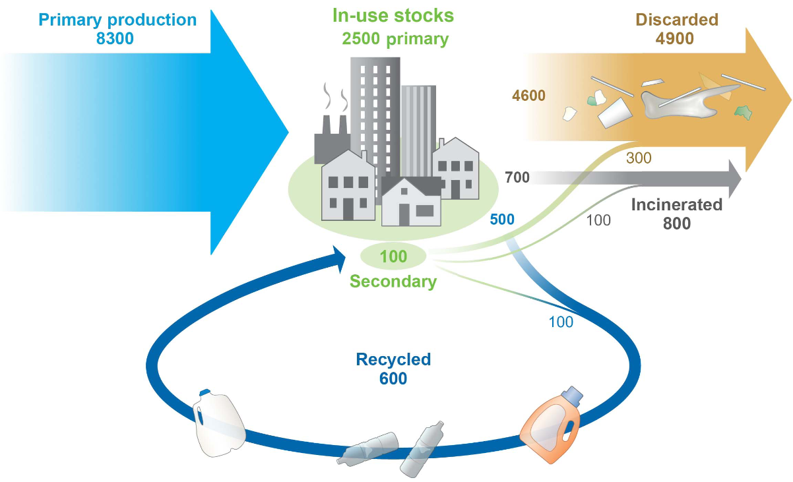
[Only a few plastics are recycled, and usually no more than once.](https://www.science.org/doi/10.1126/sciadv.1700782)

### 3. Battery recycling
Here we have some better news. The exponential rise in battery demand for applications such as electric vehicles has put strain on markets, forcing them to innovate [specific battery recycling methods](https://rmi.org/insight/the-battery-mineral-loop) that allow for up to [85-95% of minerals to be recovered](https://www.aquametals.com/). The global collection rate is estimated to be at or above 60%, with novel [direct recycling methods](https://pnecycle.com/) being developed as we speak. The primary motivation for this is that raw materials like lithium, cobalt, and nickel are expensive and their sourcing is embroiled in conflict and environmental degradation. It can be optimistically expected that this will drive both collection and mineral recovery rates up, making our job a little bit easier.

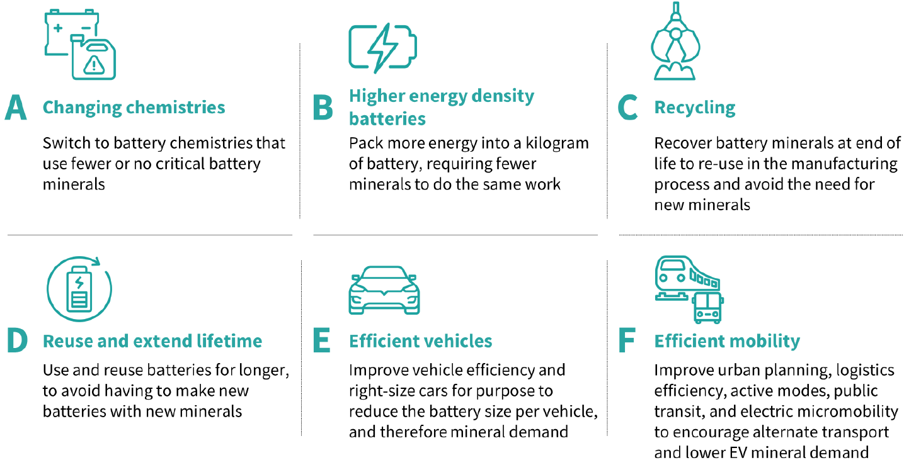
[A lot of work has been put into developing strategies to maximize our use of batteries.](https://rmi.org/insight/the-battery-mineral-loop)

Overall, it seems like recycling is a useful and necessary part of the solution. However, it is in no way sufficient. Unfortunately, we can't just design our ICT systems however we want and hope that someone is going to break them down and recycle the components afterwards. Even when it comes to products with established or newly developed recycling capabilities, such as metal frames or batteries, one less gram of product to be recycled means less energy required, and therefore more energy that can be put to good use decarbonizing the rest of the economy. And when it comes to little-recycled or practically unrecyclable materials, avoiding use means less environmentally-damaging production and fewer potentially toxic substances going to incineration or landfill. So, our job is set out for us. How do we design sustainable electronics?

# Designing sustainable electronics
As we discussed back in Lecture 2, we aim to design ICT systems that have minimal environmental impact. If we apply this principle to electronics, it means that we aim to design electronics that decrease the absolute level of resource and energy demand from their production and use. What [design principles](https://doi.org/10.1109/EGG.2016.7829823) should we apply?

1. Design for minimal material/energy footprint: [ensuring that devices are just as powerful and complex as the task they will perform requires](http://dx.doi.org/10.1007/s12243-022-00914-x) is key. Maximum use of recycled material should be made where possible, and smart use of designs should be made to reduce the amount of components required for each task. If batteries, screens, or memory are not required, then why put it in? Reducing the amount of materials in a device will most likely make it cheaper, though, and we might be inviting rebound effects!
2. Design for elimination of harmful substances: if substitutes can be found, then toxic substances should not be used.
3. Design for repairability: demand for new devices [can be reduced by enabling longer lifetimes](https://digitalization-for-sustainability.com/digital-reset/). Standardized components (for example, fasteners or connectors) allow for easier repairs. Historically, most electronics used to be repairable and modular; for example, the [original Macintosh](https://www.cultofmac.com/news/cult-mac-ifixit-teardown-original-macintosh-128k-feature) could be disassembled and its parts replaced one by one quite easily. However, modern electronics tend to include strong adhesives, non-replaceable batteries, proprietary screws, and hard-to-open outer cases.
4. Design for upgradability: same as for repairability, [modular devices allow users to switch one component for the other](https://www.repair.org/standards), and upgrade their devices with different components as desired. This ensures that devices can match demand for computing power for a longer period.
5. Design for recycling: the use of modular components and fasteners instead of adhesives allows [effective end-of-life treatment](http://dx.doi.org/10.1007/s12243-022-00914-x), as each component can be detached, sorted, and recycled separately. 

Let's take a look at a few examples of how these principles are applied in practice.

## Apple's AirPods
We start with the [AirPods](https://doi-org.tudelft.idm.oclc.org/10.1177/25148486221076136), which are true wireless Bluetooth headphones. These devices contain speakers that allow users to listen to digital audio, built-in microphones for communication, and accelerometers and optical sensors to detect in-ear placement and finger taps.

Headphones are [transducers](https://en.wikipedia.org/wiki/Transducer): devices that convert electrical signals into sound waves. To do this, they [incorporate](https://doi-org.tudelft.idm.oclc.org/10.1177/25148486221076136) a diaphragm, a highly-purified copper voice coil, and neodymium permanent magnets. The W1 or H1 processor is manufactured out of highly-purified silicon, same as the Bosch inertial measurement unit that provides motion data for spatial audio. The capacitors on the circuit boards are made out of tantalum, and the pins connecting the chips to the plastic or polyimide film circuit boards are made out of gold. The external casing is made out of acrylonitrile butadiene styrene, while the tips are made out of silicone plastic.

The AirPods are powered by a rechargeable lithium-ion battery. With every charge-discharge cycle, this battery's total capacity [decreases](https://en.wikipedia.org/wiki/Electric_battery#Lifespan_and_endurance). For such devices, [significant degradation happens](https://doi-org.tudelft.idm.oclc.org/10.1177/25148486221076136) between eighteen months and two years, and soon after the battery is incapable of providing enough energy to cover a day's - or sometimes, even an hour's - use. This is especially important given that AirPods are impossible to repair: you cannot access components without cutting apart and effectively destroying the external casing (iFixit gave AirPods a [repairability score of 0 out of 10](https://www.ifixit.com/Teardown/AirPods+Teardown/75578#teardownConclusion)). Otherwise said, the lifespan of these headphones is entirely dependent on that of the batteries.

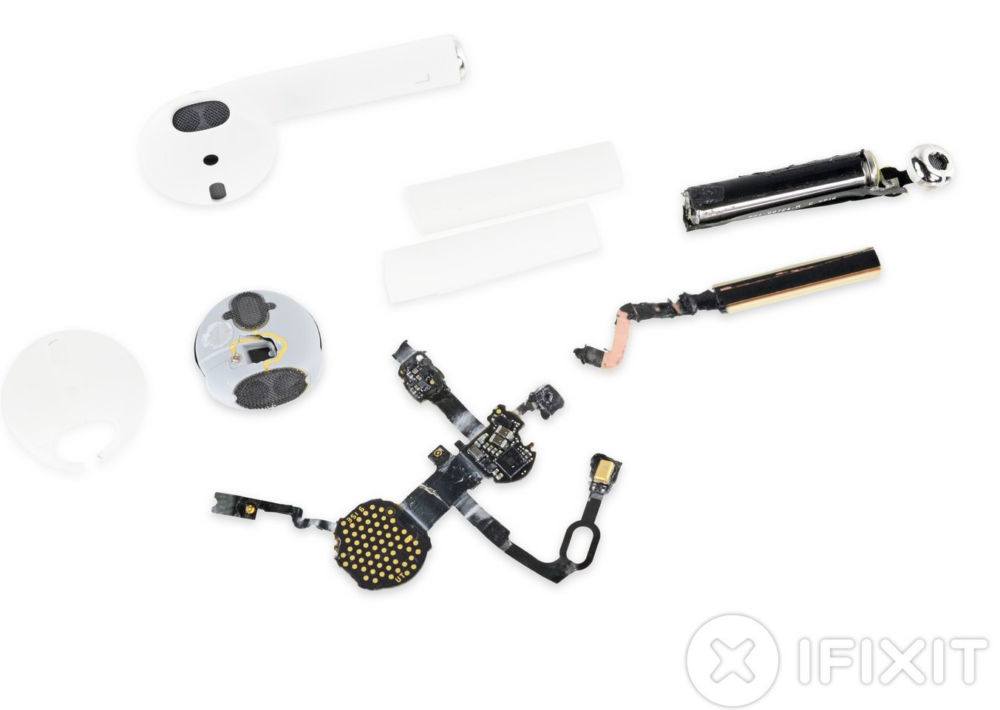
[Torn apart AirPods.](https://www.ifixit.com/Teardown/AirPods+Teardown/75578#teardownConclusion)

Needless to say, AirPods are neither designed for repairability nor recyclability. This means that, once your pair is out, you need to buy another one and another one and so on. If we want sustainable electronics, we need to look somewhere else.

## The Fairphone
Let's try again. Hopefully, everyone here has heard about Fairphone, a Dutch ICT device manufacturer which aims to make their products more environmentally and socially sustainable. The main attraction of their eponymous Fairphone is the [modular design](https://www.fairphone.com/en/impact/long-lasting-design/): users can themselves swap parts like the battery, cameras, or display, as required. They offer a [catalog](https://shop.fairphone.com/spare-parts) of these spare parts that users can purchase separately.

[Beyond repairability](https://www.fairphone.com/en/impact/circularity/), the designers try to make maximum use of recycled materials when designing components, and the company has designed programs to repurpose older Fairphone models for parallel computing in universities. 

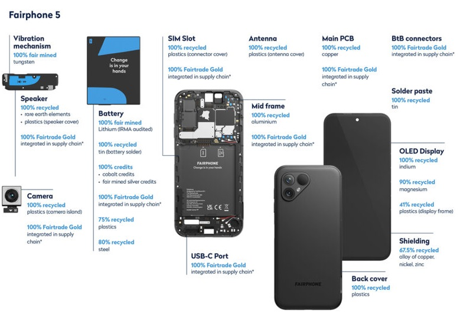
[Use of 'fairly sourced' and recycled materials in the Fairphone 5 component supply chain.](https://www.fairphone.com/en/impact/circularity/)

## The Framework Laptop
[Framework](https://frame.work/nl/en/about) is a start-up that sells a range of personal computers, from lightweight laptops to a desktop. Quoting directly from their website, their philosophy is that 'by making well-considered design tradeoffs and trusting customers and repair shops with the access and information they need, they can make fantastic devices that are still easy to repair'. 

The [modular design](https://frame.work/sustainability) of their devices allows users to perform repairs, or switch out components for others, extending the usable lifetime of the device. Framework laptop casings are secured with captive fasteners, with the design for each consecutive laptop being kept compatible with the previous ones, allowing for users to upgrade as desired. Like Fairphone, Framework also sells replacement parts on their website.

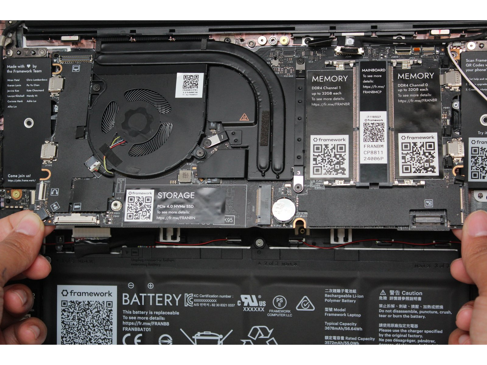
[Replacing the mainboard of a Framework laptop.](https://guides.frame.work/Guide/Mainboard+Replacement+Guide/79)

Another interesting design choice was the [design of the mainboard as a standalone module](https://frame.work/nl/en/blog/mainboard-availability-and-open-source-release), which can itself be swapped out with a different version. Even so, the old mainboard can be coupled with memory and a USB-C power adapter to be used as a separate single-board computer. The company released a GitHub repository of CAD and electrical documentation under an open-source Creative Commons license to support hobby projects that use the mainboard.

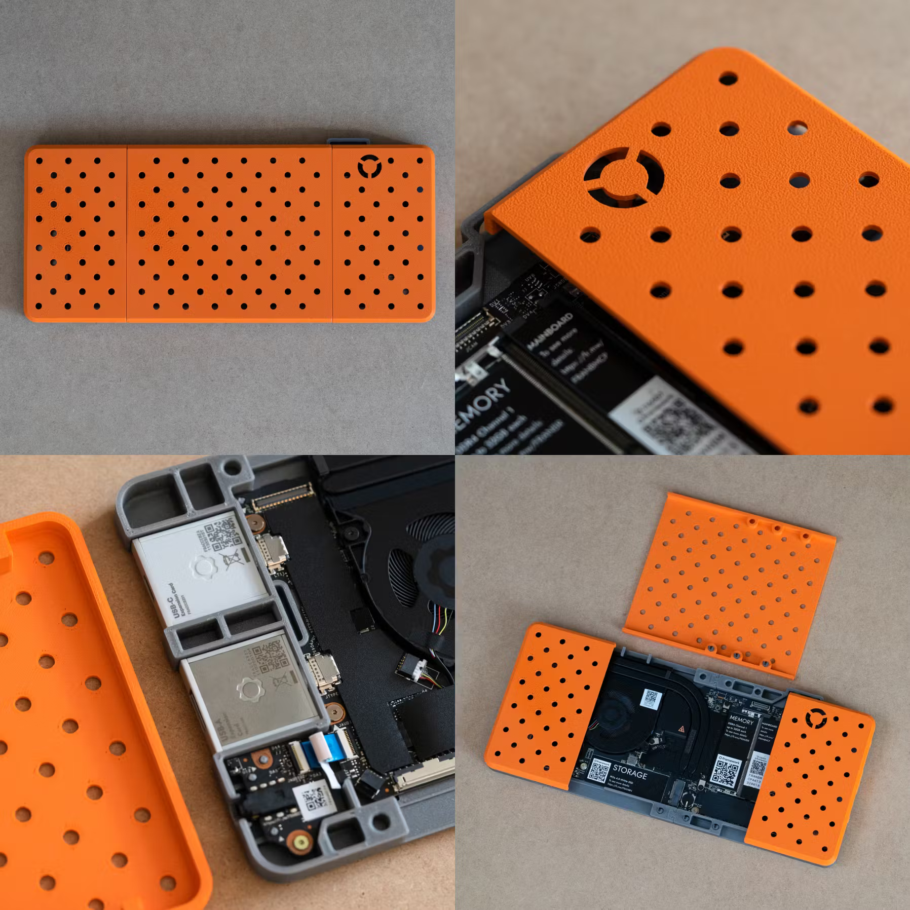
[A Framework mainboard used as a single-board computer with a 3D-printed case.](https://frame.work/nl/en/blog/mainboard-availability-and-open-source-release)

We've now gone through a few examples of electronics, and what makes them sustainable or unsustainable. More material on sustainable electronics design is only available in the slides during this iteration of the course.

# Digital product passports
If there's anything to remember from the previous lectures, it's that if we are to think about sustainability we need to go beyond just design. Of course, an energetically and materially efficient device is good, but if users throw it away after a few scratches, we haven't really solved the problem. Therefore, we need to think about how to manage electronic devices throughout their entire lifetime.

One solution the European Commission has thought up is the [digital product passport](https://data.europa.eu/en/news-events/news/eus-digital-product-passport-advancing-transparency-and-sustainability) (DPP): a digital document to contain information on the composition, origin, and environmental impact of each device. This means having an overview of the materials inside, the energy consumption, and a memory of the processes applied to it, such as refurbishing or repairs. [Within the EU](https://data.europa.eu/en/news-events/news/eus-digital-product-passport-advancing-transparency-and-sustainability), this would mean that products like textiles, batteries, and electronics would require a DPP to be sold.

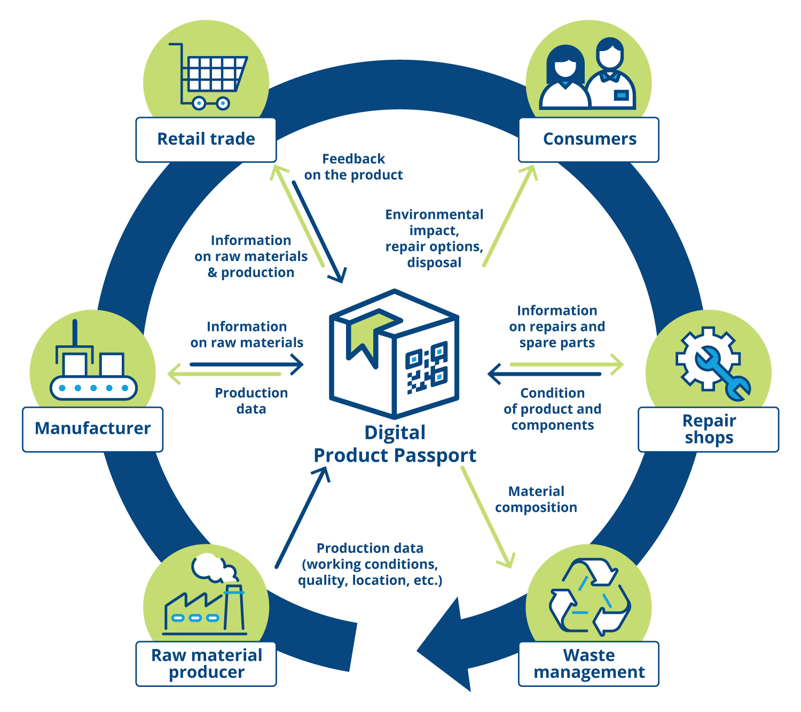
[Typical information in a DPP.](https://soffico.de/en/digital-product-passport/)

There are many research and pilot projects under development. Some projects focus on implementing a DPP for a [certain industry](https://youtu.be/JlFgRKSF2R4) (e.g. processed aluminum), while others develop [data frameworks](https://liusemweb.github.io/DPPO/ontology/dpp-core/0.1/index.html). But the basic idea is that data is added to the DPP throughout the lifecycle of the product. The economic operator that puts a product on the market creates a DPP; data on usage, repair, and recycling is added, until the end of the product's life, when the DPP is destroyed. As a [product information system](https://youtu.be/-aXMlWnGve8), the DPP needs to have a data carrier (like an RFID tag), a place where its data can be stored, and an identifier/resolver/connector between the two.

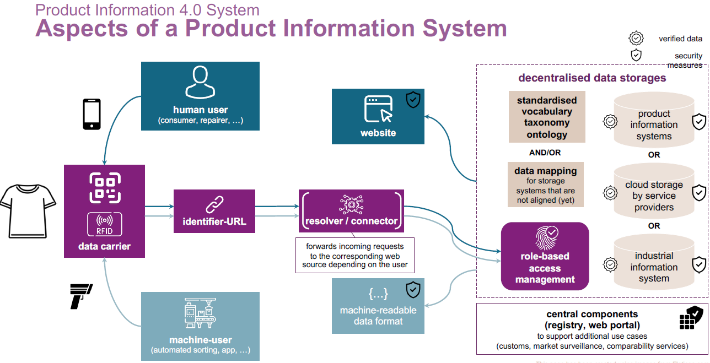
[A DPP can be understood as a product information system.](https://youtu.be/-aXMlWnGve8)

What is particularly important when developing a DPP for electronics is that data needs to be [FAIR (findable, accessible, interoperable, and reusable)](https://journals.sagepub.com/doi/10.1177/22104968251361274), but is usually kept separate in various formats because each company follows its own standard. For this reason, some projects try to structure the data into a format that both human procurement experts and machines performing diagnostics can understand. [RePlanIT](https://kind.io.tudelft.nl/replanit/docs/) is one such project, during which researchers from TU Delft developed a DPP framework based on ontologies and knowledge graphs. ICT device properties are presented as classes: hardware components, sensors, materials, and circular strategies. 

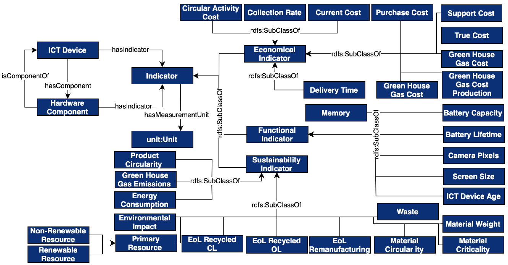
[Classes, subclasses, and indicators that contain data about a laptop within the RePlanIT framework.](https://journals.sagepub.com/doi/10.1177/22104968251361274)

While all this sounds nice on paper, there are a lot of questions about DPPs floating around. Firstly, despite all the effort so far, there are [very few real applications of DPPs in industry](https://cirpass2.eu/lighthouse-pilots/). Secondly, making sure that each product has its own individual data retained would require very large amounts of storage, so researchers are questioning whether this data should be [centralized or decentralized](https://youtu.be/-aXMlWnGve8). Some are even suggesting that we use the distributed ledger technology ([blockchain](https://youtu.be/ZQHk-BoK0zM)). Finally, the underlying assumption of the DPP is that providing better information to companies allows them to make better decisions about how they reduce their emissions and e-waste. But is this really going to happen?

# Feedback
We are happy to receive any feedback you may have on this lecture. Is there too much information in the slides/notes, or would you like to know more about a certain topic? Please let us know by [**filling in this form**](https://forms.cloud.microsoft/e/z0RAAw1Ld5).

# Further reading
Want to know more about the topics in this lecture? Here are some sources that didn't quite make the cut.

## Recycling
- [SCRREEN](https://scrreen.eu/results/)(Solutions for CRitical Raw materials): a European Union project that maps critical raw materials resources, estimates expected demand, and provides recommendations for improvement.
- [INCREACE](https://increace-project.eu/): a European Union project aiming to increase plastics recycling yields in Europe and prove that recycled polymers can be used in challenging applications such as food contact, medical equipment, and electronics.
- [Technical, economic, and environmental comparison of closed-loop recycling technologies for common plastics](https://pubs-acs-org.tudelft.idm.oclc.org/doi/10.1021/acssuschemeng.2c05497): a paper that quantitatively studies plastic recycling methods.

## Designing sustainable electronics
- [Circular Electronics Design Guide](https://cep2030.org/resources/circular-electronics-design-guide/): an in-depth resource on designing business models for circular electronics, but also implementing techniques for sustainable design.
