`Version: 1.0`
`Contributors: Alex Nedelcu`
`Publication date: 31.08.2026`

# Why do we need data storage?
Since the creation of the internet, humanity has been creating exponentially increasing amounts of data. Just in 2018, it is estimated that we created [59 zettabytes](https://theconversation.com/the-worlds-data-explained-how-much-were-producing-and-where-its-all-stored-159964) (1 ZB = $10^{21}$ bytes) worth of text, images, audio, and video among others. And in 2022, we [collectively](https://www.domo.com/data-never-sleeps) made 5.9 million Google searches, sent 16 million text messages, and viewed 1 million hours of streaming video - and made 1.1 million swipes on Tinder. But compared to the future, we're small fry: according to various [estimates](https://theconversation.com/the-worlds-data-explained-how-much-were-producing-and-where-its-all-stored-159964), hundreds of ZB of data will be created each year by 2030.

Data traffic has also been increasing enormously: between 2021 and 2022, traffic volume [grew by 23%](https://www.sandvine.com/hubfs/Sandvine_Redesign_2019/Downloads/2023/reports/Sandvine%20GIPR%202023.pdf). This growth has occurred both in fixed and in mobile connections. But not everyone uses the same amount of data. Indeed, most users only transfer small amounts of data. But a small subset of global power users ([8% of subscribers](https://www.sandvine.com/hubfs/Sandvine_Redesign_2019/Downloads/2023/reports/Sandvine%20GIPR%202023.pdf) to a data connection) are responsible for more than half of the total volume.

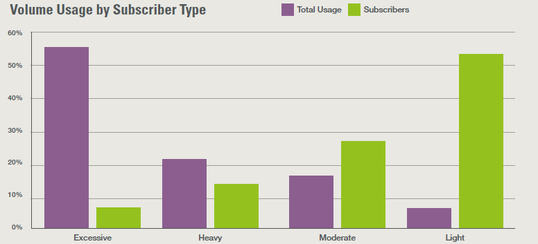
[More than three quarters of data transfer volumes are used by heavy and excessive users.](https://baxtel.com/news/skybox-datacenters-finishes-construction-on-illinois-data-center)

All over the world, more data is being created than ever. And as a consequence, more data storage capacity needs to be installed each year. Let's take a look at a few of the drivers of this growth.

## Drivers: consumer data
One of the corollaries of the exponential growth in use of social media by consumers is the increase in data being created by consumers. Both in the United States and in the European Union, an overwhelming majority of adults are social media users. US citizens tend to be a bit [more online](https://www.pewresearch.org/internet/2025/11/20/americans-social-media-use-2025/): 84% of US adults use YouTube, while 71% use Facebook. In contrast, the EU does show some [inter-country differences](https://ec.europa.eu/eurostat/web/products-eurostat-news/w/ddn-20260409-1) with 81.6% of Maltese adults being social media users compared to only 61.5% of Croatians. Importantly, these statistics are converging when it comes to younger generations: [80% of US adults below 30](https://www.pewresearch.org/internet/2025/11/20/americans-social-media-use-2025/) use Instagram, while [89.3% of EU youths](https://ec.europa.eu/eurostat/web/products-eurostat-news/w/ddn-20260409-1) use social media.

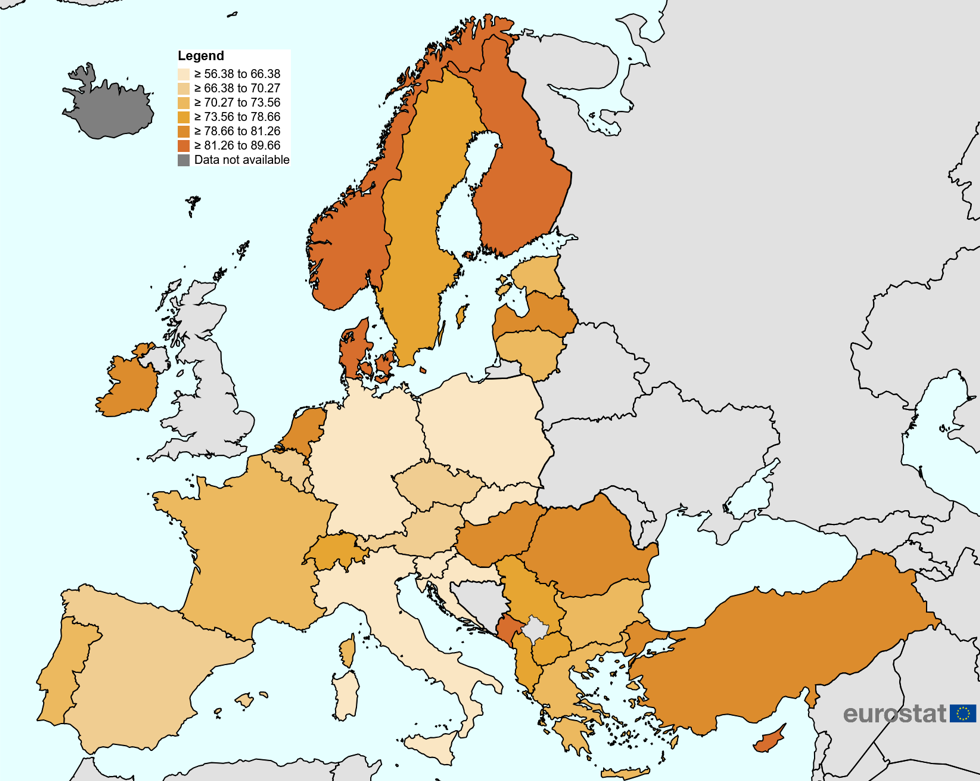
[Eurostat data on percentage of citizens using social networks in each European country.](https://ec.europa.eu/eurostat/databrowser/view/isoc_ci_ac_i__custom_11248092/bookmark/map?lang=en&bookmarkId=a042d15b-3cfe-4560-adcf-21ca4a1d7121&c=1774522611000)

Another part of the world with enormous numbers of social media users is East Asia, where local platforms tend to dominate the conversation. These apps are typically multifunctional: communication, marketplace, and social media all in one. For example, Japan's Naver LINE is used by [85.3% of the adult population](https://www.goethe.de/ins/jp/en/kul/dis/fac/dps.html), while South Korea's Kakao Talk has [47.9 million users](https://www.goethe.de/ins/jp/en/kul/dis/fac/dps.html) (amounting to 94% of smartphone owners). And of course, China's [enormous platforms](https://doi.org/10.1016/j.telpol.2025.103002) like WeChat and Douyin are used by 87.3% and 78.4% of their population respectively. 

## Drivers: data retention
Various economic actors are required by law to store data. For example, despite the European Court of Justice [invalidating](https://ilplab.nl/2020/10/14/ilp-lab-together-with-edri-concludes-data-retention-is-still-invalid/) a 2006 EU directive on data retention because it did not follow the principle of proportionality, EU governments still [require](https://privacyinternational.org/sites/default/files/2024-04/PI%20Briefing%20National%20data%20retention%20laws%202023.pdf) telecom providers to store communications metadata for years. Even if a conversation is encrypted, metadata such as when and between whom it occurs can be sensitive information. For this reason, the right of governments to access this data without good reasons has been the object of a complex [privacy battleground](https://doi-org.tudelft.idm.oclc.org/10.1016/j.telpol.2023.102542) in the past few decades.

Businesses and government institutions are also legally obliged to store data about their activities. For example, the Dutch tax authority [demands](https://www.archiefkluis.nl/en/knowledge-centre/retention-obligation-and-retention-periods/) that private actors store basic data, such as ledgers, accounts, and payrolls for 7 years, and data related to physical assets for 10 years. Additionally, according to the EU [General Data Protection Regulation](https://www.autoriteitpersoonsgegevens.nl/en/themes/basic-gdpr/privacy-and-personal-data/retention-of-personal-data), businesses may only store personal data for 'as long as required' (which the business itself defines!), and are then required to verifiably destroy it. To store all this data, very large physical and digital archives are required.

## Drivers: artificial intelligence
Beyond the direct impacts of artificial intelligence, which we discuss in Lecture 4, another less explored aspect of the AI boom is the massive quantities of data involved in training and inference. Even though different methods require different data types, all data goes through the [steps](https://omdia.tech.informa.com/blogs/2025/sep/the-storage-that-feeds-ai-training-and-modeling-for-high-impact-ai) of collection, cleaning, labeling, normalization, and tokenization. And even during training, more storage is required to save the state of the training job between expected failures (checkpointing). For example, the [MLPerf Storage benchmark](https://mlcommons.org/2025/08/storage-2-checkpointing/) used to evaluate storage systems for AI workloads includes a 'small' 8-billion-parameter model with a checkpoint size of 105 GB!

The same concern applies to AI inference, during which large quantities of intermediate runtime data need to be stored. As the context size for frontier models increases, RAM and GPU memory become insufficient to store the resulting data and processing time increases quadratically with prompt length. To handle this limitation, the data cache is [offloaded](https://research.ibm.com/blog/accelerating-ai-inference-with-ibm-storage-scale) to local storage and recalled when required. Due to the burstiness of these operations, especially high bandwidth and low latency access to the cache is required.

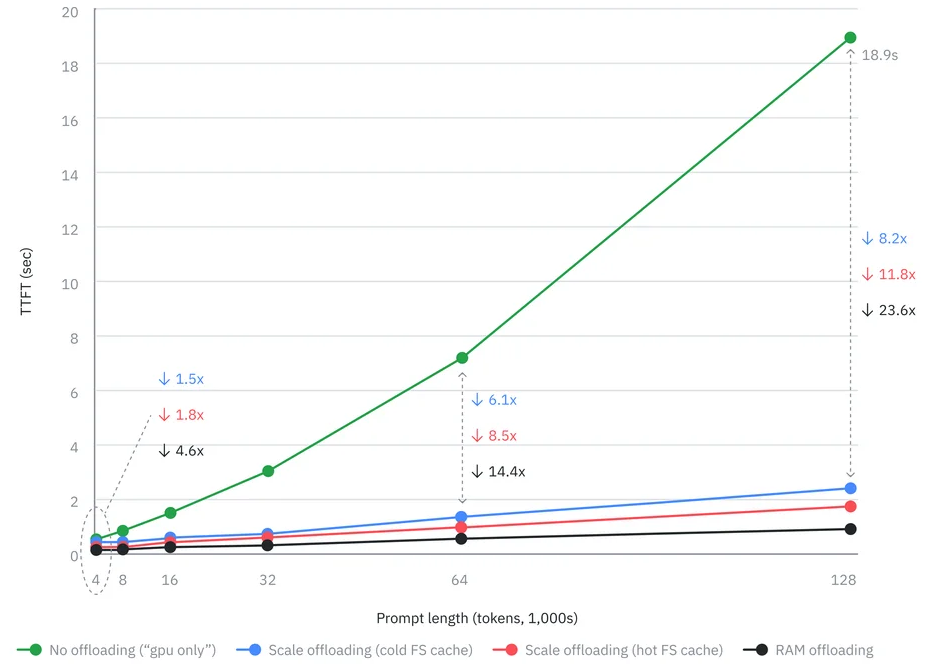
[Without data offloading, processing time increases by up to 24 times for long prompts.](https://research.ibm.com/blog/accelerating-ai-inference-with-ibm-storage-scale)

All this data needs to be stored [somewhere](https://theconversation.com/the-worlds-data-explained-how-much-were-producing-and-where-its-all-stored-159964), either on endpoints (on-device memory), on the edge (institutional  and office servers) or in the core (cloud data centers operated by providers like AWS, Microsoft Azure, and Google Cloud). Data can be [classified](https://www.hpe.com/psnow/downloadDoc/Storage%20Management%20in%20an%20Age%20of%20Minimal%20Data%20Deletion-a00144917enw.pdf?id=a00144917enw&isFutureVersion=true&ver=1&form=false&preview=false&hf=regular&isLinearized=false&contentDisposition=attachment) by how often it needs to be accessed: hot data (nano- to milliseconds), warm data (milliseconds to seconds), cool data (minutes to a day), cold data (days to weeks), and frozen data (weeks to years). Across all these categories, the total amount of data that needs to be stored is projected to grow and grow.

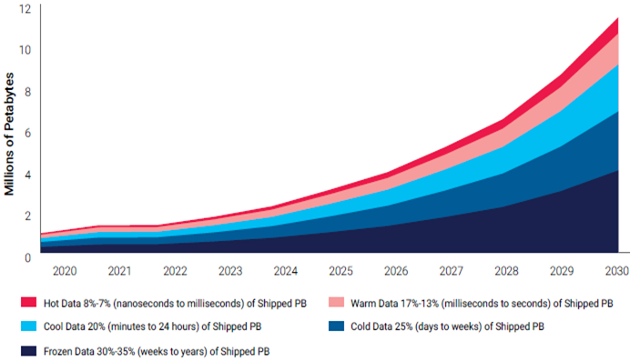
[Now and in the future, a large part of stored data remains frozen: never to be accessed again.](https://www.hpe.com/psnow/downloadDoc/Storage%20Management%20in%20an%20Age%20of%20Minimal%20Data%20Deletion-a00144917enw.pdf?id=a00144917enw&isFutureVersion=true&ver=1&form=false&preview=false&hf=regular&isLinearized=false&contentDisposition=attachment)

# Data storage technologies
Now that we've gained a better understanding of the need for data storage, it is time to investigate how it is actually stored. Historically, [some of the first technologies](https://www.dataversity.net/articles/brief-history-data-storage/) used to store computer data were punch cards and vacuum tubes. To represent 'computer programs' as series of on/off switches, these used punched holes in a piece of paper and cathode-ray tubes respectively. Over the past 80 years, bandwidth and storage capacity have increased [continuously](https://doi.org/10.1016/B978-0-12-420158-3.00017-4) through the invention of magnetic tape, optical discs, hard drive disks, and eventually flash memory.

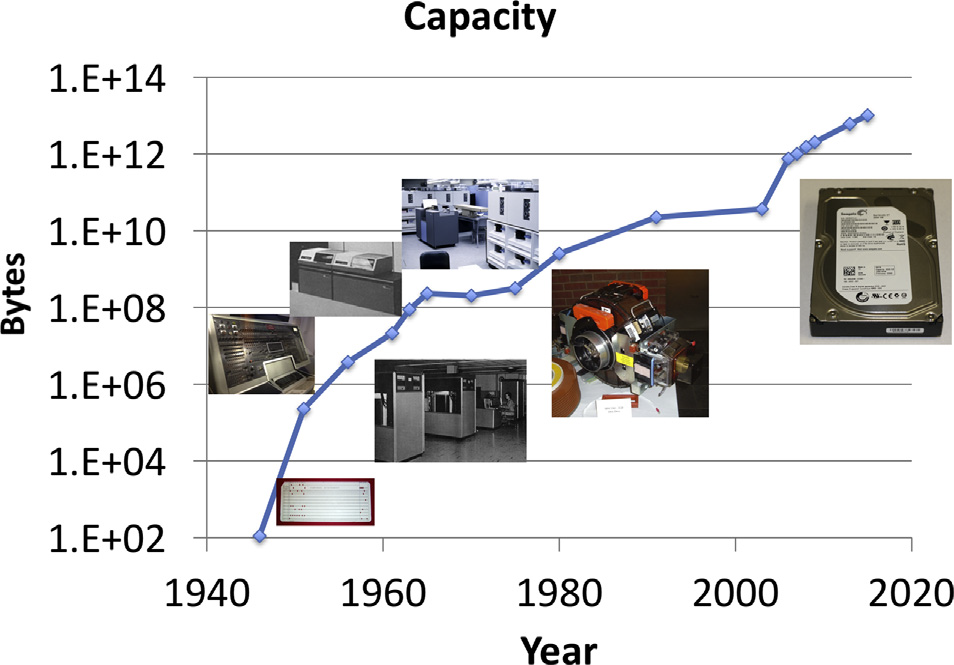
[Even when considering changes in the form factor of storage technologies, their storage capacity has increased by several orders of magnitude.](https://doi.org/10.1016/B978-0-12-420158-3.00017-4)

## Magnetic tape
Yes, despite its age, magnetic tape is still a modern data storage technology, very frequently used in archival storage. To write information into the tape, a transducer [induces a pattern of positive and negative magnetization](https://doi.org/10.1145/3708997) into the magnetizable coating of the tape reel. The longitudinal distance between regions of alternating magnetization direction is where information is encoded. Then, to read information from the tape, the reel is fed into a magnetic field sensor, which produces a pattern of voltage pulses used to reconstruct the original sequence of bits. Modern tape media compress four bands of information [in parallel](https://doi.org/10.1016/B978-0-12-420158-3.00017-4) on the same reel.

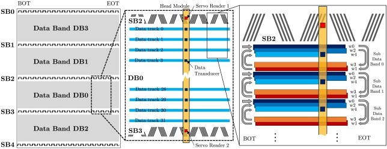
[Four times the amount of information can be stored on the same reel by placing the data bands in parallel.](https://doi.org/10.1145/3708997)

Modern tape is made in the linear tape open (LTO) format; the latest generation is [LTO-10](https://www.lto.org/lto-10/) and further generations are currently under development. The plastic (PET, aramid) tape reel is stored in a cartridge, with modern archives containing [hundreds to thousands of cartridges](https://doi.org/10.1145/3708997). A robotic arm or shuttle physically removes the cartridge from the archive and places it into the tape drive, where the reel is spooled up and read in a sequential manner.

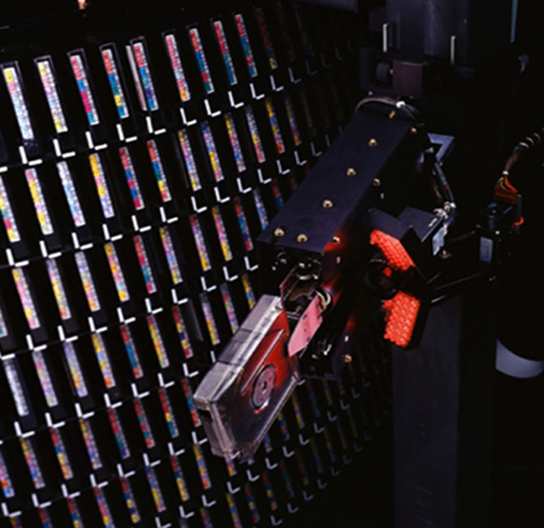
[Robot arms grab individual tape cartridges and place them inside tape drives so that the data inside can be accessed. Yes, it's an old picture.](https://doi.org/10.1145/3708997](https://www.cs.auckland.ac.nz/historydisplays/FifthFloor/MagneticDataStorage/MagneticTapes.php))

Tape storage has been widely used in write-once, read-many (WORM) storage due to its [various advantages](https://doi.org/10.1145/3708997). It can fit a lot of data into a cartridge (high volume density), it only consumes energy when accessed (except for some negligible cooling), and it has a high data rate. However, it also features very high latency compared to the other technologies in this lecture, due to its [sequential nature](https://doi.org/10.1016/B978-0-12-420158-3.00017-4) and need for physical access. Of course, this physical 'air-gapping' also makes it inherently safer than other digital forms of storage. These properties make it a good choice for storage payloads that do not require frequent access and are not latency-sensitive, like archival storage.

## Optical discs
Another technology that you have probably already been acquainted with is optical storage, with its best known representative being the [compact disc](https://doi.org/10.1016/B978-0-12-420158-3.00017-4) (CD). In CDs, data is encoded within a very thin layer of elongated spiral grooves which are then covered by a reflective metal layer. To recover this information, an infrared laser beam is passed over the grooves and the returning output is transformed by an optical sensor into electrical signals. 

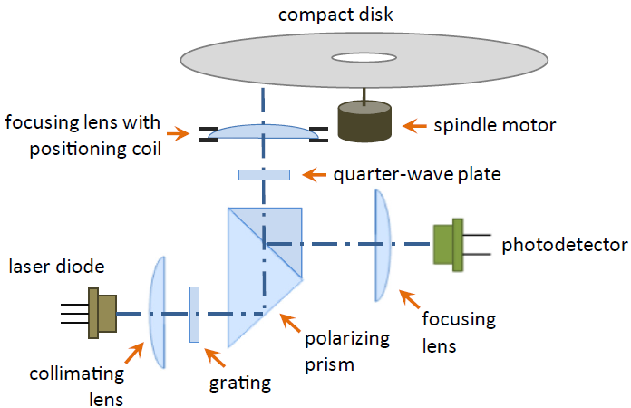
[An infrared laser is used to read data from the spiral grooves on the spinning disc.](https://doi.org/10.1016/B978-0-12-420158-3.00017-4)

The original form factor of the CD-ROM could fit approximately 700 MB of data on one side, and its content was fixed once it was written. Further [development](https://doi.org/10.1016/B978-0-12-420158-3.00017-4) of the technology led to the advent of the CD-R (recordable), which could be burned once, and the CD-RW (rewritable), whose grooves were covered by a phase-change layer; this allowed the content to be rewritten several times. 

Due to the increasing size of audiovisual media like films, the storage capacity of CDs became a limitation on the available resolution, leading to [continued improvements](https://doi.org/10.1016/B978-0-12-420158-3.00017-4). By increasing the density of the grooves and using a smaller wavelength laser to read them, more data could be fit into the same form factor. This led to development of the DVD and of Blu-ray, with a maximum capacity of 128 GB for the largest Blu-ray discs.

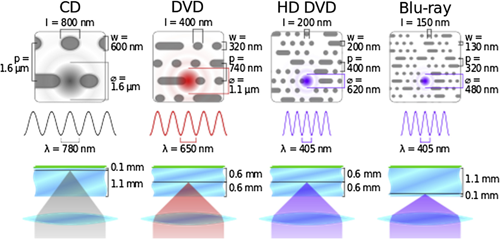
[Later generations of optical media, such as DVD and Blu-ray, have denser groove patterns that can store more data.](https://doi.org/10.1016/B978-0-12-420158-3.00017-4)

## HDDs
In a [hard drive disk](https://doi.org/10.1016/B978-0-12-420158-3.00017-4) (HDD), information is recorded on a vertical stack of platters. These thin glass discs are covered with a special layer of minerals, resulting in a crystallographic structure that allows them to maintain their magnetization even in the presence of an external magnetic fields. The platters are stacked on a spindle and rotate at several thousand rotations per minute thanks to a direct-drive brushless motor. To read and write information, an actuator arm with one read-write head per platter passes over the various data tracks. Information is written to the surface of the platter by changing the magnetization of a sector of the surface layer, and then read by transforming its magnetic field into a voltage pulse. 

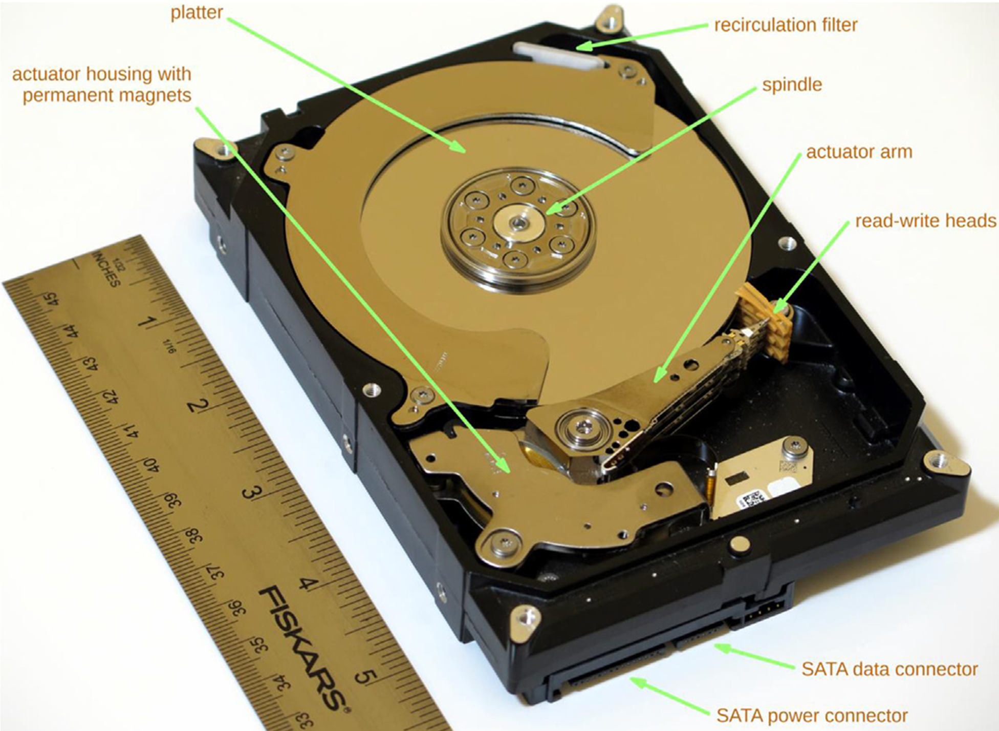
[HDDs contain minuscule, precisely manufactured components in a standard form factor.](https://doi.org/10.1016/B978-0-12-420158-3.00017-4)

The performance of a given HDD is represented by its [latency](https://doi.org/10.1016/B978-0-12-420158-3.00017-4), or how fast a certain piece of data can be accessed. On one hand, it depends on the seek time: the duration taken by the read-write head to move to a specific sector on the platter. The maximum possible seek time is the full-stroke latency (the time to travel from the innermost to the outermost track). On the other hand, it also depends on the rotational latency (the time needed to position a given sector under the read-write head), which is a function of the RPM rating. The faster the platters spin, the faster the read-write head can reach and access the desired information.  

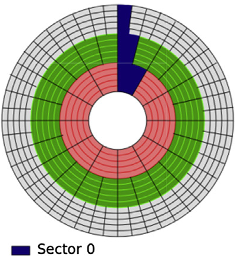
[The surface of each platter is subdivided into sectors. In modern HDDs, more sectors can be stored in the outer zones of the platter.](https://doi.org/10.1016/B978-0-12-420158-3.00017-4)

While it drives the performance rating of the device, this continuous rotation is also the [main determinant](https://dl.acm.org/doi/10.1145/3727200.3727211) of the HDD's energy consumption: you cannot access any data if the platters aren't spinning! This makes HDDs have some of the highest power draw of the modern storage technologies we discuss in this lecture. However, they also have the [highest volume density](https://doi.org/10.1016/B978-0-12-420158-3.00017-4, because of the very high areal density of individual platters (more than 800 Gbit per square inch). This means that cloud providers often rely on HDDs to efficiently store large payloads. While this may sound promising, the main problem plaguing HDDs is their relatively high latency (access time) and transfer rates (measured in input-output operations per second, or IOPS); the latter is limited to somewhere above 250MB/s.

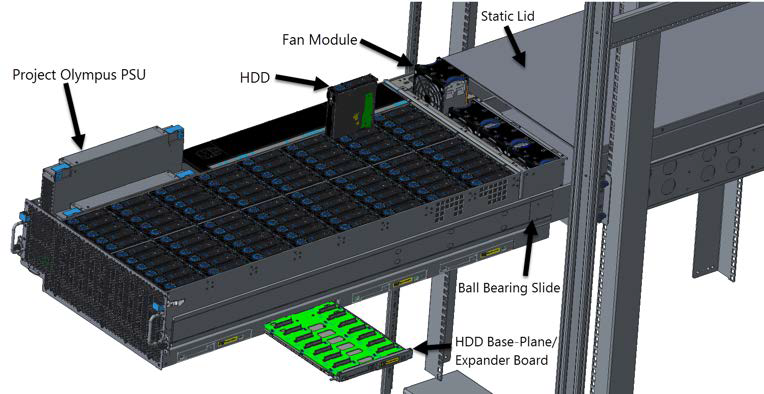
[One of Microsoft Azure's Project Olympus JBOD ('just a bunch of disks') blades contains up to 88 HDDs or 1.2 PB of storage.](https://dl.acm.org/doi/10.1145/3727200.3727211)

## Flash memory
Flash memory is the most important component in solid state drives (SSDs). As the name implies, these devices have no moving parts. Instead, data is stored as [electronic charges](https://doi-org.tudelft.idm.oclc.org/10.1109/MDAT.2025.3606412) inside transistor-based memory cells. To program the cell (write), an electron (negative charge) is injected into the floating gate attached to the transistor, raising its threshold voltage. Reading the data is then done by comparing the threshold voltage to a reference voltage. An empty cell conducts current (logic-1), while a programmed (full) cell does not conduct (logic-0).

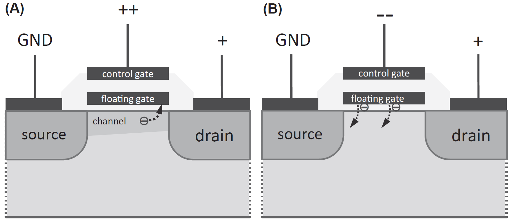
[The foundational unit of an SSD is the transistor-based memory cell, which sends out a voltage signal as a function of its programming.](https://doi.org/10.1016/B978-0-12-420158-3.00017-4)

Now, the memory cell is a neat little idea, but it can only store one or maybe a few bits. So we need a way to scale this up from a few nanometers to the size of a modern SSD. First, a set of memory cells is strung together in series, forming a NAND gate - this architecture also means that you can only write and erase a string of cells all together. Then, these NAND strings are laid together in parallel, resulting in 2D NAND memory. And finally, most manufacturers stacked these 2D memory sheets together, resulting in the 3D NAND memory [practically all SSDs contain](https://doi-org.tudelft.idm.oclc.org/10.1109/MSSC.2020.3021841).

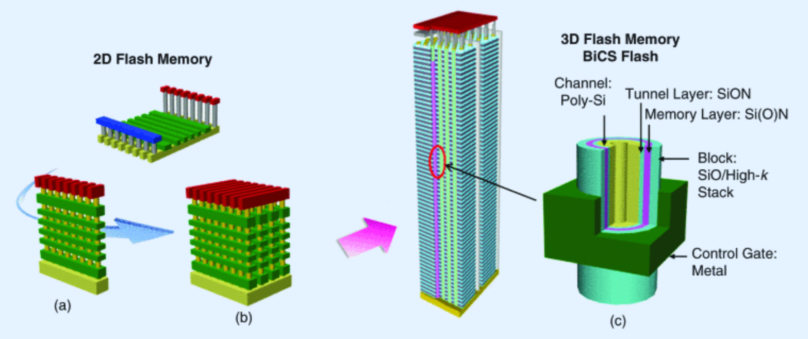
[To form 3D NAND memory, 2D strings are 'stood up' (a) and then 'multiplied' (b). Because the memory stack is three-dimensional, the memory cell can no longer be flat and is therefore developed as a cylinder.](https://doi-org.tudelft.idm.oclc.org/10.1109/MSSC.2020.3021841)

The organization of memory cells into blocks has provided immense benefits in terms of how many we can stack together. However, it also has a [disadvantage](https://doi-org.tudelft.idm.oclc.org/10.1109/MSSC.2020.3021841): operations at smaller scales are not possible; blocks are written or deleted together. This means that individual chips are quite slow, and a multi-chip SSD therefore requires controller logic and a data buffer to distribute workloads and degradation.

Another limitation of flash memory is that memory cells tend to develop [charge defects](https://doi-org.tudelft.idm.oclc.org/10.1109/MDAT.2025.3606412) after a large number of read/write operations, restricting the entire block's lifetime. As more and more read/write operations are performed, both the rate of bit errors (RBER) that need to be corrected and the reading latency increases. To measure an SSD's lifetime, manufacturers use the [terabytes written](https://doi.org/10.1016/B978-0-12-420158-3.00017-4) (TBW) metric, which describes the total volume of data the drive can handle over its lifetime.

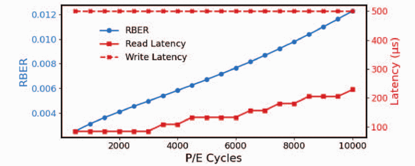
[As the number of program/erase cycles experienced by the SSD grows, its raw bit error rate and read latency increase.](https://ieeexplore.ieee.org/document/10682645)

Despite these disadvantages, SSDs are quickly becoming the dominant technology for general use-cases. Through multi-dimensional stacking and [bit packing](https://doi-org.tudelft.idm.oclc.org/10.1109/MSSC.2020.3021841) (fitting more than a single bit into a memory cell), they have achieved a respectable areal density. Furthermore, their lack of moving parts means that they consume significantly less energy than HDDs and are a bit [more power-proportional](https://dl.acm.org/doi/10.1145/3727200.3727211) (their power draw varies as a function of the operations being performed). Finally, their most important advantage is that they can handle [significantly more](https://doi.org/10.1016/B978-0-12-420158-3.00017-4) input/output operations per second than HDDs, and as such have higher bandwidth.

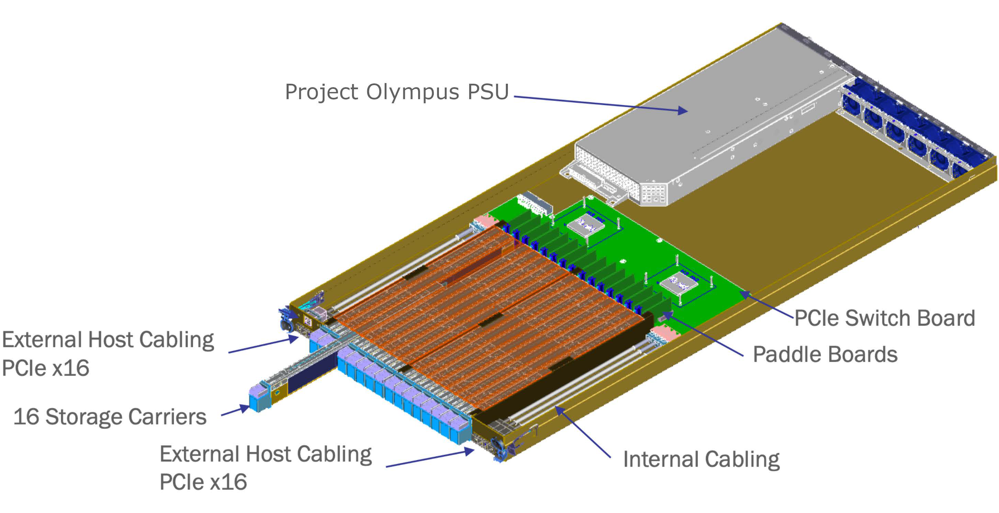
[One of Microsoft Azure's Project Olympus flash expansion blades contains 16 SSDs and therefore 128 TB of storage.](https://dl.acm.org/doi/10.1145/3727200.3727211)

Taken together, HDDs, SSDs, and sometimes magnetic tape are the hardware we are typically working with when designing a modern storage system. But a storage system is more than just hardware. To give you a complete picture, we will briefly illustrate the software used to bring these devices together into a functioning system.

# Data storage architectures
Storage architectures are how we organize physical storage devices. The most basic level is the way these are represented within an individual operating system: through ['block devices'](https://mylinux.work/guides/linux-storage-basics/) or disks. A disk can be divided into one or more partitions, which are accessed through a filesystem: an architecture for structuring data and controlling read/write operations. Typically, user-side visualization of the filesystem is done through the hierarchical file tree you are already used to.

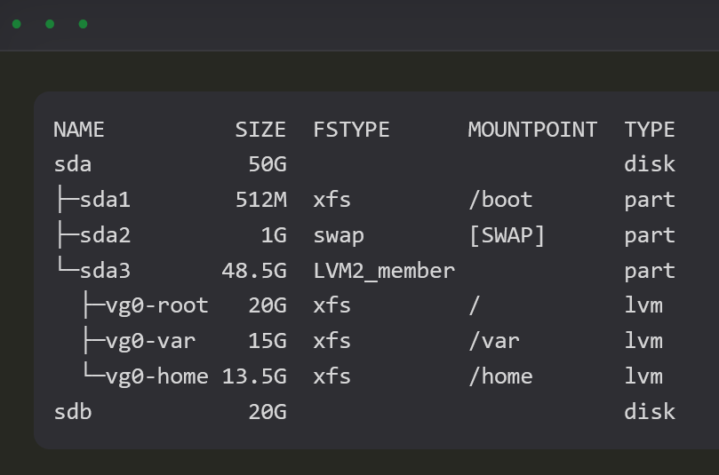
[On Linux, writing lsblk into the terminal allows users to see installed block devices and partitions.](https://mylinux.work/guides/linux-storage-basics/)

Each piece of data stored on a partition is going to disappear if the partition is wiped or corrupted. To avoid this kind of failure, and make sure that a copy is available even if the original is not, you can organize your block devices into a [redundant array of independent disks](https://doi.org/10.1016/B978-0-12-420158-3.00017-4) (RAID). RAID unifies multiple disks or partitions into a single unit, allowing files to be split and recovered depending on the RAID level. The baseline is RAID 0, which simply distributes files to the various disks without any copies. In contrast, RAID 1 fully mirrors each file - which means you need twice the number of devices to store the same amount of data. Higher RAID levels make use of various error recovery methods to reduce the total capacity required. To be clear, regardless of your chosen RAID level, there is a [trade-off](https://www.digitalocean.com/community/tutorials/how-to-create-raid-arrays-with-mdadm-on-ubuntu) between the ability to store files redundantly and the total capacity available.

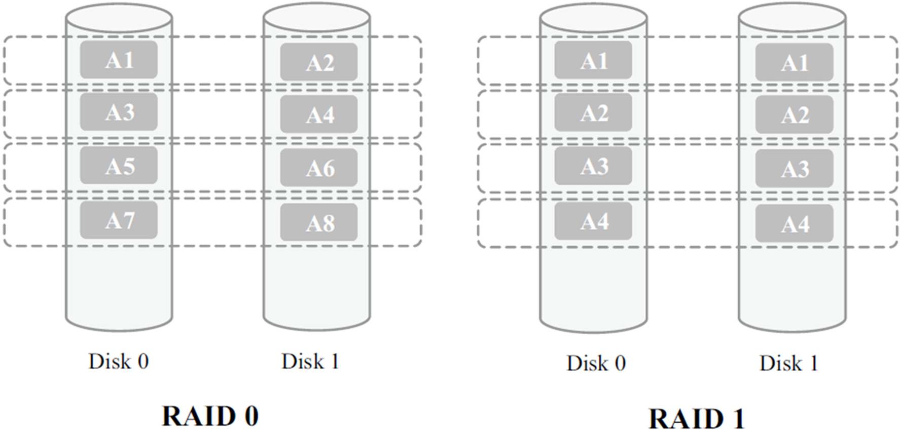
[Storing an equivalent copy means doubling the required capacity.](https://doi.org/10.1007/978-981-97-3534-1)

The next step in integrating multiple devices involves thinking about how they are connected to each other and to the user - otherwise said, the abstraction between user and storage. The first and easiest way to do this is device-attached storage (DAS), whereby each user device has its own physically-connected storage device to use. Two more [centralized](https://doi.org/10.1016/B978-0-12-420158-3.00017-4) alternatives are network-attached storage (NAS) and a storage area network (SAN). NAS is the simpler of the two options, and involves connecting a storage server to a network so that all users have access to the files on the server. SAN is a bit [more complex](https://blog.vmhoster.com/san-vs-nas-storage/) in that is makes use of its own internal high-speed network, but more importantly, it makes data blocks available rather than individual files. This makes it most useful when low latency is critical or when multiple users are working on the same files. Beyond storage devices, both centralized architectures require [networking](https://www.ibm.com/think/topics/san-vs-nas) (e.g. Ethernet, Fibre Channel), switches, and file management software.

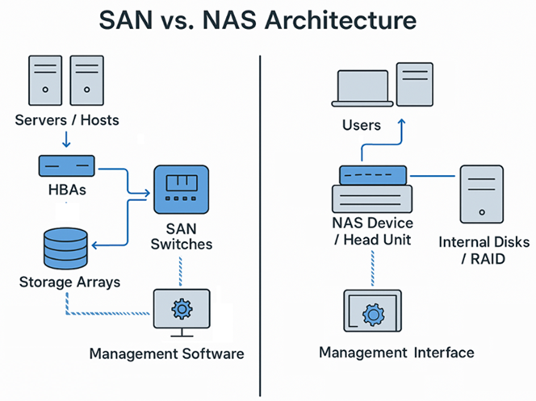
[A SAN architecture makes use of its own internal network, while NAS uses the same network as other services.](https://phoenixnap.com/kb/san-vs-nas)

The last step is organizing the data itself at a software level; this is usually done through a [data management platform](https://link.springer.com/article/10.1007/s42488-024-00132-1) (DMP). You may be already familiar with the three generations of storage architectures. The oldest is the data warehouse, a unified repository for structured data. Then, as more and more unstructured data was being gathered on the internet, the data lake was developed to more flexibly store it. Finally, the two concepts were [combined](https://itrexgroup.com/blog/data-warehouse-vs-data-lake-vs-data-lakehouse-differences-use-cases-tips) into a data lakehouse with a storage layer with open formats such as Parquet and a computing layer for structuring. These architectures are already quite far removed from the hardware side, and are typically encountered by the user when accessing or processing data.

# Data storage impacts
As we saw until now, data is stored inside physical devices. Because these devices need raw materials and processing, and because they consume energy to fulfil their purpose, they result in environmental impacts. For the purposes of this lecture, we will limit our discussion to the carbon footprint (embedded and operational greenhouse gas emissions) and material footprint of the various technologies presented in this lecture. Of course, please remember that the resource consumption and waste generation associated with data storage also cause impacts in other areas, such as water extraction (for example, as we noted in Lecture 2, semiconductors are [notoriously water-hungry](https://doi.org/10.1016/j.wri.2019.100115)) and e-waste.

## The carbon footprint of data storage
Same as for the other technologies presented in this course, data storage devices have embedded emissions related to their manufacturing and operational emissions related to the energy they consume during the use phase of their lifecycle. Unexpectedly, these emissions are actually a very important part of the overall carbon footprint of ICT systems. For example, the emissions embedded within the HDD and SSD of desktop computers tend to reach [approximately half](https://dl.acm.org/doi/10.1145/3630614.3630616) of those for the entire machine. Additionally, Microsoft Azure has noted that 61% of the embedded emissions and 33% of the operational emissions of their servers are [storage-related](https://dl.acm.org/doi/10.1145/3727200.3727211).

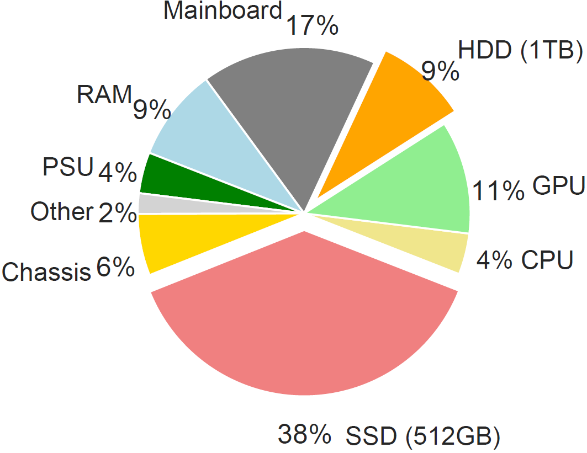
[Breakdown of embedded emissions for a typical desktop computer. Note the dominant role played by the SSD.](https://dl.acm.org/doi/10.1145/3630614.3630616)

That sounds like a lot of emissions embedded in relatively small components. If we focus on SSDs for a bit (since HDDs tend to consume more energy and therefore have [relatively higher](https://dl.acm.org/doi/10.1145/3727200.3727211) operational emissions), the device manufacturing stage tends to dominate the lifecycle emissions. This is because of the extremely complex - and [extremely energy intensive](https://dl.acm.org/doi/10.1145/3630614.3630616) - semiconductor fabrication process. As transistors become smaller and memory dies are stacked together, the capacity of SSDs has expanded tremendously. However, due to highly precise fabrication methods required for smaller and smaller transistors, the energy intensity of semiconductor memory [increases](https://doi.org/10.1145/3706594.3727962) as the size of transistor features decreases. As a consequence, the embedded emissions of SSDs have continued to increase even as their capacity within the same form factor has expanded.

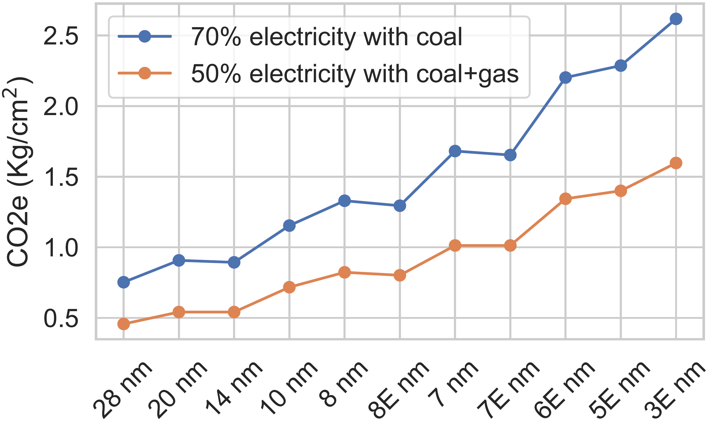
[Regardless of the grid electricity mix, the carbon intensity of semiconductor memory, measured in kilograms per square centimeter, continues to increase as the constituent transistors become smaller.](https://dl.acm.org/doi/10.1145/3630614.3630616)

HDDs also feature embedded emissions, because they contain minuscule components that need to be manufactured with [high precision](https://doi.org/10.1016/B978-0-12-420158-3.00017-4). Nevertheless, the comparatively high power draw (required to keep spinning so that data is readily available) and the presence of fossil fuel generation within the grid electricity mix means that most of their carbon footprint appears in the [operational/use phase](https://doi.org/10.1145/3757892.3757908). Interestingly, when measuring the power draw of storage technologies over time, it tends to remain [remarkably constant](https://doi.org/10.1145/3757892.3757908), with that of SSDs appearing to be a bit more proportional to the number of IO operations being performed. 

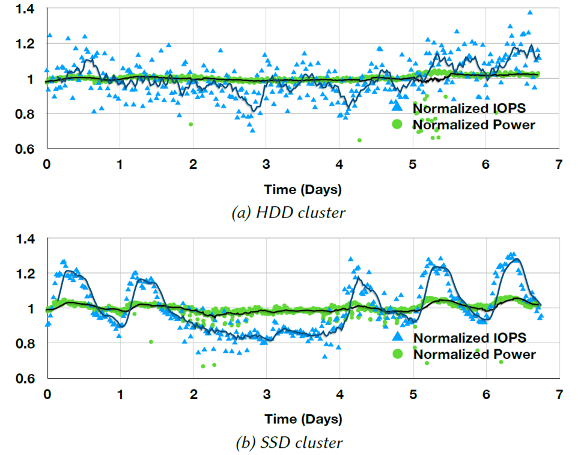
[When comparing the normalized IOPS and power draw of (a) HDD and (b) SSD clusters in a Microsoft Azure data server, SSDs appear to be somewhat more power proportional.](https://dl.acm.org/doi/10.1145/3727200.3727211)

This means that we are facing a complex trade-off between HDDs and SSDs when trying to select the most sustainable technology for our storage system. On one hand, the embedded emissions of SSDs are always higher for a given capacity value due to their complex fabrication processes. On the other hand, HDDs have higher operational emissions because of their higher energy consumption. And, if we return to the basic properties of each technology, you may remember that we can't simply compare these technologies on a GB-to-GB basis. A critical part of storage system performance is related to the IOPS or bandwidth. Due to bandwidth bottlenecks suffered by individual HDDs, more disks may be required to handle the same bursty workload that a single SSD can handle!

Given this complex design space, a lot of recent research has focused on finding the optimal technology for each use-case. Unsurprisingly, this depends on several factors: the carbon intensity of the grid during the manufacturing process (lower embedded emissions tend to favor SSDs) but also during operations (lower operational emissions tend to favor HDDs), the lifetime (number of read/write cycles), and the specific payload being transferred. 

Let's take a look at three examples. First, a [2025 paper](https://doi.org/10.1145/3757892.3757908) examining the comparative use of HDDs and SSDs for machine learning notes that these workloads are particularly challenging for the former, because they demand high-throughput, random-access IO. This is visible in their simulation runs: when the dataset the model is being trained on is reasonably small, the training time taken by the HDD-attached system is comparable to that for the SSD-attached system. However, when the memory limit is passed, the training duration balloons in size due to IO bottlenecks in the HDD. This results in more energy being consumed and a higher per-run carbon footprint.

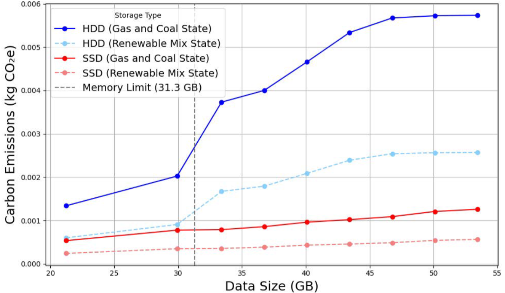
[Per-run emissions depend on the grid electricity mix and the size of the payload, which drives the processing time and resulting energy consumption. While HDD performance is comparable with that of SSDs up to the memory limit, payloads above it greatly increase processing time.](https://doi.org/10.1145/3757892.3757908)

The authors use runs as a metric; they calculate how many runs are required for the SSD, given its higher embedded emissions, to break even with the HDD. For their use-case, they find that SSDs need [tens to hundreds of thousands of runs](https://doi.org/10.1145/3757892.3757908) to catch up, depending on the size of the payload and on the carbon intensity of the grid. Dirtier grids increase per-run emissions more for HDDs, so they reduce the carbon payback time of the SSD. Past this breakeven number of runs, SSDs are always more sustainable than HDDs.

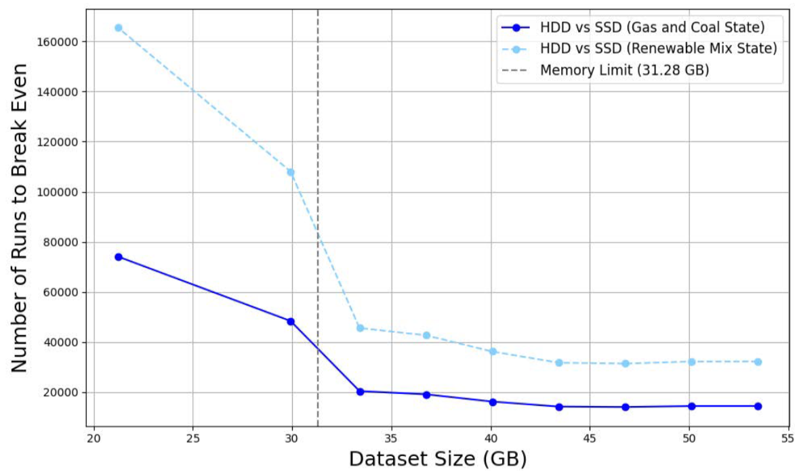
[While small training workloads need more than a hundred thousand runs for the SSD to break even, larger workloads and a dirty grid allow it to catch up faster with the HDD.](https://doi.org/10.1145/3757892.3757908)

Similar results have been obtained by researchers [comparing HDDs and SSDs](https://doi.org/10.1109/CCGRID64434.2025.00064) for key value (KV) stores, a typical cloud storage use-case. Their experiments show that, for workloads that fit within the IO constraints of an HDD, the HDD-based system also consumes less energy than the SSD-based system, so it is superior in all respects. In contrast, for large and bursty workloads, they find that multiple HDDs may be required to handle the same throughput as a single SSD, which increases the embedded emissions of the HDD system and makes SSDs more attractive. When calculating the break-even time as a function of the grid carbon intensity and KV algorithm being used, a dirty grid and an efficient algorithm reduce the carbon payback time to only 52 days; at the opposite end, it can take more than four years to catch up with the HDD. 

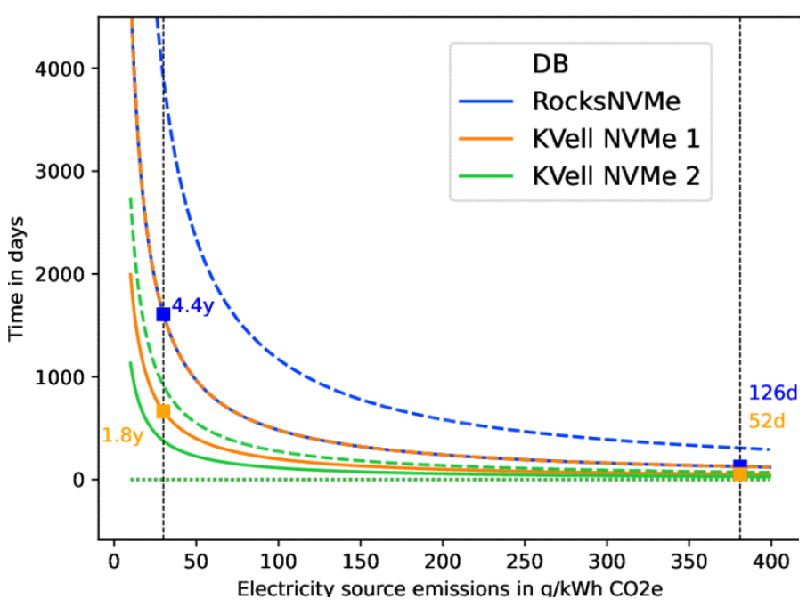
[Sensitivity analysis of the breakeven time to the algorithm being used and to the carbon intensity of the grid. The extreme points on the left side of the plot may already be past the effective lifetime of the SSD!](https://doi.org/10.1109/CCGRID64434.2025.00064)

The third and final example is long-term archival storage; for this use-case, magnetic tape has a significant advantage in that it only consumes measurable amounts of energy when being actively accessed. Its embedded emissions are also [relatively low](https://www.seagate.com/resources/decarbonizing-data-report/) in terms of carbon footprint per TB per year, sitting somewhere between those of HDDs and SSDs. Finally, its comparatively high latency can be a glaring problem when you're trying to train a machine learning model, but not when your objective is to access some archived information. 

Overall, if there's any insight to be gained from these examples, it's that there is no single 'most sustainable' technology: we as engineers need to make a trade-off based on the requirements that our use-case imposes.

## The material footprint of data storage
As you might remember, data storage technologies are physical devices made from a [multitude of materials](https://doi.org/10.1016/B978-0-12-420158-3.00017-4). Magnetic tape requires large quantities of plastic such as PET or aramid, both for the tape reels themselves and for the cartridges that contain them. This is somewhat worrisome given the problems inherent to plastic recycling that we discussed in Lecture 6. Then, HDDs rely on a broad range of minerals, such as cobalt, nickel, platinum, and chromium, for the magnetizable layers on each platter; their magnets are also made from rare earth elements like neodymium. And, of course, semiconductor memory could not exist without enormous volumes of silicon.

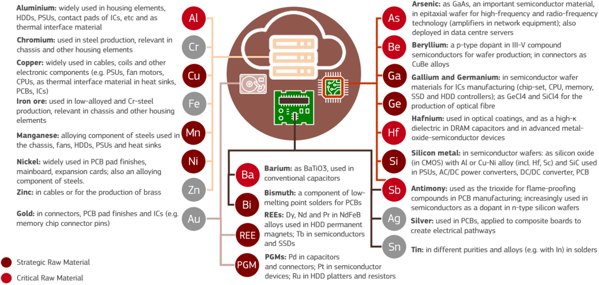
[Overview of EU critical raw materials used within storage technologies and their use-cases.](https://publications.jrc.ec.europa.eu/repository/handle/JRC132889)

Could recycling be a solution? Not really. All these technologies rely on miniaturized components like minuscule aerodynamic sliders and nanometer-scale transistors, which makes it [unlikely](https://link.springer.com/chapter/10.1007/978-3-319-09228-7_12) to extract the valuable materials within. Not to mention the staggering increase in demand for storage devices, which we will talk about in a bit. Therefore, we need to think about how we can avoid the continuous (and growing) extraction of raw materials, for example by extending device lifetime.

Another problem we are unlikely to get rid of anytime soon is where these materials are being sourced from. While the scale of demand for critical raw materials in storage technologies is relatively [small](https://publications.jrc.ec.europa.eu/repository/handle/JRC132889) compared to global supply (e.g. the lion's share of rare earth elements for permanent magnets go towards electric vehicle motors, while large quantities of semiconductor-grade silicon are also required for photovoltaic modules), questions remain about where materials are extracted and processed. According to the [European Commission's Joint Research Centre](https://publications.jrc.ec.europa.eu/repository/handle/JRC132889), supply chains for many of these materials are extremely concentrated; this means that a single producer could 'turn off the tap' and put enormous stress on the data storage industry as they rush to find alternatives.

# Industry trends
Speaking of the data storage industry, we've examined the past developments and current state of storage technologies, but where is the industry actually going to be in the future? Can we expect some breakthroughs, or are we stuck with these technologies the way they are?

First and foremost, [all signs](https://asset.fujifilm.com/master/americas/files/2020-03/7bcc575d53cec43c1b68e78e94e7d895/Tape-and-Cloud-Solving-Storage-Problems.pdf) point towards sustained growth in the demand for data storage. This means that, across all use-cases (archive, AI, public sector, cloud computing among others) and technologies, more and more capacity will have to be installed in the future. Not good! Most of the [installed capacity](https://www.hpe.com/psnow/downloadDoc/Storage%20Management%20in%20an%20Age%20of%20Minimal%20Data%20Deletion-a00144917enw.pdf?id=a00144917enw&isFutureVersion=true&ver=1&form=false&preview=false&hf=regular&isLinearized=false&contentDisposition=attachment) will be in SSDs (because of their best-in class performance) and HDDs (because of their attractive cost per GB), but tape will also continue to grow. Clearly, there is precious little breathing room for us on this front. 

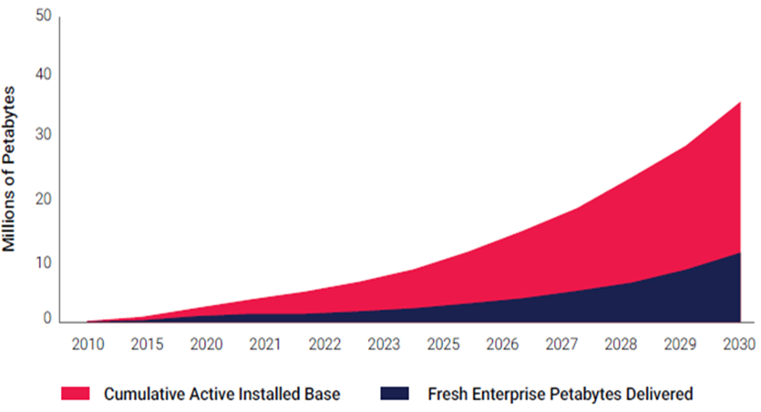
[One (relatively old) projection of the new and cumulative storage capacity to be installed by 2030.](https://www.hpe.com/psnow/downloadDoc/Storage%20Management%20in%20an%20Age%20of%20Minimal%20Data%20Deletion-a00144917enw.pdf?id=a00144917enw&isFutureVersion=true&ver=1&form=false&preview=false&hf=regular&isLinearized=false&contentDisposition=attachment)

Secondly, no groundbreaking exponential improvements are being expected in any of the storage technologies we have discussed so far. Tape, for example, has been designed according to the same [fundamental principles](https://doi.org/10.1145/3708997) for decades now, with incremental improvements in storage density for each LTO generation. Indeed, the capacity of a single cartridge has been [approximately doubling](https://www.fujifilmsummit.com/wp-content/uploads/2022/06/IBM-Saving-the-planet-28PBs-at-a-time.pdf) with each generation until now, but manufacturing complexity and resulting embedded emissions can also be assumed to increase as components become smaller and processes become more precise.

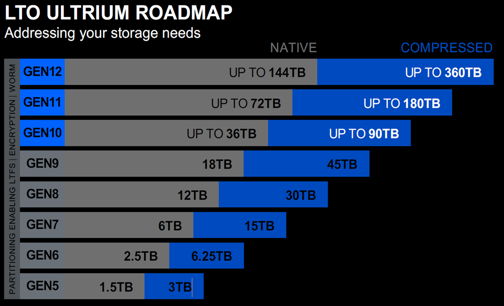
[The per-cartridge capacity of magnetic tape is predicted to continue increasing across LTO generations due to improvements in areal density.](https://www.fujifilmsummit.com/wp-content/uploads/2022/06/IBM-Saving-the-planet-28PBs-at-a-time.pdf)

There are also some improvements on the horizon for HDDs - and even more trade-offs - as the limits of the technology are reached. The next frontier is [heat-assisted magnetic recording](https://dl.acm.org/doi/10.1145/3727200.3727211) (HAMR); this allows platters to store data even more densely, but at the cost of energy being required to heat up the magnetizable layers on the surface. This can help expand capacity, but it will not affect the real bottleneck of HDD, which is access rates (IOPS), meaning that IOPS/GB, which is the real metric of interest for modern high-bandwidth workloads, is actually decreasing!

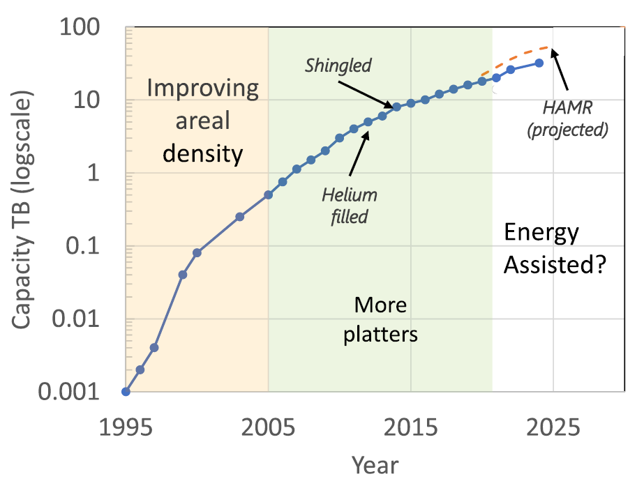
[While past innovations have supported continuous growth in HDD capacity, IOPS has stayed more or less constant over time.](https://doi.org/10.1145/3708993)

Finally, SSDs have been seeing [real advances](https://doi-org.tudelft.idm.oclc.org/10.1109/MSSC.2020.3021841) in storage density driven by multi-dimensional stacking of memory cells and bit stacking. However, there are only so many dimensions to stack in, and increasing the bit loading of each cell from triple to quadruple requires more complex (and therefore energy intensive) manufacturing processes and, critically, drastically reduces the lifetime of the memory cell because of [higher susceptibility to defects](https://doi.org/10.1109/MDAT.2025.3606412). Once again, as the low-hanging fruit in the development of a technology are picked, a trade-off has to be made between device performance, lifetime, and sustainability.

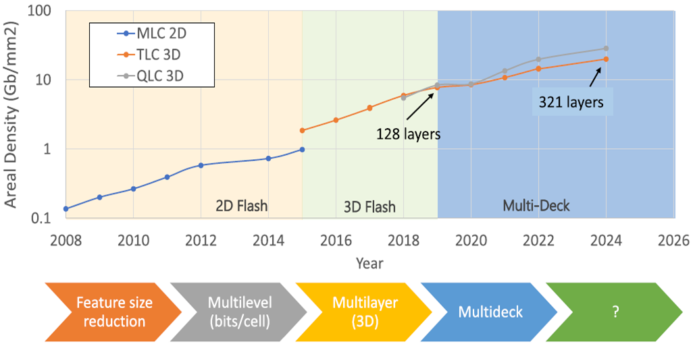
[SSD areal density has grown by several orders of magnitude over the past 20 years.](https://doi.org/10.1145/3708993)

# Data storage solutions
Now that we've evaluated the technologies themselves, their impacts, and future trends, we can start thinking about some prospective solutions. There are certainly some ways in which we as engineers can contribute to reducing the environmental impact of data storage. Let's take a look.

## 1. Lifetime extension
If we find clever ways to make effective use of the storage devices we do have, we have to replace them less often, reducing the embedded emissions of the storage system. Unfortunately, there is limited potential if we try to just keep using HDDs or SSDs until they break. 

We already know that error and failure rates increase [more or less linearly](https://ieeexplore.ieee.org/document/10682645) with the number of SSD read/write cycles. Therefore, doubling an SSD's lifetime means doubling the write operations it has to perform, which drastically saps its performance and may even lead to total loss of the device. However, the same is not true for HDDs: their failure rates are actually unknown, because they are typically decommissioned [before the end of their effective lifetime](https://dl.acm.org/doi/10.1145/3727200.3727211) for cost reasons! This gives us some room to maneuver: storage architectures could be designed to accept partial failure of devices, allowing individual HDD platters or SSD blocks to grow defects while the rest soldier on.

All things considered, there may be one way to extend the lifetime of SSDs, just not in the way you think. Just this year, a [research group from Japan](https://dx.doi.org/10.1109/MDAT.2025.3596023) demonstrated that keeping memory cells at high temperature for a short while can eliminate cell defects, allowing the SSD to recover from a high number of read/write cycles. Yes, this does mean that they baked the entire device at 150 degrees Celsius, which makes one wonder how many such annealing cycles the other components on the PCB can handle over their lifetime. Additionally, even though this method for end-of-life refurbishing shows a lot of promise, it is labor intensive: all the devices need to be extracted from their servers or expansion blades and placed in the oven for a bit. 

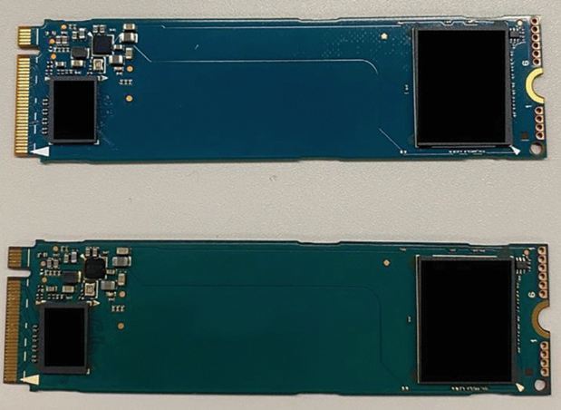
[It may look a bit crispy after baking, but it still gets the job done.](https://dx.doi.org/10.1109/MDAT.2025.3596023)

## 2. Data allocation
If you're interested in more orthodox ways to reduce the wear on your storage devices, we can go in that direction as well. A [2024 paper](https://ieeexplore.ieee.org/document/10682645) proposes a data allocation scheme used within the controller logic that manages the storage system, relying on our ability to vary the threshold voltage used during read/write operations. Increasing the threshold voltage reduces latency and noise, but also causes more defects to be formed. 

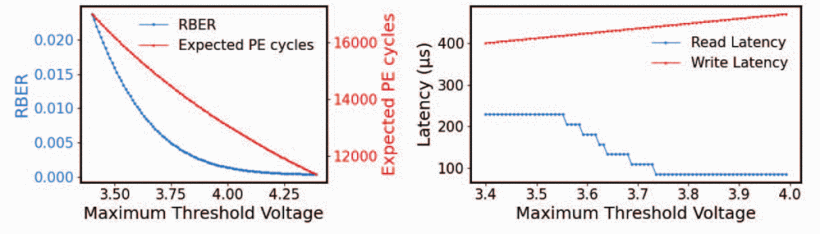
[Increasing the maximum threshold voltage noticeably decreases the raw bit error rate and read latency while also reducing the expected lifetime.](https://ieeexplore.ieee.org/document/10682645)

These researchers therefore [divided](https://ieeexplore.ieee.org/document/10682645) the disk into a high-voltage and a low-voltage region and programmed the controller to dynamically migrate data to the low-voltage partition based on observed access patterns. This allows for [wear leveling](https://doi.org/10.1109/MDAT.2025.3606412): the lifetime of the disk can be extended by making sure that all its blocks degrade at the same rate, so that no single part breaks first and causes the entire drive to be discarded.

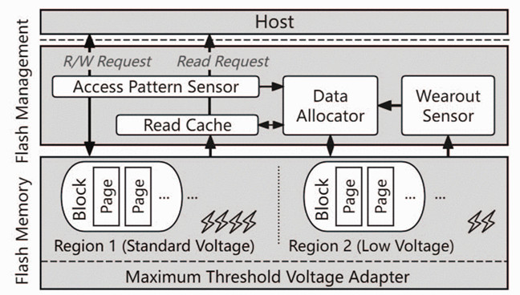
[Data is allocated to each region of the drive as a function of its measured degradation to ensure that wear is distributed across the regions.](https://ieeexplore.ieee.org/document/10682645)

We can extend this idea further by applying it to the storage system as a whole. While an older idea, the [massive array of idle disks](https://doi.org/10.1145/3736548.3737830) (MAID) is a system architecture that has been recently revived due to its potential to reduce the operational energy consumption of storage systems. In a three-tiered architecture, SSDs store hot data, always-on HDDs store warm data, and idle HDDs store cold data. If a piece of data is accessed, it is promoted to the SSD layer; if it remains uncalled, it is migrated to either of the HDD layers. Even though this does reduce power draw, it was also observed to increase latency for users trying to access data in the idle HDDs, which need to spin back up to make the data available.

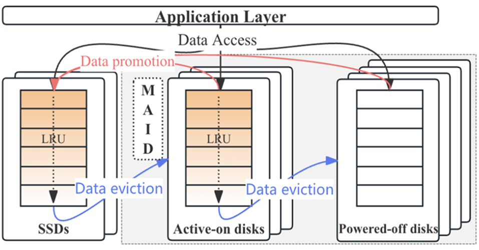
[Allocating data to active or inactive layers depending on how often it is accessed can somewhat reduce power consumption.](https://doi.org/10.1145/3736548.3737830)

Once again, there is a trade-off to be made. Here, the main problem is that the latency of storage services is typically guaranteed within the [service-level agreement](https://docs.aws.amazon.com/wellarchitected/latest/sustainability-pillar/sus_sus_user_a3.html) (SLA) that providers offer users. Otherwise said, the user pays for the convenience of accessing their data at the SLA-designated latency, which is typically [aligned](https://dl.acm.org/doi/10.1145/3727200.3727211) with that of SSDs. Therefore, the performance requirements of the system can restrict our options when designing its architecture.

## 3. Space-time trade-off
Yet another trade-off we can make to try and reduce the environmental impact of data storage is between storage space and computation time. Quoting the [space-time trade-off principle](https://opendsa-server.cs.vt.edu/ODSA/Books/CS3/html/AnalSpace.html): "one can often achieve a reduction in time if one is willing to sacrifice space or vice versa". The point, of course, is not to simply shift the energy consumption to the computing hardware, but to see whether there is a clever way to use processing power in order to reduce the data we have to store.

High-performance computing clusters like that used by CERN for its Project ATLAS experiment make use of a lot of resources, so the saving potential is also great. They identify [a few optimizations](https://link.springer.com/article/10.1140/epjc/s10052-025-14976-3) to keep in mind. The first is aggressive data compression, which can typically reach compression ratios of up to [2:1](https://www.zlib.net/zlib_tech.html) or more depending on the data type and provide enormous storage overhead reductions for the modest computational effort required. The second is reproduction: given the constant power draw of long-term storage, numerical experiment results that are not accessed very often can just be deleted and reproduced when they are needed. Of course, high-quality information about the relative energy costs of compute and energy storage is required; this is not generally available.

## 4. Background tasks
Most of the energy consumption of storage systems is a result of the power draw of the devices used to store data - we cannot reduce it without reducing performance. However, part of a storage system's consumption is actually temporally flexible: background tasks like scrubbing, backup, and deduplication among others. If the power draw of the storage system is around [17% of that of the entire data center](https://doi.org/10.1145/3727200.3727227), then 3-5% is just these background tasks taken together. 

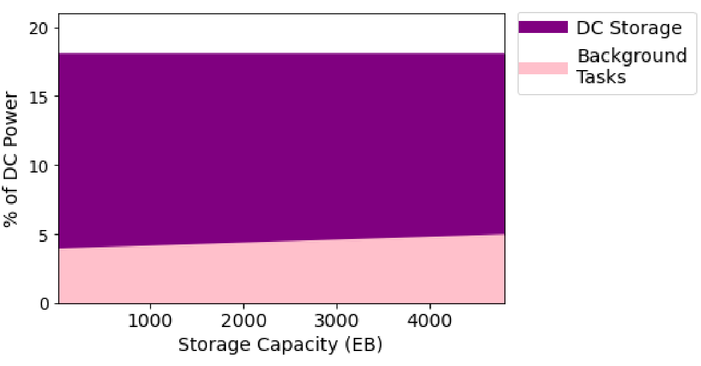
[As the storage capacity of a cloud data center expands, comparatively more reliability and management workloads are needed, growing its relative power draw.](https://doi.org/10.1145/3727200.3727227)

Even though they are necessary to ensure the reliability and efficiency of the storage system, background tasks do not need to be done at a specific point in time. Therefore, a [2025 paper](https://doi.org/10.1145/3727200.3727227) applied a greedy dispatch algorithm to align them to periods of low grid carbon intensity, such as in the middle of the day, when photovoltaic arrays are at maximum output. Depending on the aggressiveness of the specific algorithm, the operational emissions of the storage system were estimated to decrease by 5 to 22.5 percent. Every little bit helps!

## 5. Emerging technologies
Various technologies are being researched that may change the state of the storage space - for better or worse. We'll examine a few emerging technologies for their potential to improve storage performance and reduce environmental impacts, but also keep in mind their level of development.

Recent reductions in SSD latency have brought enormous benefits to processing speed, but these have been restricted by data transfer [bottlenecks](https://arxiv.org/pdf/2112.12415) on the host-side (compute) IO stack. Increasing data transfer volumes have also led to growing energy consumption; an often-cited figure is that up to [62% of the energy demand for computing](https://newsroom.arm.com/blog/computational-storage) is caused by data transfer requirements. To reduce IOPS for various workloads, researchers have proposed the idea of in-storage computing (ISC), whereby computing substrates are integrated directly into the 3D flash memory drive. The resulting computational storage drives (CSDs) feature integrated near-data accelerators to handle tasks such as filtering and reduction. This [reduces data transfer volumes and increases transfer speed](https://doi-org.tudelft.idm.oclc.org/10.1109/LCA.2020.3009347), improving performance while also reducing power consumption.

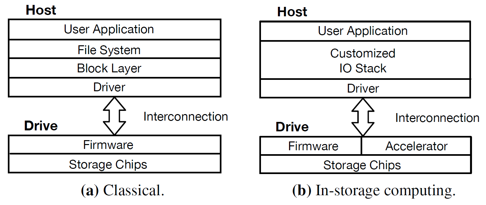
[The data processing architectures for in-storage computing (b) requires a more complex IO stack than the one for classical compute-storage systems (a).](https://arxiv.org/pdf/2112.12415)

Various CSD architectures have been proposed, with some already appearing on the commercial scene. Certain technology demonstrators have shown very good results. For example, the somewhat dated 2020 [SmartSSD](https://doi-org.tudelft.idm.oclc.org/10.1109/LCA.2020.3009347) managed to reach a 3x speed-up compared to an external CPU while reducing energy consumption by 54%. Because less data needs to be passed back and forth, the operational carbon footprint of certain applications can be expected to decrease. However, we need to remember that we are adding a processor and, in some cases, a DRAM chip, to an already energy-intensive SSD, which is sure to increase the embedded carbon of the device.

Another technology that is in the demonstrator stage is glass storage. In Microsoft's [Project Silica](https://doi.org/10.1145/3708996) prototype, data is encoded into femtosecond laser pulses that alter the physical structure of quartz glass. This form of storage is not reversible and has a very high lifetime (some figures are pushing it past [1000 years](https://doi.org/10.1038/s41586-025-10042-w)), making it compatible with the same use-cases as magnetic tape storage. Glass archives are designed to store hundreds to thousands of square disks, with robotic shuttles traveling on rails to read or write information. Microsoft has boasted about both low energy consumption and reduced costs per TB stored, with the caveat that the ultrashort pulse lasers used for write operations drive the cost of the system. Therefore, improvements in laser technology are required to make glass storage more cost-competitive.

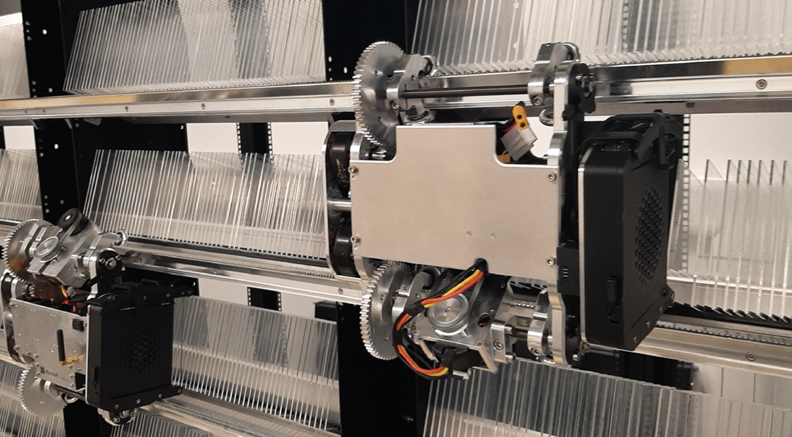
[A prototype Project Silica archive with robotic shuttles used to access glass storage media.](https://doi.org/10.1145/3708996)

But how does it compare to tape from a sustainability perspective? Well, the main problem with magnetic media like HDDs and tape is [bit rot](https://doi.org/10.1145/3708996): over time, the magnetizable layers degrade over time, so background tasks like scrubbing and defragmentation need to be performed more frequently. This means that the energy consumption for current archival storage systems increases together with the lifetime of the data! Glass storage entirely bypasses this issue because the material has an extremely long lifetime even at higher temperatures. Therefore, the storage devices do not need to be replaced as often (or, on human scales, at all) and data does not need to be migrated to new devices. Even though we don't know much about the practical environmental impact of Microsoft's prototype glass storage archive, reducing the number of devices that need to be manufactured is a great advantage.

Microsoft researchers are also working on holographic storage, which involves recording an optical interference pattern (a hologram) within a photorefractive material. They have designed a [working prototype](https://doi.org/10.1145/3708993) using commercially available infrared lasers and cameras and used it to successfully improve the storage density of the medium. However, even with historic advances in optical technology, holographic storage remains extremely energy inefficient, because only 0.01 percent of the light from the reference beam is captured by the camera. With an energy efficiency of 0.65 IOPS/W, performance needs to improve by two orders of magnitude to exceed the 20-30 IOPS/W of HDDs, and even more to reach SSD-level efficiency. The main limitation is related to [currently available photorefractive materials](https://doi.org/10.1145/3708993), which means that a lot of fundamental research is still required to make this technology competitive with anything currently on the market.

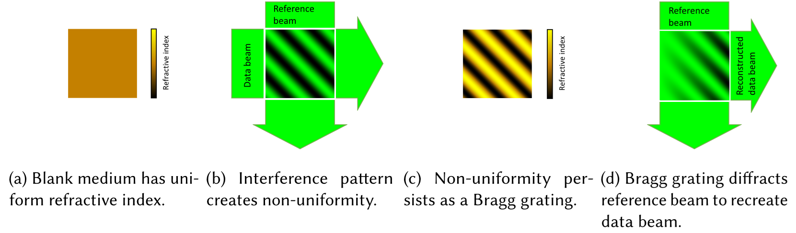
[Four stages of holographic data storage.](https://doi.org/10.1145/3708993)

Finally, if we look further away into the research pipeline, we can consider DNA storage, which involves encoding data into ATC-chains and then synthesizing an artificial DNA strand. To access the data, the strand is then sequenced, revealing the ATC-chains, which are then decoded back into digital data. This technology promises both [very high theoretical storage density](https://doi.org/10.1145/3723166) (a whopping 455 exabytes per gram!) and a very long lifetime of hundreds of years. But don't get too excited, as the biological constraints inherent to DNA mean that it requires very specific temperatures and humidity conditions to store properly. Furthermore, the technology is not quite ready for prime time: modern writing and reading processes are exceedingly slow and the largest payloads stored so far are around [200 MB](https://doi.org/10.1016/j.tibtech.2020.12.008). So it's unlikely that we will be seeing DNA drives on laptops anytime soon.

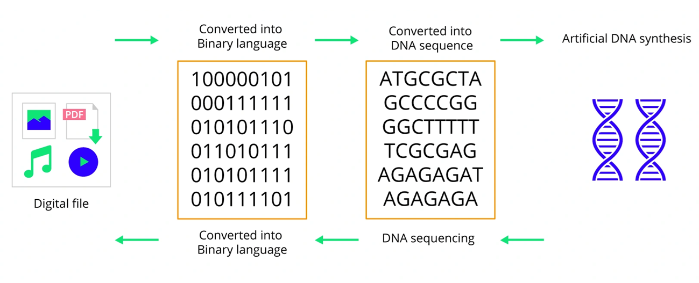
[Four stages of DNA data storage.](https://explodingtopics.com/blog/data-storage-trends)

## 6. Data strategy
Let's try and make this a bit more personal. As software engineers, our decisions also affect what and how data is to be stored. There are a number of [best practices](https://coalitieduurzamedigitalisering.nl/wp-content/uploads/NCDD-DLCM-v1.01.pdf) we can follow to reduce the amount of data in our own organization. For example, handling version control should not mean keeping report_draft_final_FINAL.pdf; tools like Git already store [deltas](https://git-scm.com/book/en/v2/Git-Internals-Packfiles) rather than keeping all versions of a file at the same time. Applying the same principle to copying could involve [zero-copy cloning](https://learn.microsoft.com/en-us/fabric/data-warehouse/clone-table), whereby only the metadata is actually copied and the initial files are referenced. Finally, noting that a majority of data being stored is frozen and will therefore [never actually be accessed](https://coalitieduurzamedigitalisering.nl/wp-content/uploads/NCDD-DLCM-v1.01.pdf), instating a deletion policy could reduce the burden on storage archives, for example by mandating a fixed retention period and then deleting the data we really don't need.

## 7. Data sufficiency
For our final prospective solution, let's once again try to think beyond technology and go to the real source of the problem. More and more data is created each year. Making transfer systems more efficient, for example by upgrading from 3G to 5G, has not reduced environmental impacts. On the contrary: these improvements have been [outpaced](https://doi.org/10.1007/s12243-022-00914-x) by growing volumes because they have also decreased the cost of data transfer, in yet another example of the rebound effect. Furthermore, the advent of wearables and IoT devices has [increased](https://doi.org/10.1007/s12243-022-00914-x) the number of devices that transfer data without direct human intervention. And of course, the business model employed by internet aggregators such as Google and Meta relies on [maximizing user attention and data traffic](https://stratechery.com/2019/a-framework-for-regulating-competition-on-the-internet/) in order to generate profit. As you may have noticed, it is unlikely that any of these problems will be solved purely through technological innovation.

What we need is [data sufficiency](https://doi.org/10.1007/s12243-022-00914-x): if we reduce data creation and traffic, then we also reduce the eventual need for storage. This can mean applications restricting data transfer only to what is necessary to provide the intended functionality of the service - so no user behavior tracking. Or, for example, using open source software and open data standards can prevent redundancy and planned obsolescence in the systems and devices we use. When it comes to data collection on the internet, governments can be proactive by both protecting users' privacy and reducing the volumes of data gathered. This could mean mandating opt-in rather than opt-out consent schemes in which users are automatically signed up. Not to mention banning [dark patterns](https://www.didomi.io/blog/the-ultimate-guide-to-consent-banner-formats) through which UI features manipulate these decisions.

It has been clear for years now that user behavior can be pushed in certain directions by clever design. This is called nudging, and it relies on psychological cues rather than outright coercion. It can be used for socially damaging purposes, like getting users to accept intrusion, or for socially beneficial ends. In 2018, the [Norwegian Consumer Council](https://www.forbrukerradet.no/rapporter/deceived-by-design/) reported that platforms like Facebook or Instagram use nudges and dark patterns to maintain privacy-intrusive defaults. As a response, the first signs of a policy shift are appearing, with a focus on children's online experience. For example, the [UK Data Act](https://ico.org.uk/for-organisations/advice-and-services/audits/data-protection-audit-framework/toolkits/age-appropriate-design/nudge-techniques/) mandates that online actors avoid using nudges to manipulate children's online decision-making. But what if we went even further? What if nudges were used to help users create less data, or to push them towards routinely [cleaning up their storage](https://support.google.com/files/answer/9747186?hl=en)?

## Conclusions
Data storage is an extremely important component of ICT systems, both in terms of the services they provide and as a portion of their environmental impact. Designing sustainable data storage systems requires that we as engineers carefully balance their performance, lifetime, and sustainability, keeping in mind the specific application we are designing the system for. But there are limits to what we can achieve through technological development. Therefore, it is also important to consider which data is being created and stored, and with what purpose.

# Feedback
We are happy to receive any feedback you may have on this lecture. Is there too much information in the slides/notes, or would you like to know more about a certain topic? Please let us know by [**filling in this form**](https://forms.cloud.microsoft/e/z0RAAw1Ld5).

# Further reading
Want to know more about the topics in this lecture? Here are some sources that didn't quite make the cut.

## Data storage architectures
- [Data Storage Architectures and Technologies](https://doi.org/10.1007/978-981-97-3534-1): an in-depth book on data storage, focusing on software-related issues like file systems and reliability.
- [The Past, the Present, and the Future of Local Storage in Cloud](https://www.usenix.org/system/files/fast26-yang.pdf): a recent overview of the various storage architectures used for local storage by Alibaba Cloud.

## Data storage impacts
- [Supply chain analysis and material demand forecast in strategic technologies and sectors in the EU](https://publications.jrc.ec.europa.eu/repository/handle/JRC132889): a Joint Research Centre report on the current and future critical raw material demand for various technologies, including in the ICT sector.
- [imec.netzero](https://netzero.imec-int.com): a web app developed by semiconductor research organization imec to visualize the environmental impact of semiconductor technologies like DRAM and flash memory.

## Data sufficiency
- [Digital hoarding](https://theconversation.com/with-seemingly-endless-data-storage-at-our-fingertips-digital-hoarding-could-be-an-increasing-problem-190356): an article on why users tend to store more data than they need.
- [National data retention laws](https://privacyinternational.org/sites/default/files/2024-04/PI%20Briefing%20National%20data%20retention%20laws%202023.pdf): a report from Privacy International on the indiscriminate data retention regulations in various parts of the world.
- [Individual data ownership](https://theconversation.com/tim-berners-lee-wants-everyone-to-own-their-own-data-his-plan-needs-state-and-consumer-support-to-work-269042): an article about world wide web creator Tim Berners-Lee's perspective on who should own your data.