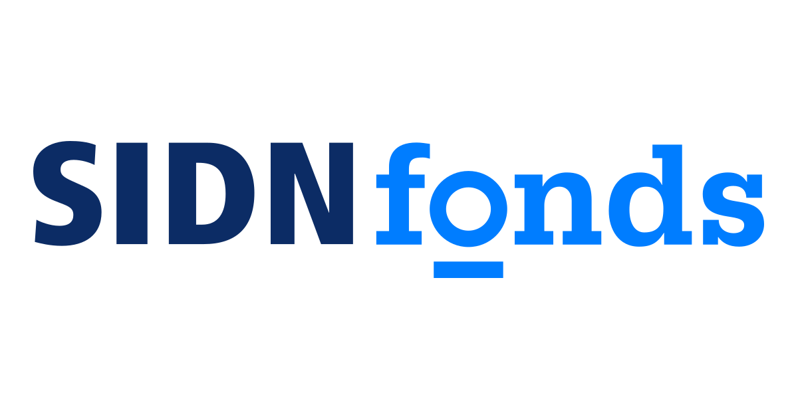

`# _Designing Sustainable Information and Communication Technologies_ ([CS4800](https://studyguide.tudelft.nl/courses/study-guide/educations/22015))

## A [TU Delft](https://tudelft.nl/en) MSc course

### Last update: _20 August 2025_

This is the official repository for the TU Delft graduate elective course focused on designing **sustainable** information and communication (ICT) systems. The course is primarily intended for MSc students in [Computer Science]() and [Electrical Engineering]() at TU Delft, but students from other MSc programs with a _suitable background_ (that is, knowledge of one _programming language_, knowledge of _basics of computer networks_ and _computer architecture_) are also welcome to enroll.

## Course Rationale

There is—and will continue to be—a strong societal need for sustainable ICT systems, encompassing both **sustainable computation** and **sustainable communication**. The labour market increasingly demands ICT professionals who understand the challenges of sustainability and can integrate sustainability goals into system design.

To the best of our knowledge, there are currently no other courses in the Netherlands—or internationally—that comprehensively address this topic. Offering such a course positions TU Delft as a [energy-cautious university](https://www.tudelft.nl/sustainability/about-us/our-vision) that takes sustainability into its curriculum, even in fields not traditionally associated with climate research, such as computer science.

This course brings together topics covered in other courses and examines them through the lens of sustainable design. It deepens existing subjects (e.g., green software) and introduces new ones not currently addressed in TU Delft’s computer science curriculum (e.g., sustainable electronics design).

The course provides a unique body of knowledge not found in existing MSc electives in [Computer Science](https://www.tudelft.nl/onderwijs/opleidingen/masters/cs/msc-computer-science), [Data Science and Artificial Intelligence Technology](https://www.tudelft.nl/onderwijs/opleidingen/masters/dsait/msc-data-science-and-artificial-intelligence-technology) and [Computer and Embedded Systems Engineering](https://www.tudelft.nl/onderwijs/opleidingen/masters/cese/msc-computer-embedded-systems-engineering) MSc programs by bridging core concepts from each into a unified course, without duplicating existing content.

To summarize, this course introduces MSc students to the principle that sustainability must be considered at **all layers of ICT systems**—not just in isolated domains like green software or renewable energy for server farms.

## Learning Objectives

At the end of the course, the student is able to: 

1. **List** what are the methods of assessing _ICT industry impact_ on climate.
2. **Comprehend** the implications of different _ICT systems design decisions_ on the climate.
3. **Apply techniques** in the ICT system design that allow to _minimize impact on climate_ of the developed system and know how to _make ICT system sustainable_.
4. **Analyse** how each design ICT system technique _affects ICT system climate impact_.
5. **Create** new methods of ICT system design considering _sustainability as core performance metric_.

## Course Structure, Dates and Delivery Locations

All lectures will be given physically at TU Delft, except for guest lectures which will be given online. During this year's course edition there will be no recorded videos of the lectures. The following list provides the structure of the course, mapped to dates, times and location of delivery.

* _04 September 2025 15:45-17:45_ (Week 1: Introduction)
  * Lecture 1: __[Introduction]()__ 
  	* [TU Delft EEMCS Hall F (36.HB.00.260)](https://esviewer.tudelft.nl/space/55/) lecture room

* _11 September 2025 15:45-17:45 (Week 2: Definitions and Project Start)_
  * Lecture 2: __[Defining Sustainability]()__
    * [TU Delft EEMCS Hall F (36.HB.00.260)](https://esviewer.tudelft.nl/space/55/) lecture room

* _12 September 2025 15:45-17:45 (Week 2: Definitions and Project Start)_
  * Project meeting 2: __Project Ideas Market__ (project groups presenting which projects they selected and how they will approach the solution)
    * [TU Delft EEMCS Hall G (36.HB.00.230)](https://esviewer.tudelft.nl/space/181/) lecture room

* _18 September 2025 15:45-17:45 (Week 3: Software)_
  * Lecture 3: __[Sustainable Software]()__
    * [TU Delft EEMCS Hall F (36.HB.00.260)](https://esviewer.tudelft.nl/space/55/) lecture room

* _19 September 2025 15:45-17:45 (Week 3: Software)_
  * Guest lecture 1: __[To Be Announced]__ (to be confirmed)
    * [online]

* _25 September 2025 15:45-17:45 (Week 4: Cloud Computing)_
  * Lecture 4: __[Sustainable Cloud Computing]()__
    * [TU Delft EEMCS Hall F (36.HB.00.260)](https://esviewer.tudelft.nl/space/55/) lecture room

* _26 September 2025 15:45-17:45 (Week 4: Cloud Computing)_
  * No lecture

* _02 October 2025 15:45-17:45 (Week 5: Group Work on the Projects)_
  * Midterm presentation
  	* [TU Delft EEMCS Hall F (36.HB.00.260)](https://esviewer.tudelft.nl/space/55/) lecture room

* _03 October 2025 15:45-17:45 (Week 5: Group Work on the Projects)_
  * Midterm presentation
    * [TU Delft EEMCS Hall G (36.HB.00.230)](https://esviewer.tudelft.nl/space/181/) lecture room

* _09 October 2025 15:45-17:45 (Week 6: Sustainable Artificial Intelligence)_
  * Lecture 5: __[Sustainable Artificial Intelligence]()__
    * [TU Delft EEMCS Hall F (36.HB.00.260)](https://esviewer.tudelft.nl/space/55/) lecture room

* _10 October 2025 15:45-17:45 (Week 6: Sustainable Artificial Intelligence)_
  * No lecture

* _16 October 2025 15:45-17:45 (Week 7: Sustainable Electronics Design)_
  * Lecture 6: Lecture __[Sustainable Electronics Design]()__
    * [TU Delft EEMCS Hall F (36.HB.00.260)](https://esviewer.tudelft.nl/space/55/) lecture room

* _17 October 2025 15:45-17:45 (Week 7: Sustainable Electronics Design)_
  * Guest lecture 2: __[To Be Announced]__ (to be confirmed)
    * [online]

* _23 October 2025 15:45-17:45 (Week 8: Course Wrap Up)_ 
  * No lecture 

* _24 October 2025 15:45-17:45 (Week 8: Course Wrap Up)_
  * * Project meeting 3: __Final project presentations__
    * [TU Delft EEMCS Hall G (36.HB.00.230)](https://esviewer.tudelft.nl/space/181/) lecture room

## Methods of Examination and Assessment

The course is composed of two assessment methods:

- _Group Project_: A group project where you will be applying some of the knowledge obtained during the course. The outcome of the project will be assessed by submitting a project report and a presenting the outcome of the project during an public presentation at the end of the course. The group project will evaluate whether [learning objectives](#learning-objectives) 3, 4 and 5 have been met by a student.
- _Written Exam_: A multiple choice exam, assessing your course knowledge. It will evaluate whether [learning objectives](#learning-objectives) 1, 2 and 3 have been met by a sutdent.

### Grade Calculation, Repair Assigmnent and Resits

The final course grade $F$ is calculated as $F=0.6P+0.3E+0.1R$, where $P$ is the final grade for the project report, $E$ is the final grade for the exam and $R$ is the final grade for the project presentation. For $P$, $E$ and $R$ you must obtain at least 5.75 grade to pass the course (see [TU Delft Assessment Framework](https://filelist.tudelft.nl/Calendar/2023/08%20August/Assessment%20framework%20TUD%20-%20final%20%281.3-Sep23%29.pdf), page 41). 

* _Group Project_: In case of grade $P$ for the group project being lower than 5.75 or a student wants to improve the grade $P$, the student must register for the course in the next academic year to repair the grade. In other words, there will be no repair assignment for the group project. This is because the group project will span the whole course time and it will be unreasonable to ask the student to do a failed project in even less time than the academic quarter (see [TU Delft Faculty of Electrical Engineering, Mathematics and Computer Science Teaching and Examination Regulations 2025-2026](https://filelist.tudelft.nl/Studentenportal/Faculteitspecifiek/EWI/Studeren/Reglementen/TER%20-%20EEMCS%20Faculty%202025-2026%20FINAL.pdf) Page 26, Footnote 4.). When the student decides to follow the course again, there will be no penalty for doing so, i.e. grade $F$ (or sub-grades $P$, $E$, and $R$) at the next course edition will not be upper-bounded becuase of a previous years' course grade failure.

* _Written Exam_: In case of grade $E$ for the group project being lower than 5.75 or a student wants to improve the grade $E$, the course will offer a resit opportunity. For the final grade $E$, the highest of the two grades (initilal exam and resit exam) will be taken. Both first and resit exam will have the same format.

### Dates and Deadlines

- _Group Project_: List of available projects will be posted on _September 4, 2025 15:45_. Submission deadline for the group project report is _24 October 2025 15:45_ (i.e. the start of the lecture where selected groups will provide their project group results).

- _Exam and Exam Resit_: Exam is scheduled for 6th of November at 13:30 and will take place in [ME-Hall I (34.D-1-200)](https://esviewer.tudelft.nl/space/13). The resit exam is scheduled for 21st of January at 13:30 and will take place in [ME-Hall H (34.D-1-100)](https://esviewer.tudelft.nl/space/12).

## This Course is Looking for Your Feedback

The course is in a continous development, so it will be updated after every iteration. We request all followers of this course to suggest changes and improvemens by submitting issues. We appreciate your ideas and criticism.

There is also a link after every lecture and inside every module of this repository where you can send your feedback.

Thank you!

## The Course Team

* _Project leader and lecturer_: [Przemysław Pawełczak](https://github.com/przemyslaw-pawelczak) :poland: :eu:
* _Backup lecturer_: [Soham Chakraborty](https://www.st.ewi.tudelft.nl/sschakraborty/) :india:

_Content developers (in alphabetical order)_: 

* [Cristian Cutitei](https://github.com/GrasSoft) :romania: :eu:
* [Alex Despan](https://github.com/Gargant0373) :romania: :eu:
* [Radosław Majer](https://github.com/Rpplctns) :poland: :eu:
* [Alex Nedelcu](https://github.com/anedelcu2002) :romania: :eu:
* [Liwia Padowska](https://github.com/Liwia-Padowska) :poland: :eu:
* [Alexandru Postu](https://github.com/apostoo) :romania: :eu:

## Contact 

Have a question for us? Do not hesitate to contact us at our official course e-mail: **CS4800-EWI@tudelft.nl**

## Frequently Asked Questions

* Question: __Was this course given earlier at TU Delft?__ 
  * Answer: TU Delft academic year 2025/2026 will be the first year when this course is given. We are excited to see all of you in the lecture room - we hope you will enjoy the course and that we will live to your course expectations. 

* Question: __Will the guest lecture material be tested on the exam?__
  * Answer: No. However it does not mean you should skip the guest lectures: they will be equally informative and learning as the main course. The added value of the guest lectures (and what should make them appealing) is to learn about the topic of the lecture from the ICT practitioners from the industry. The intended educational value of offering such lectures is knowledge expansion and knowledge deepening.

* Question: __What if I need to drop the lecture mid-way?__
  * Answer: You are free do to so (of course you will not get a passing grade), but please be aware that with that you will cause problems to your project teammates, so please be sure that you are really able to be present until the last day of the course.

* Question: __Will the video material from the classess be eventually available?__
  * Answer: Yes, we are working on it, but expect the videos be available not earlier than from 2026/2027 academic year.

## Additional Resources

Although this course is the first to shed light on the topic of sustainability in such an all-encompassing manner, it is not the first resource to address the subject. We have surveyed the existing literature and compiled a list for you to explore. It includes previously offered [courses](./External%20Resources/useful_courses.md) and [books](./External%20Resources/books.md). 

## Acknowledgments

We thank [SIDN Funds](https://www.sidn.nl/en/about-sidn/sidn-fund) for supporting the development of this course through grant [Educational ecosystem aimed at sustainable ICT system design](https://www.sidnfonds.nl/educational-ecosystem-aimed-at-sustainable-ict-system-design). We also thank TU Delft [Computer Science department](https://www.tudelft.nl/ewi/over-de-faculteit/afdelingen/computer-science) for giving green light in developing this course.

 