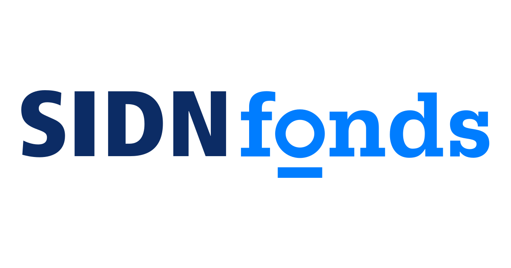
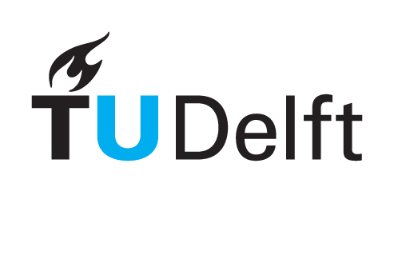

# _Designing Sustainable ICT Systems_ ([CS4800](https://studyguide.tudelft.nl/courses/study-guide/educations/22015))

## A [TU Delft](https://tudelft.nl/en) MSc course

### Last update: _31 August 2026_

This is the official repository for the TU Delft graduate elective course focused on designing **sustainable** information and communication (ICT) systems. The course is primarily intended for MSc students in [Computer Science](https://www.tudelft.nl/en/education/programmes/masters/cs/msc-computer-science) and [Electrical Engineering](https://www.tudelft.nl/en/education/programmes/masters/ee/msc-electrical-engineering) at TU Delft, but students from other MSc programs with a _suitable background_ (that is, knowledge of one _programming language_, knowledge of _basics of computer networks_ and _computer architecture_) are also welcome to enroll.

## Table of Contents

- [Course Rationale](#course-rationale)
- [Learning Objectives](#learning-objectives)
- [Course Structure, Dates and Delivery Locations](#course-structure-dates-and-delivery-locations)
- [Assessment](#assessment)
- [Grade Calculation, Repair Assigmnent and Resits](#grade-calculation-repair-assigmnent-and-resits)
- [Dates and Deadlines](#dates-and-deadlines)
- [This Course is Looking for Your Feedback](#this-course-is-looking-for-your-feedback)
- [The Course Team](#the-course-team)
- [Contact](#contact)
- [Additional Resources](#additional-resources)
- [Acknowledgments](#acknowledgments)

## Course Rationale

There is—and will continue to be—a strong societal need for sustainable ICT systems, encompassing both **sustainable computation** and **sustainable communication**. The labor market increasingly demands ICT professionals who understand the challenges of sustainability and can integrate sustainability goals into system design.

To the best of our knowledge, there are currently no other courses in the Netherlands—or internationally—that comprehensively address this topic. Offering such a course positions TU Delft as an [energy-cautious university](https://www.tudelft.nl/sustainability/about-us/our-vision) that takes sustainability into its curriculum, even in fields not traditionally associated with climate research, such as computer science.

This course brings together topics covered in other courses and examines them through the lens of sustainable design. It deepens existing subjects (e.g., green software) and introduces new ones not currently addressed in TU Delft’s computer science curriculum (e.g., sustainable electronics design).

The course provides a unique body of knowledge not found in existing MSc electives in [Computer Science](https://www.tudelft.nl/onderwijs/opleidingen/masters/cs/msc-computer-science), [Data Science and Artificial Intelligence Technology](https://www.tudelft.nl/onderwijs/opleidingen/masters/dsait/msc-data-science-and-artificial-intelligence-technology) and [Computer and Embedded Systems Engineering](https://www.tudelft.nl/onderwijs/opleidingen/masters/cese/msc-computer-embedded-systems-engineering) MSc programs by bridging core concepts from each into a unified course, without duplicating existing content.

To summarize, this course introduces MSc students to the principle that sustainability must be considered at **all layers of ICT systems**—not just in isolated domains like green software or renewable energy for data centers.

## Learning Objectives

At the end of the course, the student is able to: 

1. **List** the methods of assessing _ICT industry impact_ on climate.
2. **Comprehend** the implications of different _ICT systems design decisions_ on the climate.
3. **Apply techniques** in ICT system design that allow to _minimize the climate impacts_ of the developed system and know how to _make ICT systems sustainable_.
4. **Analyze** how each ICT system design technique _affects ICT system climate impacts_.
5. **Create** new methods of ICT system design considering _sustainability as core performance metric_.

## Course Structure, Dates and Delivery Locations

All lectures will be given physically at TU Delft, except for guest lectures which will be given online. There will be no recorded videos of the lectures. The following list provides the structure of the course, mapped to dates, times and location of delivery.

* _03 September 2026 15:45-17:45_
  * Lecture 1: __[Introduction](./Lectures)__ 
  	* [TU Delft EEMCS Hall F (36.HB.00.260)](https://esviewer.tudelft.nl/space/55/) lecture room

* _04 September 2026 15:45-17:45_
  * No lecture

* _10 September 2026 15:45-17:45_
  * Lecture 2: __[Defining Sustainability](./Lectures)__
    * [TU Delft EEMCS Hall F (36.HB.00.260)](https://esviewer.tudelft.nl/space/55/) lecture room

* _11 September 2026 15:45-17:45_
  * __Assignment Consultation Session (online)__

* _17 September 2026 15:45-17:45_
  * Lecture 3: __[Sustainable Software](./Lectures)__
    * [TU Delft EEMCS Hall F (36.HB.00.260)](https://esviewer.tudelft.nl/space/55/) lecture room

* _18 September 2026 15:45-17:45_
  * Lecture 4.1: __[Sustainable Artificial Intelligence, Part 1](./Lectures)__
    * [TU Delft EEMCS Hall F (36.HB.00.260)](https://esviewer.tudelft.nl/space/55/) lecture room
   
* _24 September 2026 15:45-17:45_
  * Lecture 4.2: __[Sustainable Artificial Intelligence, Part 2](./Lectures)__
    * [TU Delft EEMCS Hall F (36.HB.00.260)](https://esviewer.tudelft.nl/space/55/) lecture room

* _25 September 2026 15:45-17:45_
  * Lecture 5.1: __[Sustainable Cloud Computing, Part 1](./Lectures)__
    * [TU Delft EEMCS Hall F (36.HB.00.260)](https://esviewer.tudelft.nl/space/55/) lecture room
   
* _01 October 2026 15:45-17:45_
  * Lecture 5.2: __[Sustainable Cloud Computing, Part 2](./Lectures)__
    * [TU Delft EEMCS Hall F (36.HB.00.260)](https://esviewer.tudelft.nl/space/55/) lecture room

* _02 October 2026 15:45-17:45_
  * Lecture 6: __[Sustainable Electronics Design](./Lectures)__
    * [TU Delft EEMCS Hall F (36.HB.00.260)](https://esviewer.tudelft.nl/space/55/) lecture room

* _08 October 2026 15:45-17:45_
  * __Assignment Midterm Presentation (in-person)__
  	* [TU Delft EEMCS Hall F (36.HB.00.260)](https://esviewer.tudelft.nl/space/55/) lecture room

* _09 October 2026 15:45-17:45_
  * __Assignment Midterm Presentation (in-person, backup session)__
  	* [TU Delft EEMCS Hall F (36.HB.00.260)](https://esviewer.tudelft.nl/space/55/) lecture room

* _15 October 2026 15:45-17:45_
  * Lecture 7.1: __[Sustainable Data Storage, Part 1](./Lectures)__
    * [TU Delft EEMCS Hall F (36.HB.00.260)](https://esviewer.tudelft.nl/space/55/) lecture room
   
* _16 October 2026 15:45-17:45_
  * Lecture 7.2: __[Sustainable Data Storage, Part 2](./Lectures)__
    * [TU Delft EEMCS Hall F (36.HB.00.260)](https://esviewer.tudelft.nl/space/55/) lecture room

* _22 October 2025 15:45-17:45_
  * __Assignment Final Presentation (in-person)__
    * [TU Delft EEMCS Hall F (36.HB.00.260)](https://esviewer.tudelft.nl/space/55/) lecture room

## Assessment

The course has two assessment methods:

- _Group Project_: A group project where you will be applying some of the knowledge obtained during the course. The outcome of the project will be assessed by submitting a project report and a presenting the outcome of the project during a public presentation at the end of the course. The group project will evaluate whether [learning objectives](#learning-objectives) 3, 4 and 5 have been met by the student.
- _Written Exam_: A multiple choice exam, assessing your course knowledge. It will evaluate whether [learning objectives](#learning-objectives) 1, 2 and 3 have been met by the student.

### Grade Calculation, Repair Assignment and Resits

The final course grade $F$ is calculated as $F=0.6P+0.3E+0.1R$, where $P$ is the final grade for the project report, $E$ is the final grade for the exam and $R$ is the final grade for the project presentation. For $P$, $E$ and $R$ you must obtain a grade of at least 5.75 to pass the course (see [TU Delft Assessment Framework](https://filelist.tudelft.nl/Calendar/2023/08%20August/Assessment%20framework%20TUD%20-%20final%20%281.3-Sep23%29.pdf), page 41). 

* _Group Project_: In case of grade $P$ for the group project being lower than 5.75 (or of certain killer criteria not being met), students will be asked to resubmit the final report to the responsible lecturer within a reasonable timeframe to be decided on by the responsible lecturer. Students that do not participate in the group project do not receive a resit opportunity and must register for the course in the next academic year to repair the grade. This is because the group project will span the whole course time and it will be unreasonable to ask the student to do a failed project in even less time than the academic quarter (see [TU Delft Faculty of Electrical Engineering, Mathematics and Computer Science Teaching and Examination Regulations 2025-2026](https://filelist.tudelft.nl/Studentenportal/Faculteitspecifiek/EWI/Studeren/Reglementen/TER%20-%20EEMCS%20Faculty%202025-2026%20FINAL.pdf) Page 26, Footnote 4.). When the student decides to follow the course again, there will be no penalty for doing so, i.e. grade $F$ (or sub-grades $P$, $E$, and $R$) at the next course edition will not be upper-bounded becuase of a previous years' course grade failure.

* _Written Exam_: In case of grade $E$ for the final exam being lower than 5.75 or a student wants to improve the grade $E$, the course will offer a resit opportunity. For the final grade $E$, the highest of the two grades (initial exam and resit exam) will be taken. Both the final and resit exam will have the same format.

### Group project

You will get to apply the knowledge you gain in this course towards designing a sustainable system of your own. To achieve this task you can choose between one of the two projects on offer.

1. [Designing a sustainable AI system](./Assignments/Sustainable%20AI/) 
2. [Designing a benchmark to measure sustainability](./Assignments/Sustainable%20Software/)

### Grading Scheme

To better understand the expectations on your final report, you have access to the grading scheme used to grade the reports. You can find the Excel Sheet [here](https://github.com/TUDSSL/dsicts/tree/main/Grading%20Scheme).

### Dates and Deadlines

- _Group Project_: Submission deadline for the group project report is _22 October 15:45_ (i.e. the start of the lecture during which selected groups will provide their project group results).

- _Exam and Exam Resit_: Exam is scheduled for _4 November at 13:30_ and will take place in [AE-Hall E (Building 62)](https://esviewer.tudelft.nl/space/147/). The resit exam is scheduled for _20 January at 13:30_ and will take place in [ME-Hall H (Building 34)](https://esviewer.tudelft.nl/space/12).

## This Course is Looking for Your Feedback

The course is in continuous development, so it will be updated after every iteration. We request all followers of this course to suggest changes and improvements by submitting issues. We appreciate your ideas and criticism. There is also a [feedback form](https://forms.cloud.microsoft/e/z0RAAw1Ld5) through which you can anonymously send feedback.

Thank you!

## The Course Team

* _Project leader and lecturer_: [Przemysław Pawełczak](https://github.com/przemyslaw-pawelczak) :poland: :eu:
* _Backup lecturer_: [Soham Chakraborty](https://www.st.ewi.tudelft.nl/sschakraborty/) :india:

_Content developers (in alphabetical order)_: 

* [Cristian Cutitei](https://github.com/GrasSoft) :romania: :eu:
* [Alex Despan](https://github.com/Gargant0373) :romania: :eu:
* [Radosław Majer](https://github.com/Rpplctns) :poland: :eu:
* [Alex Nedelcu](https://github.com/anedelcu2002) :romania: :eu:
* [Liwia Padowska](https://github.com/Liwia-Padowska) :poland: :eu:
* [Alexandru Postu](https://github.com/apostoo) :romania: :eu:

## Contact 

Have a question for the course team? Do not hesitate to contact us at our official course e-mail: **CS4800-EWI@tudelft.nl**

## Additional Resources

Although this is the first TU Delft course to treat the sustainability of ICT systems in a comprehensive manner, others have also brought important contributions to the field. We have surveyed the existing literature and compiled a list for you to explore. It includes previously offered [courses](./External%20Resources/useful_courses.md) and [books](./External%20Resources/books.md). 

## Acknowledgments

We thank [SIDN Funds](https://www.sidn.nl/en/about-sidn/sidn-fund) for supporting the development of this course through grant [Educational ecosystem aimed at sustainable ICT system design](https://www.sidnfonds.nl/educational-ecosystem-aimed-at-sustainable-ict-system-design). We also thank the TU Delft [Computer Science department](https://www.tudelft.nl/ewi/over-de-faculteit/afdelingen/computer-science) for giving the green light towards developing this course.

 
